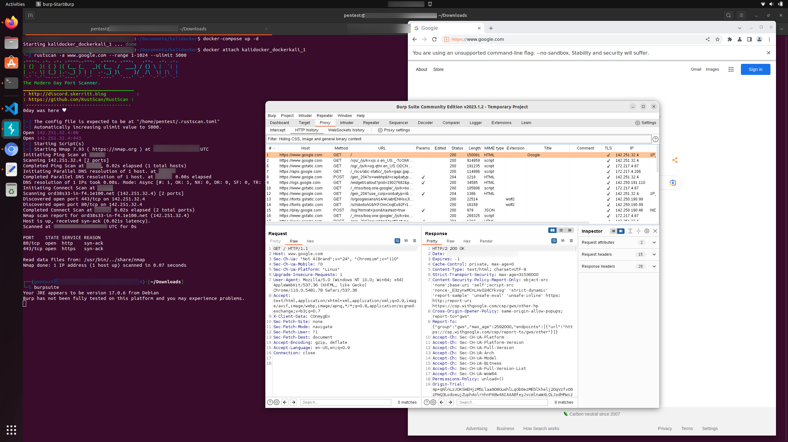

# Pentest Docker Image

__For Kali Linux-based, isolated pentesting with bare metal performance and X11 (GUI) Support regardless of your host machine's linux distribution.__

I find that I prefer a particular linux distribution as my desktop environment and a different linux distribution as a penetration testing distribution. However, I don't want the performance limitations of running the penetration testing distribution in a VM or the additional effort of cloning a new VM for each engagement, managing disk space, virtual cpus, and etc. This project is an experiment to determine the level of isolation I can achieve (there is a trade off as compared to a full VM) versus the increased convenience for setting up a new penetration testing base for each engagement.



## Features

- Run Kali Linux as a docker image with preinstalled tools (customize further if you desire)
- Run as a lower privileged user (pentest) with sudo rights
- GUI (X11) support
- Persistent storage directory (a docker volume) to preserve data between container restarts (local directory `data_volume` is mounted at `/data` inside of the container)
- Preinstalled tools, including
  - Utilties
    - wget
    - nano
    - tmux
    - screen
    - xclip
    - sudo
    - firefox-esr
    - google chrome (to support gowitness which I haven't yet tested and expect a sandbox issue)
  - Pentesting Tools
    - assetfinder
    - subfinder
    - amass
    - nmap
    - cloud-enum
    - masscan
    - ffuf
    - sslyze
    - seclists
    - massdns
    - wordlists
    - burpsuite
    - gau
    - gowitness
    - puredns  
    - rustscan  
    - ripgen

## Instructions
1. `export DOCKERKALIPASSWORD="yourpasswordhere"`
1. `mkdir data_volume`
1. change `yourpasswordhere` in `Dockerfile` to your chosen password
1. Build the image with `docker-compose build`
2. Run the image with `docker-compose up -d`
3. Attach to the image with `docker attach kalidocker_dockerkali_1`
4. For more terminals, consider the following options:
    - using `tmux` (installed) or `screen` on the first terminal
    - Run `docker-compose exec dockerkali bash`
    - Run `docker exec -it kalidocker_dockerkali_1 bash`
4. the `/data_volume` directory is on the host mounted at `/data` inside docker to persist files
4. Run gui applications from the docker container:
    - On the host: `xhost +local:*`
    - In the container: `google-chrome`
    - Remove xhost permissions afterward: `xhost -local:*`
5. Detach with Ctrl+P then Ctrl+Q

## Notes

### Burp Suite Community

Even though it runs as the user "pentest", it still complains about not being able to run the browser in a sandbox. To get the browser to run disable the sandbox (Really think about whether this is a good idea as it does expose you to risk). Go to Burp -> Settings -> Tools -> Burp's Browser, and check "Run Burp's browser without a sandbox".

### Google Chrome

## Demonstration of Building and Running the Image

### Building

```bash
~/Documents/kalidocker$ docker-compose build
Building dockerkali
Sending build context to Docker daemon  21.73MB
Step 1/13 : FROM kalilinux/kali-rolling:latest
 ---> d71d962a6bf0
Step 2/13 : VOLUME ["/data"]
 ---> Using cache
 ---> cb114c38507b
Step 3/13 : VOLUME ["/tmp/.X11-unix/"]
 ---> Using cache
 ---> 65ffe85aa7fc
Step 4/13 : RUN apt-get update && apt-get -y upgrade && apt-get install -y wget nano assetfinder tmux subfinder amass nmap cloud-enum masscan ffuf sslyze golang seclists cargo massdns xclip flatpak fonts-liberation libu2f-udev libvulkan1 xdg-utils dbus-x11 packagekit-gtk3-module libcanberra-gtk3-0 wordlists burpsuite sudo firefox-esr
 ---> Running in b9752b625ac5
Get:1 http://kali.darklab.sh/kali kali-rolling InRelease [41.2 kB]
Get:2 http://kali.darklab.sh/kali kali-rolling/contrib amd64 Packages [116 kB]
Get:3 http://kali.darklab.sh/kali kali-rolling/non-free amd64 Packages [217 kB]
Get:4 http://kali.darklab.sh/kali kali-rolling/main amd64 Packages [19.4 MB]
Fetched 19.8 MB in 7s (2896 kB/s)
Reading package lists...
Reading package lists...
Building dependency tree...
Reading state information...
Calculating upgrade...
The following packages will be upgraded:
  apt base-files bsdutils dpkg kali-defaults libapt-pkg6.0 libaudit-common
  libaudit1 libblkid1 libgnutls30 liblzma5 libmount1 libsmartcols1 libuuid1
  libzstd1 login mount passwd tzdata util-linux util-linux-extra
21 upgraded, 0 newly installed, 0 to remove and 0 not upgraded.
Need to get 9998 kB of archives.
After this operation, 185 kB of additional disk space will be used.
Get:1 http://kali.darklab.sh/kali kali-rolling/main amd64 base-files amd64 1:2023.1.0 [54.8 kB]
Get:2 http://http.kali.org/kali kali-rolling/main amd64 bsdutils amd64 1:2.38.1-5+b1 [94.4 kB]
Get:3 http://kali.darklab.sh/kali kali-rolling/main amd64 liblzma5 amd64 5.4.1-0.2 [205 kB]
Get:4 http://http.kali.org/kali kali-rolling/main amd64 libzstd1 amd64 1.5.4+dfsg2-3 [290 kB]
Get:7 http://http.kali.org/kali kali-rolling/main amd64 login amd64 1:4.13+dfsg1-1+b1 [616 kB]
Get:5 http://kali.darklab.sh/kali kali-rolling/main amd64 libapt-pkg6.0 amd64 2.6.0 [906 kB]
Get:10 http://http.kali.org/kali kali-rolling/main amd64 libsmartcols1 amd64 2.38.1-5+b1 [107 kB]
Get:11 http://http.kali.org/kali kali-rolling/main amd64 util-linux-extra amd64 2.38.1-5+b1 [111 kB]
Get:12 http://http.kali.org/kali kali-rolling/main amd64 util-linux amd64 2.38.1-5+b1 [1177 kB]
Get:6 http://http.kali.org/kali kali-rolling/main amd64 dpkg amd64 1.21.21+kali2 [1568 kB]
Get:15 http://http.kali.org/kali kali-rolling/main amd64 mount amd64 2.38.1-5+b1 [134 kB]
Get:16 http://http.kali.org/kali kali-rolling/main amd64 libblkid1 amd64 2.38.1-5+b1 [147 kB]
Get:17 http://http.kali.org/kali kali-rolling/main amd64 libmount1 amd64 2.38.1-5+b1 [166 kB]
Get:18 http://http.kali.org/kali kali-rolling/main amd64 libuuid1 amd64 2.38.1-5+b1 [28.8 kB]
Get:19 http://http.kali.org/kali kali-rolling/main amd64 passwd amd64 1:4.13+dfsg1-1+b1 [972 kB]
Get:8 http://kali.darklab.sh/kali kali-rolling/main amd64 libaudit-common all 1:3.0.9-1 [10.4 kB]
Get:9 http://kali.darklab.sh/kali kali-rolling/main amd64 libaudit1 amd64 1:3.0.9-1 [46.8 kB]
Get:13 http://kali.darklab.sh/kali kali-rolling/main amd64 libgnutls30 amd64 3.7.9-1 [1404 kB]
Get:14 http://kali.darklab.sh/kali kali-rolling/main amd64 apt amd64 2.6.0 [1372 kB]
Get:20 http://kali.darklab.sh/kali kali-rolling/main amd64 tzdata all 2022g-7 [297 kB]
Get:21 http://kali.darklab.sh/kali kali-rolling/main amd64 kali-defaults all 2023.1.6 [291 kB]
debconf: delaying package configuration, since apt-utils is not installed
Fetched 9998 kB in 4s (2479 kB/s)
(Reading database ... 6125 files and directories currently installed.)
Preparing to unpack .../base-files_1%3a2023.1.0_amd64.deb ...
Unpacking base-files (1:2023.1.0) over (1:2022.4.0) ...
Setting up base-files (1:2023.1.0) ...
(Reading database ... 6125 files and directories currently installed.)
Preparing to unpack .../bsdutils_1%3a2.38.1-5+b1_amd64.deb ...
Unpacking bsdutils (1:2.38.1-5+b1) over (1:2.38.1-4) ...
Setting up bsdutils (1:2.38.1-5+b1) ...
(Reading database ... 6126 files and directories currently installed.)
Preparing to unpack .../liblzma5_5.4.1-0.2_amd64.deb ...
Unpacking liblzma5:amd64 (5.4.1-0.2) over (5.4.1-0.0) ...
Setting up liblzma5:amd64 (5.4.1-0.2) ...
(Reading database ... 6126 files and directories currently installed.)
Preparing to unpack .../libzstd1_1.5.4+dfsg2-3_amd64.deb ...
Unpacking libzstd1:amd64 (1.5.4+dfsg2-3) over (1.5.2+dfsg2-3) ...
Setting up libzstd1:amd64 (1.5.4+dfsg2-3) ...
(Reading database ... 6126 files and directories currently installed.)
Preparing to unpack .../libapt-pkg6.0_2.6.0_amd64.deb ...
Unpacking libapt-pkg6.0:amd64 (2.6.0) over (2.5.6) ...
Setting up libapt-pkg6.0:amd64 (2.6.0) ...
(Reading database ... 6126 files and directories currently installed.)
Preparing to unpack .../dpkg_1.21.21+kali2_amd64.deb ...
Unpacking dpkg (1.21.21+kali2) over (1.21.20+kali1) ...
Setting up dpkg (1.21.21+kali2) ...
(Reading database ... 6126 files and directories currently installed.)
Preparing to unpack .../login_1%3a4.13+dfsg1-1+b1_amd64.deb ...
Unpacking login (1:4.13+dfsg1-1+b1) over (1:4.13+dfsg1-1) ...
Setting up login (1:4.13+dfsg1-1+b1) ...
(Reading database ... 6127 files and directories currently installed.)
Preparing to unpack .../libaudit-common_1%3a3.0.9-1_all.deb ...
Unpacking libaudit-common (1:3.0.9-1) over (1:3.0.7-1.1) ...
Setting up libaudit-common (1:3.0.9-1) ...
(Reading database ... 6127 files and directories currently installed.)
Preparing to unpack .../libaudit1_1%3a3.0.9-1_amd64.deb ...
Unpacking libaudit1:amd64 (1:3.0.9-1) over (1:3.0.7-1.1+b3) ...
Setting up libaudit1:amd64 (1:3.0.9-1) ...
(Reading database ... 6126 files and directories currently installed.)
Preparing to unpack .../libsmartcols1_2.38.1-5+b1_amd64.deb ...
Unpacking libsmartcols1:amd64 (2.38.1-5+b1) over (2.38.1-4) ...
Setting up libsmartcols1:amd64 (2.38.1-5+b1) ...
(Reading database ... 6127 files and directories currently installed.)
Preparing to unpack .../util-linux-extra_2.38.1-5+b1_amd64.deb ...
Unpacking util-linux-extra (2.38.1-5+b1) over (2.38.1-4) ...
Setting up util-linux-extra (2.38.1-5+b1) ...
(Reading database ... 6128 files and directories currently installed.)
Preparing to unpack .../util-linux_2.38.1-5+b1_amd64.deb ...
Unpacking util-linux (2.38.1-5+b1) over (2.38.1-4) ...
Setting up util-linux (2.38.1-5+b1) ...
(Reading database ... 6129 files and directories currently installed.)
Preparing to unpack .../libgnutls30_3.7.9-1_amd64.deb ...
Unpacking libgnutls30:amd64 (3.7.9-1) over (3.7.8-5) ...
Setting up libgnutls30:amd64 (3.7.9-1) ...
(Reading database ... 6131 files and directories currently installed.)
Preparing to unpack .../archives/apt_2.6.0_amd64.deb ...
Unpacking apt (2.6.0) over (2.5.6) ...
Setting up apt (2.6.0) ...
Installing new version of config file /etc/apt/apt.conf.d/01autoremove ...
(Reading database ... 6133 files and directories currently installed.)
Preparing to unpack .../mount_2.38.1-5+b1_amd64.deb ...
Unpacking mount (2.38.1-5+b1) over (2.38.1-4) ...
Preparing to unpack .../libblkid1_2.38.1-5+b1_amd64.deb ...
Unpacking libblkid1:amd64 (2.38.1-5+b1) over (2.38.1-4) ...
Setting up libblkid1:amd64 (2.38.1-5+b1) ...
(Reading database ... 6135 files and directories currently installed.)
Preparing to unpack .../libmount1_2.38.1-5+b1_amd64.deb ...
Unpacking libmount1:amd64 (2.38.1-5+b1) over (2.38.1-4) ...
Setting up libmount1:amd64 (2.38.1-5+b1) ...
(Reading database ... 6136 files and directories currently installed.)
Preparing to unpack .../libuuid1_2.38.1-5+b1_amd64.deb ...
Unpacking libuuid1:amd64 (2.38.1-5+b1) over (2.38.1-4) ...
Setting up libuuid1:amd64 (2.38.1-5+b1) ...
(Reading database ... 6137 files and directories currently installed.)
Preparing to unpack .../passwd_1%3a4.13+dfsg1-1+b1_amd64.deb ...
Unpacking passwd (1:4.13+dfsg1-1+b1) over (1:4.13+dfsg1-1) ...
Preparing to unpack .../tzdata_2022g-7_all.deb ...
Unpacking tzdata (2022g-7) over (2022g-5) ...
Preparing to unpack .../kali-defaults_2023.1.6_all.deb ...
Adding 'diversion of /usr/lib/python3.11/EXTERNALLY-MANAGED to /usr/lib/python3.11/EXTERNALLY-MANAGED.original by kali-defaults'
Unpacking kali-defaults (2023.1.6) over (2023.1.3) ...
Setting up kali-defaults (2023.1.6) ...
Configuring /etc/environment
Setting up tzdata (2022g-7) ...
debconf: unable to initialize frontend: Dialog
debconf: (TERM is not set, so the dialog frontend is not usable.)
debconf: falling back to frontend: Readline
debconf: unable to initialize frontend: Readline
debconf: (Can't locate Term/ReadLine.pm in @INC (you may need to install the Term::ReadLine module) (@INC contains: /etc/perl /usr/local/lib/x86_64-linux-gnu/perl/5.36.0 /usr/local/share/perl/5.36.0 /usr/lib/x86_64-linux-gnu/perl5/5.36 /usr/share/perl5 /usr/lib/x86_64-linux-gnu/perl-base /usr/lib/x86_64-linux-gnu/perl/5.36 /usr/share/perl/5.36 /usr/local/lib/site_perl) at /usr/share/perl5/Debconf/FrontEnd/Readline.pm line 7.)
debconf: falling back to frontend: Teletype

Current default time zone: 'Etc/UTC'
Local time is now:      Fri Mar 24 13:50:43 UTC 2023.
Universal Time is now:  Fri Mar 24 13:50:43 UTC 2023.
Run 'dpkg-reconfigure tzdata' if you wish to change it.

Setting up passwd (1:4.13+dfsg1-1+b1) ...
Setting up mount (2.38.1-5+b1) ...
Processing triggers for libc-bin (2.36-8) ...
Reading package lists...
Building dependency tree...
Reading state information...
The following additional packages will be installed:
  adduser adwaita-icon-theme alsa-topology-conf alsa-ucm-conf amass-common
  appstream apt-config-icons at-spi2-common at-spi2-core bind9-host bind9-libs
  binfmt-support binutils binutils-common binutils-x86-64-linux-gnu bolt
  bubblewrap ca-certificates ca-certificates-java cpp cpp-12 dbus dbus-bin
  dbus-daemon dbus-session-bus-common dbus-system-bus-common dbus-user-session
  dconf-gsettings-backend dconf-service default-jre default-jre-headless
  desktop-file-utils dirmngr distro-info-data dmidecode dmsetup dosfstools
  eject exfatprogs fdisk fontconfig fontconfig-config fonts-dejavu-core
  fonts-dejavu-extra fuse3 fwupd fwupd-amd64-signed g++ g++-12 gcc gcc-12 gcr
  gdisk gir1.2-atk-1.0 gir1.2-freedesktop gir1.2-gdkpixbuf-2.0 gir1.2-glib-2.0
  gir1.2-goa-1.0 gir1.2-gtk-3.0 gir1.2-handy-1 gir1.2-harfbuzz-0.0
  gir1.2-packagekitglib-1.0 gir1.2-pango-1.0 glib-networking
  glib-networking-common glib-networking-services gnome-desktop3-data
  gnome-keyring gnome-keyring-pkcs11 gnome-session-bin gnome-software
  gnome-software-common gnupg gnupg-l10n gnupg-utils golang-1.19
  golang-1.19-doc golang-1.19-go golang-1.19-src golang-doc golang-go
  golang-src gpg gpg-agent gpg-wks-client gpg-wks-server gpgconf gpgsm
  groff-base gsettings-desktop-schemas gtk-update-icon-cache
  hicolor-icon-theme i965-va-driver icu-devtools intel-media-va-driver
  iso-codes java-common java-wrappers javascript-common jq krb5-locales
  libabsl20220623 libadwaita-1-0 libaom3 libapparmor1 libappstream4
  libarchive13 libargon2-1 libasan8 libasound2 libasound2-data libassuan0
  libatasmart4 libatk-bridge2.0-0 libatk-wrapper-java libatk-wrapper-java-jni
  libatk1.0-0 libatomic1 libatspi2.0-0 libauthen-sasl-perl libavahi-client3
  libavahi-common-data libavahi-common3 libavahi-glib1 libavcodec59 libavif15
  libavutil57 libbinutils libblas3 libblockdev-crypto2 libblockdev-fs2
  libblockdev-loop2 libblockdev-part-err2 libblockdev-part2 libblockdev-swap2
  libblockdev-utils2 libblockdev2 libbrotli1 libbsd0 libc-dev-bin
  libc-devtools libc-l10n libc6-dev libcairo-gobject-perl libcairo-gobject2
  libcairo-perl libcairo-script-interpreter2 libcairo2 libcanberra-gtk3-module
  libcanberra0 libcap2-bin libcbor0.8 libcc1-0 libclang-cpp14 libclone-perl
  libcloudproviders0 libcodec2-1.0 libcolord2 libcrypt-dev libcryptsetup12
  libctf-nobfd0 libctf0 libcups2 libcurl3-gnutls libcurl3-nss
  libdata-dump-perl libdatrie1 libdav1d6 libdbus-1-3 libdbus-glib-1-2
  libdconf1 libde265-0 libdeflate0 libdevmapper1.02.1 libdrm-amdgpu1
  libdrm-common libdrm-intel1 libdrm-nouveau2 libdrm-radeon1 libdrm2
  libduktape207 libdw1 libedit2 libefiboot1 libefivar1 libegl-mesa0 libegl1
  libelf1 libencode-locale-perl libepoxy0 libevent-2.1-7 libevent-core-2.1-7
  libexpat1 libextutils-depends-perl libfdisk1 libffi-dev libfile-basedir-perl
  libfile-desktopentry-perl libfile-listing-perl libfile-mimeinfo-perl
  libflashrom1 libfont-afm-perl libfontconfig1 libfontenc1 libfreetype6
  libfribidi0 libfstrm0 libftdi1-2 libfuse3-3 libfwupd2 libgav1-1 libgbm1
  libgcab-1.0-0 libgcc-12-dev libgck-1-0 libgcr-base-3-1 libgcr-ui-3-1 libgd3
  libgdbm-compat4 libgdbm6 libgdk-pixbuf-2.0-0 libgdk-pixbuf2.0-bin
  libgdk-pixbuf2.0-common libgif7 libgirepository-1.0-1 libgit2-1.5 libgl1
  libgl1-mesa-dri libglapi-mesa libgles2 libglib-object-introspection-perl
  libglib-perl libglib2.0-0 libglib2.0-bin libglib2.0-data libglvnd0
  libglx-mesa0 libglx0 libgnome-desktop-3-20 libgoa-1.0-0b libgoa-1.0-common
  libgomp1 libgpgme11 libgpm2 libgprofng0 libgraphene-1.0-0 libgraphite2-3
  libgsm1 libgssapi-krb5-2 libgstreamer1.0-0 libgtk-3-0 libgtk-3-bin
  libgtk-3-common libgtk-4-1 libgtk-4-bin libgtk-4-common libgtk3-perl
  libgudev-1.0-0 libgusb2 libhandy-1-0 libharfbuzz0b libheif1
  libhtml-form-perl libhtml-format-perl libhtml-parser-perl
  libhtml-tagset-perl libhtml-tree-perl libhttp-cookies-perl
  libhttp-daemon-perl libhttp-date-perl libhttp-message-perl
  libhttp-negotiate-perl libhttp-parser2.9 libhwy1 libice6 libicu-dev libicu72
  libigdgmm12 libio-html-perl libio-socket-ssl-perl libio-stringy-perl
  libip4tc2 libipc-system-simple-perl libisl23 libitm1 libjansson4 libjaylink0
  libjbig0 libjcat1 libjemalloc2 libjim0.81 libjpeg62-turbo libjq1
  libjs-jquery libjs-sphinxdoc libjs-underscore libjson-c5 libjson-glib-1.0-0
  libjson-glib-1.0-common libjxl0.7 libk5crypto3 libkeyutils1 libkmod2
  libkrb5-3 libkrb5support0 libksba8 liblcms2-2 libldap-2.5-0 libldap-common
  liblerc4 liblinear4 libllvm14 libllvm15 liblmdb0 liblsan0 libltdl7
  liblua5.3-0 liblwp-mediatypes-perl liblwp-protocol-https-perl liblzo2-2
  libmailtools-perl libmalcontent-0-0 libmaxminddb0 libmbedcrypto7
  libmbedtls14 libmbedx509-1 libmbim-glib4 libmbim-proxy libmbim-utils libmfx1
  libmm-glib0 libmp3lame0 libmpc3 libmpfr6 libncurses-dev libncurses6
  libncursesw6 libnet-dbus-perl libnet-http-perl libnet-smtp-ssl-perl
  libnet-ssleay-perl libnghttp2-14 libnpth0 libnsl-dev libnsl2 libnspr4
  libnss-systemd libnss3 libntfs-3g89 libnuma1 libogg0 libonig5 libopenjp2-7
  libopus0 libostree-1-1 libpackagekit-glib2-18 libpam-cap
  libpam-gnome-keyring libpam-systemd libpango-1.0-0 libpangocairo-1.0-0
  libpangoft2-1.0-0 libpangoxft-1.0-0 libparted-fs-resize0 libparted2 libpci3
  libpciaccess0 libpcre3 libpcsclite1 libperl5.36 libpfm4 libpipeline1
  libpipewire-0.3-0 libpipewire-0.3-common libpixman-1-0 libpkgconf3
  libpng16-16 libpolkit-agent-1-0 libpolkit-gobject-1-0 libpopt0 libproc2-0
  libprotobuf-c1 libproxy1v5 libpsl5 libpython3-stdlib libpython3.11-minimal
  libpython3.11-stdlib libqmi-glib5 libqmi-proxy libqmi-utils libqrtr-glib0
  libquadmath0 librav1e0 libreadline8 libregexp-ipv6-perl librsvg2-2
  librsvg2-common librtmp1 libsasl2-2 libsasl2-modules libsasl2-modules-db
  libsecret-1-0 libsecret-common libsensors-config libsensors5 libshine3
  libsm6 libsmbios-c2 libsnappy1v5 libsoup-3.0-0 libsoup-3.0-common libsoxr0
  libspa-0.2-modules libspeex1 libsqlite3-0 libssh2-1 libssl3 libstd-rust-1.63
  libstd-rust-dev libstdc++-12-dev libstemmer0d libsvtav1enc1 libswresample4
  libsystemd-shared libtdb1 libtext-iconv-perl libthai-data libthai0
  libtheora0 libtie-ixhash-perl libtiff6 libtimedate-perl libtinfo-dev
  libtirpc-common libtirpc-dev libtirpc3 libtry-tiny-perl libtsan2
  libtss2-esys-3.0.2-0 libtss2-mu0 libtss2-sys1 libtss2-tcti-cmd0
  libtss2-tcti-device0 libtss2-tcti-mssim0 libtss2-tcti-swtpm0 libtwolame0
  libubsan1 libuchardet0 libudisks2-0 libunwind8 libupower-glib3 liburi-perl
  libusb-1.0-0 libutempter0 libuv1 libva-drm2 libva-x11-2 libva2
  libvdpau-va-gl1 libvdpau1 libvolume-key1 libvorbis0a libvorbisenc2
  libvorbisfile3 libvpx7 libwayland-client0 libwayland-cursor0 libwayland-egl1
  libwayland-server0 libwebp7 libwebpmux3 libwebrtc-audio-processing1
  libwww-perl libwww-robotrules-perl libx11-6 libx11-data libx11-protocol-perl
  libx11-xcb1 libx264-164 libx265-199 libxau6 libxaw7 libxcb-dri2-0
  libxcb-dri3-0 libxcb-glx0 libxcb-present0 libxcb-randr0 libxcb-render0
  libxcb-shape0 libxcb-shm0 libxcb-sync1 libxcb-xfixes0 libxcb1 libxcomposite1
  libxcursor1 libxcvt0 libxdamage1 libxdmcp6 libxext6 libxfixes3 libxfont2
  libxft2 libxi6 libxinerama1 libxkbcommon0 libxkbfile1 libxkbregistry0
  libxml-parser-perl libxml-twig-perl libxml-xpathengine-perl libxml2
  libxml2-dev libxmlb2 libxmu6 libxmuu1 libxpm4 libxrandr2 libxrender1
  libxshmfence1 libxt6 libxtst6 libxv1 libxvidcore4 libxxf86dga1 libxxf86vm1
  libyaml-0-2 libyuv0 libz3-4 libz3-dev libzvbi-common libzvbi0 linux-libc-dev
  llvm-14 llvm-14-dev llvm-14-linker-tools llvm-14-runtime llvm-14-tools
  locales lsb-release lua-lpeg manpages manpages-dev media-types
  mesa-va-drivers mesa-vdpau-drivers mesa-vulkan-drivers modemmanager netbase
  nmap-common ntfs-3g ocl-icd-libopencl1 openjdk-17-jre
  openjdk-17-jre-headless openssl p11-kit p11-kit-modules packagekit
  packagekit-tools parted pci.ids perl perl-modules-5.36 perl-openssl-defaults
  pinentry-curses pinentry-gnome3 pkg-config pkgconf pkgconf-bin polkitd
  procps psmisc publicsuffix python-apt-common python3 python3-anyio
  python3-apt python3-blinker python3-certifi python3-cffi-backend
  python3-chardet python3-charset-normalizer python3-click python3-colorama
  python3-cryptography python3-dateutil python3-dbus python3-distro
  python3-distro-info python3-dnspython python3-gi python3-h11 python3-h2
  python3-hpack python3-httpcore python3-httplib2 python3-httpx
  python3-hyperframe python3-idna python3-jwt python3-lazr.restfulclient
  python3-lazr.uri python3-markdown-it python3-mdurl python3-minimal
  python3-nassl python3-oauthlib python3-openssl python3-pkg-resources
  python3-pydantic python3-pygments python3-pyparsing python3-requests
  python3-requests-futures python3-requests-toolbelt python3-rfc3986
  python3-rich python3-six python3-sniffio python3-software-properties
  python3-tls-parser python3-typing-extensions python3-urllib3 python3-wadllib
  python3-yaml python3.11 python3.11-minimal readline-common rpcsvc-proto
  rustc sensible-utils sgml-base shared-mime-info software-properties-common
  software-properties-gtk sound-theme-freedesktop systemd systemd-sysv
  systemd-timesyncd tpm-udev udev udisks2 unzip upower usb-modeswitch
  usb-modeswitch-data usb.ids va-driver-all vdpau-driver-all x11-common
  x11-utils x11-xkb-utils x11-xserver-utils xauth xdg-dbus-proxy
  xdg-desktop-portal xdg-desktop-portal-gtk xdg-user-dirs xfonts-base
  xfonts-encodings xfonts-utils xkb-data xml-core xserver-common xwayland
  zutty
Suggested packages:
  liblocale-gettext-perl cron quota binutils-doc cargo-doc cpp-doc
  gcc-12-locales cpp-12-doc tor fonts-stix | otf-stix fonts-lmodern pulseaudio
  avahi-daemon malcontent-gui gir1.2-fwupd-2.0 g++-multilib g++-12-multilib
  gcc-12-doc gcc-multilib make autoconf automake libtool flex bison gdb
  gcc-doc gcc-12-multilib apt-config-icons-hidpi gnome-software-plugin-flatpak
  gnome-software-plugin-snap parcimonie xloadimage bzr | brz git mercurial
  subversion scdaemon groff i965-va-driver-shaders isoquery apache2 | lighttpd
  | httpd lrzip libasound2-plugins alsa-utils libdigest-hmac-perl
  libgssapi-perl libcuda1 libnvcuvid1 libnvidia-encode1 glibc-doc
  libfont-freetype-perl libcanberra-gtk0 libcanberra-pulse colord cups-common
  libgd-tools gdbm-l10n libxml-libxml-perl low-memory-monitor gpm krb5-doc
  krb5-user gstreamer1.0-tools gvfs libgtk-4-media-gstreamer
  | libgtk-4-media-ffmpeg icu-doc liblcms2-utils liblinear-tools liblinear-dev
  libcrypt-ssleay-perl mmdb-bin ncurses-doc opus-tools libparted-dev
  libparted-i18n pciutils pcscd pipewire librsvg2-bin
  libsasl2-modules-gssapi-mit | libsasl2-modules-gssapi-heimdal
  libsasl2-modules-ldap libsasl2-modules-otp libsasl2-modules-sql lm-sensors
  libsmbios-doc speex libstdc++-12-doc libsub-name-perl libbusiness-isbn-perl
  libauthen-ntlm-perl libunicode-map8-perl libunicode-string-perl
  xml-twig-tools llvm-14-doc man-browser hunspell ncat ndiff zenmap opencl-icd
  libnss-mdns fonts-ipafont-gothic fonts-ipafont-mincho fonts-wqy-microhei
  | fonts-wqy-zenhei fonts-indic parted-doc perl-doc libterm-readline-gnu-perl
  | libterm-readline-perl-perl libtap-harness-archive-perl debhelper
  pinentry-doc polkitd-pkla python3-doc python3-tk python3-venv python-apt-doc
  python-blinker-doc python-cryptography-doc python3-cryptography-vectors
  python-dbus-doc python3-trio python3-aioquic python3-crypto
  python-openssl-doc python3-openssl-dbg python3-setuptools
  python-pygments-doc ttf-bitstream-vera python-pyparsing-doc python3-socks
  python-requests-doc python3-brotli python3.11-venv python3.11-doc
  readline-doc lld-14 clang-14 sgml-base-doc systemd-container systemd-homed
  systemd-userdbd systemd-boot systemd-resolved libfido2-1 libqrencode4
  libtss2-rc0 btrfs-progs f2fs-tools libblockdev-mdraid2 mdadm nilfs-tools
  reiserfsprogs udftools udisks2-bcache udisks2-btrfs udisks2-lvm2
  udisks2-zram xfsprogs zip comgt wvdial nvidia-vdpau-driver
  nvidia-tesla-440-vdpau-driver nvidia-tesla-418-vdpau-driver
  nvidia-legacy-390xx-vdpau-driver nvidia-legacy-340xx-vdpau-driver mesa-utils
  nickle cairo-5c xorg-docs-core accountsservice evince
  xdg-desktop-portal-gnome xfs | xserver
Recommended packages:
  secureboot-db
The following NEW packages will be installed:
  adduser adwaita-icon-theme alsa-topology-conf alsa-ucm-conf amass
  amass-common appstream apt-config-icons assetfinder at-spi2-common
  at-spi2-core bind9-host bind9-libs binfmt-support binutils binutils-common
  binutils-x86-64-linux-gnu bolt bubblewrap burpsuite ca-certificates
  ca-certificates-java cargo cloud-enum cpp cpp-12 dbus dbus-bin dbus-daemon
  dbus-session-bus-common dbus-system-bus-common dbus-user-session dbus-x11
  dconf-gsettings-backend dconf-service default-jre default-jre-headless
  desktop-file-utils dirmngr distro-info-data dmidecode dmsetup dosfstools
  eject exfatprogs fdisk ffuf firefox-esr flatpak fontconfig fontconfig-config
  fonts-dejavu-core fonts-dejavu-extra fonts-liberation fuse3 fwupd
  fwupd-amd64-signed g++ g++-12 gcc gcc-12 gcr gdisk gir1.2-atk-1.0
  gir1.2-freedesktop gir1.2-gdkpixbuf-2.0 gir1.2-glib-2.0 gir1.2-goa-1.0
  gir1.2-gtk-3.0 gir1.2-handy-1 gir1.2-harfbuzz-0.0 gir1.2-packagekitglib-1.0
  gir1.2-pango-1.0 glib-networking glib-networking-common
  glib-networking-services gnome-desktop3-data gnome-keyring
  gnome-keyring-pkcs11 gnome-session-bin gnome-software gnome-software-common
  gnupg gnupg-l10n gnupg-utils golang golang-1.19 golang-1.19-doc
  golang-1.19-go golang-1.19-src golang-doc golang-go golang-src gpg gpg-agent
  gpg-wks-client gpg-wks-server gpgconf gpgsm groff-base
  gsettings-desktop-schemas gtk-update-icon-cache hicolor-icon-theme
  i965-va-driver icu-devtools intel-media-va-driver iso-codes java-common
  java-wrappers javascript-common jq krb5-locales libabsl20220623
  libadwaita-1-0 libaom3 libapparmor1 libappstream4 libarchive13 libargon2-1
  libasan8 libasound2 libasound2-data libassuan0 libatasmart4
  libatk-bridge2.0-0 libatk-wrapper-java libatk-wrapper-java-jni libatk1.0-0
  libatomic1 libatspi2.0-0 libauthen-sasl-perl libavahi-client3
  libavahi-common-data libavahi-common3 libavahi-glib1 libavcodec59 libavif15
  libavutil57 libbinutils libblas3 libblockdev-crypto2 libblockdev-fs2
  libblockdev-loop2 libblockdev-part-err2 libblockdev-part2 libblockdev-swap2
  libblockdev-utils2 libblockdev2 libbrotli1 libbsd0 libc-dev-bin
  libc-devtools libc-l10n libc6-dev libcairo-gobject-perl libcairo-gobject2
  libcairo-perl libcairo-script-interpreter2 libcairo2 libcanberra-gtk3-0
  libcanberra-gtk3-module libcanberra0 libcap2-bin libcbor0.8 libcc1-0
  libclang-cpp14 libclone-perl libcloudproviders0 libcodec2-1.0 libcolord2
  libcrypt-dev libcryptsetup12 libctf-nobfd0 libctf0 libcups2 libcurl3-gnutls
  libcurl3-nss libdata-dump-perl libdatrie1 libdav1d6 libdbus-1-3
  libdbus-glib-1-2 libdconf1 libde265-0 libdeflate0 libdevmapper1.02.1
  libdrm-amdgpu1 libdrm-common libdrm-intel1 libdrm-nouveau2 libdrm-radeon1
  libdrm2 libduktape207 libdw1 libedit2 libefiboot1 libefivar1 libegl-mesa0
  libegl1 libelf1 libencode-locale-perl libepoxy0 libevent-2.1-7
  libevent-core-2.1-7 libexpat1 libextutils-depends-perl libfdisk1 libffi-dev
  libfile-basedir-perl libfile-desktopentry-perl libfile-listing-perl
  libfile-mimeinfo-perl libflashrom1 libfont-afm-perl libfontconfig1
  libfontenc1 libfreetype6 libfribidi0 libfstrm0 libftdi1-2 libfuse3-3
  libfwupd2 libgav1-1 libgbm1 libgcab-1.0-0 libgcc-12-dev libgck-1-0
  libgcr-base-3-1 libgcr-ui-3-1 libgd3 libgdbm-compat4 libgdbm6
  libgdk-pixbuf-2.0-0 libgdk-pixbuf2.0-bin libgdk-pixbuf2.0-common libgif7
  libgirepository-1.0-1 libgit2-1.5 libgl1 libgl1-mesa-dri libglapi-mesa
  libgles2 libglib-object-introspection-perl libglib-perl libglib2.0-0
  libglib2.0-bin libglib2.0-data libglvnd0 libglx-mesa0 libglx0
  libgnome-desktop-3-20 libgoa-1.0-0b libgoa-1.0-common libgomp1 libgpgme11
  libgpm2 libgprofng0 libgraphene-1.0-0 libgraphite2-3 libgsm1
  libgssapi-krb5-2 libgstreamer1.0-0 libgtk-3-0 libgtk-3-bin libgtk-3-common
  libgtk-4-1 libgtk-4-bin libgtk-4-common libgtk3-perl libgudev-1.0-0 libgusb2
  libhandy-1-0 libharfbuzz0b libheif1 libhtml-form-perl libhtml-format-perl
  libhtml-parser-perl libhtml-tagset-perl libhtml-tree-perl
  libhttp-cookies-perl libhttp-daemon-perl libhttp-date-perl
  libhttp-message-perl libhttp-negotiate-perl libhttp-parser2.9 libhwy1
  libice6 libicu-dev libicu72 libigdgmm12 libio-html-perl
  libio-socket-ssl-perl libio-stringy-perl libip4tc2 libipc-system-simple-perl
  libisl23 libitm1 libjansson4 libjaylink0 libjbig0 libjcat1 libjemalloc2
  libjim0.81 libjpeg62-turbo libjq1 libjs-jquery libjs-sphinxdoc
  libjs-underscore libjson-c5 libjson-glib-1.0-0 libjson-glib-1.0-common
  libjxl0.7 libk5crypto3 libkeyutils1 libkmod2 libkrb5-3 libkrb5support0
  libksba8 liblcms2-2 libldap-2.5-0 libldap-common liblerc4 liblinear4
  libllvm14 libllvm15 liblmdb0 liblsan0 libltdl7 liblua5.3-0
  liblwp-mediatypes-perl liblwp-protocol-https-perl liblzo2-2
  libmailtools-perl libmalcontent-0-0 libmaxminddb0 libmbedcrypto7
  libmbedtls14 libmbedx509-1 libmbim-glib4 libmbim-proxy libmbim-utils libmfx1
  libmm-glib0 libmp3lame0 libmpc3 libmpfr6 libncurses-dev libncurses6
  libncursesw6 libnet-dbus-perl libnet-http-perl libnet-smtp-ssl-perl
  libnet-ssleay-perl libnghttp2-14 libnpth0 libnsl-dev libnsl2 libnspr4
  libnss-systemd libnss3 libntfs-3g89 libnuma1 libogg0 libonig5 libopenjp2-7
  libopus0 libostree-1-1 libpackagekit-glib2-18 libpam-cap
  libpam-gnome-keyring libpam-systemd libpango-1.0-0 libpangocairo-1.0-0
  libpangoft2-1.0-0 libpangoxft-1.0-0 libparted-fs-resize0 libparted2 libpci3
  libpciaccess0 libpcre3 libpcsclite1 libperl5.36 libpfm4 libpipeline1
  libpipewire-0.3-0 libpipewire-0.3-common libpixman-1-0 libpkgconf3
  libpng16-16 libpolkit-agent-1-0 libpolkit-gobject-1-0 libpopt0 libproc2-0
  libprotobuf-c1 libproxy1v5 libpsl5 libpython3-stdlib libpython3.11-minimal
  libpython3.11-stdlib libqmi-glib5 libqmi-proxy libqmi-utils libqrtr-glib0
  libquadmath0 librav1e0 libreadline8 libregexp-ipv6-perl librsvg2-2
  librsvg2-common librtmp1 libsasl2-2 libsasl2-modules libsasl2-modules-db
  libsecret-1-0 libsecret-common libsensors-config libsensors5 libshine3
  libsm6 libsmbios-c2 libsnappy1v5 libsoup-3.0-0 libsoup-3.0-common libsoxr0
  libspa-0.2-modules libspeex1 libsqlite3-0 libssh2-1 libssl3 libstd-rust-1.63
  libstd-rust-dev libstdc++-12-dev libstemmer0d libsvtav1enc1 libswresample4
  libsystemd-shared libtdb1 libtext-iconv-perl libthai-data libthai0
  libtheora0 libtie-ixhash-perl libtiff6 libtimedate-perl libtinfo-dev
  libtirpc-common libtirpc-dev libtirpc3 libtry-tiny-perl libtsan2
  libtss2-esys-3.0.2-0 libtss2-mu0 libtss2-sys1 libtss2-tcti-cmd0
  libtss2-tcti-device0 libtss2-tcti-mssim0 libtss2-tcti-swtpm0 libtwolame0
  libu2f-udev libubsan1 libuchardet0 libudisks2-0 libunwind8 libupower-glib3
  liburi-perl libusb-1.0-0 libutempter0 libuv1 libva-drm2 libva-x11-2 libva2
  libvdpau-va-gl1 libvdpau1 libvolume-key1 libvorbis0a libvorbisenc2
  libvorbisfile3 libvpx7 libvulkan1 libwayland-client0 libwayland-cursor0
  libwayland-egl1 libwayland-server0 libwebp7 libwebpmux3
  libwebrtc-audio-processing1 libwww-perl libwww-robotrules-perl libx11-6
  libx11-data libx11-protocol-perl libx11-xcb1 libx264-164 libx265-199 libxau6
  libxaw7 libxcb-dri2-0 libxcb-dri3-0 libxcb-glx0 libxcb-present0
  libxcb-randr0 libxcb-render0 libxcb-shape0 libxcb-shm0 libxcb-sync1
  libxcb-xfixes0 libxcb1 libxcomposite1 libxcursor1 libxcvt0 libxdamage1
  libxdmcp6 libxext6 libxfixes3 libxfont2 libxft2 libxi6 libxinerama1
  libxkbcommon0 libxkbfile1 libxkbregistry0 libxml-parser-perl
  libxml-twig-perl libxml-xpathengine-perl libxml2 libxml2-dev libxmlb2
  libxmu6 libxmuu1 libxpm4 libxrandr2 libxrender1 libxshmfence1 libxt6
  libxtst6 libxv1 libxvidcore4 libxxf86dga1 libxxf86vm1 libyaml-0-2 libyuv0
  libz3-4 libz3-dev libzvbi-common libzvbi0 linux-libc-dev llvm-14 llvm-14-dev
  llvm-14-linker-tools llvm-14-runtime llvm-14-tools locales lsb-release
  lua-lpeg manpages manpages-dev masscan massdns media-types mesa-va-drivers
  mesa-vdpau-drivers mesa-vulkan-drivers modemmanager nano netbase nmap
  nmap-common ntfs-3g ocl-icd-libopencl1 openjdk-17-jre
  openjdk-17-jre-headless openssl p11-kit p11-kit-modules packagekit
  packagekit-gtk3-module packagekit-tools parted pci.ids perl
  perl-modules-5.36 perl-openssl-defaults pinentry-curses pinentry-gnome3
  pkg-config pkgconf pkgconf-bin polkitd procps psmisc publicsuffix
  python-apt-common python3 python3-anyio python3-apt python3-blinker
  python3-certifi python3-cffi-backend python3-chardet
  python3-charset-normalizer python3-click python3-colorama
  python3-cryptography python3-dateutil python3-dbus python3-distro
  python3-distro-info python3-dnspython python3-gi python3-h11 python3-h2
  python3-hpack python3-httpcore python3-httplib2 python3-httpx
  python3-hyperframe python3-idna python3-jwt python3-lazr.restfulclient
  python3-lazr.uri python3-markdown-it python3-mdurl python3-minimal
  python3-nassl python3-oauthlib python3-openssl python3-pkg-resources
  python3-pydantic python3-pygments python3-pyparsing python3-requests
  python3-requests-futures python3-requests-toolbelt python3-rfc3986
  python3-rich python3-six python3-sniffio python3-software-properties
  python3-tls-parser python3-typing-extensions python3-urllib3 python3-wadllib
  python3-yaml python3.11 python3.11-minimal readline-common rpcsvc-proto
  rustc seclists sensible-utils sgml-base shared-mime-info
  software-properties-common software-properties-gtk sound-theme-freedesktop
  sslyze subfinder sudo systemd systemd-sysv systemd-timesyncd tmux tpm-udev
  udev udisks2 unzip upower usb-modeswitch usb-modeswitch-data usb.ids
  va-driver-all vdpau-driver-all wget wordlists x11-common x11-utils
  x11-xkb-utils x11-xserver-utils xauth xclip xdg-dbus-proxy
  xdg-desktop-portal xdg-desktop-portal-gtk xdg-user-dirs xdg-utils
  xfonts-base xfonts-encodings xfonts-utils xkb-data xml-core xserver-common
  xwayland zutty
0 upgraded, 693 newly installed, 0 to remove and 0 not upgraded.
Need to get 1385 MB of archives.
After this operation, 5103 MB of additional disk space will be used.
Get:1 http://kali.darklab.sh/kali kali-rolling/main amd64 libssl3 amd64 3.0.8-1 [2013 kB]
Get:7 http://http.kali.org/kali kali-rolling/main amd64 libfdisk1 amd64 2.38.1-5+b1 [194 kB]
Get:2 http://http.kali.org/kali kali-rolling/main amd64 libargon2-1 amd64 0~20171227-0.3 [20.0 kB]
Get:3 http://kali.darklab.sh/kali kali-rolling/main amd64 dmsetup amd64 2:1.02.185-2 [82.0 kB]
Get:4 http://kali.darklab.sh/kali kali-rolling/main amd64 libdevmapper1.02.1 amd64 2:1.02.185-2 [133 kB]
Get:5 http://kali.darklab.sh/kali kali-rolling/main amd64 libjson-c5 amd64 0.16-2 [44.1 kB]
Get:6 http://kali.darklab.sh/kali kali-rolling/main amd64 libcryptsetup12 amd64 2:2.6.1-1 [222 kB]
Get:8 http://http.kali.org/kali kali-rolling/main amd64 libkmod2 amd64 30+20221128-1 [57.9 kB]
Get:9 http://kali.darklab.sh/kali kali-rolling/main amd64 libapparmor1 amd64 3.0.8-3 [41.2 kB]
Get:10 http://kali.darklab.sh/kali kali-rolling/main amd64 libip4tc2 amd64 1.8.9-2 [19.0 kB]
Get:11 http://kali.darklab.sh/kali kali-rolling/main amd64 libsystemd-shared amd64 252.5-2 [1684 kB]
Get:12 http://kali.darklab.sh/kali kali-rolling/main amd64 systemd amd64 252.5-2 [3010 kB]
Get:31 http://http.kali.org/kali kali-rolling/main amd64 libntfs-3g89 amd64 1:2022.10.3-1+b1 [164 kB]
Get:13 http://kali.darklab.sh/kali kali-rolling/main amd64 systemd-sysv amd64 252.5-2 [41.3 kB]
Get:14 http://kali.darklab.sh/kali kali-rolling/main amd64 libdbus-1-3 amd64 1.14.6-1 [200 kB]
Get:15 http://kali.darklab.sh/kali kali-rolling/main amd64 dbus-bin amd64 1.14.6-1 [104 kB]
Get:16 http://kali.darklab.sh/kali kali-rolling/main amd64 dbus-session-bus-common all 1.14.6-1 [76.6 kB]
Get:17 http://kali.darklab.sh/kali kali-rolling/main amd64 libexpat1 amd64 2.5.0-1 [99.3 kB]
Get:32 http://http.kali.org/kali kali-rolling/main amd64 ntfs-3g amd64 1:2022.10.3-1+b1 [406 kB]
Get:18 http://kali.darklab.sh/kali kali-rolling/main amd64 dbus-daemon amd64 1.14.6-1 [182 kB]
Get:19 http://kali.darklab.sh/kali kali-rolling/main amd64 adduser all 3.131 [166 kB]
Get:20 http://kali.darklab.sh/kali kali-rolling/main amd64 dbus-system-bus-common all 1.14.6-1 [77.7 kB]
Get:21 http://kali.darklab.sh/kali kali-rolling/main amd64 dbus amd64 1.14.6-1 [95.7 kB]
Get:22 http://kali.darklab.sh/kali kali-rolling/main amd64 perl-modules-5.36 all 5.36.0-7 [2815 kB]
Get:38 http://http.kali.org/kali kali-rolling/main amd64 libkrb5support0 amd64 1.20.1-1+b1 [32.5 kB]
Get:39 http://http.kali.org/kali kali-rolling/main amd64 libk5crypto3 amd64 1.20.1-1+b1 [78.7 kB]
Get:23 http://kali.darklab.sh/kali kali-rolling/main amd64 libgdbm6 amd64 1.23-3 [72.2 kB]
Get:24 http://kali.darklab.sh/kali kali-rolling/main amd64 libgdbm-compat4 amd64 1.23-3 [48.2 kB]
Get:25 http://kali.darklab.sh/kali kali-rolling/main amd64 libperl5.36 amd64 5.36.0-7 [4218 kB]
Get:41 http://http.kali.org/kali kali-rolling/main amd64 libkrb5-3 amd64 1.20.1-1+b1 [332 kB]
Get:42 http://http.kali.org/kali kali-rolling/main amd64 libgssapi-krb5-2 amd64 1.20.1-1+b1 [134 kB]
Get:56 http://http.kali.org/kali kali-rolling/main amd64 fdisk amd64 2.38.1-5+b1 [142 kB]
Get:26 http://kali.darklab.sh/kali kali-rolling/main amd64 perl amd64 5.36.0-7 [239 kB]
Get:27 http://kali.darklab.sh/kali kali-rolling/main amd64 libpipeline1 amd64 1.5.7-1 [38.5 kB]
Get:28 http://kali.darklab.sh/kali kali-rolling/main amd64 binfmt-support amd64 2.2.2-2 [64.0 kB]
Get:29 http://kali.darklab.sh/kali kali-rolling/main amd64 libfuse3-3 amd64 3.14.0-2 [87.8 kB]
Get:30 http://kali.darklab.sh/kali kali-rolling/main amd64 fuse3 amd64 3.14.0-2 [35.7 kB]
Get:33 http://kali.darklab.sh/kali kali-rolling/main amd64 libpython3.11-minimal amd64 3.11.2-4 [813 kB]
Get:34 http://kali.darklab.sh/kali kali-rolling/main amd64 python3.11-minimal amd64 3.11.2-4 [2065 kB]
Get:35 http://kali.darklab.sh/kali kali-rolling/main amd64 python3-minimal amd64 3.11.2-1 [26.0 kB]
Get:36 http://kali.darklab.sh/kali kali-rolling/main amd64 media-types all 10.0.0 [26.1 kB]
Get:37 http://kali.darklab.sh/kali kali-rolling/main amd64 libncursesw6 amd64 6.4-2 [134 kB]
Get:40 http://kali.darklab.sh/kali kali-rolling/main amd64 libkeyutils1 amd64 1.6.3-2 [8808 B]
Get:43 http://http.kali.org/kali kali-rolling/main amd64 libtirpc-common all 1.3.3+ds-1 [14.0 kB]
Get:44 http://http.kali.org/kali kali-rolling/main amd64 libtirpc3 amd64 1.3.3+ds-1 [85.2 kB]
Get:45 http://kali.darklab.sh/kali kali-rolling/main amd64 libnsl2 amd64 1.3.0-2 [39.5 kB]
Get:46 http://kali.darklab.sh/kali kali-rolling/main amd64 readline-common all 8.2-1.3 [69.0 kB]
Get:47 http://kali.darklab.sh/kali kali-rolling/main amd64 libreadline8 amd64 8.2-1.3 [166 kB]
Get:48 http://kali.darklab.sh/kali kali-rolling/main amd64 libsqlite3-0 amd64 3.40.1-1 [838 kB]
Get:49 http://kali.darklab.sh/kali kali-rolling/main amd64 libpython3.11-stdlib amd64 3.11.2-4 [1797 kB]
Get:50 http://kali.darklab.sh/kali kali-rolling/main amd64 python3.11 amd64 3.11.2-4 [572 kB]
Get:51 http://kali.darklab.sh/kali kali-rolling/main amd64 libpython3-stdlib amd64 3.11.2-1 [9012 B]
Get:52 http://kali.darklab.sh/kali kali-rolling/main amd64 python3 amd64 3.11.2-1 [26.0 kB]
Get:53 http://kali.darklab.sh/kali kali-rolling/main amd64 sgml-base all 1.31 [15.4 kB]
Get:54 http://kali.darklab.sh/kali kali-rolling/main amd64 sudo amd64 1.9.13p3-1 [1889 kB]
Get:55 http://kali.darklab.sh/kali kali-rolling/main amd64 dmidecode amd64 3.4-1 [68.8 kB]
Get:57 http://kali.darklab.sh/kali kali-rolling/main amd64 nano amd64 7.2-1 [689 kB]
Get:58 http://kali.darklab.sh/kali kali-rolling/main amd64 netbase all 6.4 [12.8 kB]
Get:59 http://kali.darklab.sh/kali kali-rolling/main amd64 libproc2-0 amd64 2:4.0.2-3 [62.8 kB]
Get:60 http://kali.darklab.sh/kali kali-rolling/main amd64 procps amd64 2:4.0.2-3 [709 kB]
Get:61 http://http.kali.org/kali kali-rolling/main amd64 sensible-utils all 0.0.17+nmu1 [19.0 kB]
Get:62 http://kali.darklab.sh/kali kali-rolling/main amd64 udev amd64 252.5-2 [1601 kB]
Get:63 http://kali.darklab.sh/kali kali-rolling/main amd64 libuv1 amd64 1.44.2-1 [140 kB]
Get:64 http://kali.darklab.sh/kali kali-rolling/main amd64 libfstrm0 amd64 0.6.1-1 [21.6 kB]
Get:65 http://kali.darklab.sh/kali kali-rolling/main amd64 libjemalloc2 amd64 5.3.0-1 [275 kB]
Get:66 http://kali.darklab.sh/kali kali-rolling/main amd64 liblmdb0 amd64 0.9.24-1 [45.0 kB]
Get:67 http://kali.darklab.sh/kali kali-rolling/main amd64 libmaxminddb0 amd64 1.7.1-1 [29.8 kB]
Get:68 http://kali.darklab.sh/kali kali-rolling/main amd64 libnghttp2-14 amd64 1.52.0-1 [72.3 kB]
Get:69 http://http.kali.org/kali kali-rolling/main amd64 libprotobuf-c1 amd64 1.4.1-1+b1 [27.5 kB]
Get:70 http://kali.darklab.sh/kali kali-rolling/main amd64 libicu72 amd64 72.1-3 [9376 kB]
Get:71 http://http.kali.org/kali kali-rolling/main amd64 libxml2 amd64 2.9.14+dfsg-1.1+b3 [687 kB]
Get:72 http://kali.darklab.sh/kali kali-rolling/main amd64 bind9-libs amd64 1:9.18.12-1 [1404 kB]
Get:73 http://kali.darklab.sh/kali kali-rolling/main amd64 bind9-host amd64 1:9.18.12-1 [298 kB]
Get:74 http://kali.darklab.sh/kali kali-rolling/main amd64 openssl amd64 3.0.8-1 [1407 kB]
Get:75 http://kali.darklab.sh/kali kali-rolling/main amd64 ca-certificates all 20230311 [153 kB]
Get:76 http://kali.darklab.sh/kali kali-rolling/main amd64 libuchardet0 amd64 0.0.7-1 [67.8 kB]
Get:77 http://kali.darklab.sh/kali kali-rolling/main amd64 groff-base amd64 1.22.4-10 [916 kB]
Get:78 http://kali.darklab.sh/kali kali-rolling/main amd64 krb5-locales all 1.20.1-1 [62.4 kB]
Get:79 http://kali.darklab.sh/kali kali-rolling/main amd64 libc-l10n all 2.36-8 [673 kB]
Get:80 http://kali.darklab.sh/kali kali-rolling/main amd64 libnss-systemd amd64 252.5-2 [163 kB]
Get:81 http://kali.darklab.sh/kali kali-rolling/main amd64 libpam-systemd amd64 252.5-2 [223 kB]
Get:82 http://kali.darklab.sh/kali kali-rolling/main amd64 locales all 2.36-8 [3900 kB]
Get:83 http://kali.darklab.sh/kali kali-rolling/main amd64 manpages all 6.03-1 [1332 kB]
Get:84 http://kali.darklab.sh/kali kali-rolling/main amd64 systemd-timesyncd amd64 252.5-2 [62.3 kB]
Get:85 http://kali.darklab.sh/kali kali-rolling/main amd64 libpsl5 amd64 0.21.2-1 [58.7 kB]
Get:86 http://http.kali.org/kali kali-rolling/main amd64 wget amd64 1.21.3-1+b2 [984 kB]
Get:87 http://kali.darklab.sh/kali kali-rolling/main amd64 hicolor-icon-theme all 0.17-2 [11.4 kB]
Get:88 http://http.kali.org/kali kali-rolling/main amd64 libgdk-pixbuf2.0-common all 2.42.10+dfsg-1 [306 kB]
Get:89 http://kali.darklab.sh/kali kali-rolling/main amd64 libglib2.0-0 amd64 2.74.6-1 [1397 kB]
Get:90 http://kali.darklab.sh/kali kali-rolling/main amd64 shared-mime-info amd64 2.2-1 [729 kB]
Get:91 http://kali.darklab.sh/kali kali-rolling/main amd64 libjpeg62-turbo amd64 1:2.1.5-2 [166 kB]
Get:92 http://kali.darklab.sh/kali kali-rolling/main amd64 libpng16-16 amd64 1.6.39-2 [276 kB]
Get:93 http://kali.darklab.sh/kali kali-rolling/main amd64 libdeflate0 amd64 1.14-1 [61.4 kB]
Get:94 http://kali.darklab.sh/kali kali-rolling/main amd64 libjbig0 amd64 2.1-6.1 [31.7 kB]
Get:95 http://http.kali.org/kali kali-rolling/main amd64 liblerc4 amd64 4.0.0+ds-2 [170 kB]
Get:96 http://kali.darklab.sh/kali kali-rolling/main amd64 libwebp7 amd64 1.2.4-0.1 [285 kB]
Get:97 http://kali.darklab.sh/kali kali-rolling/main amd64 libtiff6 amd64 4.5.0-5 [316 kB]
Get:98 http://http.kali.org/kali kali-rolling/main amd64 libgdk-pixbuf-2.0-0 amd64 2.42.10+dfsg-1+b1 [139 kB]
Get:99 http://http.kali.org/kali kali-rolling/main amd64 gtk-update-icon-cache amd64 3.24.37-2 [43.3 kB]
Get:100 http://kali.darklab.sh/kali kali-rolling/main amd64 adwaita-icon-theme all 43-1 [5124 kB]
Get:101 http://kali.darklab.sh/kali kali-rolling/main amd64 alsa-topology-conf all 1.2.5.1-2 [15.2 kB]
Get:102 http://kali.darklab.sh/kali kali-rolling/main amd64 libasound2-data all 1.2.8-1 [20.5 kB]
Get:103 http://http.kali.org/kali kali-rolling/main amd64 libasound2 amd64 1.2.8-1+b1 [362 kB]
Get:104 http://kali.darklab.sh/kali kali-rolling/main amd64 alsa-ucm-conf all 1.2.8-1 [51.7 kB]
Get:105 http://kali.darklab.sh/kali kali-rolling/main amd64 amass-common all 3.21.2-0kali1 [1802 kB]
Get:106 http://kali.darklab.sh/kali kali-rolling/main amd64 amass amd64 3.21.2-0kali1 [13.8 MB]
Get:107 http://http.kali.org/kali kali-rolling/main amd64 libbrotli1 amd64 1.0.9-2+b6 [275 kB]
Get:108 http://http.kali.org/kali kali-rolling/main amd64 libsasl2-modules-db amd64 2.1.28+dfsg-10 [20.3 kB]
Get:109 http://http.kali.org/kali kali-rolling/main amd64 libsasl2-2 amd64 2.1.28+dfsg-10 [59.7 kB]
Get:110 http://http.kali.org/kali kali-rolling/main amd64 libldap-2.5-0 amd64 2.5.13+dfsg-5 [183 kB]
Get:111 http://http.kali.org/kali kali-rolling/main amd64 librtmp1 amd64 2.4+20151223.gitfa8646d.1-2+b2 [60.8 kB]
Get:112 http://http.kali.org/kali kali-rolling/main amd64 libssh2-1 amd64 1.10.0-3+b1 [179 kB]
Get:113 http://kali.darklab.sh/kali kali-rolling/main amd64 libcurl3-gnutls amd64 7.88.1-1 [379 kB]
Get:114 http://kali.darklab.sh/kali kali-rolling/main amd64 libstemmer0d amd64 2.2.0-2 [118 kB]
Get:115 http://kali.darklab.sh/kali kali-rolling/main amd64 libxmlb2 amd64 0.3.10-2 [60.2 kB]
Get:116 http://kali.darklab.sh/kali kali-rolling/main amd64 libyaml-0-2 amd64 0.2.5-1 [53.6 kB]
Get:117 http://kali.darklab.sh/kali kali-rolling/main amd64 libappstream4 amd64 0.16.1-1 [197 kB]
Get:118 http://kali.darklab.sh/kali kali-rolling/main amd64 appstream amd64 0.16.1-1 [405 kB]
Get:119 http://kali.darklab.sh/kali kali-rolling/main amd64 apt-config-icons all 0.16.1-1 [7248 B]
Get:120 http://http.kali.org/kali kali-rolling/main amd64 assetfinder amd64 0.1.0+git20200415-0kali1 [1571 kB]
Get:121 http://kali.darklab.sh/kali kali-rolling/main amd64 at-spi2-common all 2.46.0-5 [162 kB]
Get:122 http://kali.darklab.sh/kali kali-rolling/main amd64 libxau6 amd64 1:1.0.9-1 [19.7 kB]
Get:123 http://kali.darklab.sh/kali kali-rolling/main amd64 libbsd0 amd64 0.11.7-2 [117 kB]
Get:124 http://kali.darklab.sh/kali kali-rolling/main amd64 libxdmcp6 amd64 1:1.1.2-3 [26.3 kB]
Get:125 http://kali.darklab.sh/kali kali-rolling/main amd64 libxcb1 amd64 1.15-1 [144 kB]
Get:126 http://kali.darklab.sh/kali kali-rolling/main amd64 libx11-data all 2:1.8.4-2 [292 kB]
Get:127 http://kali.darklab.sh/kali kali-rolling/main amd64 libx11-6 amd64 2:1.8.4-2 [759 kB]
Get:128 http://http.kali.org/kali kali-rolling/main amd64 libxext6 amd64 2:1.3.4-1+b1 [52.9 kB]
Get:129 http://http.kali.org/kali kali-rolling/main amd64 libxi6 amd64 2:1.8-1+b1 [84.2 kB]
Get:130 http://kali.darklab.sh/kali kali-rolling/main amd64 libatspi2.0-0 amd64 2.46.0-5 [75.4 kB]
Get:131 http://http.kali.org/kali kali-rolling/main amd64 x11-common all 1:7.7+23 [252 kB]
Get:132 http://kali.darklab.sh/kali kali-rolling/main amd64 libxtst6 amd64 2:1.2.3-1.1 [28.0 kB]
Get:133 http://kali.darklab.sh/kali kali-rolling/main amd64 dbus-user-session amd64 1.14.6-1 [76.5 kB]
Get:134 http://kali.darklab.sh/kali kali-rolling/main amd64 dbus-x11 amd64 1.14.6-1 [89.4 kB]
Get:135 http://kali.darklab.sh/kali kali-rolling/main amd64 libdconf1 amd64 0.40.0-4 [40.9 kB]
Get:136 http://kali.darklab.sh/kali kali-rolling/main amd64 dconf-service amd64 0.40.0-4 [31.6 kB]
Get:137 http://kali.darklab.sh/kali kali-rolling/main amd64 dconf-gsettings-backend amd64 0.40.0-4 [27.8 kB]
Get:138 http://kali.darklab.sh/kali kali-rolling/main amd64 gsettings-desktop-schemas all 43.0-1 [643 kB]
Get:139 http://kali.darklab.sh/kali kali-rolling/main amd64 at-spi2-core amd64 2.46.0-5 [57.3 kB]
Get:140 http://kali.darklab.sh/kali kali-rolling/main amd64 binutils-common amd64 2.40-2 [2487 kB]
Get:141 http://kali.darklab.sh/kali kali-rolling/main amd64 libbinutils amd64 2.40-2 [572 kB]
Get:142 http://kali.darklab.sh/kali kali-rolling/main amd64 libctf-nobfd0 amd64 2.40-2 [153 kB]
Get:143 http://kali.darklab.sh/kali kali-rolling/main amd64 libctf0 amd64 2.40-2 [89.8 kB]
Get:144 http://kali.darklab.sh/kali kali-rolling/main amd64 libgprofng0 amd64 2.40-2 [812 kB]
Get:145 http://kali.darklab.sh/kali kali-rolling/main amd64 libjansson4 amd64 2.14-2 [40.8 kB]
Get:146 http://kali.darklab.sh/kali kali-rolling/main amd64 binutils-x86-64-linux-gnu amd64 2.40-2 [2246 kB]
Get:147 http://kali.darklab.sh/kali kali-rolling/main amd64 binutils amd64 2.40-2 [65.0 kB]
Get:148 http://http.kali.org/kali kali-rolling/main amd64 libpolkit-gobject-1-0 amd64 122-3+kali1 [44.3 kB]
Get:149 http://kali.darklab.sh/kali kali-rolling/main amd64 bolt amd64 0.9.5-1 [147 kB]
Get:150 http://kali.darklab.sh/kali kali-rolling/main amd64 bubblewrap amd64 0.8.0-2 [46.8 kB]
Get:151 http://kali.darklab.sh/kali kali-rolling/main amd64 ca-certificates-java all 20230103 [11.4 kB]
Get:152 http://kali.darklab.sh/kali kali-rolling/main amd64 java-common all 0.74 [6388 B]
Get:153 http://kali.darklab.sh/kali kali-rolling/main amd64 libavahi-common-data amd64 0.8-9 [107 kB]
Get:154 http://kali.darklab.sh/kali kali-rolling/main amd64 libavahi-common3 amd64 0.8-9 [41.3 kB]
Get:155 http://kali.darklab.sh/kali kali-rolling/main amd64 libavahi-client3 amd64 0.8-9 [45.1 kB]
Get:156 http://kali.darklab.sh/kali kali-rolling/main amd64 libcups2 amd64 2.4.2-2 [244 kB]
Get:157 http://kali.darklab.sh/kali kali-rolling/main amd64 liblcms2-2 amd64 2.14-2 [154 kB]
Get:158 http://http.kali.org/kali kali-rolling/main amd64 libfreetype6 amd64 2.12.1+dfsg-4 [399 kB]
Get:159 http://kali.darklab.sh/kali kali-rolling/main amd64 fonts-dejavu-core all 2.37-6 [1068 kB]
Get:160 http://kali.darklab.sh/kali kali-rolling/main amd64 fonts-liberation all 1:1.07.4-11 [828 kB]
Get:203 http://http.kali.org/kali kali-rolling/main amd64 libdrm2 amd64 2.4.114-1+b1 [37.5 kB]
Get:161 http://kali.darklab.sh/kali kali-rolling/main amd64 fontconfig-config amd64 2.14.1-4 [315 kB]
Get:162 http://kali.darklab.sh/kali kali-rolling/main amd64 libfontconfig1 amd64 2.14.1-4 [386 kB]
Get:163 http://kali.darklab.sh/kali kali-rolling/main amd64 libnspr4 amd64 2:4.35-1 [113 kB]
Get:164 http://kali.darklab.sh/kali kali-rolling/main amd64 libnss3 amd64 2:3.87.1-1 [1331 kB]
Get:165 http://kali.darklab.sh/kali kali-rolling/main amd64 libgraphite2-3 amd64 1.3.14-1 [81.2 kB]
Get:166 http://http.kali.org/kali kali-rolling/main amd64 libharfbuzz0b amd64 6.0.0+dfsg-3 [1945 kB]
Get:167 http://kali.darklab.sh/kali kali-rolling/main amd64 libpcsclite1 amd64 1.9.9-1 [60.8 kB]
Get:168 http://http.kali.org/kali kali-rolling/main amd64 openjdk-17-jre-headless amd64 17.0.6+10-1 [43.6 MB]
Get:214 http://http.kali.org/kali kali-rolling/main amd64 libdrm-amdgpu1 amd64 2.4.114-1+b1 [20.9 kB]
Get:216 http://http.kali.org/kali kali-rolling/main amd64 libdrm-intel1 amd64 2.4.114-1+b1 [64.0 kB]
Get:217 http://http.kali.org/kali kali-rolling/main amd64 libdrm-nouveau2 amd64 2.4.114-1+b1 [19.1 kB]
Get:218 http://http.kali.org/kali kali-rolling/main amd64 libdrm-radeon1 amd64 2.4.114-1+b1 [21.8 kB]
Get:169 http://kali.darklab.sh/kali kali-rolling/main amd64 default-jre-headless amd64 2:1.17-74 [2936 B]
Get:170 http://kali.darklab.sh/kali kali-rolling/main amd64 libatk1.0-0 amd64 2.46.0-5 [49.6 kB]
Get:171 http://kali.darklab.sh/kali kali-rolling/main amd64 libatk-bridge2.0-0 amd64 2.46.0-5 [64.6 kB]
Get:172 http://kali.darklab.sh/kali kali-rolling/main amd64 libpixman-1-0 amd64 0.42.2-1 [546 kB]
Get:173 http://kali.darklab.sh/kali kali-rolling/main amd64 libxcb-render0 amd64 1.15-1 [115 kB]
Get:174 http://kali.darklab.sh/kali kali-rolling/main amd64 libxcb-shm0 amd64 1.15-1 [105 kB]
Get:175 http://kali.darklab.sh/kali kali-rolling/main amd64 libxrender1 amd64 1:0.9.10-1.1 [33.2 kB]
Get:176 http://kali.darklab.sh/kali kali-rolling/main amd64 libcairo2 amd64 1.16.0-7 [575 kB]
Get:177 http://kali.darklab.sh/kali kali-rolling/main amd64 libcairo-gobject2 amd64 1.16.0-7 [112 kB]
Get:178 http://kali.darklab.sh/kali kali-rolling/main amd64 libcolord2 amd64 1.4.6-2.2 [137 kB]
Get:179 http://kali.darklab.sh/kali kali-rolling/main amd64 libepoxy0 amd64 1.5.10-1 [189 kB]
Get:180 http://kali.darklab.sh/kali kali-rolling/main amd64 libfribidi0 amd64 1.0.8-2.1 [65.0 kB]
Get:181 http://kali.darklab.sh/kali kali-rolling/main amd64 fontconfig amd64 2.14.1-4 [449 kB]
Get:182 http://kali.darklab.sh/kali kali-rolling/main amd64 libthai-data all 0.1.29-1 [176 kB]
Get:183 http://http.kali.org/kali kali-rolling/main amd64 libdatrie1 amd64 0.2.13-2+b1 [43.3 kB]
Get:184 http://kali.darklab.sh/kali kali-rolling/main amd64 libthai0 amd64 0.1.29-1 [57.5 kB]
Get:185 http://http.kali.org/kali kali-rolling/main amd64 libpango-1.0-0 amd64 1.50.12+ds-1 [212 kB]
Get:186 http://http.kali.org/kali kali-rolling/main amd64 libpangoft2-1.0-0 amd64 1.50.12+ds-1 [47.4 kB]
Get:187 http://http.kali.org/kali kali-rolling/main amd64 libpangocairo-1.0-0 amd64 1.50.12+ds-1 [34.2 kB]
Get:188 http://kali.darklab.sh/kali kali-rolling/main amd64 libwayland-client0 amd64 1.21.0-1 [28.3 kB]
Get:189 http://kali.darklab.sh/kali kali-rolling/main amd64 libwayland-cursor0 amd64 1.21.0-1 [14.4 kB]
Get:190 http://kali.darklab.sh/kali kali-rolling/main amd64 libwayland-egl1 amd64 1.21.0-1 [8640 B]
Get:191 http://kali.darklab.sh/kali kali-rolling/main amd64 libxcomposite1 amd64 1:0.4.5-1 [16.6 kB]
Get:192 http://kali.darklab.sh/kali kali-rolling/main amd64 libxfixes3 amd64 1:6.0.0-2 [22.7 kB]
Get:193 http://kali.darklab.sh/kali kali-rolling/main amd64 libxcursor1 amd64 1:1.2.1-1 [40.9 kB]
Get:194 http://kali.darklab.sh/kali kali-rolling/main amd64 libxdamage1 amd64 1:1.1.6-1 [15.1 kB]
Get:195 http://kali.darklab.sh/kali kali-rolling/main amd64 libxinerama1 amd64 2:1.1.4-3 [17.8 kB]
Get:196 http://kali.darklab.sh/kali kali-rolling/main amd64 xkb-data all 2.35.1-1 [764 kB]
Get:197 http://kali.darklab.sh/kali kali-rolling/main amd64 libxkbcommon0 amd64 1.5.0-1 [106 kB]
Get:198 http://http.kali.org/kali kali-rolling/main amd64 libxrandr2 amd64 2:1.5.2-2+b1 [39.2 kB]
Get:199 http://http.kali.org/kali kali-rolling/main amd64 libgtk-3-common all 3.24.37-2 [3891 kB]
Get:200 http://http.kali.org/kali kali-rolling/main amd64 libgtk-3-0 amd64 3.24.37-2 [2845 kB]
Get:201 http://kali.darklab.sh/kali kali-rolling/main amd64 libglvnd0 amd64 1.6.0-1 [51.8 kB]
Get:202 http://kali.darklab.sh/kali kali-rolling/main amd64 libdrm-common all 2.4.114-1 [7112 B]
Get:204 http://kali.darklab.sh/kali kali-rolling/main amd64 libglapi-mesa amd64 22.3.3-1 [35.6 kB]
Get:205 http://kali.darklab.sh/kali kali-rolling/main amd64 libx11-xcb1 amd64 2:1.8.4-2 [192 kB]
Get:206 http://kali.darklab.sh/kali kali-rolling/main amd64 libxcb-dri2-0 amd64 1.15-1 [107 kB]
Get:207 http://kali.darklab.sh/kali kali-rolling/main amd64 libxcb-dri3-0 amd64 1.15-1 [107 kB]
Get:208 http://kali.darklab.sh/kali kali-rolling/main amd64 libxcb-glx0 amd64 1.15-1 [122 kB]
Get:209 http://kali.darklab.sh/kali kali-rolling/main amd64 libxcb-present0 amd64 1.15-1 [105 kB]
Get:210 http://kali.darklab.sh/kali kali-rolling/main amd64 libxcb-sync1 amd64 1.15-1 [109 kB]
Get:288 http://http.kali.org/kali kali-rolling/main amd64 eject amd64 2.38.1-5+b1 [48.0 kB]
Get:211 http://kali.darklab.sh/kali kali-rolling/main amd64 libxcb-xfixes0 amd64 1.15-1 [109 kB]
Get:212 http://kali.darklab.sh/kali kali-rolling/main amd64 libxshmfence1 amd64 1.3-1 [8820 B]
Get:213 http://http.kali.org/kali kali-rolling/main amd64 libxxf86vm1 amd64 1:1.1.4-1+b2 [20.8 kB]
Get:215 http://kali.darklab.sh/kali kali-rolling/main amd64 libpciaccess0 amd64 0.17-2 [51.4 kB]
Get:219 http://kali.darklab.sh/kali kali-rolling/main amd64 libelf1 amd64 0.188-2.1 [174 kB]
Get:220 http://kali.darklab.sh/kali kali-rolling/main amd64 libedit2 amd64 3.1-20221030-2 [93.0 kB]
Get:221 http://kali.darklab.sh/kali kali-rolling/main amd64 libz3-4 amd64 4.8.12-3.1 [7216 kB]
Get:222 http://http.kali.org/kali kali-rolling/main amd64 libllvm15 amd64 1:15.0.6-4+b1 [23.1 MB]
Get:223 http://kali.darklab.sh/kali kali-rolling/main amd64 libsensors-config all 1:3.6.0-7.1 [14.3 kB]
Get:224 http://kali.darklab.sh/kali kali-rolling/main amd64 libsensors5 amd64 1:3.6.0-7.1 [34.2 kB]
Get:225 http://kali.darklab.sh/kali kali-rolling/main amd64 libgl1-mesa-dri amd64 22.3.3-1 [7235 kB]
Get:226 http://kali.darklab.sh/kali kali-rolling/main amd64 libglx-mesa0 amd64 22.3.3-1 [147 kB]
Get:227 http://kali.darklab.sh/kali kali-rolling/main amd64 libglx0 amd64 1.6.0-1 [34.4 kB]
Get:228 http://kali.darklab.sh/kali kali-rolling/main amd64 libgl1 amd64 1.6.0-1 [88.4 kB]
Get:229 http://kali.darklab.sh/kali kali-rolling/main amd64 libgif7 amd64 5.2.1-2.5 [46.9 kB]
Get:230 http://http.kali.org/kali kali-rolling/main amd64 openjdk-17-jre amd64 17.0.6+10-1 [168 kB]
Get:231 http://kali.darklab.sh/kali kali-rolling/main amd64 default-jre amd64 2:1.17-74 [1056 B]
Get:232 http://kali.darklab.sh/kali kali-rolling/main amd64 unzip amd64 6.0-28 [166 kB]
Get:233 http://kali.darklab.sh/kali kali-rolling/main amd64 java-wrappers all 0.4 [8916 B]
Get:234 http://kali.darklab.sh/kali kali-rolling/main amd64 burpsuite amd64 2023.1.2-0kali1 [224 MB]
Get:382 http://http.kali.org/kali kali-rolling/main amd64 gnome-keyring amd64 42.1-1+b2 [1020 kB]
Get:383 http://http.kali.org/kali kali-rolling/main amd64 gnome-keyring-pkcs11 amd64 42.1-1+b2 [315 kB]
Get:508 http://http.kali.org/kali kali-rolling/main amd64 libtheora0 amd64 1.1.1+dfsg.1-16.1+b1 [154 kB]
Get:594 http://mirrors.ocf.berkeley.edu/kali kali-rolling/main amd64 liblwp-protocol-https-perl all 6.10-1 [12.2 kB]
Get:604 http://http.kali.org/kali kali-rolling/main amd64 libpam-gnome-keyring amd64 42.1-1+b2 [310 kB]
Get:235 http://kali.darklab.sh/kali kali-rolling/main amd64 libhttp-parser2.9 amd64 2.9.4-5 [22.0 kB]
Get:236 http://kali.darklab.sh/kali kali-rolling/main amd64 libmbedcrypto7 amd64 2.28.2-1 [275 kB]
Get:237 http://kali.darklab.sh/kali kali-rolling/main amd64 libmbedx509-1 amd64 2.28.2-1 [126 kB]
Get:238 http://kali.darklab.sh/kali kali-rolling/main amd64 libmbedtls14 amd64 2.28.2-1 [161 kB]
Get:239 http://http.kali.org/kali kali-rolling/main amd64 libgit2-1.5 amd64 1.5.1+ds-1 [503 kB]
Get:240 http://kali.darklab.sh/kali kali-rolling/main amd64 libllvm14 amd64 1:14.0.6-12 [21.8 MB]
Get:241 http://http.kali.org/kali kali-rolling/main amd64 libstd-rust-1.63 amd64 1.63.0+dfsg1-2 [18.7 MB]
Get:242 http://http.kali.org/kali kali-rolling/main amd64 libstd-rust-dev amd64 1.63.0+dfsg1-2 [33.9 MB]
Get:243 http://kali.darklab.sh/kali kali-rolling/main amd64 libisl23 amd64 0.25-1 [690 kB]
Get:244 http://kali.darklab.sh/kali kali-rolling/main amd64 libmpfr6 amd64 4.2.0-1 [701 kB]
Get:245 http://kali.darklab.sh/kali kali-rolling/main amd64 libmpc3 amd64 1.3.1-1 [51.5 kB]
Get:246 http://kali.darklab.sh/kali kali-rolling/main amd64 cpp-12 amd64 12.2.0-14 [9764 kB]
Get:247 http://kali.darklab.sh/kali kali-rolling/main amd64 cpp amd64 4:12.2.0-3 [6836 B]
Get:248 http://kali.darklab.sh/kali kali-rolling/main amd64 libcc1-0 amd64 12.2.0-14 [41.7 kB]
Get:249 http://kali.darklab.sh/kali kali-rolling/main amd64 libgomp1 amd64 12.2.0-14 [116 kB]
Get:250 http://kali.darklab.sh/kali kali-rolling/main amd64 libitm1 amd64 12.2.0-14 [26.1 kB]
Get:251 http://kali.darklab.sh/kali kali-rolling/main amd64 libatomic1 amd64 12.2.0-14 [9328 B]
Get:252 http://kali.darklab.sh/kali kali-rolling/main amd64 libasan8 amd64 12.2.0-14 [2195 kB]
Get:253 http://kali.darklab.sh/kali kali-rolling/main amd64 liblsan0 amd64 12.2.0-14 [969 kB]
Get:254 http://kali.darklab.sh/kali kali-rolling/main amd64 libtsan2 amd64 12.2.0-14 [2196 kB]
Get:255 http://kali.darklab.sh/kali kali-rolling/main amd64 libubsan1 amd64 12.2.0-14 [883 kB]
Get:256 http://kali.darklab.sh/kali kali-rolling/main amd64 libquadmath0 amd64 12.2.0-14 [144 kB]
Get:257 http://kali.darklab.sh/kali kali-rolling/main amd64 libgcc-12-dev amd64 12.2.0-14 [2437 kB]
Get:258 http://kali.darklab.sh/kali kali-rolling/main amd64 gcc-12 amd64 12.2.0-14 [19.3 MB]
Get:259 http://kali.darklab.sh/kali kali-rolling/main amd64 gcc amd64 4:12.2.0-3 [5216 B]
Get:260 http://kali.darklab.sh/kali kali-rolling/main amd64 libc-dev-bin amd64 2.36-8 [43.8 kB]
Get:261 http://kali.darklab.sh/kali kali-rolling/main amd64 linux-libc-dev amd64 6.1.12-1kali2 [1737 kB]
Get:262 http://kali.darklab.sh/kali kali-rolling/main amd64 libcrypt-dev amd64 1:4.4.33-2 [118 kB]
Get:263 http://http.kali.org/kali kali-rolling/main amd64 libtirpc-dev amd64 1.3.3+ds-1 [191 kB]
Get:264 http://kali.darklab.sh/kali kali-rolling/main amd64 libnsl-dev amd64 1.3.0-2 [66.4 kB]
Get:265 http://kali.darklab.sh/kali kali-rolling/main amd64 rpcsvc-proto amd64 1.4.3-1 [63.3 kB]
Get:266 http://kali.darklab.sh/kali kali-rolling/main amd64 libc6-dev amd64 2.36-8 [1897 kB]
Get:267 http://http.kali.org/kali kali-rolling/main amd64 rustc amd64 1.63.0+dfsg1-2 [2613 kB]
Get:268 http://http.kali.org/kali kali-rolling/main amd64 cargo amd64 0.66.0+ds1-1 [3419 kB]
Get:269 http://kali.darklab.sh/kali kali-rolling/main amd64 python3-dnspython all 2.3.0-1 [152 kB]
Get:270 http://kali.darklab.sh/kali kali-rolling/main amd64 python3-certifi all 2022.9.24-1 [153 kB]
Get:271 http://kali.darklab.sh/kali kali-rolling/main amd64 python3-charset-normalizer all 3.0.1-2 [49.3 kB]
Get:272 http://kali.darklab.sh/kali kali-rolling/main amd64 python3-idna all 3.3-1 [39.4 kB]
Get:273 http://kali.darklab.sh/kali kali-rolling/main amd64 python3-six all 1.16.0-4 [17.5 kB]
Get:274 http://kali.darklab.sh/kali kali-rolling/main amd64 python3-urllib3 all 1.26.12-1 [117 kB]
Get:275 http://kali.darklab.sh/kali kali-rolling/main amd64 python3-pkg-resources all 66.1.1-1 [296 kB]
Get:276 http://http.kali.org/kali kali-rolling/main amd64 python3-chardet all 5.1.0+dfsg-2 [110 kB]
Get:277 http://http.kali.org/kali kali-rolling/main amd64 python3-requests all 2.28.1+dfsg-1 [67.9 kB]
Get:278 http://kali.darklab.sh/kali kali-rolling/main amd64 python3-requests-futures all 1.0.0-2 [10.7 kB]
Get:279 http://kali.darklab.sh/kali kali-rolling/main amd64 cloud-enum all 0.7-2 [16.4 kB]
Get:280 http://kali.darklab.sh/kali kali-rolling/main amd64 desktop-file-utils amd64 0.26-1 [91.2 kB]
Get:281 http://kali.darklab.sh/kali kali-rolling/main amd64 libassuan0 amd64 2.5.5-5 [48.5 kB]
Get:282 http://kali.darklab.sh/kali kali-rolling/main amd64 gpgconf amd64 2.2.40-1 [564 kB]
Get:283 http://kali.darklab.sh/kali kali-rolling/main amd64 libksba8 amd64 1.6.3-2 [128 kB]
Get:284 http://kali.darklab.sh/kali kali-rolling/main amd64 libnpth0 amd64 1.6-3 [19.0 kB]
Get:285 http://kali.darklab.sh/kali kali-rolling/main amd64 dirmngr amd64 2.2.40-1 [792 kB]
Get:286 http://kali.darklab.sh/kali kali-rolling/main amd64 distro-info-data all 0.57 [5744 B]
Get:287 http://kali.darklab.sh/kali kali-rolling/main amd64 dosfstools amd64 4.2-1 [142 kB]
Get:289 http://kali.darklab.sh/kali kali-rolling/main amd64 exfatprogs amd64 1.2.0-1 [57.5 kB]
Get:290 http://kali.darklab.sh/kali kali-rolling/main amd64 ffuf amd64 2.0.0-0kali1 [2414 kB]
Get:291 http://kali.darklab.sh/kali kali-rolling/main amd64 libdbus-glib-1-2 amd64 0.112-3 [58.8 kB]
Get:292 http://kali.darklab.sh/kali kali-rolling/main amd64 libevent-2.1-7 amd64 2.1.12-stable-8 [180 kB]
Get:293 http://kali.darklab.sh/kali kali-rolling/main amd64 libvpx7 amd64 1.12.0-1 [1003 kB]
Get:294 http://kali.darklab.sh/kali kali-rolling/main amd64 firefox-esr amd64 102.8.0esr-1 [59.4 MB]
Get:295 http://kali.darklab.sh/kali kali-rolling/main amd64 xdg-dbus-proxy amd64 0.1.4-3 [23.2 kB]
Get:296 http://kali.darklab.sh/kali kali-rolling/main amd64 libarchive13 amd64 3.6.2-1 [343 kB]
Get:297 http://kali.darklab.sh/kali kali-rolling/main amd64 gnupg-l10n all 2.2.40-1 [1094 kB]
Get:298 http://kali.darklab.sh/kali kali-rolling/main amd64 gnupg-utils amd64 2.2.40-1 [926 kB]
Get:299 http://kali.darklab.sh/kali kali-rolling/main amd64 gpg amd64 2.2.40-1 [948 kB]
Get:300 http://kali.darklab.sh/kali kali-rolling/main amd64 pinentry-curses amd64 1.2.1-1 [77.4 kB]
Get:301 http://http.kali.org/kali kali-rolling/main amd64 libgck-1-0 amd64 3.41.1-1+b1 [75.0 kB]
Get:302 http://http.kali.org/kali kali-rolling/main amd64 libgcr-base-3-1 amd64 3.41.1-1+b1 [196 kB]
Get:303 http://http.kali.org/kali kali-rolling/main amd64 libgcr-ui-3-1 amd64 3.41.1-1+b1 [131 kB]
Get:304 http://kali.darklab.sh/kali kali-rolling/main amd64 libsecret-common all 0.20.5-3 [28.5 kB]
Get:305 http://kali.darklab.sh/kali kali-rolling/main amd64 libsecret-1-0 amd64 0.20.5-3 [115 kB]
Get:306 http://http.kali.org/kali kali-rolling/main amd64 gcr amd64 3.41.1-1+b1 [272 kB]
Get:307 http://kali.darklab.sh/kali kali-rolling/main amd64 pinentry-gnome3 amd64 1.2.1-1 [79.9 kB]
Get:308 http://kali.darklab.sh/kali kali-rolling/main amd64 gpg-agent amd64 2.2.40-1 [694 kB]
Get:309 http://kali.darklab.sh/kali kali-rolling/main amd64 gpg-wks-client amd64 2.2.40-1 [540 kB]
Get:310 http://kali.darklab.sh/kali kali-rolling/main amd64 gpg-wks-server amd64 2.2.40-1 [531 kB]
Get:311 http://kali.darklab.sh/kali kali-rolling/main amd64 gpgsm amd64 2.2.40-1 [671 kB]
Get:312 http://kali.darklab.sh/kali kali-rolling/main amd64 gnupg all 2.2.40-1 [846 kB]
Get:313 http://http.kali.org/kali kali-rolling/main amd64 libgpgme11 amd64 1.18.0-3+b1 [300 kB]
Get:314 http://kali.darklab.sh/kali kali-rolling/main amd64 libjson-glib-1.0-common all 1.6.6-1 [57.1 kB]
Get:315 http://kali.darklab.sh/kali kali-rolling/main amd64 libjson-glib-1.0-0 amd64 1.6.6-1 [65.6 kB]
Get:316 http://kali.darklab.sh/kali kali-rolling/main amd64 libmalcontent-0-0 amd64 0.11.0-4 [21.4 kB]
Get:317 http://kali.darklab.sh/kali kali-rolling/main amd64 libavahi-glib1 amd64 0.8-9 [27.2 kB]
Get:318 http://kali.darklab.sh/kali kali-rolling/main amd64 libostree-1-1 amd64 2022.7-2 [321 kB]
Get:319 http://http.kali.org/kali kali-rolling/main amd64 libpolkit-agent-1-0 amd64 122-3+kali1 [24.7 kB]
Get:320 http://kali.darklab.sh/kali kali-rolling/main amd64 flatpak amd64 1.14.4-1 [1392 kB]
Get:321 http://kali.darklab.sh/kali kali-rolling/main amd64 fonts-dejavu-extra all 2.37-6 [1985 kB]
Get:322 http://http.kali.org/kali kali-rolling/main amd64 libcbor0.8 amd64 0.8.0-2+b1 [27.4 kB]
Get:323 http://kali.darklab.sh/kali kali-rolling/main amd64 libefivar1 amd64 37-6 [50.0 kB]
Get:324 http://kali.darklab.sh/kali kali-rolling/main amd64 libefiboot1 amd64 37-6 [44.1 kB]
Get:325 http://kali.darklab.sh/kali kali-rolling/main amd64 libusb-1.0-0 amd64 2:1.0.26-1 [62.6 kB]
Get:326 http://http.kali.org/kali kali-rolling/main amd64 libftdi1-2 amd64 1.5-6+b2 [31.6 kB]
Get:327 http://kali.darklab.sh/kali kali-rolling/main amd64 libjaylink0 amd64 0.3.1-1 [23.4 kB]
Get:328 http://http.kali.org/kali kali-rolling/main amd64 pci.ids all 0.0~2023.02.23-1 [242 kB]
Get:329 http://kali.darklab.sh/kali kali-rolling/main amd64 libpci3 amd64 1:3.9.0-4 [67.4 kB]
Get:330 http://kali.darklab.sh/kali kali-rolling/main amd64 libflashrom1 amd64 1.3.0-2.1 [204 kB]
Get:331 http://kali.darklab.sh/kali kali-rolling/main amd64 libjcat1 amd64 0.1.9-1 [26.1 kB]
Get:332 http://kali.darklab.sh/kali kali-rolling/main amd64 libfwupd2 amd64 1.8.12-2 [113 kB]
Get:333 http://kali.darklab.sh/kali kali-rolling/main amd64 libgcab-1.0-0 amd64 1.5-1 [31.3 kB]
Get:334 http://kali.darklab.sh/kali kali-rolling/main amd64 libgudev-1.0-0 amd64 237-2 [15.1 kB]
Get:335 http://kali.darklab.sh/kali kali-rolling/main amd64 libgusb2 amd64 0.3.10-1 [28.8 kB]
Get:336 http://kali.darklab.sh/kali kali-rolling/main amd64 libmbim-glib4 amd64 1.28.2-1 [175 kB]
Get:337 http://kali.darklab.sh/kali kali-rolling/main amd64 libmbim-proxy amd64 1.28.2-1 [8632 B]
Get:338 http://kali.darklab.sh/kali kali-rolling/main amd64 libmm-glib0 amd64 1.20.4-1 [237 kB]
Get:339 http://kali.darklab.sh/kali kali-rolling/main amd64 libqrtr-glib0 amd64 1.2.2-1 [16.6 kB]
Get:340 http://kali.darklab.sh/kali kali-rolling/main amd64 libqmi-glib5 amd64 1.32.2-1 [715 kB]
Get:341 http://kali.darklab.sh/kali kali-rolling/main amd64 libqmi-proxy amd64 1.32.2-1 [9312 B]
Get:342 http://kali.darklab.sh/kali kali-rolling/main amd64 libsmbios-c2 amd64 2.4.3-1 [74.7 kB]
Get:343 http://kali.darklab.sh/kali kali-rolling/main amd64 tpm-udev all 0.6 [3160 B]
Get:344 http://kali.darklab.sh/kali kali-rolling/main amd64 libtss2-mu0 amd64 3.2.1-3 [76.9 kB]
Get:345 http://kali.darklab.sh/kali kali-rolling/main amd64 libtss2-tcti-cmd0 amd64 3.2.1-3 [35.0 kB]
Get:346 http://kali.darklab.sh/kali kali-rolling/main amd64 libtss2-tcti-device0 amd64 3.2.1-3 [33.8 kB]
Get:347 http://kali.darklab.sh/kali kali-rolling/main amd64 libtss2-tcti-mssim0 amd64 3.2.1-3 [34.0 kB]
Get:348 http://kali.darklab.sh/kali kali-rolling/main amd64 libtss2-tcti-swtpm0 amd64 3.2.1-3 [34.0 kB]
Get:349 http://kali.darklab.sh/kali kali-rolling/main amd64 libtss2-sys1 amd64 3.2.1-3 [57.1 kB]
Get:350 http://kali.darklab.sh/kali kali-rolling/main amd64 libtss2-esys-3.0.2-0 amd64 3.2.1-3 [158 kB]
Get:351 http://kali.darklab.sh/kali kali-rolling/main amd64 fwupd amd64 1.8.12-2 [2845 kB]
Get:352 http://http.kali.org/kali kali-rolling/main amd64 fwupd-amd64-signed amd64 1:1.4+1 [26.5 kB]
Get:353 http://http.kali.org/kali kali-rolling/main amd64 libstdc++-12-dev amd64 12.2.0-14 [2046 kB]
Get:354 http://http.kali.org/kali kali-rolling/main amd64 g++-12 amd64 12.2.0-14 [10.7 MB]
Get:355 http://http.kali.org/kali kali-rolling/main amd64 g++ amd64 4:12.2.0-3 [1356 B]
Get:356 http://http.kali.org/kali kali-rolling/main amd64 libpopt0 amd64 1.19+dfsg-1 [43.3 kB]
Get:357 http://kali.darklab.sh/kali kali-rolling/main amd64 gdisk amd64 1.0.9-2.1 [221 kB]
Get:358 http://kali.darklab.sh/kali kali-rolling/main amd64 libgirepository-1.0-1 amd64 1.74.0-3 [101 kB]
Get:359 http://kali.darklab.sh/kali kali-rolling/main amd64 gir1.2-glib-2.0 amd64 1.74.0-3 [159 kB]
Get:360 http://kali.darklab.sh/kali kali-rolling/main amd64 gir1.2-atk-1.0 amd64 2.46.0-5 [23.7 kB]
Get:361 http://kali.darklab.sh/kali kali-rolling/main amd64 gir1.2-freedesktop amd64 1.74.0-3 [37.2 kB]
Get:362 http://http.kali.org/kali kali-rolling/main amd64 gir1.2-gdkpixbuf-2.0 amd64 2.42.10+dfsg-1+b1 [13.5 kB]
Get:363 http://kali.darklab.sh/kali kali-rolling/main amd64 libgoa-1.0-common all 3.46.0-1 [178 kB]
Get:364 http://kali.darklab.sh/kali kali-rolling/main amd64 libgoa-1.0-0b amd64 3.46.0-1 [71.4 kB]
Get:365 http://kali.darklab.sh/kali kali-rolling/main amd64 gir1.2-goa-1.0 amd64 3.46.0-1 [21.0 kB]
Get:366 http://http.kali.org/kali kali-rolling/main amd64 gir1.2-harfbuzz-0.0 amd64 6.0.0+dfsg-3 [1579 kB]
Get:367 http://kali.darklab.sh/kali kali-rolling/main amd64 libxft2 amd64 2.3.6-1 [61.8 kB]
Get:368 http://http.kali.org/kali kali-rolling/main amd64 libpangoxft-1.0-0 amd64 1.50.12+ds-1 [26.7 kB]
Get:369 http://http.kali.org/kali kali-rolling/main amd64 gir1.2-pango-1.0 amd64 1.50.12+ds-1 [37.4 kB]
Get:370 http://http.kali.org/kali kali-rolling/main amd64 gir1.2-gtk-3.0 amd64 3.24.37-2 [219 kB]
Get:371 http://kali.darklab.sh/kali kali-rolling/main amd64 libhandy-1-0 amd64 1.8.1-1 [321 kB]
Get:372 http://kali.darklab.sh/kali kali-rolling/main amd64 gir1.2-handy-1 amd64 1.8.1-1 [19.2 kB]
Get:373 http://kali.darklab.sh/kali kali-rolling/main amd64 libpackagekit-glib2-18 amd64 1.2.6-3 [113 kB]
Get:374 http://kali.darklab.sh/kali kali-rolling/main amd64 gir1.2-packagekitglib-1.0 amd64 1.2.6-3 [25.3 kB]
Get:375 http://kali.darklab.sh/kali kali-rolling/main amd64 libproxy1v5 amd64 0.4.18-1.2 [56.2 kB]
Get:376 http://kali.darklab.sh/kali kali-rolling/main amd64 glib-networking-common all 2.74.0-4 [80.3 kB]
Get:377 http://kali.darklab.sh/kali kali-rolling/main amd64 glib-networking-services amd64 2.74.0-4 [12.0 kB]
Get:378 http://kali.darklab.sh/kali kali-rolling/main amd64 glib-networking amd64 2.74.0-4 [68.4 kB]
Get:379 http://kali.darklab.sh/kali kali-rolling/main amd64 gnome-desktop3-data all 43.2-2 [431 kB]
Get:380 http://kali.darklab.sh/kali kali-rolling/main amd64 p11-kit-modules amd64 0.24.1-2 [233 kB]
Get:381 http://kali.darklab.sh/kali kali-rolling/main amd64 p11-kit amd64 0.24.1-2 [292 kB]
Get:384 http://kali.darklab.sh/kali kali-rolling/main amd64 libupower-glib3 amd64 0.99.20-2 [36.4 kB]
Get:385 http://kali.darklab.sh/kali kali-rolling/main amd64 upower amd64 0.99.20-2 [81.2 kB]
Get:386 http://kali.darklab.sh/kali kali-rolling/main amd64 libice6 amd64 2:1.0.10-1 [58.5 kB]
Get:387 http://kali.darklab.sh/kali kali-rolling/main amd64 libsm6 amd64 2:1.2.3-1 [35.1 kB]
Get:388 http://kali.darklab.sh/kali kali-rolling/main amd64 libxt6 amd64 1:1.2.1-1 [189 kB]
Get:389 http://kali.darklab.sh/kali kali-rolling/main amd64 libxmu6 amd64 2:1.1.3-3 [60.1 kB]
Get:390 http://kali.darklab.sh/kali kali-rolling/main amd64 libxpm4 amd64 1:3.5.12-1.1 [48.4 kB]
Get:391 http://kali.darklab.sh/kali kali-rolling/main amd64 libxaw7 amd64 2:1.0.14-1 [201 kB]
Get:392 http://kali.darklab.sh/kali kali-rolling/main amd64 libxkbfile1 amd64 1:1.1.0-1 [75.2 kB]
Get:393 http://http.kali.org/kali kali-rolling/main amd64 x11-xkb-utils amd64 7.7+7 [165 kB]
Get:394 http://kali.darklab.sh/kali kali-rolling/main amd64 xserver-common all 2:21.1.7-1 [2381 kB]
Get:395 http://kali.darklab.sh/kali kali-rolling/main amd64 libwayland-server0 amd64 1.21.0-1 [35.9 kB]
Get:396 http://kali.darklab.sh/kali kali-rolling/main amd64 libgbm1 amd64 22.3.3-1 [37.9 kB]
Get:397 http://kali.darklab.sh/kali kali-rolling/main amd64 libxcvt0 amd64 0.1.2-1 [5400 B]
Get:398 http://kali.darklab.sh/kali kali-rolling/main amd64 libfontenc1 amd64 1:1.1.4-1 [24.3 kB]
Get:399 http://kali.darklab.sh/kali kali-rolling/main amd64 libxfont2 amd64 1:2.0.6-1 [136 kB]
Get:400 http://kali.darklab.sh/kali kali-rolling/main amd64 xwayland amd64 2:22.1.8-1 [870 kB]
Get:401 http://kali.darklab.sh/kali kali-rolling/main amd64 libxcb-randr0 amd64 1.15-1 [117 kB]
Get:402 http://kali.darklab.sh/kali kali-rolling/main amd64 libegl-mesa0 amd64 22.3.3-1 [113 kB]
Get:403 http://kali.darklab.sh/kali kali-rolling/main amd64 libegl1 amd64 1.6.0-1 [33.7 kB]
Get:404 http://kali.darklab.sh/kali kali-rolling/main amd64 libgles2 amd64 1.6.0-1 [16.8 kB]
Get:405 http://kali.darklab.sh/kali kali-rolling/main amd64 iso-codes all 4.13.0-1 [2899 kB]
Get:406 http://kali.darklab.sh/kali kali-rolling/main amd64 libxkbregistry0 amd64 1.5.0-1 [14.8 kB]
Get:407 http://kali.darklab.sh/kali kali-rolling/main amd64 libgnome-desktop-3-20 amd64 43.2-2 [90.2 kB]
Get:408 http://kali.darklab.sh/kali kali-rolling/main amd64 gnome-session-bin amd64 43.0-1 [122 kB]
Get:409 http://kali.darklab.sh/kali kali-rolling/main amd64 gnome-software-common all 43.4-1 [750 kB]
Get:410 http://http.kali.org/kali kali-rolling/main amd64 libcairo-perl amd64 1.109-3+b1 [91.6 kB]
Get:411 http://kali.darklab.sh/kali kali-rolling/main amd64 libextutils-depends-perl all 0.8001-2 [17.1 kB]
Get:412 http://http.kali.org/kali kali-rolling/main amd64 libglib-perl amd64 3:1.329.3-2+b2 [337 kB]
Get:413 http://kali.darklab.sh/kali kali-rolling/main amd64 libcairo-gobject-perl amd64 1.005-4 [11.7 kB]
Get:414 http://kali.darklab.sh/kali kali-rolling/main amd64 libglib-object-introspection-perl amd64 0.049-3 [66.7 kB]
Get:415 http://kali.darklab.sh/kali kali-rolling/main amd64 libgtk3-perl all 0.038-3 [32.2 kB]
Get:416 http://kali.darklab.sh/kali kali-rolling/main amd64 libglib2.0-data all 2.74.6-1 [1208 kB]
Get:417 http://kali.darklab.sh/kali kali-rolling/main amd64 libglib2.0-bin amd64 2.74.6-1 [110 kB]
Get:418 http://http.kali.org/kali kali-rolling/main amd64 xml-core all 0.18+nmu1 [23.8 kB]
Get:419 http://kali.darklab.sh/kali kali-rolling/main amd64 libduktape207 amd64 2.7.0-2 [134 kB]
Get:420 http://http.kali.org/kali kali-rolling/main amd64 polkitd amd64 122-3+kali1 [113 kB]
Get:421 http://kali.darklab.sh/kali kali-rolling/main amd64 libdw1 amd64 0.188-2.1 [235 kB]
Get:422 http://kali.darklab.sh/kali kali-rolling/main amd64 libunwind8 amd64 1.6.2-3 [51.2 kB]
Get:423 http://kali.darklab.sh/kali kali-rolling/main amd64 libcap2-bin amd64 1:2.66-3 [34.6 kB]
Get:424 http://kali.darklab.sh/kali kali-rolling/main amd64 libgstreamer1.0-0 amd64 1.22.0-2 [1169 kB]
Get:425 http://kali.darklab.sh/kali kali-rolling/main amd64 packagekit amd64 1.2.6-3 [609 kB]
Get:426 http://kali.darklab.sh/kali kali-rolling/main amd64 python3-dateutil all 2.8.2-1 [78.2 kB]
Get:427 http://kali.darklab.sh/kali kali-rolling/main amd64 python3-distro-info all 1.5 [6696 B]
Get:428 http://http.kali.org/kali kali-rolling/main amd64 python3-gi amd64 3.42.2-3+b1 [219 kB]
Get:429 http://kali.darklab.sh/kali kali-rolling/main amd64 lsb-release all 12.0-1 [6416 B]
Get:430 http://kali.darklab.sh/kali kali-rolling/main amd64 python-apt-common all 2.5.3 [63.6 kB]
Get:431 http://kali.darklab.sh/kali kali-rolling/main amd64 python3-apt amd64 2.5.3 [158 kB]
Get:432 http://kali.darklab.sh/kali kali-rolling/main amd64 python3-pyparsing all 3.0.9-1 [138 kB]
Get:433 http://kali.darklab.sh/kali kali-rolling/main amd64 python3-httplib2 all 0.20.4-3 [36.0 kB]
Get:434 http://kali.darklab.sh/kali kali-rolling/main amd64 python3-lazr.uri all 1.0.6-3 [13.7 kB]
Get:435 http://kali.darklab.sh/kali kali-rolling/main amd64 python3-wadllib all 1.3.6-4 [37.2 kB]
Get:436 http://kali.darklab.sh/kali kali-rolling/main amd64 python3-distro all 1.8.0-1 [20.5 kB]
Get:437 http://kali.darklab.sh/kali kali-rolling/main amd64 python3-blinker all 1.5-1 [14.7 kB]
Get:438 http://http.kali.org/kali kali-rolling/main amd64 python3-cffi-backend amd64 1.15.1-5+b1 [84.6 kB]
Get:439 http://kali.darklab.sh/kali kali-rolling/main amd64 python3-cryptography amd64 38.0.4-3 [666 kB]
Get:440 http://kali.darklab.sh/kali kali-rolling/main amd64 python3-jwt all 2.6.0-1 [26.6 kB]
Get:441 http://kali.darklab.sh/kali kali-rolling/main amd64 python3-oauthlib all 3.2.2-1 [95.4 kB]
Get:442 http://kali.darklab.sh/kali kali-rolling/main amd64 python3-lazr.restfulclient all 0.14.5-1 [50.4 kB]
Get:443 http://kali.darklab.sh/kali kali-rolling/main amd64 python3-software-properties all 0.99.30-4 [32.7 kB]
Get:444 http://http.kali.org/kali kali-rolling/main amd64 python3-dbus amd64 1.3.2-4+b1 [95.1 kB]
Get:445 http://kali.darklab.sh/kali kali-rolling/main amd64 software-properties-common all 0.99.30-4 [62.0 kB]
Get:446 http://kali.darklab.sh/kali kali-rolling/main amd64 software-properties-gtk all 0.99.30-4 [65.5 kB]
Get:447 http://kali.darklab.sh/kali kali-rolling/main amd64 libgraphene-1.0-0 amd64 1.10.8-1 [43.2 kB]
Get:448 http://kali.darklab.sh/kali kali-rolling/main amd64 liblzo2-2 amd64 2.10-2 [56.9 kB]
Get:449 http://kali.darklab.sh/kali kali-rolling/main amd64 libcairo-script-interpreter2 amd64 1.16.0-7 [149 kB]
Get:450 http://kali.darklab.sh/kali kali-rolling/main amd64 libcloudproviders0 amd64 0.3.1-2 [27.8 kB]
Get:451 http://http.kali.org/kali kali-rolling/main amd64 libgtk-4-common all 4.8.3+ds-2 [1853 kB]
Get:452 http://http.kali.org/kali kali-rolling/main amd64 libgtk-4-1 amd64 4.8.3+ds-2 [2767 kB]
Get:453 http://kali.darklab.sh/kali kali-rolling/main amd64 libadwaita-1-0 amd64 1.2.2-1kali1 [320 kB]
Get:454 http://kali.darklab.sh/kali kali-rolling/main amd64 libsoup-3.0-common all 3.2.2-2 [60.8 kB]
Get:455 http://kali.darklab.sh/kali kali-rolling/main amd64 libsoup-3.0-0 amd64 3.2.2-2 [270 kB]
Get:456 http://kali.darklab.sh/kali kali-rolling/main amd64 gnome-software amd64 43.4-1 [623 kB]
Get:457 http://kali.darklab.sh/kali kali-rolling/main amd64 golang-1.19-doc all 1.19.6-2 [97.1 kB]
Get:458 http://kali.darklab.sh/kali kali-rolling/main amd64 golang-1.19-src all 1.19.6-2 [18.3 MB]
Get:459 http://kali.darklab.sh/kali kali-rolling/main amd64 golang-1.19-go amd64 1.19.6-2 [62.7 MB]
Get:460 http://kali.darklab.sh/kali kali-rolling/main amd64 golang-1.19 all 1.19.6-2 [18.0 kB]
Get:461 http://http.kali.org/kali kali-rolling/main amd64 golang-src all 2:1.19~1 [5756 B]
Get:462 http://http.kali.org/kali kali-rolling/main amd64 golang-go amd64 2:1.19~1 [45.0 kB]
Get:463 http://http.kali.org/kali kali-rolling/main amd64 golang-doc all 2:1.19~1 [5804 B]
Get:464 http://http.kali.org/kali kali-rolling/main amd64 golang amd64 2:1.19~1 [5744 B]
Get:465 http://kali.darklab.sh/kali kali-rolling/main amd64 libva2 amd64 2.17.0-1 [69.2 kB]
Get:466 http://http.kali.org/kali kali-rolling/main amd64 i965-va-driver amd64 2.4.1+dfsg1-1 [309 kB]
Get:467 http://kali.darklab.sh/kali kali-rolling/main amd64 icu-devtools amd64 72.1-3 [206 kB]
Get:468 http://http.kali.org/kali kali-rolling/main amd64 libigdgmm12 amd64 22.3.3+ds1-1 [139 kB]
Get:469 http://http.kali.org/kali kali-rolling/main amd64 intel-media-va-driver amd64 23.1.1+dfsg1-1 [2882 kB]
Get:470 http://http.kali.org/kali kali-rolling/main amd64 javascript-common all 11+nmu1 [6260 B]
Get:471 http://kali.darklab.sh/kali kali-rolling/main amd64 libonig5 amd64 6.9.8-1 [188 kB]
Get:472 http://kali.darklab.sh/kali kali-rolling/main amd64 libjq1 amd64 1.6-2.1 [135 kB]
Get:473 http://kali.darklab.sh/kali kali-rolling/main amd64 jq amd64 1.6-2.1 [64.9 kB]
Get:474 http://kali.darklab.sh/kali kali-rolling/main amd64 libabsl20220623 amd64 20220623.1-1 [391 kB]
Get:475 http://kali.darklab.sh/kali kali-rolling/main amd64 libaom3 amd64 3.6.0-1 [1851 kB]
Get:476 http://kali.darklab.sh/kali kali-rolling/main amd64 libatasmart4 amd64 0.19-5 [23.8 kB]
Get:477 http://kali.darklab.sh/kali kali-rolling/main amd64 libxcb-shape0 amd64 1.15-1 [106 kB]
Get:478 http://kali.darklab.sh/kali kali-rolling/main amd64 libxmuu1 amd64 2:1.1.3-3 [23.9 kB]
Get:479 http://kali.darklab.sh/kali kali-rolling/main amd64 libxv1 amd64 2:1.0.11-1.1 [24.8 kB]
Get:480 http://kali.darklab.sh/kali kali-rolling/main amd64 libxxf86dga1 amd64 2:1.1.5-1 [22.1 kB]
Get:481 http://http.kali.org/kali kali-rolling/main amd64 x11-utils amd64 7.7+5 [202 kB]
Get:482 http://kali.darklab.sh/kali kali-rolling/main amd64 libatk-wrapper-java all 0.40.0-2 [65.2 kB]
Get:483 http://kali.darklab.sh/kali kali-rolling/main amd64 libatk-wrapper-java-jni amd64 0.40.0-2 [56.7 kB]
Get:484 http://kali.darklab.sh/kali kali-rolling/main amd64 libauthen-sasl-perl all 2.1600-3 [43.9 kB]
Get:485 http://kali.darklab.sh/kali kali-rolling/main amd64 libmfx1 amd64 22.5.4-1 [3219 kB]
Get:486 http://kali.darklab.sh/kali kali-rolling/main amd64 libva-drm2 amd64 2.17.0-1 [16.4 kB]
Get:487 http://kali.darklab.sh/kali kali-rolling/main amd64 libva-x11-2 amd64 2.17.0-1 [21.0 kB]
Get:488 http://kali.darklab.sh/kali kali-rolling/main amd64 libvdpau1 amd64 1.5-2 [26.1 kB]
Get:489 http://kali.darklab.sh/kali kali-rolling/main amd64 ocl-icd-libopencl1 amd64 2.3.1-1 [43.0 kB]
Get:490 http://kali.darklab.sh/kali kali-rolling/main amd64 libavutil57 amd64 7:5.1.2-3 [356 kB]
Get:491 http://kali.darklab.sh/kali kali-rolling/main amd64 libcodec2-1.0 amd64 1.0.5-1 [8171 kB]
Get:492 http://kali.darklab.sh/kali kali-rolling/main amd64 libdav1d6 amd64 1.0.0-2 [495 kB]
Get:493 http://kali.darklab.sh/kali kali-rolling/main amd64 libgsm1 amd64 1.0.22-1 [30.9 kB]
Get:494 http://kali.darklab.sh/kali kali-rolling/main amd64 libhwy1 amd64 1.0.3-3 [348 kB]
Get:495 http://kali.darklab.sh/kali kali-rolling/main amd64 libjxl0.7 amd64 0.7.0-10 [1046 kB]
Get:496 http://kali.darklab.sh/kali kali-rolling/main amd64 libmp3lame0 amd64 3.100-6 [365 kB]
Get:497 http://http.kali.org/kali kali-rolling/main amd64 libopenjp2-7 amd64 2.5.0-1+b1 [189 kB]
Get:498 http://kali.darklab.sh/kali kali-rolling/main amd64 libopus0 amd64 1.3.1-3 [195 kB]
Get:499 http://kali.darklab.sh/kali kali-rolling/main amd64 librav1e0 amd64 0.5.1-6 [763 kB]
Get:500 http://http.kali.org/kali kali-rolling/main amd64 librsvg2-2 amd64 2.54.5+dfsg-1 [2629 kB]
Get:501 http://kali.darklab.sh/kali kali-rolling/main amd64 libshine3 amd64 3.1.1-2 [23.6 kB]
Get:502 http://kali.darklab.sh/kali kali-rolling/main amd64 libsnappy1v5 amd64 1.1.9-3 [26.0 kB]
Get:503 http://kali.darklab.sh/kali kali-rolling/main amd64 libspeex1 amd64 1.2.1-2 [54.6 kB]
Get:504 http://http.kali.org/kali kali-rolling/main amd64 libsvtav1enc1 amd64 1.4.1+dfsg-1 [2121 kB]
Get:505 http://kali.darklab.sh/kali kali-rolling/main amd64 libsoxr0 amd64 0.1.3-4 [77.8 kB]
Get:506 http://kali.darklab.sh/kali kali-rolling/main amd64 libswresample4 amd64 7:5.1.2-3 [90.8 kB]
Get:507 http://kali.darklab.sh/kali kali-rolling/main amd64 libogg0 amd64 1.3.5-3 [23.4 kB]
Get:509 http://kali.darklab.sh/kali kali-rolling/main amd64 libtwolame0 amd64 0.4.0-2 [51.1 kB]
Get:510 http://kali.darklab.sh/kali kali-rolling/main amd64 libvorbis0a amd64 1.3.7-1 [93.0 kB]
Get:511 http://kali.darklab.sh/kali kali-rolling/main amd64 libvorbisenc2 amd64 1.3.7-1 [80.6 kB]
Get:512 http://kali.darklab.sh/kali kali-rolling/main amd64 libwebpmux3 amd64 1.2.4-0.1 [109 kB]
Get:513 http://http.kali.org/kali kali-rolling/main amd64 libx264-164 amd64 2:0.164.3095+gitbaee400-2+b1 [544 kB]
Get:514 http://kali.darklab.sh/kali kali-rolling/main amd64 libnuma1 amd64 2.0.16-1 [21.0 kB]
Get:515 http://http.kali.org/kali kali-rolling/main amd64 libx265-199 amd64 3.5-2+b1 [1150 kB]
Get:516 http://kali.darklab.sh/kali kali-rolling/main amd64 libxvidcore4 amd64 2:1.3.7-1 [242 kB]
Get:517 http://kali.darklab.sh/kali kali-rolling/main amd64 libzvbi-common all 0.2.41-1 [69.7 kB]
Get:518 http://kali.darklab.sh/kali kali-rolling/main amd64 libzvbi0 amd64 0.2.41-1 [274 kB]
Get:519 http://kali.darklab.sh/kali kali-rolling/main amd64 libavcodec59 amd64 7:5.1.2-3 [5214 kB]
Get:520 http://http.kali.org/kali kali-rolling/main amd64 libgav1-1 amd64 0.18.0-1+b1 [332 kB]
Get:521 http://http.kali.org/kali kali-rolling/main amd64 libyuv0 amd64 0.0~git20230123.b2528b0-1 [168 kB]
Get:522 http://kali.darklab.sh/kali kali-rolling/main amd64 libavif15 amd64 0.11.1-1 [93.8 kB]
Get:523 http://kali.darklab.sh/kali kali-rolling/main amd64 libblas3 amd64 3.11.0-2 [149 kB]
Get:524 http://kali.darklab.sh/kali kali-rolling/main amd64 libblockdev-utils2 amd64 2.28-2 [15.2 kB]
Get:525 http://http.kali.org/kali kali-rolling/main amd64 libvolume-key1 amd64 0.3.12-5+b1 [120 kB]
Get:526 http://kali.darklab.sh/kali kali-rolling/main amd64 libblockdev-crypto2 amd64 2.28-2 [18.3 kB]
Get:527 http://kali.darklab.sh/kali kali-rolling/main amd64 libblockdev-part-err2 amd64 2.28-2 [5572 B]
Get:528 http://kali.darklab.sh/kali kali-rolling/main amd64 libparted2 amd64 3.5-3 [294 kB]
Get:529 http://kali.darklab.sh/kali kali-rolling/main amd64 libparted-fs-resize0 amd64 3.5-3 [38.2 kB]
Get:530 http://kali.darklab.sh/kali kali-rolling/main amd64 libblockdev-fs2 amd64 2.28-2 [22.8 kB]
Get:531 http://kali.darklab.sh/kali kali-rolling/main amd64 libblockdev-loop2 amd64 2.28-2 [8288 B]
Get:532 http://kali.darklab.sh/kali kali-rolling/main amd64 libblockdev-part2 amd64 2.28-2 [17.4 kB]
Get:533 http://kali.darklab.sh/kali kali-rolling/main amd64 libblockdev-swap2 amd64 2.28-2 [10.2 kB]
Get:534 http://kali.darklab.sh/kali kali-rolling/main amd64 libblockdev2 amd64 2.28-2 [38.7 kB]
Get:535 http://kali.darklab.sh/kali kali-rolling/main amd64 libde265-0 amd64 1.0.11-1 [185 kB]
Get:536 http://kali.darklab.sh/kali kali-rolling/main amd64 libheif1 amd64 1.15.1-1 [215 kB]
Get:537 http://kali.darklab.sh/kali kali-rolling/main amd64 libgd3 amd64 2.3.3-9 [124 kB]
Get:538 http://kali.darklab.sh/kali kali-rolling/main amd64 libc-devtools amd64 2.36-8 [51.4 kB]
Get:539 http://kali.darklab.sh/kali kali-rolling/main amd64 libltdl7 amd64 2.4.7-5 [393 kB]
Get:540 http://kali.darklab.sh/kali kali-rolling/main amd64 libtdb1 amd64 1.4.8-2 [44.5 kB]
Get:541 http://kali.darklab.sh/kali kali-rolling/main amd64 libvorbisfile3 amd64 1.3.7-1 [26.1 kB]
Get:542 http://kali.darklab.sh/kali kali-rolling/main amd64 sound-theme-freedesktop all 0.8-2 [384 kB]
Get:543 http://kali.darklab.sh/kali kali-rolling/main amd64 libcanberra0 amd64 0.30-10 [41.3 kB]
Get:544 http://kali.darklab.sh/kali kali-rolling/main amd64 libcanberra-gtk3-0 amd64 0.30-10 [12.7 kB]
Get:545 http://kali.darklab.sh/kali kali-rolling/main amd64 libcanberra-gtk3-module amd64 0.30-10 [15.0 kB]
Get:546 http://kali.darklab.sh/kali kali-rolling/main amd64 libclang-cpp14 amd64 1:14.0.6-12 [11.1 MB]
Get:547 http://kali.darklab.sh/kali kali-rolling/main amd64 libclone-perl amd64 0.46-1 [13.7 kB]
Get:548 http://kali.darklab.sh/kali kali-rolling/main amd64 libcurl3-nss amd64 7.88.1-1 [388 kB]
Get:549 http://kali.darklab.sh/kali kali-rolling/main amd64 libdata-dump-perl all 1.25-1 [28.4 kB]
Get:550 http://kali.darklab.sh/kali kali-rolling/main amd64 libencode-locale-perl all 1.05-3 [12.9 kB]
Get:551 http://kali.darklab.sh/kali kali-rolling/main amd64 libevent-core-2.1-7 amd64 2.1.12-stable-8 [131 kB]
Get:552 http://kali.darklab.sh/kali kali-rolling/main amd64 libffi-dev amd64 3.4.4-1 [59.4 kB]
Get:553 http://kali.darklab.sh/kali kali-rolling/main amd64 libipc-system-simple-perl all 1.30-2 [26.8 kB]
Get:554 http://kali.darklab.sh/kali kali-rolling/main amd64 libfile-basedir-perl all 0.09-2 [15.1 kB]
Get:555 http://kali.darklab.sh/kali kali-rolling/main amd64 libregexp-ipv6-perl all 0.03-3 [5212 B]
Get:556 http://kali.darklab.sh/kali kali-rolling/main amd64 liburi-perl all 5.17-1 [90.4 kB]
Get:557 http://kali.darklab.sh/kali kali-rolling/main amd64 libfile-desktopentry-perl all 0.22-3 [17.6 kB]
Get:558 http://kali.darklab.sh/kali kali-rolling/main amd64 libtimedate-perl all 2.3300-2 [39.3 kB]
Get:559 http://kali.darklab.sh/kali kali-rolling/main amd64 libhttp-date-perl all 6.05-2 [10.5 kB]
Get:560 http://kali.darklab.sh/kali kali-rolling/main amd64 libfile-listing-perl all 6.15-1 [12.6 kB]
Get:561 http://kali.darklab.sh/kali kali-rolling/main amd64 libfile-mimeinfo-perl all 0.33-1 [48.3 kB]
Get:562 http://kali.darklab.sh/kali kali-rolling/main amd64 libfont-afm-perl all 1.20-4 [13.1 kB]
Get:563 http://http.kali.org/kali kali-rolling/main amd64 libgdk-pixbuf2.0-bin amd64 2.42.10+dfsg-1+b1 [17.9 kB]
Get:564 http://http.kali.org/kali kali-rolling/main amd64 libgpm2 amd64 1.20.7-10+b1 [14.2 kB]
Get:565 http://http.kali.org/kali kali-rolling/main amd64 libgtk-3-bin amd64 3.24.37-2 [81.8 kB]
Get:566 http://http.kali.org/kali kali-rolling/main amd64 libgtk-4-bin amd64 4.8.3+ds-2 [2733 kB]
Get:567 http://kali.darklab.sh/kali kali-rolling/main amd64 libhtml-tagset-perl all 3.20-6 [11.7 kB]
Get:568 http://kali.darklab.sh/kali kali-rolling/main amd64 libhtml-parser-perl amd64 3.81-1 [101 kB]
Get:569 http://kali.darklab.sh/kali kali-rolling/main amd64 libio-html-perl all 1.004-3 [16.2 kB]
Get:570 http://kali.darklab.sh/kali kali-rolling/main amd64 liblwp-mediatypes-perl all 6.04-2 [20.2 kB]
Get:571 http://kali.darklab.sh/kali kali-rolling/main amd64 libhttp-message-perl all 6.44-1 [81.7 kB]
Get:572 http://kali.darklab.sh/kali kali-rolling/main amd64 libhtml-form-perl all 6.11-1 [33.1 kB]
Get:573 http://kali.darklab.sh/kali kali-rolling/main amd64 libhtml-tree-perl all 5.07-3 [211 kB]
Get:574 http://kali.darklab.sh/kali kali-rolling/main amd64 libhtml-format-perl all 2.16-2 [38.8 kB]
Get:575 http://kali.darklab.sh/kali kali-rolling/main amd64 libhttp-cookies-perl all 6.10-1 [19.6 kB]
Get:576 http://kali.darklab.sh/kali kali-rolling/main amd64 libhttp-daemon-perl all 6.16-1 [23.5 kB]
Get:577 http://kali.darklab.sh/kali kali-rolling/main amd64 libhttp-negotiate-perl all 6.01-2 [13.1 kB]
Get:578 http://kali.darklab.sh/kali kali-rolling/main amd64 libicu-dev amd64 72.1-3 [10.3 MB]
Get:579 http://http.kali.org/kali kali-rolling/main amd64 perl-openssl-defaults amd64 7+b1 [7924 B]
Get:580 http://http.kali.org/kali kali-rolling/main amd64 libnet-ssleay-perl amd64 1.92-2+b1 [317 kB]
Get:581 http://kali.darklab.sh/kali kali-rolling/main amd64 libio-socket-ssl-perl all 2.081-2 [219 kB]
Get:582 http://kali.darklab.sh/kali kali-rolling/main amd64 libio-stringy-perl all 2.111-3 [56.5 kB]
Get:583 http://http.kali.org/kali kali-rolling/main amd64 libjim0.81 amd64 0.81+dfsg0-2 [127 kB]
Get:584 http://http.kali.org/kali kali-rolling/main amd64 libjs-jquery all 3.6.1+dfsg+~3.5.14-1 [326 kB]
Get:585 http://http.kali.org/kali kali-rolling/main amd64 libjs-underscore all 1.13.4~dfsg+~1.11.4-3 [116 kB]
Get:586 http://kali.darklab.sh/kali kali-rolling/main amd64 libjs-sphinxdoc all 5.3.0-3 [130 kB]
Get:587 http://http.kali.org/kali kali-rolling/main amd64 libldap-common all 2.5.13+dfsg-5 [29.3 kB]
Get:588 http://http.kali.org/kali kali-rolling/main amd64 liblinear4 amd64 2.3.0+dfsg-5 [43.6 kB]
Get:589 http://kali.darklab.sh/kali kali-rolling/main amd64 liblua5.3-0 amd64 5.3.6-2 [123 kB]
Get:590 http://kali.darklab.sh/kali kali-rolling/main amd64 libnet-http-perl all 6.22-1 [25.3 kB]
Get:591 http://kali.darklab.sh/kali kali-rolling/main amd64 libtry-tiny-perl all 0.31-2 [22.6 kB]
Get:592 http://kali.darklab.sh/kali kali-rolling/main amd64 libwww-robotrules-perl all 6.02-1 [12.9 kB]
Get:593 http://kali.darklab.sh/kali kali-rolling/main amd64 libwww-perl all 6.68-1 [186 kB]
Get:595 http://kali.darklab.sh/kali kali-rolling/main amd64 libnet-smtp-ssl-perl all 1.04-2 [6548 B]
Get:596 http://kali.darklab.sh/kali kali-rolling/main amd64 libmailtools-perl all 2.21-2 [95.6 kB]
Get:597 http://kali.darklab.sh/kali kali-rolling/main amd64 libmbim-utils amd64 1.28.2-1 [66.4 kB]
Get:598 http://kali.darklab.sh/kali kali-rolling/main amd64 libncurses6 amd64 6.4-2 [103 kB]
Get:599 http://kali.darklab.sh/kali kali-rolling/main amd64 libncurses-dev amd64 6.4-2 [348 kB]
Get:600 http://kali.darklab.sh/kali kali-rolling/main amd64 libxml-parser-perl amd64 2.46-4 [201 kB]
Get:601 http://kali.darklab.sh/kali kali-rolling/main amd64 libxml-twig-perl all 1:3.52-2 [181 kB]
Get:602 http://kali.darklab.sh/kali kali-rolling/main amd64 libnet-dbus-perl amd64 1.2.0-2 [177 kB]
Get:603 http://kali.darklab.sh/kali kali-rolling/main amd64 libpam-cap amd64 1:2.66-3 [14.4 kB]
Get:605 http://kali.darklab.sh/kali kali-rolling/main amd64 libpcre3 amd64 2:8.39-15 [341 kB]
Get:606 http://http.kali.org/kali kali-rolling/main amd64 libpfm4 amd64 4.12.1+git12-g678bca9-1 [293 kB]
Get:607 http://http.kali.org/kali kali-rolling/main amd64 libwebrtc-audio-processing1 amd64 0.3-1+b1 [264 kB]
Get:608 http://kali.darklab.sh/kali kali-rolling/main amd64 libspa-0.2-modules amd64 0.3.65-3 [542 kB]
Get:609 http://kali.darklab.sh/kali kali-rolling/main amd64 libpipewire-0.3-0 amd64 0.3.65-3 [244 kB]
Get:610 http://kali.darklab.sh/kali kali-rolling/main amd64 libpipewire-0.3-common all 0.3.65-3 [71.9 kB]
Get:611 http://kali.darklab.sh/kali kali-rolling/main amd64 libpkgconf3 amd64 1.8.1-1 [36.1 kB]
Get:612 http://kali.darklab.sh/kali kali-rolling/main amd64 libqmi-utils amd64 1.32.2-1 [189 kB]
Get:613 http://http.kali.org/kali kali-rolling/main amd64 librsvg2-common amd64 2.54.5+dfsg-1 [34.1 kB]
Get:614 http://http.kali.org/kali kali-rolling/main amd64 libsasl2-modules amd64 2.1.28+dfsg-10 [66.6 kB]
Get:615 http://kali.darklab.sh/kali kali-rolling/main amd64 libtext-iconv-perl amd64 1.7-8 [14.5 kB]
Get:616 http://kali.darklab.sh/kali kali-rolling/main amd64 libtie-ixhash-perl all 1.23-4 [11.7 kB]
Get:617 http://kali.darklab.sh/kali kali-rolling/main amd64 libtinfo-dev amd64 6.4-2 [924 B]
Get:618 http://kali.darklab.sh/kali kali-rolling/main amd64 libu2f-udev all 1.1.10-3 [6300 B]
Get:619 http://kali.darklab.sh/kali kali-rolling/main amd64 libudisks2-0 amd64 2.9.4-4 [147 kB]
Get:620 http://kali.darklab.sh/kali kali-rolling/main amd64 libutempter0 amd64 1.2.1-3 [8960 B]
Get:621 http://http.kali.org/kali kali-rolling/main amd64 libvdpau-va-gl1 amd64 0.4.2-1+b1 [71.3 kB]
Get:622 http://kali.darklab.sh/kali kali-rolling/main amd64 libvulkan1 amd64 1.3.239.0-1 [116 kB]
Get:623 http://kali.darklab.sh/kali kali-rolling/main amd64 libx11-protocol-perl all 0.56-9 [120 kB]
Get:624 http://kali.darklab.sh/kali kali-rolling/main amd64 libxml-xpathengine-perl all 0.14-2 [33.5 kB]
Get:625 http://http.kali.org/kali kali-rolling/main amd64 libxml2-dev amd64 2.9.14+dfsg-1.1+b3 [782 kB]
Get:626 http://kali.darklab.sh/kali kali-rolling/main amd64 libz3-dev amd64 4.8.12-3.1 [90.6 kB]
Get:627 http://kali.darklab.sh/kali kali-rolling/main amd64 llvm-14-runtime amd64 1:14.0.6-12 [477 kB]
Get:628 http://kali.darklab.sh/kali kali-rolling/main amd64 llvm-14-linker-tools amd64 1:14.0.6-12 [1288 kB]
Get:629 http://kali.darklab.sh/kali kali-rolling/main amd64 llvm-14 amd64 1:14.0.6-12 [11.7 MB]
Get:630 http://http.kali.org/kali kali-rolling/main amd64 python3-pygments all 2.14.0+dfsg-1 [783 kB]
Get:631 http://http.kali.org/kali kali-rolling/main amd64 python3-yaml amd64 6.0-3+b2 [119 kB]
Get:632 http://kali.darklab.sh/kali kali-rolling/main amd64 llvm-14-tools amd64 1:14.0.6-12 [405 kB]
Get:633 http://kali.darklab.sh/kali kali-rolling/main amd64 llvm-14-dev amd64 1:14.0.6-12 [33.9 MB]
Get:634 http://kali.darklab.sh/kali kali-rolling/main amd64 lua-lpeg amd64 1.0.2-2 [37.7 kB]
Get:635 http://kali.darklab.sh/kali kali-rolling/main amd64 manpages-dev all 6.03-1 [2030 kB]
Get:636 http://http.kali.org/kali kali-rolling/main amd64 masscan amd64 2:1.3.2+ds1-1 [238 kB]
Get:637 http://kali.darklab.sh/kali kali-rolling/main amd64 massdns amd64 1.0.0-0kali1 [37.1 kB]
Get:638 http://kali.darklab.sh/kali kali-rolling/main amd64 mesa-va-drivers amd64 22.3.3-1 [3300 kB]
Get:639 http://kali.darklab.sh/kali kali-rolling/main amd64 mesa-vdpau-drivers amd64 22.3.3-1 [3181 kB]
Get:640 http://kali.darklab.sh/kali kali-rolling/main amd64 mesa-vulkan-drivers amd64 22.3.3-1 [7991 kB]
Get:641 http://kali.darklab.sh/kali kali-rolling/main amd64 modemmanager amd64 1.20.4-1 [1008 kB]
Get:642 http://http.kali.org/kali kali-rolling/non-free amd64 nmap-common all 7.93+dfsg1-0kali2 [4155 kB]
Get:643 http://http.kali.org/kali kali-rolling/non-free amd64 nmap amd64 7.93+dfsg1-0kali2 [2009 kB]
Get:644 http://kali.darklab.sh/kali kali-rolling/main amd64 packagekit-gtk3-module amd64 1.2.6-3 [10.7 kB]
Get:645 http://kali.darklab.sh/kali kali-rolling/main amd64 packagekit-tools amd64 1.2.6-3 [30.4 kB]
Get:646 http://kali.darklab.sh/kali kali-rolling/main amd64 parted amd64 3.5-3 [39.1 kB]
Get:647 http://kali.darklab.sh/kali kali-rolling/main amd64 pkgconf-bin amd64 1.8.1-1 [29.5 kB]
Get:648 http://kali.darklab.sh/kali kali-rolling/main amd64 pkgconf amd64 1.8.1-1 [25.9 kB]
Get:649 http://kali.darklab.sh/kali kali-rolling/main amd64 pkg-config amd64 1.8.1-1 [13.7 kB]
Get:650 http://kali.darklab.sh/kali kali-rolling/main amd64 psmisc amd64 23.6-1 [259 kB]
Get:651 http://kali.darklab.sh/kali kali-rolling/main amd64 publicsuffix all 20230209.2326-1 [126 kB]
Get:652 http://kali.darklab.sh/kali kali-rolling/main amd64 python3-sniffio all 1.2.0-1 [6372 B]
Get:653 http://kali.darklab.sh/kali kali-rolling/main amd64 python3-typing-extensions all 4.4.0-1 [45.2 kB]
Get:654 http://kali.darklab.sh/kali kali-rolling/main amd64 python3-anyio all 3.6.2-1 [54.0 kB]
Get:655 http://kali.darklab.sh/kali kali-rolling/main amd64 python3-colorama all 0.4.6-2 [36.8 kB]
Get:656 http://kali.darklab.sh/kali kali-rolling/main amd64 python3-click all 8.1.3-2 [92.2 kB]
Get:657 http://kali.darklab.sh/kali kali-rolling/main amd64 python3-h11 all 0.14.0-1 [50.1 kB]
Get:658 http://kali.darklab.sh/kali kali-rolling/main amd64 python3-hpack all 4.0.0-2 [25.0 kB]
Get:659 http://kali.darklab.sh/kali kali-rolling/main amd64 python3-hyperframe all 6.0.0-1 [14.5 kB]
Get:660 http://kali.darklab.sh/kali kali-rolling/main amd64 python3-h2 all 4.1.0-4 [80.8 kB]
Get:661 http://kali.darklab.sh/kali kali-rolling/main amd64 python3-httpcore all 0.16.3-1 [38.4 kB]
Get:662 http://kali.darklab.sh/kali kali-rolling/main amd64 python3-mdurl all 0.1.2-1 [9444 B]
Get:663 http://kali.darklab.sh/kali kali-rolling/main amd64 python3-markdown-it all 2.1.0-4 [58.6 kB]
Get:664 http://kali.darklab.sh/kali kali-rolling/main amd64 python3-rich all 13.3.1-1 [202 kB]
Get:665 http://kali.darklab.sh/kali kali-rolling/main amd64 python3-rfc3986 all 1.5.0-2 [22.2 kB]
Get:666 http://kali.darklab.sh/kali kali-rolling/main amd64 python3-httpx all 0.23.3-1 [72.3 kB]
Get:667 http://kali.darklab.sh/kali kali-rolling/main amd64 python3-nassl amd64 5.0.0-0kali1 [1848 kB]
Get:668 http://kali.darklab.sh/kali kali-rolling/main amd64 python3-openssl all 23.0.0-1 [50.8 kB]
Get:669 http://kali.darklab.sh/kali kali-rolling/main amd64 python3-pydantic all 1.10.4-1 [171 kB]
Get:670 http://kali.darklab.sh/kali kali-rolling/main amd64 python3-requests-toolbelt all 0.10.1-1 [41.3 kB]
Get:671 http://kali.darklab.sh/kali kali-rolling/main amd64 python3-tls-parser all 1.2.2-0kali1 [8904 B]
Get:672 http://kali.darklab.sh/kali kali-rolling/main amd64 seclists all 2023.1-0kali1 [428 MB]
Get:673 http://kali.darklab.sh/kali kali-rolling/main amd64 sslyze all 5.1.2-0kali1 [412 kB]
Get:674 http://kali.darklab.sh/kali kali-rolling/main amd64 subfinder amd64 2.3.8-0kali1 [2975 kB]
Get:675 http://kali.darklab.sh/kali kali-rolling/main amd64 tmux amd64 3.3a-3 [455 kB]
Get:676 http://kali.darklab.sh/kali kali-rolling/main amd64 udisks2 amd64 2.9.4-4 [402 kB]
Get:677 http://kali.darklab.sh/kali kali-rolling/main amd64 usb-modeswitch-data all 20191128-5 [47.9 kB]
Get:678 http://http.kali.org/kali kali-rolling/main amd64 usb-modeswitch amd64 2.6.1-3+b1 [59.6 kB]
Get:679 http://kali.darklab.sh/kali kali-rolling/main amd64 usb.ids all 2023.01.16-1 [206 kB]
Get:680 http://kali.darklab.sh/kali kali-rolling/main amd64 va-driver-all amd64 2.17.0-1 [12.8 kB]
Get:681 http://kali.darklab.sh/kali kali-rolling/main amd64 vdpau-driver-all amd64 1.5-2 [4348 B]
Get:682 http://kali.darklab.sh/kali kali-rolling/main amd64 wordlists all 2023.1.2 [53.4 MB]
Get:683 http://http.kali.org/kali kali-rolling/main amd64 x11-xserver-utils amd64 7.7+9+b1 [169 kB]
Get:684 http://kali.darklab.sh/kali kali-rolling/main amd64 xauth amd64 1:1.1.2-1 [36.0 kB]
Get:685 http://kali.darklab.sh/kali kali-rolling/main amd64 xclip amd64 0.13-2 [23.3 kB]
Get:686 http://kali.darklab.sh/kali kali-rolling/main amd64 xdg-desktop-portal amd64 1.16.0-2 [332 kB]
Get:687 http://kali.darklab.sh/kali kali-rolling/main amd64 xdg-desktop-portal-gtk amd64 1.14.1-1 [132 kB]
Get:688 http://kali.darklab.sh/kali kali-rolling/main amd64 xdg-user-dirs amd64 0.18-1 [54.4 kB]
Get:689 http://kali.darklab.sh/kali kali-rolling/main amd64 xdg-utils all 1.1.3-4.1 [75.5 kB]
Get:690 http://kali.darklab.sh/kali kali-rolling/main amd64 xfonts-encodings all 1:1.0.4-2.2 [577 kB]
Get:691 http://http.kali.org/kali kali-rolling/main amd64 xfonts-utils amd64 1:7.7+6 [93.0 kB]
Get:692 http://http.kali.org/kali kali-rolling/main amd64 xfonts-base all 1:1.0.5+nmu1 [5895 kB]
Get:693 http://http.kali.org/kali kali-rolling/main amd64 zutty amd64 0.14.0.20230218+dfsg1-1 [177 kB]
debconf: delaying package configuration, since apt-utils is not installed
Fetched 1385 MB in 4min 2s (5725 kB/s)
Selecting previously unselected package libssl3:amd64.
(Reading database ... 6140 files and directories currently installed.)
Preparing to unpack .../00-libssl3_3.0.8-1_amd64.deb ...
Unpacking libssl3:amd64 (3.0.8-1) ...
Selecting previously unselected package libargon2-1:amd64.
Preparing to unpack .../01-libargon2-1_0~20171227-0.3_amd64.deb ...
Unpacking libargon2-1:amd64 (0~20171227-0.3) ...
Selecting previously unselected package dmsetup.
Preparing to unpack .../02-dmsetup_2%3a1.02.185-2_amd64.deb ...
Unpacking dmsetup (2:1.02.185-2) ...
Selecting previously unselected package libdevmapper1.02.1:amd64.
Preparing to unpack .../03-libdevmapper1.02.1_2%3a1.02.185-2_amd64.deb ...
Unpacking libdevmapper1.02.1:amd64 (2:1.02.185-2) ...
Selecting previously unselected package libjson-c5:amd64.
Preparing to unpack .../04-libjson-c5_0.16-2_amd64.deb ...
Unpacking libjson-c5:amd64 (0.16-2) ...
Selecting previously unselected package libcryptsetup12:amd64.
Preparing to unpack .../05-libcryptsetup12_2%3a2.6.1-1_amd64.deb ...
Unpacking libcryptsetup12:amd64 (2:2.6.1-1) ...
Selecting previously unselected package libfdisk1:amd64.
Preparing to unpack .../06-libfdisk1_2.38.1-5+b1_amd64.deb ...
Unpacking libfdisk1:amd64 (2.38.1-5+b1) ...
Selecting previously unselected package libkmod2:amd64.
Preparing to unpack .../07-libkmod2_30+20221128-1_amd64.deb ...
Unpacking libkmod2:amd64 (30+20221128-1) ...
Selecting previously unselected package libapparmor1:amd64.
Preparing to unpack .../08-libapparmor1_3.0.8-3_amd64.deb ...
Unpacking libapparmor1:amd64 (3.0.8-3) ...
Selecting previously unselected package libip4tc2:amd64.
Preparing to unpack .../09-libip4tc2_1.8.9-2_amd64.deb ...
Unpacking libip4tc2:amd64 (1.8.9-2) ...
Selecting previously unselected package libsystemd-shared:amd64.
Preparing to unpack .../10-libsystemd-shared_252.5-2_amd64.deb ...
Unpacking libsystemd-shared:amd64 (252.5-2) ...
Setting up libssl3:amd64 (3.0.8-1) ...
Selecting previously unselected package systemd.
(Reading database ... 6227 files and directories currently installed.)
Preparing to unpack .../systemd_252.5-2_amd64.deb ...
Unpacking systemd (252.5-2) ...
Setting up libargon2-1:amd64 (0~20171227-0.3) ...
Setting up libjson-c5:amd64 (0.16-2) ...
Setting up libfdisk1:amd64 (2.38.1-5+b1) ...
Setting up libkmod2:amd64 (30+20221128-1) ...
Setting up libapparmor1:amd64 (3.0.8-3) ...
Setting up libip4tc2:amd64 (1.8.9-2) ...
Setting up libsystemd-shared:amd64 (252.5-2) ...
Setting up libdevmapper1.02.1:amd64 (2:1.02.185-2) ...
Setting up libcryptsetup12:amd64 (2:2.6.1-1) ...
Setting up systemd (252.5-2) ...
Created symlink /etc/systemd/system/getty.target.wants/getty@tty1.service → /lib/systemd/system/getty@.service.
Created symlink /etc/systemd/system/multi-user.target.wants/remote-fs.target → /lib/systemd/system/remote-fs.target.
Created symlink /etc/systemd/system/sysinit.target.wants/systemd-pstore.service → /lib/systemd/system/systemd-pstore.service.
Initializing machine ID from random generator.
Creating group 'systemd-journal' with GID 999.
Creating group 'systemd-network' with GID 998.
Creating user 'systemd-network' (systemd Network Management) with UID 998 and GID 998.
Setting up dmsetup (2:1.02.185-2) ...
Selecting previously unselected package systemd-sysv.
(Reading database ... 7061 files and directories currently installed.)
Preparing to unpack .../0-systemd-sysv_252.5-2_amd64.deb ...
Unpacking systemd-sysv (252.5-2) ...
Selecting previously unselected package libdbus-1-3:amd64.
Preparing to unpack .../1-libdbus-1-3_1.14.6-1_amd64.deb ...
Unpacking libdbus-1-3:amd64 (1.14.6-1) ...
Selecting previously unselected package dbus-bin.
Preparing to unpack .../2-dbus-bin_1.14.6-1_amd64.deb ...
Unpacking dbus-bin (1.14.6-1) ...
Selecting previously unselected package dbus-session-bus-common.
Preparing to unpack .../3-dbus-session-bus-common_1.14.6-1_all.deb ...
Unpacking dbus-session-bus-common (1.14.6-1) ...
Selecting previously unselected package libexpat1:amd64.
Preparing to unpack .../4-libexpat1_2.5.0-1_amd64.deb ...
Unpacking libexpat1:amd64 (2.5.0-1) ...
Selecting previously unselected package dbus-daemon.
Preparing to unpack .../5-dbus-daemon_1.14.6-1_amd64.deb ...
Unpacking dbus-daemon (1.14.6-1) ...
Selecting previously unselected package adduser.
Preparing to unpack .../6-adduser_3.131_all.deb ...
Unpacking adduser (3.131) ...
Setting up adduser (3.131) ...
Selecting previously unselected package dbus-system-bus-common.
(Reading database ... 7206 files and directories currently installed.)
Preparing to unpack .../00-dbus-system-bus-common_1.14.6-1_all.deb ...
Unpacking dbus-system-bus-common (1.14.6-1) ...
Selecting previously unselected package dbus.
Preparing to unpack .../01-dbus_1.14.6-1_amd64.deb ...
Unpacking dbus (1.14.6-1) ...
Selecting previously unselected package perl-modules-5.36.
Preparing to unpack .../02-perl-modules-5.36_5.36.0-7_all.deb ...
Unpacking perl-modules-5.36 (5.36.0-7) ...
Selecting previously unselected package libgdbm6:amd64.
Preparing to unpack .../03-libgdbm6_1.23-3_amd64.deb ...
Unpacking libgdbm6:amd64 (1.23-3) ...
Selecting previously unselected package libgdbm-compat4:amd64.
Preparing to unpack .../04-libgdbm-compat4_1.23-3_amd64.deb ...
Unpacking libgdbm-compat4:amd64 (1.23-3) ...
Selecting previously unselected package libperl5.36:amd64.
Preparing to unpack .../05-libperl5.36_5.36.0-7_amd64.deb ...
Unpacking libperl5.36:amd64 (5.36.0-7) ...
Selecting previously unselected package perl.
Preparing to unpack .../06-perl_5.36.0-7_amd64.deb ...
Unpacking perl (5.36.0-7) ...
Selecting previously unselected package libpipeline1:amd64.
Preparing to unpack .../07-libpipeline1_1.5.7-1_amd64.deb ...
Unpacking libpipeline1:amd64 (1.5.7-1) ...
Selecting previously unselected package binfmt-support.
Preparing to unpack .../08-binfmt-support_2.2.2-2_amd64.deb ...
Unpacking binfmt-support (2.2.2-2) ...
Selecting previously unselected package libfuse3-3:amd64.
Preparing to unpack .../09-libfuse3-3_3.14.0-2_amd64.deb ...
Unpacking libfuse3-3:amd64 (3.14.0-2) ...
Selecting previously unselected package fuse3.
Preparing to unpack .../10-fuse3_3.14.0-2_amd64.deb ...
Unpacking fuse3 (3.14.0-2) ...
Selecting previously unselected package libntfs-3g89:amd64.
Preparing to unpack .../11-libntfs-3g89_1%3a2022.10.3-1+b1_amd64.deb ...
Unpacking libntfs-3g89:amd64 (1:2022.10.3-1+b1) ...
Setting up libfuse3-3:amd64 (3.14.0-2) ...
Setting up fuse3 (3.14.0-2) ...
Selecting previously unselected package ntfs-3g.
(Reading database ... 9292 files and directories currently installed.)
Preparing to unpack .../ntfs-3g_1%3a2022.10.3-1+b1_amd64.deb ...
Unpacking ntfs-3g (1:2022.10.3-1+b1) ...
Selecting previously unselected package libpython3.11-minimal:amd64.
Preparing to unpack .../libpython3.11-minimal_3.11.2-4_amd64.deb ...
Unpacking libpython3.11-minimal:amd64 (3.11.2-4) ...
Selecting previously unselected package python3.11-minimal.
Preparing to unpack .../python3.11-minimal_3.11.2-4_amd64.deb ...
Unpacking python3.11-minimal (3.11.2-4) ...
Setting up libpython3.11-minimal:amd64 (3.11.2-4) ...
Setting up libexpat1:amd64 (2.5.0-1) ...
Setting up python3.11-minimal (3.11.2-4) ...
Selecting previously unselected package python3-minimal.
(Reading database ... 9665 files and directories currently installed.)
Preparing to unpack .../00-python3-minimal_3.11.2-1_amd64.deb ...
Unpacking python3-minimal (3.11.2-1) ...
Selecting previously unselected package media-types.
Preparing to unpack .../01-media-types_10.0.0_all.deb ...
Unpacking media-types (10.0.0) ...
Selecting previously unselected package libncursesw6:amd64.
Preparing to unpack .../02-libncursesw6_6.4-2_amd64.deb ...
Unpacking libncursesw6:amd64 (6.4-2) ...
Selecting previously unselected package libkrb5support0:amd64.
Preparing to unpack .../03-libkrb5support0_1.20.1-1+b1_amd64.deb ...
Unpacking libkrb5support0:amd64 (1.20.1-1+b1) ...
Selecting previously unselected package libk5crypto3:amd64.
Preparing to unpack .../04-libk5crypto3_1.20.1-1+b1_amd64.deb ...
Unpacking libk5crypto3:amd64 (1.20.1-1+b1) ...
Selecting previously unselected package libkeyutils1:amd64.
Preparing to unpack .../05-libkeyutils1_1.6.3-2_amd64.deb ...
Unpacking libkeyutils1:amd64 (1.6.3-2) ...
Selecting previously unselected package libkrb5-3:amd64.
Preparing to unpack .../06-libkrb5-3_1.20.1-1+b1_amd64.deb ...
Unpacking libkrb5-3:amd64 (1.20.1-1+b1) ...
Selecting previously unselected package libgssapi-krb5-2:amd64.
Preparing to unpack .../07-libgssapi-krb5-2_1.20.1-1+b1_amd64.deb ...
Unpacking libgssapi-krb5-2:amd64 (1.20.1-1+b1) ...
Selecting previously unselected package libtirpc-common.
Preparing to unpack .../08-libtirpc-common_1.3.3+ds-1_all.deb ...
Unpacking libtirpc-common (1.3.3+ds-1) ...
Selecting previously unselected package libtirpc3:amd64.
Preparing to unpack .../09-libtirpc3_1.3.3+ds-1_amd64.deb ...
Unpacking libtirpc3:amd64 (1.3.3+ds-1) ...
Selecting previously unselected package libnsl2:amd64.
Preparing to unpack .../10-libnsl2_1.3.0-2_amd64.deb ...
Unpacking libnsl2:amd64 (1.3.0-2) ...
Selecting previously unselected package readline-common.
Preparing to unpack .../11-readline-common_8.2-1.3_all.deb ...
Unpacking readline-common (8.2-1.3) ...
Selecting previously unselected package libreadline8:amd64.
Preparing to unpack .../12-libreadline8_8.2-1.3_amd64.deb ...
Unpacking libreadline8:amd64 (8.2-1.3) ...
Selecting previously unselected package libsqlite3-0:amd64.
Preparing to unpack .../13-libsqlite3-0_3.40.1-1_amd64.deb ...
Unpacking libsqlite3-0:amd64 (3.40.1-1) ...
Selecting previously unselected package libpython3.11-stdlib:amd64.
Preparing to unpack .../14-libpython3.11-stdlib_3.11.2-4_amd64.deb ...
Unpacking libpython3.11-stdlib:amd64 (3.11.2-4) ...
Selecting previously unselected package python3.11.
Preparing to unpack .../15-python3.11_3.11.2-4_amd64.deb ...
Unpacking python3.11 (3.11.2-4) ...
Selecting previously unselected package libpython3-stdlib:amd64.
Preparing to unpack .../16-libpython3-stdlib_3.11.2-1_amd64.deb ...
Unpacking libpython3-stdlib:amd64 (3.11.2-1) ...
Setting up python3-minimal (3.11.2-1) ...
Selecting previously unselected package python3.
(Reading database ... 10174 files and directories currently installed.)
Preparing to unpack .../000-python3_3.11.2-1_amd64.deb ...
Unpacking python3 (3.11.2-1) ...
Selecting previously unselected package sgml-base.
Preparing to unpack .../001-sgml-base_1.31_all.deb ...
Unpacking sgml-base (1.31) ...
Selecting previously unselected package sudo.
Preparing to unpack .../002-sudo_1.9.13p3-1_amd64.deb ...
Unpacking sudo (1.9.13p3-1) ...
Selecting previously unselected package dmidecode.
Preparing to unpack .../003-dmidecode_3.4-1_amd64.deb ...
Unpacking dmidecode (3.4-1) ...
Selecting previously unselected package fdisk.
Preparing to unpack .../004-fdisk_2.38.1-5+b1_amd64.deb ...
Unpacking fdisk (2.38.1-5+b1) ...
Selecting previously unselected package nano.
Preparing to unpack .../005-nano_7.2-1_amd64.deb ...
Unpacking nano (7.2-1) ...
Selecting previously unselected package netbase.
Preparing to unpack .../006-netbase_6.4_all.deb ...
Unpacking netbase (6.4) ...
Selecting previously unselected package libproc2-0:amd64.
Preparing to unpack .../007-libproc2-0_2%3a4.0.2-3_amd64.deb ...
Unpacking libproc2-0:amd64 (2:4.0.2-3) ...
Selecting previously unselected package procps.
Preparing to unpack .../008-procps_2%3a4.0.2-3_amd64.deb ...
Unpacking procps (2:4.0.2-3) ...
Selecting previously unselected package sensible-utils.
Preparing to unpack .../009-sensible-utils_0.0.17+nmu1_all.deb ...
Unpacking sensible-utils (0.0.17+nmu1) ...
Selecting previously unselected package udev.
Preparing to unpack .../010-udev_252.5-2_amd64.deb ...
Unpacking udev (252.5-2) ...
Selecting previously unselected package libuv1:amd64.
Preparing to unpack .../011-libuv1_1.44.2-1_amd64.deb ...
Unpacking libuv1:amd64 (1.44.2-1) ...
Selecting previously unselected package libfstrm0:amd64.
Preparing to unpack .../012-libfstrm0_0.6.1-1_amd64.deb ...
Unpacking libfstrm0:amd64 (0.6.1-1) ...
Selecting previously unselected package libjemalloc2:amd64.
Preparing to unpack .../013-libjemalloc2_5.3.0-1_amd64.deb ...
Unpacking libjemalloc2:amd64 (5.3.0-1) ...
Selecting previously unselected package liblmdb0:amd64.
Preparing to unpack .../014-liblmdb0_0.9.24-1_amd64.deb ...
Unpacking liblmdb0:amd64 (0.9.24-1) ...
Selecting previously unselected package libmaxminddb0:amd64.
Preparing to unpack .../015-libmaxminddb0_1.7.1-1_amd64.deb ...
Unpacking libmaxminddb0:amd64 (1.7.1-1) ...
Selecting previously unselected package libnghttp2-14:amd64.
Preparing to unpack .../016-libnghttp2-14_1.52.0-1_amd64.deb ...
Unpacking libnghttp2-14:amd64 (1.52.0-1) ...
Selecting previously unselected package libprotobuf-c1:amd64.
Preparing to unpack .../017-libprotobuf-c1_1.4.1-1+b1_amd64.deb ...
Unpacking libprotobuf-c1:amd64 (1.4.1-1+b1) ...
Selecting previously unselected package libicu72:amd64.
Preparing to unpack .../018-libicu72_72.1-3_amd64.deb ...
Unpacking libicu72:amd64 (72.1-3) ...
Selecting previously unselected package libxml2:amd64.
Preparing to unpack .../019-libxml2_2.9.14+dfsg-1.1+b3_amd64.deb ...
Unpacking libxml2:amd64 (2.9.14+dfsg-1.1+b3) ...
Selecting previously unselected package bind9-libs:amd64.
Preparing to unpack .../020-bind9-libs_1%3a9.18.12-1_amd64.deb ...
Unpacking bind9-libs:amd64 (1:9.18.12-1) ...
Selecting previously unselected package bind9-host.
Preparing to unpack .../021-bind9-host_1%3a9.18.12-1_amd64.deb ...
Unpacking bind9-host (1:9.18.12-1) ...
Selecting previously unselected package openssl.
Preparing to unpack .../022-openssl_3.0.8-1_amd64.deb ...
Unpacking openssl (3.0.8-1) ...
Selecting previously unselected package ca-certificates.
Preparing to unpack .../023-ca-certificates_20230311_all.deb ...
Unpacking ca-certificates (20230311) ...
Selecting previously unselected package libuchardet0:amd64.
Preparing to unpack .../024-libuchardet0_0.0.7-1_amd64.deb ...
Unpacking libuchardet0:amd64 (0.0.7-1) ...
Selecting previously unselected package groff-base.
Preparing to unpack .../025-groff-base_1.22.4-10_amd64.deb ...
Unpacking groff-base (1.22.4-10) ...
Selecting previously unselected package krb5-locales.
Preparing to unpack .../026-krb5-locales_1.20.1-1_all.deb ...
Unpacking krb5-locales (1.20.1-1) ...
Selecting previously unselected package libc-l10n.
Preparing to unpack .../027-libc-l10n_2.36-8_all.deb ...
Unpacking libc-l10n (2.36-8) ...
Selecting previously unselected package libnss-systemd:amd64.
Preparing to unpack .../028-libnss-systemd_252.5-2_amd64.deb ...
Unpacking libnss-systemd:amd64 (252.5-2) ...
Selecting previously unselected package libpam-systemd:amd64.
Preparing to unpack .../029-libpam-systemd_252.5-2_amd64.deb ...
Unpacking libpam-systemd:amd64 (252.5-2) ...
Selecting previously unselected package locales.
Preparing to unpack .../030-locales_2.36-8_all.deb ...
Unpacking locales (2.36-8) ...
Selecting previously unselected package manpages.
Preparing to unpack .../031-manpages_6.03-1_all.deb ...
Unpacking manpages (6.03-1) ...
Selecting previously unselected package systemd-timesyncd.
Preparing to unpack .../032-systemd-timesyncd_252.5-2_amd64.deb ...
Unpacking systemd-timesyncd (252.5-2) ...
Selecting previously unselected package libpsl5:amd64.
Preparing to unpack .../033-libpsl5_0.21.2-1_amd64.deb ...
Unpacking libpsl5:amd64 (0.21.2-1) ...
Selecting previously unselected package wget.
Preparing to unpack .../034-wget_1.21.3-1+b2_amd64.deb ...
Unpacking wget (1.21.3-1+b2) ...
Selecting previously unselected package hicolor-icon-theme.
Preparing to unpack .../035-hicolor-icon-theme_0.17-2_all.deb ...
Unpacking hicolor-icon-theme (0.17-2) ...
Selecting previously unselected package libgdk-pixbuf2.0-common.
Preparing to unpack .../036-libgdk-pixbuf2.0-common_2.42.10+dfsg-1_all.deb ...
Unpacking libgdk-pixbuf2.0-common (2.42.10+dfsg-1) ...
Selecting previously unselected package libglib2.0-0:amd64.
Preparing to unpack .../037-libglib2.0-0_2.74.6-1_amd64.deb ...
Unpacking libglib2.0-0:amd64 (2.74.6-1) ...
Selecting previously unselected package shared-mime-info.
Preparing to unpack .../038-shared-mime-info_2.2-1_amd64.deb ...
Unpacking shared-mime-info (2.2-1) ...
Selecting previously unselected package libjpeg62-turbo:amd64.
Preparing to unpack .../039-libjpeg62-turbo_1%3a2.1.5-2_amd64.deb ...
Unpacking libjpeg62-turbo:amd64 (1:2.1.5-2) ...
Selecting previously unselected package libpng16-16:amd64.
Preparing to unpack .../040-libpng16-16_1.6.39-2_amd64.deb ...
Unpacking libpng16-16:amd64 (1.6.39-2) ...
Selecting previously unselected package libdeflate0:amd64.
Preparing to unpack .../041-libdeflate0_1.14-1_amd64.deb ...
Unpacking libdeflate0:amd64 (1.14-1) ...
Selecting previously unselected package libjbig0:amd64.
Preparing to unpack .../042-libjbig0_2.1-6.1_amd64.deb ...
Unpacking libjbig0:amd64 (2.1-6.1) ...
Selecting previously unselected package liblerc4:amd64.
Preparing to unpack .../043-liblerc4_4.0.0+ds-2_amd64.deb ...
Unpacking liblerc4:amd64 (4.0.0+ds-2) ...
Selecting previously unselected package libwebp7:amd64.
Preparing to unpack .../044-libwebp7_1.2.4-0.1_amd64.deb ...
Unpacking libwebp7:amd64 (1.2.4-0.1) ...
Selecting previously unselected package libtiff6:amd64.
Preparing to unpack .../045-libtiff6_4.5.0-5_amd64.deb ...
Unpacking libtiff6:amd64 (4.5.0-5) ...
Selecting previously unselected package libgdk-pixbuf-2.0-0:amd64.
Preparing to unpack .../046-libgdk-pixbuf-2.0-0_2.42.10+dfsg-1+b1_amd64.deb ...
Unpacking libgdk-pixbuf-2.0-0:amd64 (2.42.10+dfsg-1+b1) ...
Selecting previously unselected package gtk-update-icon-cache.
Preparing to unpack .../047-gtk-update-icon-cache_3.24.37-2_amd64.deb ...
Unpacking gtk-update-icon-cache (3.24.37-2) ...
Selecting previously unselected package adwaita-icon-theme.
Preparing to unpack .../048-adwaita-icon-theme_43-1_all.deb ...
Unpacking adwaita-icon-theme (43-1) ...
Selecting previously unselected package alsa-topology-conf.
Preparing to unpack .../049-alsa-topology-conf_1.2.5.1-2_all.deb ...
Unpacking alsa-topology-conf (1.2.5.1-2) ...
Selecting previously unselected package libasound2-data.
Preparing to unpack .../050-libasound2-data_1.2.8-1_all.deb ...
Unpacking libasound2-data (1.2.8-1) ...
Selecting previously unselected package libasound2:amd64.
Preparing to unpack .../051-libasound2_1.2.8-1+b1_amd64.deb ...
Unpacking libasound2:amd64 (1.2.8-1+b1) ...
Selecting previously unselected package alsa-ucm-conf.
Preparing to unpack .../052-alsa-ucm-conf_1.2.8-1_all.deb ...
Unpacking alsa-ucm-conf (1.2.8-1) ...
Selecting previously unselected package amass-common.
Preparing to unpack .../053-amass-common_3.21.2-0kali1_all.deb ...
Unpacking amass-common (3.21.2-0kali1) ...
Selecting previously unselected package amass.
Preparing to unpack .../054-amass_3.21.2-0kali1_amd64.deb ...
Unpacking amass (3.21.2-0kali1) ...
Selecting previously unselected package libbrotli1:amd64.
Preparing to unpack .../055-libbrotli1_1.0.9-2+b6_amd64.deb ...
Unpacking libbrotli1:amd64 (1.0.9-2+b6) ...
Selecting previously unselected package libsasl2-modules-db:amd64.
Preparing to unpack .../056-libsasl2-modules-db_2.1.28+dfsg-10_amd64.deb ...
Unpacking libsasl2-modules-db:amd64 (2.1.28+dfsg-10) ...
Selecting previously unselected package libsasl2-2:amd64.
Preparing to unpack .../057-libsasl2-2_2.1.28+dfsg-10_amd64.deb ...
Unpacking libsasl2-2:amd64 (2.1.28+dfsg-10) ...
Selecting previously unselected package libldap-2.5-0:amd64.
Preparing to unpack .../058-libldap-2.5-0_2.5.13+dfsg-5_amd64.deb ...
Unpacking libldap-2.5-0:amd64 (2.5.13+dfsg-5) ...
Selecting previously unselected package librtmp1:amd64.
Preparing to unpack .../059-librtmp1_2.4+20151223.gitfa8646d.1-2+b2_amd64.deb ...
Unpacking librtmp1:amd64 (2.4+20151223.gitfa8646d.1-2+b2) ...
Selecting previously unselected package libssh2-1:amd64.
Preparing to unpack .../060-libssh2-1_1.10.0-3+b1_amd64.deb ...
Unpacking libssh2-1:amd64 (1.10.0-3+b1) ...
Selecting previously unselected package libcurl3-gnutls:amd64.
Preparing to unpack .../061-libcurl3-gnutls_7.88.1-1_amd64.deb ...
Unpacking libcurl3-gnutls:amd64 (7.88.1-1) ...
Selecting previously unselected package libstemmer0d:amd64.
Preparing to unpack .../062-libstemmer0d_2.2.0-2_amd64.deb ...
Unpacking libstemmer0d:amd64 (2.2.0-2) ...
Selecting previously unselected package libxmlb2:amd64.
Preparing to unpack .../063-libxmlb2_0.3.10-2_amd64.deb ...
Unpacking libxmlb2:amd64 (0.3.10-2) ...
Selecting previously unselected package libyaml-0-2:amd64.
Preparing to unpack .../064-libyaml-0-2_0.2.5-1_amd64.deb ...
Unpacking libyaml-0-2:amd64 (0.2.5-1) ...
Selecting previously unselected package libappstream4:amd64.
Preparing to unpack .../065-libappstream4_0.16.1-1_amd64.deb ...
Unpacking libappstream4:amd64 (0.16.1-1) ...
Selecting previously unselected package appstream.
Preparing to unpack .../066-appstream_0.16.1-1_amd64.deb ...
Unpacking appstream (0.16.1-1) ...
Selecting previously unselected package apt-config-icons.
Preparing to unpack .../067-apt-config-icons_0.16.1-1_all.deb ...
Unpacking apt-config-icons (0.16.1-1) ...
Selecting previously unselected package assetfinder.
Preparing to unpack .../068-assetfinder_0.1.0+git20200415-0kali1_amd64.deb ...
Unpacking assetfinder (0.1.0+git20200415-0kali1) ...
Selecting previously unselected package at-spi2-common.
Preparing to unpack .../069-at-spi2-common_2.46.0-5_all.deb ...
Unpacking at-spi2-common (2.46.0-5) ...
Selecting previously unselected package libxau6:amd64.
Preparing to unpack .../070-libxau6_1%3a1.0.9-1_amd64.deb ...
Unpacking libxau6:amd64 (1:1.0.9-1) ...
Selecting previously unselected package libbsd0:amd64.
Preparing to unpack .../071-libbsd0_0.11.7-2_amd64.deb ...
Unpacking libbsd0:amd64 (0.11.7-2) ...
Selecting previously unselected package libxdmcp6:amd64.
Preparing to unpack .../072-libxdmcp6_1%3a1.1.2-3_amd64.deb ...
Unpacking libxdmcp6:amd64 (1:1.1.2-3) ...
Selecting previously unselected package libxcb1:amd64.
Preparing to unpack .../073-libxcb1_1.15-1_amd64.deb ...
Unpacking libxcb1:amd64 (1.15-1) ...
Selecting previously unselected package libx11-data.
Preparing to unpack .../074-libx11-data_2%3a1.8.4-2_all.deb ...
Unpacking libx11-data (2:1.8.4-2) ...
Selecting previously unselected package libx11-6:amd64.
Preparing to unpack .../075-libx11-6_2%3a1.8.4-2_amd64.deb ...
Unpacking libx11-6:amd64 (2:1.8.4-2) ...
Selecting previously unselected package libxext6:amd64.
Preparing to unpack .../076-libxext6_2%3a1.3.4-1+b1_amd64.deb ...
Unpacking libxext6:amd64 (2:1.3.4-1+b1) ...
Selecting previously unselected package libxi6:amd64.
Preparing to unpack .../077-libxi6_2%3a1.8-1+b1_amd64.deb ...
Unpacking libxi6:amd64 (2:1.8-1+b1) ...
Selecting previously unselected package libatspi2.0-0:amd64.
Preparing to unpack .../078-libatspi2.0-0_2.46.0-5_amd64.deb ...
Unpacking libatspi2.0-0:amd64 (2.46.0-5) ...
Selecting previously unselected package x11-common.
Preparing to unpack .../079-x11-common_1%3a7.7+23_all.deb ...
Unpacking x11-common (1:7.7+23) ...
Selecting previously unselected package libxtst6:amd64.
Preparing to unpack .../080-libxtst6_2%3a1.2.3-1.1_amd64.deb ...
Unpacking libxtst6:amd64 (2:1.2.3-1.1) ...
Selecting previously unselected package dbus-user-session.
Preparing to unpack .../081-dbus-user-session_1.14.6-1_amd64.deb ...
Unpacking dbus-user-session (1.14.6-1) ...
Selecting previously unselected package dbus-x11.
Preparing to unpack .../082-dbus-x11_1.14.6-1_amd64.deb ...
Unpacking dbus-x11 (1.14.6-1) ...
Selecting previously unselected package libdconf1:amd64.
Preparing to unpack .../083-libdconf1_0.40.0-4_amd64.deb ...
Unpacking libdconf1:amd64 (0.40.0-4) ...
Selecting previously unselected package dconf-service.
Preparing to unpack .../084-dconf-service_0.40.0-4_amd64.deb ...
Unpacking dconf-service (0.40.0-4) ...
Selecting previously unselected package dconf-gsettings-backend:amd64.
Preparing to unpack .../085-dconf-gsettings-backend_0.40.0-4_amd64.deb ...
Unpacking dconf-gsettings-backend:amd64 (0.40.0-4) ...
Selecting previously unselected package gsettings-desktop-schemas.
Preparing to unpack .../086-gsettings-desktop-schemas_43.0-1_all.deb ...
Unpacking gsettings-desktop-schemas (43.0-1) ...
Selecting previously unselected package at-spi2-core.
Preparing to unpack .../087-at-spi2-core_2.46.0-5_amd64.deb ...
Unpacking at-spi2-core (2.46.0-5) ...
Selecting previously unselected package binutils-common:amd64.
Preparing to unpack .../088-binutils-common_2.40-2_amd64.deb ...
Unpacking binutils-common:amd64 (2.40-2) ...
Selecting previously unselected package libbinutils:amd64.
Preparing to unpack .../089-libbinutils_2.40-2_amd64.deb ...
Unpacking libbinutils:amd64 (2.40-2) ...
Selecting previously unselected package libctf-nobfd0:amd64.
Preparing to unpack .../090-libctf-nobfd0_2.40-2_amd64.deb ...
Unpacking libctf-nobfd0:amd64 (2.40-2) ...
Selecting previously unselected package libctf0:amd64.
Preparing to unpack .../091-libctf0_2.40-2_amd64.deb ...
Unpacking libctf0:amd64 (2.40-2) ...
Selecting previously unselected package libgprofng0:amd64.
Preparing to unpack .../092-libgprofng0_2.40-2_amd64.deb ...
Unpacking libgprofng0:amd64 (2.40-2) ...
Selecting previously unselected package libjansson4:amd64.
Preparing to unpack .../093-libjansson4_2.14-2_amd64.deb ...
Unpacking libjansson4:amd64 (2.14-2) ...
Selecting previously unselected package binutils-x86-64-linux-gnu.
Preparing to unpack .../094-binutils-x86-64-linux-gnu_2.40-2_amd64.deb ...
Unpacking binutils-x86-64-linux-gnu (2.40-2) ...
Selecting previously unselected package binutils.
Preparing to unpack .../095-binutils_2.40-2_amd64.deb ...
Unpacking binutils (2.40-2) ...
Selecting previously unselected package libpolkit-gobject-1-0:amd64.
Preparing to unpack .../096-libpolkit-gobject-1-0_122-3+kali1_amd64.deb ...
Unpacking libpolkit-gobject-1-0:amd64 (122-3+kali1) ...
Selecting previously unselected package bolt.
Preparing to unpack .../097-bolt_0.9.5-1_amd64.deb ...
Unpacking bolt (0.9.5-1) ...
Selecting previously unselected package bubblewrap.
Preparing to unpack .../098-bubblewrap_0.8.0-2_amd64.deb ...
Unpacking bubblewrap (0.8.0-2) ...
Selecting previously unselected package ca-certificates-java.
Preparing to unpack .../099-ca-certificates-java_20230103_all.deb ...
Unpacking ca-certificates-java (20230103) ...
Selecting previously unselected package java-common.
Preparing to unpack .../100-java-common_0.74_all.deb ...
Unpacking java-common (0.74) ...
Selecting previously unselected package libavahi-common-data:amd64.
Preparing to unpack .../101-libavahi-common-data_0.8-9_amd64.deb ...
Unpacking libavahi-common-data:amd64 (0.8-9) ...
Selecting previously unselected package libavahi-common3:amd64.
Preparing to unpack .../102-libavahi-common3_0.8-9_amd64.deb ...
Unpacking libavahi-common3:amd64 (0.8-9) ...
Selecting previously unselected package libavahi-client3:amd64.
Preparing to unpack .../103-libavahi-client3_0.8-9_amd64.deb ...
Unpacking libavahi-client3:amd64 (0.8-9) ...
Selecting previously unselected package libcups2:amd64.
Preparing to unpack .../104-libcups2_2.4.2-2_amd64.deb ...
Unpacking libcups2:amd64 (2.4.2-2) ...
Selecting previously unselected package liblcms2-2:amd64.
Preparing to unpack .../105-liblcms2-2_2.14-2_amd64.deb ...
Unpacking liblcms2-2:amd64 (2.14-2) ...
Selecting previously unselected package libfreetype6:amd64.
Preparing to unpack .../106-libfreetype6_2.12.1+dfsg-4_amd64.deb ...
Unpacking libfreetype6:amd64 (2.12.1+dfsg-4) ...
Selecting previously unselected package fonts-dejavu-core.
Preparing to unpack .../107-fonts-dejavu-core_2.37-6_all.deb ...
Unpacking fonts-dejavu-core (2.37-6) ...
Selecting previously unselected package fonts-liberation.
Preparing to unpack .../108-fonts-liberation_1%3a1.07.4-11_all.deb ...
Unpacking fonts-liberation (1:1.07.4-11) ...
Selecting previously unselected package fontconfig-config.
Preparing to unpack .../109-fontconfig-config_2.14.1-4_amd64.deb ...
Unpacking fontconfig-config (2.14.1-4) ...
Selecting previously unselected package libfontconfig1:amd64.
Preparing to unpack .../110-libfontconfig1_2.14.1-4_amd64.deb ...
Unpacking libfontconfig1:amd64 (2.14.1-4) ...
Selecting previously unselected package libnspr4:amd64.
Preparing to unpack .../111-libnspr4_2%3a4.35-1_amd64.deb ...
Unpacking libnspr4:amd64 (2:4.35-1) ...
Selecting previously unselected package libnss3:amd64.
Preparing to unpack .../112-libnss3_2%3a3.87.1-1_amd64.deb ...
Unpacking libnss3:amd64 (2:3.87.1-1) ...
Selecting previously unselected package libgraphite2-3:amd64.
Preparing to unpack .../113-libgraphite2-3_1.3.14-1_amd64.deb ...
Unpacking libgraphite2-3:amd64 (1.3.14-1) ...
Selecting previously unselected package libharfbuzz0b:amd64.
Preparing to unpack .../114-libharfbuzz0b_6.0.0+dfsg-3_amd64.deb ...
Unpacking libharfbuzz0b:amd64 (6.0.0+dfsg-3) ...
Selecting previously unselected package libpcsclite1:amd64.
Preparing to unpack .../115-libpcsclite1_1.9.9-1_amd64.deb ...
Unpacking libpcsclite1:amd64 (1.9.9-1) ...
Selecting previously unselected package openjdk-17-jre-headless:amd64.
Preparing to unpack .../116-openjdk-17-jre-headless_17.0.6+10-1_amd64.deb ...
Unpacking openjdk-17-jre-headless:amd64 (17.0.6+10-1) ...
Selecting previously unselected package default-jre-headless.
Preparing to unpack .../117-default-jre-headless_2%3a1.17-74_amd64.deb ...
Unpacking default-jre-headless (2:1.17-74) ...
Selecting previously unselected package libatk1.0-0:amd64.
Preparing to unpack .../118-libatk1.0-0_2.46.0-5_amd64.deb ...
Unpacking libatk1.0-0:amd64 (2.46.0-5) ...
Selecting previously unselected package libatk-bridge2.0-0:amd64.
Preparing to unpack .../119-libatk-bridge2.0-0_2.46.0-5_amd64.deb ...
Unpacking libatk-bridge2.0-0:amd64 (2.46.0-5) ...
Selecting previously unselected package libpixman-1-0:amd64.
Preparing to unpack .../120-libpixman-1-0_0.42.2-1_amd64.deb ...
Unpacking libpixman-1-0:amd64 (0.42.2-1) ...
Selecting previously unselected package libxcb-render0:amd64.
Preparing to unpack .../121-libxcb-render0_1.15-1_amd64.deb ...
Unpacking libxcb-render0:amd64 (1.15-1) ...
Selecting previously unselected package libxcb-shm0:amd64.
Preparing to unpack .../122-libxcb-shm0_1.15-1_amd64.deb ...
Unpacking libxcb-shm0:amd64 (1.15-1) ...
Selecting previously unselected package libxrender1:amd64.
Preparing to unpack .../123-libxrender1_1%3a0.9.10-1.1_amd64.deb ...
Unpacking libxrender1:amd64 (1:0.9.10-1.1) ...
Selecting previously unselected package libcairo2:amd64.
Preparing to unpack .../124-libcairo2_1.16.0-7_amd64.deb ...
Unpacking libcairo2:amd64 (1.16.0-7) ...
Selecting previously unselected package libcairo-gobject2:amd64.
Preparing to unpack .../125-libcairo-gobject2_1.16.0-7_amd64.deb ...
Unpacking libcairo-gobject2:amd64 (1.16.0-7) ...
Selecting previously unselected package libcolord2:amd64.
Preparing to unpack .../126-libcolord2_1.4.6-2.2_amd64.deb ...
Unpacking libcolord2:amd64 (1.4.6-2.2) ...
Selecting previously unselected package libepoxy0:amd64.
Preparing to unpack .../127-libepoxy0_1.5.10-1_amd64.deb ...
Unpacking libepoxy0:amd64 (1.5.10-1) ...
Selecting previously unselected package libfribidi0:amd64.
Preparing to unpack .../128-libfribidi0_1.0.8-2.1_amd64.deb ...
Unpacking libfribidi0:amd64 (1.0.8-2.1) ...
Selecting previously unselected package fontconfig.
Preparing to unpack .../129-fontconfig_2.14.1-4_amd64.deb ...
Unpacking fontconfig (2.14.1-4) ...
Selecting previously unselected package libthai-data.
Preparing to unpack .../130-libthai-data_0.1.29-1_all.deb ...
Unpacking libthai-data (0.1.29-1) ...
Selecting previously unselected package libdatrie1:amd64.
Preparing to unpack .../131-libdatrie1_0.2.13-2+b1_amd64.deb ...
Unpacking libdatrie1:amd64 (0.2.13-2+b1) ...
Selecting previously unselected package libthai0:amd64.
Preparing to unpack .../132-libthai0_0.1.29-1_amd64.deb ...
Unpacking libthai0:amd64 (0.1.29-1) ...
Selecting previously unselected package libpango-1.0-0:amd64.
Preparing to unpack .../133-libpango-1.0-0_1.50.12+ds-1_amd64.deb ...
Unpacking libpango-1.0-0:amd64 (1.50.12+ds-1) ...
Selecting previously unselected package libpangoft2-1.0-0:amd64.
Preparing to unpack .../134-libpangoft2-1.0-0_1.50.12+ds-1_amd64.deb ...
Unpacking libpangoft2-1.0-0:amd64 (1.50.12+ds-1) ...
Selecting previously unselected package libpangocairo-1.0-0:amd64.
Preparing to unpack .../135-libpangocairo-1.0-0_1.50.12+ds-1_amd64.deb ...
Unpacking libpangocairo-1.0-0:amd64 (1.50.12+ds-1) ...
Selecting previously unselected package libwayland-client0:amd64.
Preparing to unpack .../136-libwayland-client0_1.21.0-1_amd64.deb ...
Unpacking libwayland-client0:amd64 (1.21.0-1) ...
Selecting previously unselected package libwayland-cursor0:amd64.
Preparing to unpack .../137-libwayland-cursor0_1.21.0-1_amd64.deb ...
Unpacking libwayland-cursor0:amd64 (1.21.0-1) ...
Selecting previously unselected package libwayland-egl1:amd64.
Preparing to unpack .../138-libwayland-egl1_1.21.0-1_amd64.deb ...
Unpacking libwayland-egl1:amd64 (1.21.0-1) ...
Selecting previously unselected package libxcomposite1:amd64.
Preparing to unpack .../139-libxcomposite1_1%3a0.4.5-1_amd64.deb ...
Unpacking libxcomposite1:amd64 (1:0.4.5-1) ...
Selecting previously unselected package libxfixes3:amd64.
Preparing to unpack .../140-libxfixes3_1%3a6.0.0-2_amd64.deb ...
Unpacking libxfixes3:amd64 (1:6.0.0-2) ...
Selecting previously unselected package libxcursor1:amd64.
Preparing to unpack .../141-libxcursor1_1%3a1.2.1-1_amd64.deb ...
Unpacking libxcursor1:amd64 (1:1.2.1-1) ...
Selecting previously unselected package libxdamage1:amd64.
Preparing to unpack .../142-libxdamage1_1%3a1.1.6-1_amd64.deb ...
Unpacking libxdamage1:amd64 (1:1.1.6-1) ...
Selecting previously unselected package libxinerama1:amd64.
Preparing to unpack .../143-libxinerama1_2%3a1.1.4-3_amd64.deb ...
Unpacking libxinerama1:amd64 (2:1.1.4-3) ...
Selecting previously unselected package xkb-data.
Preparing to unpack .../144-xkb-data_2.35.1-1_all.deb ...
Unpacking xkb-data (2.35.1-1) ...
Selecting previously unselected package libxkbcommon0:amd64.
Preparing to unpack .../145-libxkbcommon0_1.5.0-1_amd64.deb ...
Unpacking libxkbcommon0:amd64 (1.5.0-1) ...
Selecting previously unselected package libxrandr2:amd64.
Preparing to unpack .../146-libxrandr2_2%3a1.5.2-2+b1_amd64.deb ...
Unpacking libxrandr2:amd64 (2:1.5.2-2+b1) ...
Selecting previously unselected package libgtk-3-common.
Preparing to unpack .../147-libgtk-3-common_3.24.37-2_all.deb ...
Unpacking libgtk-3-common (3.24.37-2) ...
Selecting previously unselected package libgtk-3-0:amd64.
Preparing to unpack .../148-libgtk-3-0_3.24.37-2_amd64.deb ...
Unpacking libgtk-3-0:amd64 (3.24.37-2) ...
Selecting previously unselected package libglvnd0:amd64.
Preparing to unpack .../149-libglvnd0_1.6.0-1_amd64.deb ...
Unpacking libglvnd0:amd64 (1.6.0-1) ...
Selecting previously unselected package libdrm-common.
Preparing to unpack .../150-libdrm-common_2.4.114-1_all.deb ...
Unpacking libdrm-common (2.4.114-1) ...
Selecting previously unselected package libdrm2:amd64.
Preparing to unpack .../151-libdrm2_2.4.114-1+b1_amd64.deb ...
Unpacking libdrm2:amd64 (2.4.114-1+b1) ...
Selecting previously unselected package libglapi-mesa:amd64.
Preparing to unpack .../152-libglapi-mesa_22.3.3-1_amd64.deb ...
Unpacking libglapi-mesa:amd64 (22.3.3-1) ...
Selecting previously unselected package libx11-xcb1:amd64.
Preparing to unpack .../153-libx11-xcb1_2%3a1.8.4-2_amd64.deb ...
Unpacking libx11-xcb1:amd64 (2:1.8.4-2) ...
Selecting previously unselected package libxcb-dri2-0:amd64.
Preparing to unpack .../154-libxcb-dri2-0_1.15-1_amd64.deb ...
Unpacking libxcb-dri2-0:amd64 (1.15-1) ...
Selecting previously unselected package libxcb-dri3-0:amd64.
Preparing to unpack .../155-libxcb-dri3-0_1.15-1_amd64.deb ...
Unpacking libxcb-dri3-0:amd64 (1.15-1) ...
Selecting previously unselected package libxcb-glx0:amd64.
Preparing to unpack .../156-libxcb-glx0_1.15-1_amd64.deb ...
Unpacking libxcb-glx0:amd64 (1.15-1) ...
Selecting previously unselected package libxcb-present0:amd64.
Preparing to unpack .../157-libxcb-present0_1.15-1_amd64.deb ...
Unpacking libxcb-present0:amd64 (1.15-1) ...
Selecting previously unselected package libxcb-sync1:amd64.
Preparing to unpack .../158-libxcb-sync1_1.15-1_amd64.deb ...
Unpacking libxcb-sync1:amd64 (1.15-1) ...
Selecting previously unselected package libxcb-xfixes0:amd64.
Preparing to unpack .../159-libxcb-xfixes0_1.15-1_amd64.deb ...
Unpacking libxcb-xfixes0:amd64 (1.15-1) ...
Selecting previously unselected package libxshmfence1:amd64.
Preparing to unpack .../160-libxshmfence1_1.3-1_amd64.deb ...
Unpacking libxshmfence1:amd64 (1.3-1) ...
Selecting previously unselected package libxxf86vm1:amd64.
Preparing to unpack .../161-libxxf86vm1_1%3a1.1.4-1+b2_amd64.deb ...
Unpacking libxxf86vm1:amd64 (1:1.1.4-1+b2) ...
Selecting previously unselected package libdrm-amdgpu1:amd64.
Preparing to unpack .../162-libdrm-amdgpu1_2.4.114-1+b1_amd64.deb ...
Unpacking libdrm-amdgpu1:amd64 (2.4.114-1+b1) ...
Selecting previously unselected package libpciaccess0:amd64.
Preparing to unpack .../163-libpciaccess0_0.17-2_amd64.deb ...
Unpacking libpciaccess0:amd64 (0.17-2) ...
Selecting previously unselected package libdrm-intel1:amd64.
Preparing to unpack .../164-libdrm-intel1_2.4.114-1+b1_amd64.deb ...
Unpacking libdrm-intel1:amd64 (2.4.114-1+b1) ...
Selecting previously unselected package libdrm-nouveau2:amd64.
Preparing to unpack .../165-libdrm-nouveau2_2.4.114-1+b1_amd64.deb ...
Unpacking libdrm-nouveau2:amd64 (2.4.114-1+b1) ...
Selecting previously unselected package libdrm-radeon1:amd64.
Preparing to unpack .../166-libdrm-radeon1_2.4.114-1+b1_amd64.deb ...
Unpacking libdrm-radeon1:amd64 (2.4.114-1+b1) ...
Selecting previously unselected package libelf1:amd64.
Preparing to unpack .../167-libelf1_0.188-2.1_amd64.deb ...
Unpacking libelf1:amd64 (0.188-2.1) ...
Selecting previously unselected package libedit2:amd64.
Preparing to unpack .../168-libedit2_3.1-20221030-2_amd64.deb ...
Unpacking libedit2:amd64 (3.1-20221030-2) ...
Selecting previously unselected package libz3-4:amd64.
Preparing to unpack .../169-libz3-4_4.8.12-3.1_amd64.deb ...
Unpacking libz3-4:amd64 (4.8.12-3.1) ...
Selecting previously unselected package libllvm15:amd64.
Preparing to unpack .../170-libllvm15_1%3a15.0.6-4+b1_amd64.deb ...
Unpacking libllvm15:amd64 (1:15.0.6-4+b1) ...
Selecting previously unselected package libsensors-config.
Preparing to unpack .../171-libsensors-config_1%3a3.6.0-7.1_all.deb ...
Unpacking libsensors-config (1:3.6.0-7.1) ...
Selecting previously unselected package libsensors5:amd64.
Preparing to unpack .../172-libsensors5_1%3a3.6.0-7.1_amd64.deb ...
Unpacking libsensors5:amd64 (1:3.6.0-7.1) ...
Selecting previously unselected package libgl1-mesa-dri:amd64.
Preparing to unpack .../173-libgl1-mesa-dri_22.3.3-1_amd64.deb ...
Unpacking libgl1-mesa-dri:amd64 (22.3.3-1) ...
Selecting previously unselected package libglx-mesa0:amd64.
Preparing to unpack .../174-libglx-mesa0_22.3.3-1_amd64.deb ...
Unpacking libglx-mesa0:amd64 (22.3.3-1) ...
Selecting previously unselected package libglx0:amd64.
Preparing to unpack .../175-libglx0_1.6.0-1_amd64.deb ...
Unpacking libglx0:amd64 (1.6.0-1) ...
Selecting previously unselected package libgl1:amd64.
Preparing to unpack .../176-libgl1_1.6.0-1_amd64.deb ...
Unpacking libgl1:amd64 (1.6.0-1) ...
Selecting previously unselected package libgif7:amd64.
Preparing to unpack .../177-libgif7_5.2.1-2.5_amd64.deb ...
Unpacking libgif7:amd64 (5.2.1-2.5) ...
Selecting previously unselected package openjdk-17-jre:amd64.
Preparing to unpack .../178-openjdk-17-jre_17.0.6+10-1_amd64.deb ...
Unpacking openjdk-17-jre:amd64 (17.0.6+10-1) ...
Selecting previously unselected package default-jre.
Preparing to unpack .../179-default-jre_2%3a1.17-74_amd64.deb ...
Unpacking default-jre (2:1.17-74) ...
Selecting previously unselected package unzip.
Preparing to unpack .../180-unzip_6.0-28_amd64.deb ...
Unpacking unzip (6.0-28) ...
Selecting previously unselected package java-wrappers.
Preparing to unpack .../181-java-wrappers_0.4_all.deb ...
Unpacking java-wrappers (0.4) ...
Selecting previously unselected package burpsuite.
Preparing to unpack .../182-burpsuite_2023.1.2-0kali1_amd64.deb ...
Unpacking burpsuite (2023.1.2-0kali1) ...
Selecting previously unselected package libhttp-parser2.9:amd64.
Preparing to unpack .../183-libhttp-parser2.9_2.9.4-5_amd64.deb ...
Unpacking libhttp-parser2.9:amd64 (2.9.4-5) ...
Selecting previously unselected package libmbedcrypto7:amd64.
Preparing to unpack .../184-libmbedcrypto7_2.28.2-1_amd64.deb ...
Unpacking libmbedcrypto7:amd64 (2.28.2-1) ...
Selecting previously unselected package libmbedx509-1:amd64.
Preparing to unpack .../185-libmbedx509-1_2.28.2-1_amd64.deb ...
Unpacking libmbedx509-1:amd64 (2.28.2-1) ...
Selecting previously unselected package libmbedtls14:amd64.
Preparing to unpack .../186-libmbedtls14_2.28.2-1_amd64.deb ...
Unpacking libmbedtls14:amd64 (2.28.2-1) ...
Selecting previously unselected package libgit2-1.5:amd64.
Preparing to unpack .../187-libgit2-1.5_1.5.1+ds-1_amd64.deb ...
Unpacking libgit2-1.5:amd64 (1.5.1+ds-1) ...
Selecting previously unselected package libllvm14:amd64.
Preparing to unpack .../188-libllvm14_1%3a14.0.6-12_amd64.deb ...
Unpacking libllvm14:amd64 (1:14.0.6-12) ...
Selecting previously unselected package libstd-rust-1.63:amd64.
Preparing to unpack .../189-libstd-rust-1.63_1.63.0+dfsg1-2_amd64.deb ...
Unpacking libstd-rust-1.63:amd64 (1.63.0+dfsg1-2) ...
Selecting previously unselected package libstd-rust-dev:amd64.
Preparing to unpack .../190-libstd-rust-dev_1.63.0+dfsg1-2_amd64.deb ...
Unpacking libstd-rust-dev:amd64 (1.63.0+dfsg1-2) ...
Selecting previously unselected package libisl23:amd64.
Preparing to unpack .../191-libisl23_0.25-1_amd64.deb ...
Unpacking libisl23:amd64 (0.25-1) ...
Selecting previously unselected package libmpfr6:amd64.
Preparing to unpack .../192-libmpfr6_4.2.0-1_amd64.deb ...
Unpacking libmpfr6:amd64 (4.2.0-1) ...
Selecting previously unselected package libmpc3:amd64.
Preparing to unpack .../193-libmpc3_1.3.1-1_amd64.deb ...
Unpacking libmpc3:amd64 (1.3.1-1) ...
Selecting previously unselected package cpp-12.
Preparing to unpack .../194-cpp-12_12.2.0-14_amd64.deb ...
Unpacking cpp-12 (12.2.0-14) ...
Selecting previously unselected package cpp.
Preparing to unpack .../195-cpp_4%3a12.2.0-3_amd64.deb ...
Unpacking cpp (4:12.2.0-3) ...
Selecting previously unselected package libcc1-0:amd64.
Preparing to unpack .../196-libcc1-0_12.2.0-14_amd64.deb ...
Unpacking libcc1-0:amd64 (12.2.0-14) ...
Selecting previously unselected package libgomp1:amd64.
Preparing to unpack .../197-libgomp1_12.2.0-14_amd64.deb ...
Unpacking libgomp1:amd64 (12.2.0-14) ...
Selecting previously unselected package libitm1:amd64.
Preparing to unpack .../198-libitm1_12.2.0-14_amd64.deb ...
Unpacking libitm1:amd64 (12.2.0-14) ...
Selecting previously unselected package libatomic1:amd64.
Preparing to unpack .../199-libatomic1_12.2.0-14_amd64.deb ...
Unpacking libatomic1:amd64 (12.2.0-14) ...
Selecting previously unselected package libasan8:amd64.
Preparing to unpack .../200-libasan8_12.2.0-14_amd64.deb ...
Unpacking libasan8:amd64 (12.2.0-14) ...
Selecting previously unselected package liblsan0:amd64.
Preparing to unpack .../201-liblsan0_12.2.0-14_amd64.deb ...
Unpacking liblsan0:amd64 (12.2.0-14) ...
Selecting previously unselected package libtsan2:amd64.
Preparing to unpack .../202-libtsan2_12.2.0-14_amd64.deb ...
Unpacking libtsan2:amd64 (12.2.0-14) ...
Selecting previously unselected package libubsan1:amd64.
Preparing to unpack .../203-libubsan1_12.2.0-14_amd64.deb ...
Unpacking libubsan1:amd64 (12.2.0-14) ...
Selecting previously unselected package libquadmath0:amd64.
Preparing to unpack .../204-libquadmath0_12.2.0-14_amd64.deb ...
Unpacking libquadmath0:amd64 (12.2.0-14) ...
Selecting previously unselected package libgcc-12-dev:amd64.
Preparing to unpack .../205-libgcc-12-dev_12.2.0-14_amd64.deb ...
Unpacking libgcc-12-dev:amd64 (12.2.0-14) ...
Selecting previously unselected package gcc-12.
Preparing to unpack .../206-gcc-12_12.2.0-14_amd64.deb ...
Unpacking gcc-12 (12.2.0-14) ...
Selecting previously unselected package gcc.
Preparing to unpack .../207-gcc_4%3a12.2.0-3_amd64.deb ...
Unpacking gcc (4:12.2.0-3) ...
Selecting previously unselected package libc-dev-bin.
Preparing to unpack .../208-libc-dev-bin_2.36-8_amd64.deb ...
Unpacking libc-dev-bin (2.36-8) ...
Selecting previously unselected package linux-libc-dev:amd64.
Preparing to unpack .../209-linux-libc-dev_6.1.12-1kali2_amd64.deb ...
Unpacking linux-libc-dev:amd64 (6.1.12-1kali2) ...
Selecting previously unselected package libcrypt-dev:amd64.
Preparing to unpack .../210-libcrypt-dev_1%3a4.4.33-2_amd64.deb ...
Unpacking libcrypt-dev:amd64 (1:4.4.33-2) ...
Selecting previously unselected package libtirpc-dev:amd64.
Preparing to unpack .../211-libtirpc-dev_1.3.3+ds-1_amd64.deb ...
Unpacking libtirpc-dev:amd64 (1.3.3+ds-1) ...
Selecting previously unselected package libnsl-dev:amd64.
Preparing to unpack .../212-libnsl-dev_1.3.0-2_amd64.deb ...
Unpacking libnsl-dev:amd64 (1.3.0-2) ...
Selecting previously unselected package rpcsvc-proto.
Preparing to unpack .../213-rpcsvc-proto_1.4.3-1_amd64.deb ...
Unpacking rpcsvc-proto (1.4.3-1) ...
Selecting previously unselected package libc6-dev:amd64.
Preparing to unpack .../214-libc6-dev_2.36-8_amd64.deb ...
Unpacking libc6-dev:amd64 (2.36-8) ...
Selecting previously unselected package rustc.
Preparing to unpack .../215-rustc_1.63.0+dfsg1-2_amd64.deb ...
Unpacking rustc (1.63.0+dfsg1-2) ...
Selecting previously unselected package cargo.
Preparing to unpack .../216-cargo_0.66.0+ds1-1_amd64.deb ...
Unpacking cargo (0.66.0+ds1-1) ...
Selecting previously unselected package python3-dnspython.
Preparing to unpack .../217-python3-dnspython_2.3.0-1_all.deb ...
Unpacking python3-dnspython (2.3.0-1) ...
Selecting previously unselected package python3-certifi.
Preparing to unpack .../218-python3-certifi_2022.9.24-1_all.deb ...
Unpacking python3-certifi (2022.9.24-1) ...
Selecting previously unselected package python3-charset-normalizer.
Preparing to unpack .../219-python3-charset-normalizer_3.0.1-2_all.deb ...
Unpacking python3-charset-normalizer (3.0.1-2) ...
Selecting previously unselected package python3-idna.
Preparing to unpack .../220-python3-idna_3.3-1_all.deb ...
Unpacking python3-idna (3.3-1) ...
Selecting previously unselected package python3-six.
Preparing to unpack .../221-python3-six_1.16.0-4_all.deb ...
Unpacking python3-six (1.16.0-4) ...
Selecting previously unselected package python3-urllib3.
Preparing to unpack .../222-python3-urllib3_1.26.12-1_all.deb ...
Unpacking python3-urllib3 (1.26.12-1) ...
Selecting previously unselected package python3-pkg-resources.
Preparing to unpack .../223-python3-pkg-resources_66.1.1-1_all.deb ...
Unpacking python3-pkg-resources (66.1.1-1) ...
Selecting previously unselected package python3-chardet.
Preparing to unpack .../224-python3-chardet_5.1.0+dfsg-2_all.deb ...
Unpacking python3-chardet (5.1.0+dfsg-2) ...
Selecting previously unselected package python3-requests.
Preparing to unpack .../225-python3-requests_2.28.1+dfsg-1_all.deb ...
Unpacking python3-requests (2.28.1+dfsg-1) ...
Selecting previously unselected package python3-requests-futures.
Preparing to unpack .../226-python3-requests-futures_1.0.0-2_all.deb ...
Unpacking python3-requests-futures (1.0.0-2) ...
Selecting previously unselected package cloud-enum.
Preparing to unpack .../227-cloud-enum_0.7-2_all.deb ...
Unpacking cloud-enum (0.7-2) ...
Selecting previously unselected package desktop-file-utils.
Preparing to unpack .../228-desktop-file-utils_0.26-1_amd64.deb ...
Unpacking desktop-file-utils (0.26-1) ...
Selecting previously unselected package libassuan0:amd64.
Preparing to unpack .../229-libassuan0_2.5.5-5_amd64.deb ...
Unpacking libassuan0:amd64 (2.5.5-5) ...
Selecting previously unselected package gpgconf.
Preparing to unpack .../230-gpgconf_2.2.40-1_amd64.deb ...
Unpacking gpgconf (2.2.40-1) ...
Selecting previously unselected package libksba8:amd64.
Preparing to unpack .../231-libksba8_1.6.3-2_amd64.deb ...
Unpacking libksba8:amd64 (1.6.3-2) ...
Selecting previously unselected package libnpth0:amd64.
Preparing to unpack .../232-libnpth0_1.6-3_amd64.deb ...
Unpacking libnpth0:amd64 (1.6-3) ...
Selecting previously unselected package dirmngr.
Preparing to unpack .../233-dirmngr_2.2.40-1_amd64.deb ...
Unpacking dirmngr (2.2.40-1) ...
Selecting previously unselected package distro-info-data.
Preparing to unpack .../234-distro-info-data_0.57_all.deb ...
Unpacking distro-info-data (0.57) ...
Selecting previously unselected package dosfstools.
Preparing to unpack .../235-dosfstools_4.2-1_amd64.deb ...
Unpacking dosfstools (4.2-1) ...
Selecting previously unselected package eject.
Preparing to unpack .../236-eject_2.38.1-5+b1_amd64.deb ...
Unpacking eject (2.38.1-5+b1) ...
Selecting previously unselected package exfatprogs.
Preparing to unpack .../237-exfatprogs_1.2.0-1_amd64.deb ...
Unpacking exfatprogs (1.2.0-1) ...
Selecting previously unselected package ffuf.
Preparing to unpack .../238-ffuf_2.0.0-0kali1_amd64.deb ...
Unpacking ffuf (2.0.0-0kali1) ...
Selecting previously unselected package libdbus-glib-1-2:amd64.
Preparing to unpack .../239-libdbus-glib-1-2_0.112-3_amd64.deb ...
Unpacking libdbus-glib-1-2:amd64 (0.112-3) ...
Selecting previously unselected package libevent-2.1-7:amd64.
Preparing to unpack .../240-libevent-2.1-7_2.1.12-stable-8_amd64.deb ...
Unpacking libevent-2.1-7:amd64 (2.1.12-stable-8) ...
Selecting previously unselected package libvpx7:amd64.
Preparing to unpack .../241-libvpx7_1.12.0-1_amd64.deb ...
Unpacking libvpx7:amd64 (1.12.0-1) ...
Selecting previously unselected package firefox-esr.
Preparing to unpack .../242-firefox-esr_102.8.0esr-1_amd64.deb ...
Adding 'diversion of /usr/bin/firefox to /usr/bin/firefox.real by firefox-esr'
Unpacking firefox-esr (102.8.0esr-1) ...
Selecting previously unselected package xdg-dbus-proxy.
Preparing to unpack .../243-xdg-dbus-proxy_0.1.4-3_amd64.deb ...
Unpacking xdg-dbus-proxy (0.1.4-3) ...
Selecting previously unselected package libarchive13:amd64.
Preparing to unpack .../244-libarchive13_3.6.2-1_amd64.deb ...
Unpacking libarchive13:amd64 (3.6.2-1) ...
Selecting previously unselected package gnupg-l10n.
Preparing to unpack .../245-gnupg-l10n_2.2.40-1_all.deb ...
Unpacking gnupg-l10n (2.2.40-1) ...
Selecting previously unselected package gnupg-utils.
Preparing to unpack .../246-gnupg-utils_2.2.40-1_amd64.deb ...
Unpacking gnupg-utils (2.2.40-1) ...
Selecting previously unselected package gpg.
Preparing to unpack .../247-gpg_2.2.40-1_amd64.deb ...
Unpacking gpg (2.2.40-1) ...
Selecting previously unselected package pinentry-curses.
Preparing to unpack .../248-pinentry-curses_1.2.1-1_amd64.deb ...
Unpacking pinentry-curses (1.2.1-1) ...
Selecting previously unselected package libgck-1-0:amd64.
Preparing to unpack .../249-libgck-1-0_3.41.1-1+b1_amd64.deb ...
Unpacking libgck-1-0:amd64 (3.41.1-1+b1) ...
Selecting previously unselected package libgcr-base-3-1:amd64.
Preparing to unpack .../250-libgcr-base-3-1_3.41.1-1+b1_amd64.deb ...
Unpacking libgcr-base-3-1:amd64 (3.41.1-1+b1) ...
Selecting previously unselected package libgcr-ui-3-1:amd64.
Preparing to unpack .../251-libgcr-ui-3-1_3.41.1-1+b1_amd64.deb ...
Unpacking libgcr-ui-3-1:amd64 (3.41.1-1+b1) ...
Selecting previously unselected package libsecret-common.
Preparing to unpack .../252-libsecret-common_0.20.5-3_all.deb ...
Unpacking libsecret-common (0.20.5-3) ...
Selecting previously unselected package libsecret-1-0:amd64.
Preparing to unpack .../253-libsecret-1-0_0.20.5-3_amd64.deb ...
Unpacking libsecret-1-0:amd64 (0.20.5-3) ...
Selecting previously unselected package gcr.
Preparing to unpack .../254-gcr_3.41.1-1+b1_amd64.deb ...
Unpacking gcr (3.41.1-1+b1) ...
Selecting previously unselected package pinentry-gnome3.
Preparing to unpack .../255-pinentry-gnome3_1.2.1-1_amd64.deb ...
Unpacking pinentry-gnome3 (1.2.1-1) ...
Selecting previously unselected package gpg-agent.
Preparing to unpack .../256-gpg-agent_2.2.40-1_amd64.deb ...
Unpacking gpg-agent (2.2.40-1) ...
Selecting previously unselected package gpg-wks-client.
Preparing to unpack .../257-gpg-wks-client_2.2.40-1_amd64.deb ...
Unpacking gpg-wks-client (2.2.40-1) ...
Selecting previously unselected package gpg-wks-server.
Preparing to unpack .../258-gpg-wks-server_2.2.40-1_amd64.deb ...
Unpacking gpg-wks-server (2.2.40-1) ...
Selecting previously unselected package gpgsm.
Preparing to unpack .../259-gpgsm_2.2.40-1_amd64.deb ...
Unpacking gpgsm (2.2.40-1) ...
Selecting previously unselected package gnupg.
Preparing to unpack .../260-gnupg_2.2.40-1_all.deb ...
Unpacking gnupg (2.2.40-1) ...
Selecting previously unselected package libgpgme11:amd64.
Preparing to unpack .../261-libgpgme11_1.18.0-3+b1_amd64.deb ...
Unpacking libgpgme11:amd64 (1.18.0-3+b1) ...
Selecting previously unselected package libjson-glib-1.0-common.
Preparing to unpack .../262-libjson-glib-1.0-common_1.6.6-1_all.deb ...
Unpacking libjson-glib-1.0-common (1.6.6-1) ...
Selecting previously unselected package libjson-glib-1.0-0:amd64.
Preparing to unpack .../263-libjson-glib-1.0-0_1.6.6-1_amd64.deb ...
Unpacking libjson-glib-1.0-0:amd64 (1.6.6-1) ...
Selecting previously unselected package libmalcontent-0-0:amd64.
Preparing to unpack .../264-libmalcontent-0-0_0.11.0-4_amd64.deb ...
Unpacking libmalcontent-0-0:amd64 (0.11.0-4) ...
Selecting previously unselected package libavahi-glib1:amd64.
Preparing to unpack .../265-libavahi-glib1_0.8-9_amd64.deb ...
Unpacking libavahi-glib1:amd64 (0.8-9) ...
Selecting previously unselected package libostree-1-1:amd64.
Preparing to unpack .../266-libostree-1-1_2022.7-2_amd64.deb ...
Unpacking libostree-1-1:amd64 (2022.7-2) ...
Selecting previously unselected package libpolkit-agent-1-0:amd64.
Preparing to unpack .../267-libpolkit-agent-1-0_122-3+kali1_amd64.deb ...
Unpacking libpolkit-agent-1-0:amd64 (122-3+kali1) ...
Selecting previously unselected package flatpak.
Preparing to unpack .../268-flatpak_1.14.4-1_amd64.deb ...
Unpacking flatpak (1.14.4-1) ...
Selecting previously unselected package fonts-dejavu-extra.
Preparing to unpack .../269-fonts-dejavu-extra_2.37-6_all.deb ...
Unpacking fonts-dejavu-extra (2.37-6) ...
Selecting previously unselected package libcbor0.8:amd64.
Preparing to unpack .../270-libcbor0.8_0.8.0-2+b1_amd64.deb ...
Unpacking libcbor0.8:amd64 (0.8.0-2+b1) ...
Selecting previously unselected package libefivar1:amd64.
Preparing to unpack .../271-libefivar1_37-6_amd64.deb ...
Unpacking libefivar1:amd64 (37-6) ...
Selecting previously unselected package libefiboot1:amd64.
Preparing to unpack .../272-libefiboot1_37-6_amd64.deb ...
Unpacking libefiboot1:amd64 (37-6) ...
Selecting previously unselected package libusb-1.0-0:amd64.
Preparing to unpack .../273-libusb-1.0-0_2%3a1.0.26-1_amd64.deb ...
Unpacking libusb-1.0-0:amd64 (2:1.0.26-1) ...
Selecting previously unselected package libftdi1-2:amd64.
Preparing to unpack .../274-libftdi1-2_1.5-6+b2_amd64.deb ...
Unpacking libftdi1-2:amd64 (1.5-6+b2) ...
Selecting previously unselected package libjaylink0:amd64.
Preparing to unpack .../275-libjaylink0_0.3.1-1_amd64.deb ...
Unpacking libjaylink0:amd64 (0.3.1-1) ...
Selecting previously unselected package pci.ids.
Preparing to unpack .../276-pci.ids_0.0~2023.02.23-1_all.deb ...
Unpacking pci.ids (0.0~2023.02.23-1) ...
Selecting previously unselected package libpci3:amd64.
Preparing to unpack .../277-libpci3_1%3a3.9.0-4_amd64.deb ...
Unpacking libpci3:amd64 (1:3.9.0-4) ...
Selecting previously unselected package libflashrom1:amd64.
Preparing to unpack .../278-libflashrom1_1.3.0-2.1_amd64.deb ...
Unpacking libflashrom1:amd64 (1.3.0-2.1) ...
Selecting previously unselected package libjcat1:amd64.
Preparing to unpack .../279-libjcat1_0.1.9-1_amd64.deb ...
Unpacking libjcat1:amd64 (0.1.9-1) ...
Selecting previously unselected package libfwupd2:amd64.
Preparing to unpack .../280-libfwupd2_1.8.12-2_amd64.deb ...
Unpacking libfwupd2:amd64 (1.8.12-2) ...
Selecting previously unselected package libgcab-1.0-0:amd64.
Preparing to unpack .../281-libgcab-1.0-0_1.5-1_amd64.deb ...
Unpacking libgcab-1.0-0:amd64 (1.5-1) ...
Selecting previously unselected package libgudev-1.0-0:amd64.
Preparing to unpack .../282-libgudev-1.0-0_237-2_amd64.deb ...
Unpacking libgudev-1.0-0:amd64 (237-2) ...
Selecting previously unselected package libgusb2:amd64.
Preparing to unpack .../283-libgusb2_0.3.10-1_amd64.deb ...
Unpacking libgusb2:amd64 (0.3.10-1) ...
Selecting previously unselected package libmbim-glib4:amd64.
Preparing to unpack .../284-libmbim-glib4_1.28.2-1_amd64.deb ...
Unpacking libmbim-glib4:amd64 (1.28.2-1) ...
Selecting previously unselected package libmbim-proxy.
Preparing to unpack .../285-libmbim-proxy_1.28.2-1_amd64.deb ...
Unpacking libmbim-proxy (1.28.2-1) ...
Selecting previously unselected package libmm-glib0:amd64.
Preparing to unpack .../286-libmm-glib0_1.20.4-1_amd64.deb ...
Unpacking libmm-glib0:amd64 (1.20.4-1) ...
Selecting previously unselected package libqrtr-glib0:amd64.
Preparing to unpack .../287-libqrtr-glib0_1.2.2-1_amd64.deb ...
Unpacking libqrtr-glib0:amd64 (1.2.2-1) ...
Selecting previously unselected package libqmi-glib5:amd64.
Preparing to unpack .../288-libqmi-glib5_1.32.2-1_amd64.deb ...
Unpacking libqmi-glib5:amd64 (1.32.2-1) ...
Selecting previously unselected package libqmi-proxy.
Preparing to unpack .../289-libqmi-proxy_1.32.2-1_amd64.deb ...
Unpacking libqmi-proxy (1.32.2-1) ...
Selecting previously unselected package libsmbios-c2.
Preparing to unpack .../290-libsmbios-c2_2.4.3-1_amd64.deb ...
Unpacking libsmbios-c2 (2.4.3-1) ...
Selecting previously unselected package tpm-udev.
Preparing to unpack .../291-tpm-udev_0.6_all.deb ...
Unpacking tpm-udev (0.6) ...
Selecting previously unselected package libtss2-mu0:amd64.
Preparing to unpack .../292-libtss2-mu0_3.2.1-3_amd64.deb ...
Unpacking libtss2-mu0:amd64 (3.2.1-3) ...
Selecting previously unselected package libtss2-tcti-cmd0:amd64.
Preparing to unpack .../293-libtss2-tcti-cmd0_3.2.1-3_amd64.deb ...
Unpacking libtss2-tcti-cmd0:amd64 (3.2.1-3) ...
Selecting previously unselected package libtss2-tcti-device0:amd64.
Preparing to unpack .../294-libtss2-tcti-device0_3.2.1-3_amd64.deb ...
Unpacking libtss2-tcti-device0:amd64 (3.2.1-3) ...
Selecting previously unselected package libtss2-tcti-mssim0:amd64.
Preparing to unpack .../295-libtss2-tcti-mssim0_3.2.1-3_amd64.deb ...
Unpacking libtss2-tcti-mssim0:amd64 (3.2.1-3) ...
Selecting previously unselected package libtss2-tcti-swtpm0:amd64.
Preparing to unpack .../296-libtss2-tcti-swtpm0_3.2.1-3_amd64.deb ...
Unpacking libtss2-tcti-swtpm0:amd64 (3.2.1-3) ...
Selecting previously unselected package libtss2-sys1:amd64.
Preparing to unpack .../297-libtss2-sys1_3.2.1-3_amd64.deb ...
Unpacking libtss2-sys1:amd64 (3.2.1-3) ...
Selecting previously unselected package libtss2-esys-3.0.2-0:amd64.
Preparing to unpack .../298-libtss2-esys-3.0.2-0_3.2.1-3_amd64.deb ...
Unpacking libtss2-esys-3.0.2-0:amd64 (3.2.1-3) ...
Selecting previously unselected package fwupd.
Preparing to unpack .../299-fwupd_1.8.12-2_amd64.deb ...
Unpacking fwupd (1.8.12-2) ...
Selecting previously unselected package fwupd-amd64-signed.
Preparing to unpack .../300-fwupd-amd64-signed_1%3a1.4+1_amd64.deb ...
Unpacking fwupd-amd64-signed (1:1.4+1) ...
Selecting previously unselected package libstdc++-12-dev:amd64.
Preparing to unpack .../301-libstdc++-12-dev_12.2.0-14_amd64.deb ...
Unpacking libstdc++-12-dev:amd64 (12.2.0-14) ...
Selecting previously unselected package g++-12.
Preparing to unpack .../302-g++-12_12.2.0-14_amd64.deb ...
Unpacking g++-12 (12.2.0-14) ...
Selecting previously unselected package g++.
Preparing to unpack .../303-g++_4%3a12.2.0-3_amd64.deb ...
Unpacking g++ (4:12.2.0-3) ...
Selecting previously unselected package libpopt0:amd64.
Preparing to unpack .../304-libpopt0_1.19+dfsg-1_amd64.deb ...
Unpacking libpopt0:amd64 (1.19+dfsg-1) ...
Selecting previously unselected package gdisk.
Preparing to unpack .../305-gdisk_1.0.9-2.1_amd64.deb ...
Unpacking gdisk (1.0.9-2.1) ...
Selecting previously unselected package libgirepository-1.0-1:amd64.
Preparing to unpack .../306-libgirepository-1.0-1_1.74.0-3_amd64.deb ...
Unpacking libgirepository-1.0-1:amd64 (1.74.0-3) ...
Selecting previously unselected package gir1.2-glib-2.0:amd64.
Preparing to unpack .../307-gir1.2-glib-2.0_1.74.0-3_amd64.deb ...
Unpacking gir1.2-glib-2.0:amd64 (1.74.0-3) ...
Selecting previously unselected package gir1.2-atk-1.0:amd64.
Preparing to unpack .../308-gir1.2-atk-1.0_2.46.0-5_amd64.deb ...
Unpacking gir1.2-atk-1.0:amd64 (2.46.0-5) ...
Selecting previously unselected package gir1.2-freedesktop:amd64.
Preparing to unpack .../309-gir1.2-freedesktop_1.74.0-3_amd64.deb ...
Unpacking gir1.2-freedesktop:amd64 (1.74.0-3) ...
Selecting previously unselected package gir1.2-gdkpixbuf-2.0:amd64.
Preparing to unpack .../310-gir1.2-gdkpixbuf-2.0_2.42.10+dfsg-1+b1_amd64.deb ...
Unpacking gir1.2-gdkpixbuf-2.0:amd64 (2.42.10+dfsg-1+b1) ...
Selecting previously unselected package libgoa-1.0-common.
Preparing to unpack .../311-libgoa-1.0-common_3.46.0-1_all.deb ...
Unpacking libgoa-1.0-common (3.46.0-1) ...
Selecting previously unselected package libgoa-1.0-0b:amd64.
Preparing to unpack .../312-libgoa-1.0-0b_3.46.0-1_amd64.deb ...
Unpacking libgoa-1.0-0b:amd64 (3.46.0-1) ...
Selecting previously unselected package gir1.2-goa-1.0:amd64.
Preparing to unpack .../313-gir1.2-goa-1.0_3.46.0-1_amd64.deb ...
Unpacking gir1.2-goa-1.0:amd64 (3.46.0-1) ...
Selecting previously unselected package gir1.2-harfbuzz-0.0:amd64.
Preparing to unpack .../314-gir1.2-harfbuzz-0.0_6.0.0+dfsg-3_amd64.deb ...
Unpacking gir1.2-harfbuzz-0.0:amd64 (6.0.0+dfsg-3) ...
Selecting previously unselected package libxft2:amd64.
Preparing to unpack .../315-libxft2_2.3.6-1_amd64.deb ...
Unpacking libxft2:amd64 (2.3.6-1) ...
Selecting previously unselected package libpangoxft-1.0-0:amd64.
Preparing to unpack .../316-libpangoxft-1.0-0_1.50.12+ds-1_amd64.deb ...
Unpacking libpangoxft-1.0-0:amd64 (1.50.12+ds-1) ...
Selecting previously unselected package gir1.2-pango-1.0:amd64.
Preparing to unpack .../317-gir1.2-pango-1.0_1.50.12+ds-1_amd64.deb ...
Unpacking gir1.2-pango-1.0:amd64 (1.50.12+ds-1) ...
Selecting previously unselected package gir1.2-gtk-3.0:amd64.
Preparing to unpack .../318-gir1.2-gtk-3.0_3.24.37-2_amd64.deb ...
Unpacking gir1.2-gtk-3.0:amd64 (3.24.37-2) ...
Selecting previously unselected package libhandy-1-0:amd64.
Preparing to unpack .../319-libhandy-1-0_1.8.1-1_amd64.deb ...
Unpacking libhandy-1-0:amd64 (1.8.1-1) ...
Selecting previously unselected package gir1.2-handy-1:amd64.
Preparing to unpack .../320-gir1.2-handy-1_1.8.1-1_amd64.deb ...
Unpacking gir1.2-handy-1:amd64 (1.8.1-1) ...
Selecting previously unselected package libpackagekit-glib2-18:amd64.
Preparing to unpack .../321-libpackagekit-glib2-18_1.2.6-3_amd64.deb ...
Unpacking libpackagekit-glib2-18:amd64 (1.2.6-3) ...
Selecting previously unselected package gir1.2-packagekitglib-1.0.
Preparing to unpack .../322-gir1.2-packagekitglib-1.0_1.2.6-3_amd64.deb ...
Unpacking gir1.2-packagekitglib-1.0 (1.2.6-3) ...
Selecting previously unselected package libproxy1v5:amd64.
Preparing to unpack .../323-libproxy1v5_0.4.18-1.2_amd64.deb ...
Unpacking libproxy1v5:amd64 (0.4.18-1.2) ...
Selecting previously unselected package glib-networking-common.
Preparing to unpack .../324-glib-networking-common_2.74.0-4_all.deb ...
Unpacking glib-networking-common (2.74.0-4) ...
Selecting previously unselected package glib-networking-services.
Preparing to unpack .../325-glib-networking-services_2.74.0-4_amd64.deb ...
Unpacking glib-networking-services (2.74.0-4) ...
Selecting previously unselected package glib-networking:amd64.
Preparing to unpack .../326-glib-networking_2.74.0-4_amd64.deb ...
Unpacking glib-networking:amd64 (2.74.0-4) ...
Selecting previously unselected package gnome-desktop3-data.
Preparing to unpack .../327-gnome-desktop3-data_43.2-2_all.deb ...
Unpacking gnome-desktop3-data (43.2-2) ...
Selecting previously unselected package p11-kit-modules:amd64.
Preparing to unpack .../328-p11-kit-modules_0.24.1-2_amd64.deb ...
Unpacking p11-kit-modules:amd64 (0.24.1-2) ...
Selecting previously unselected package p11-kit.
Preparing to unpack .../329-p11-kit_0.24.1-2_amd64.deb ...
Unpacking p11-kit (0.24.1-2) ...
Selecting previously unselected package gnome-keyring.
Preparing to unpack .../330-gnome-keyring_42.1-1+b2_amd64.deb ...
Unpacking gnome-keyring (42.1-1+b2) ...
Selecting previously unselected package gnome-keyring-pkcs11:amd64.
Preparing to unpack .../331-gnome-keyring-pkcs11_42.1-1+b2_amd64.deb ...
Unpacking gnome-keyring-pkcs11:amd64 (42.1-1+b2) ...
Selecting previously unselected package libupower-glib3:amd64.
Preparing to unpack .../332-libupower-glib3_0.99.20-2_amd64.deb ...
Unpacking libupower-glib3:amd64 (0.99.20-2) ...
Selecting previously unselected package upower.
Preparing to unpack .../333-upower_0.99.20-2_amd64.deb ...
Unpacking upower (0.99.20-2) ...
Selecting previously unselected package libice6:amd64.
Preparing to unpack .../334-libice6_2%3a1.0.10-1_amd64.deb ...
Unpacking libice6:amd64 (2:1.0.10-1) ...
Selecting previously unselected package libsm6:amd64.
Preparing to unpack .../335-libsm6_2%3a1.2.3-1_amd64.deb ...
Unpacking libsm6:amd64 (2:1.2.3-1) ...
Selecting previously unselected package libxt6:amd64.
Preparing to unpack .../336-libxt6_1%3a1.2.1-1_amd64.deb ...
Unpacking libxt6:amd64 (1:1.2.1-1) ...
Selecting previously unselected package libxmu6:amd64.
Preparing to unpack .../337-libxmu6_2%3a1.1.3-3_amd64.deb ...
Unpacking libxmu6:amd64 (2:1.1.3-3) ...
Selecting previously unselected package libxpm4:amd64.
Preparing to unpack .../338-libxpm4_1%3a3.5.12-1.1_amd64.deb ...
Unpacking libxpm4:amd64 (1:3.5.12-1.1) ...
Selecting previously unselected package libxaw7:amd64.
Preparing to unpack .../339-libxaw7_2%3a1.0.14-1_amd64.deb ...
Unpacking libxaw7:amd64 (2:1.0.14-1) ...
Selecting previously unselected package libxkbfile1:amd64.
Preparing to unpack .../340-libxkbfile1_1%3a1.1.0-1_amd64.deb ...
Unpacking libxkbfile1:amd64 (1:1.1.0-1) ...
Selecting previously unselected package x11-xkb-utils.
Preparing to unpack .../341-x11-xkb-utils_7.7+7_amd64.deb ...
Unpacking x11-xkb-utils (7.7+7) ...
Selecting previously unselected package xserver-common.
Preparing to unpack .../342-xserver-common_2%3a21.1.7-1_all.deb ...
Unpacking xserver-common (2:21.1.7-1) ...
Selecting previously unselected package libwayland-server0:amd64.
Preparing to unpack .../343-libwayland-server0_1.21.0-1_amd64.deb ...
Unpacking libwayland-server0:amd64 (1.21.0-1) ...
Selecting previously unselected package libgbm1:amd64.
Preparing to unpack .../344-libgbm1_22.3.3-1_amd64.deb ...
Unpacking libgbm1:amd64 (22.3.3-1) ...
Selecting previously unselected package libxcvt0:amd64.
Preparing to unpack .../345-libxcvt0_0.1.2-1_amd64.deb ...
Unpacking libxcvt0:amd64 (0.1.2-1) ...
Selecting previously unselected package libfontenc1:amd64.
Preparing to unpack .../346-libfontenc1_1%3a1.1.4-1_amd64.deb ...
Unpacking libfontenc1:amd64 (1:1.1.4-1) ...
Selecting previously unselected package libxfont2:amd64.
Preparing to unpack .../347-libxfont2_1%3a2.0.6-1_amd64.deb ...
Unpacking libxfont2:amd64 (1:2.0.6-1) ...
Selecting previously unselected package xwayland.
Preparing to unpack .../348-xwayland_2%3a22.1.8-1_amd64.deb ...
Unpacking xwayland (2:22.1.8-1) ...
Selecting previously unselected package libxcb-randr0:amd64.
Preparing to unpack .../349-libxcb-randr0_1.15-1_amd64.deb ...
Unpacking libxcb-randr0:amd64 (1.15-1) ...
Selecting previously unselected package libegl-mesa0:amd64.
Preparing to unpack .../350-libegl-mesa0_22.3.3-1_amd64.deb ...
Unpacking libegl-mesa0:amd64 (22.3.3-1) ...
Selecting previously unselected package libegl1:amd64.
Preparing to unpack .../351-libegl1_1.6.0-1_amd64.deb ...
Unpacking libegl1:amd64 (1.6.0-1) ...
Selecting previously unselected package libgles2:amd64.
Preparing to unpack .../352-libgles2_1.6.0-1_amd64.deb ...
Unpacking libgles2:amd64 (1.6.0-1) ...
Selecting previously unselected package iso-codes.
Preparing to unpack .../353-iso-codes_4.13.0-1_all.deb ...
Unpacking iso-codes (4.13.0-1) ...
Selecting previously unselected package libxkbregistry0:amd64.
Preparing to unpack .../354-libxkbregistry0_1.5.0-1_amd64.deb ...
Unpacking libxkbregistry0:amd64 (1.5.0-1) ...
Selecting previously unselected package libgnome-desktop-3-20:amd64.
Preparing to unpack .../355-libgnome-desktop-3-20_43.2-2_amd64.deb ...
Unpacking libgnome-desktop-3-20:amd64 (43.2-2) ...
Selecting previously unselected package gnome-session-bin.
Preparing to unpack .../356-gnome-session-bin_43.0-1_amd64.deb ...
Unpacking gnome-session-bin (43.0-1) ...
Selecting previously unselected package gnome-software-common.
Preparing to unpack .../357-gnome-software-common_43.4-1_all.deb ...
Unpacking gnome-software-common (43.4-1) ...
Selecting previously unselected package libcairo-perl.
Preparing to unpack .../358-libcairo-perl_1.109-3+b1_amd64.deb ...
Unpacking libcairo-perl (1.109-3+b1) ...
Selecting previously unselected package libextutils-depends-perl.
Preparing to unpack .../359-libextutils-depends-perl_0.8001-2_all.deb ...
Unpacking libextutils-depends-perl (0.8001-2) ...
Selecting previously unselected package libglib-perl:amd64.
Preparing to unpack .../360-libglib-perl_3%3a1.329.3-2+b2_amd64.deb ...
Unpacking libglib-perl:amd64 (3:1.329.3-2+b2) ...
Selecting previously unselected package libcairo-gobject-perl.
Preparing to unpack .../361-libcairo-gobject-perl_1.005-4_amd64.deb ...
Unpacking libcairo-gobject-perl (1.005-4) ...
Selecting previously unselected package libglib-object-introspection-perl.
Preparing to unpack .../362-libglib-object-introspection-perl_0.049-3_amd64.deb ...
Unpacking libglib-object-introspection-perl (0.049-3) ...
Selecting previously unselected package libgtk3-perl.
Preparing to unpack .../363-libgtk3-perl_0.038-3_all.deb ...
Unpacking libgtk3-perl (0.038-3) ...
Selecting previously unselected package libglib2.0-data.
Preparing to unpack .../364-libglib2.0-data_2.74.6-1_all.deb ...
Unpacking libglib2.0-data (2.74.6-1) ...
Selecting previously unselected package libglib2.0-bin.
Preparing to unpack .../365-libglib2.0-bin_2.74.6-1_amd64.deb ...
Unpacking libglib2.0-bin (2.74.6-1) ...
Selecting previously unselected package xml-core.
Preparing to unpack .../366-xml-core_0.18+nmu1_all.deb ...
Unpacking xml-core (0.18+nmu1) ...
Selecting previously unselected package libduktape207:amd64.
Preparing to unpack .../367-libduktape207_2.7.0-2_amd64.deb ...
Unpacking libduktape207:amd64 (2.7.0-2) ...
Selecting previously unselected package polkitd.
Preparing to unpack .../368-polkitd_122-3+kali1_amd64.deb ...
Unpacking polkitd (122-3+kali1) ...
Selecting previously unselected package libdw1:amd64.
Preparing to unpack .../369-libdw1_0.188-2.1_amd64.deb ...
Unpacking libdw1:amd64 (0.188-2.1) ...
Selecting previously unselected package libunwind8:amd64.
Preparing to unpack .../370-libunwind8_1.6.2-3_amd64.deb ...
Unpacking libunwind8:amd64 (1.6.2-3) ...
Selecting previously unselected package libcap2-bin.
Preparing to unpack .../371-libcap2-bin_1%3a2.66-3_amd64.deb ...
Unpacking libcap2-bin (1:2.66-3) ...
Selecting previously unselected package libgstreamer1.0-0:amd64.
Preparing to unpack .../372-libgstreamer1.0-0_1.22.0-2_amd64.deb ...
Unpacking libgstreamer1.0-0:amd64 (1.22.0-2) ...
Selecting previously unselected package packagekit.
Preparing to unpack .../373-packagekit_1.2.6-3_amd64.deb ...
Unpacking packagekit (1.2.6-3) ...
Selecting previously unselected package python3-dateutil.
Preparing to unpack .../374-python3-dateutil_2.8.2-1_all.deb ...
Unpacking python3-dateutil (2.8.2-1) ...
Selecting previously unselected package python3-distro-info.
Preparing to unpack .../375-python3-distro-info_1.5_all.deb ...
Unpacking python3-distro-info (1.5) ...
Selecting previously unselected package python3-gi.
Preparing to unpack .../376-python3-gi_3.42.2-3+b1_amd64.deb ...
Unpacking python3-gi (3.42.2-3+b1) ...
Selecting previously unselected package lsb-release.
Preparing to unpack .../377-lsb-release_12.0-1_all.deb ...
Unpacking lsb-release (12.0-1) ...
Selecting previously unselected package python-apt-common.
Preparing to unpack .../378-python-apt-common_2.5.3_all.deb ...
Unpacking python-apt-common (2.5.3) ...
Selecting previously unselected package python3-apt.
Preparing to unpack .../379-python3-apt_2.5.3_amd64.deb ...
Unpacking python3-apt (2.5.3) ...
Selecting previously unselected package python3-pyparsing.
Preparing to unpack .../380-python3-pyparsing_3.0.9-1_all.deb ...
Unpacking python3-pyparsing (3.0.9-1) ...
Selecting previously unselected package python3-httplib2.
Preparing to unpack .../381-python3-httplib2_0.20.4-3_all.deb ...
Unpacking python3-httplib2 (0.20.4-3) ...
Selecting previously unselected package python3-lazr.uri.
Preparing to unpack .../382-python3-lazr.uri_1.0.6-3_all.deb ...
Unpacking python3-lazr.uri (1.0.6-3) ...
Selecting previously unselected package python3-wadllib.
Preparing to unpack .../383-python3-wadllib_1.3.6-4_all.deb ...
Unpacking python3-wadllib (1.3.6-4) ...
Selecting previously unselected package python3-distro.
Preparing to unpack .../384-python3-distro_1.8.0-1_all.deb ...
Unpacking python3-distro (1.8.0-1) ...
Selecting previously unselected package python3-blinker.
Preparing to unpack .../385-python3-blinker_1.5-1_all.deb ...
Unpacking python3-blinker (1.5-1) ...
Selecting previously unselected package python3-cffi-backend:amd64.
Preparing to unpack .../386-python3-cffi-backend_1.15.1-5+b1_amd64.deb ...
Unpacking python3-cffi-backend:amd64 (1.15.1-5+b1) ...
Selecting previously unselected package python3-cryptography.
Preparing to unpack .../387-python3-cryptography_38.0.4-3_amd64.deb ...
Unpacking python3-cryptography (38.0.4-3) ...
Selecting previously unselected package python3-jwt.
Preparing to unpack .../388-python3-jwt_2.6.0-1_all.deb ...
Unpacking python3-jwt (2.6.0-1) ...
Selecting previously unselected package python3-oauthlib.
Preparing to unpack .../389-python3-oauthlib_3.2.2-1_all.deb ...
Unpacking python3-oauthlib (3.2.2-1) ...
Selecting previously unselected package python3-lazr.restfulclient.
Preparing to unpack .../390-python3-lazr.restfulclient_0.14.5-1_all.deb ...
Unpacking python3-lazr.restfulclient (0.14.5-1) ...
Selecting previously unselected package python3-software-properties.
Preparing to unpack .../391-python3-software-properties_0.99.30-4_all.deb ...
Unpacking python3-software-properties (0.99.30-4) ...
Selecting previously unselected package python3-dbus.
Preparing to unpack .../392-python3-dbus_1.3.2-4+b1_amd64.deb ...
Unpacking python3-dbus (1.3.2-4+b1) ...
Selecting previously unselected package software-properties-common.
Preparing to unpack .../393-software-properties-common_0.99.30-4_all.deb ...
Unpacking software-properties-common (0.99.30-4) ...
Selecting previously unselected package software-properties-gtk.
Preparing to unpack .../394-software-properties-gtk_0.99.30-4_all.deb ...
Unpacking software-properties-gtk (0.99.30-4) ...
Selecting previously unselected package libgraphene-1.0-0:amd64.
Preparing to unpack .../395-libgraphene-1.0-0_1.10.8-1_amd64.deb ...
Unpacking libgraphene-1.0-0:amd64 (1.10.8-1) ...
Selecting previously unselected package liblzo2-2:amd64.
Preparing to unpack .../396-liblzo2-2_2.10-2_amd64.deb ...
Unpacking liblzo2-2:amd64 (2.10-2) ...
Selecting previously unselected package libcairo-script-interpreter2:amd64.
Preparing to unpack .../397-libcairo-script-interpreter2_1.16.0-7_amd64.deb ...
Unpacking libcairo-script-interpreter2:amd64 (1.16.0-7) ...
Selecting previously unselected package libcloudproviders0:amd64.
Preparing to unpack .../398-libcloudproviders0_0.3.1-2_amd64.deb ...
Unpacking libcloudproviders0:amd64 (0.3.1-2) ...
Selecting previously unselected package libgtk-4-common.
Preparing to unpack .../399-libgtk-4-common_4.8.3+ds-2_all.deb ...
Unpacking libgtk-4-common (4.8.3+ds-2) ...
Selecting previously unselected package libgtk-4-1:amd64.
Preparing to unpack .../400-libgtk-4-1_4.8.3+ds-2_amd64.deb ...
Unpacking libgtk-4-1:amd64 (4.8.3+ds-2) ...
Selecting previously unselected package libadwaita-1-0:amd64.
Preparing to unpack .../401-libadwaita-1-0_1.2.2-1kali1_amd64.deb ...
Unpacking libadwaita-1-0:amd64 (1.2.2-1kali1) ...
Selecting previously unselected package libsoup-3.0-common.
Preparing to unpack .../402-libsoup-3.0-common_3.2.2-2_all.deb ...
Unpacking libsoup-3.0-common (3.2.2-2) ...
Selecting previously unselected package libsoup-3.0-0:amd64.
Preparing to unpack .../403-libsoup-3.0-0_3.2.2-2_amd64.deb ...
Unpacking libsoup-3.0-0:amd64 (3.2.2-2) ...
Selecting previously unselected package gnome-software.
Preparing to unpack .../404-gnome-software_43.4-1_amd64.deb ...
Unpacking gnome-software (43.4-1) ...
Selecting previously unselected package golang-1.19-doc.
Preparing to unpack .../405-golang-1.19-doc_1.19.6-2_all.deb ...
Unpacking golang-1.19-doc (1.19.6-2) ...
Selecting previously unselected package golang-1.19-src.
Preparing to unpack .../406-golang-1.19-src_1.19.6-2_all.deb ...
Unpacking golang-1.19-src (1.19.6-2) ...
Selecting previously unselected package golang-1.19-go.
Preparing to unpack .../407-golang-1.19-go_1.19.6-2_amd64.deb ...
Unpacking golang-1.19-go (1.19.6-2) ...
Selecting previously unselected package golang-1.19.
Preparing to unpack .../408-golang-1.19_1.19.6-2_all.deb ...
Unpacking golang-1.19 (1.19.6-2) ...
Selecting previously unselected package golang-src.
Preparing to unpack .../409-golang-src_2%3a1.19~1_all.deb ...
Unpacking golang-src (2:1.19~1) ...
Selecting previously unselected package golang-go:amd64.
Preparing to unpack .../410-golang-go_2%3a1.19~1_amd64.deb ...
Unpacking golang-go:amd64 (2:1.19~1) ...
Selecting previously unselected package golang-doc.
Preparing to unpack .../411-golang-doc_2%3a1.19~1_all.deb ...
Unpacking golang-doc (2:1.19~1) ...
Selecting previously unselected package golang:amd64.
Preparing to unpack .../412-golang_2%3a1.19~1_amd64.deb ...
Unpacking golang:amd64 (2:1.19~1) ...
Selecting previously unselected package libva2:amd64.
Preparing to unpack .../413-libva2_2.17.0-1_amd64.deb ...
Unpacking libva2:amd64 (2.17.0-1) ...
Selecting previously unselected package i965-va-driver:amd64.
Preparing to unpack .../414-i965-va-driver_2.4.1+dfsg1-1_amd64.deb ...
Unpacking i965-va-driver:amd64 (2.4.1+dfsg1-1) ...
Selecting previously unselected package icu-devtools.
Preparing to unpack .../415-icu-devtools_72.1-3_amd64.deb ...
Unpacking icu-devtools (72.1-3) ...
Selecting previously unselected package libigdgmm12:amd64.
Preparing to unpack .../416-libigdgmm12_22.3.3+ds1-1_amd64.deb ...
Unpacking libigdgmm12:amd64 (22.3.3+ds1-1) ...
Selecting previously unselected package intel-media-va-driver:amd64.
Preparing to unpack .../417-intel-media-va-driver_23.1.1+dfsg1-1_amd64.deb ...
Unpacking intel-media-va-driver:amd64 (23.1.1+dfsg1-1) ...
Selecting previously unselected package javascript-common.
Preparing to unpack .../418-javascript-common_11+nmu1_all.deb ...
Unpacking javascript-common (11+nmu1) ...
Selecting previously unselected package libonig5:amd64.
Preparing to unpack .../419-libonig5_6.9.8-1_amd64.deb ...
Unpacking libonig5:amd64 (6.9.8-1) ...
Selecting previously unselected package libjq1:amd64.
Preparing to unpack .../420-libjq1_1.6-2.1_amd64.deb ...
Unpacking libjq1:amd64 (1.6-2.1) ...
Selecting previously unselected package jq.
Preparing to unpack .../421-jq_1.6-2.1_amd64.deb ...
Unpacking jq (1.6-2.1) ...
Selecting previously unselected package libabsl20220623:amd64.
Preparing to unpack .../422-libabsl20220623_20220623.1-1_amd64.deb ...
Unpacking libabsl20220623:amd64 (20220623.1-1) ...
Selecting previously unselected package libaom3:amd64.
Preparing to unpack .../423-libaom3_3.6.0-1_amd64.deb ...
Unpacking libaom3:amd64 (3.6.0-1) ...
Selecting previously unselected package libatasmart4:amd64.
Preparing to unpack .../424-libatasmart4_0.19-5_amd64.deb ...
Unpacking libatasmart4:amd64 (0.19-5) ...
Selecting previously unselected package libxcb-shape0:amd64.
Preparing to unpack .../425-libxcb-shape0_1.15-1_amd64.deb ...
Unpacking libxcb-shape0:amd64 (1.15-1) ...
Selecting previously unselected package libxmuu1:amd64.
Preparing to unpack .../426-libxmuu1_2%3a1.1.3-3_amd64.deb ...
Unpacking libxmuu1:amd64 (2:1.1.3-3) ...
Selecting previously unselected package libxv1:amd64.
Preparing to unpack .../427-libxv1_2%3a1.0.11-1.1_amd64.deb ...
Unpacking libxv1:amd64 (2:1.0.11-1.1) ...
Selecting previously unselected package libxxf86dga1:amd64.
Preparing to unpack .../428-libxxf86dga1_2%3a1.1.5-1_amd64.deb ...
Unpacking libxxf86dga1:amd64 (2:1.1.5-1) ...
Selecting previously unselected package x11-utils.
Preparing to unpack .../429-x11-utils_7.7+5_amd64.deb ...
Unpacking x11-utils (7.7+5) ...
Selecting previously unselected package libatk-wrapper-java.
Preparing to unpack .../430-libatk-wrapper-java_0.40.0-2_all.deb ...
Unpacking libatk-wrapper-java (0.40.0-2) ...
Selecting previously unselected package libatk-wrapper-java-jni:amd64.
Preparing to unpack .../431-libatk-wrapper-java-jni_0.40.0-2_amd64.deb ...
Unpacking libatk-wrapper-java-jni:amd64 (0.40.0-2) ...
Selecting previously unselected package libauthen-sasl-perl.
Preparing to unpack .../432-libauthen-sasl-perl_2.1600-3_all.deb ...
Unpacking libauthen-sasl-perl (2.1600-3) ...
Selecting previously unselected package libmfx1:amd64.
Preparing to unpack .../433-libmfx1_22.5.4-1_amd64.deb ...
Unpacking libmfx1:amd64 (22.5.4-1) ...
Selecting previously unselected package libva-drm2:amd64.
Preparing to unpack .../434-libva-drm2_2.17.0-1_amd64.deb ...
Unpacking libva-drm2:amd64 (2.17.0-1) ...
Selecting previously unselected package libva-x11-2:amd64.
Preparing to unpack .../435-libva-x11-2_2.17.0-1_amd64.deb ...
Unpacking libva-x11-2:amd64 (2.17.0-1) ...
Selecting previously unselected package libvdpau1:amd64.
Preparing to unpack .../436-libvdpau1_1.5-2_amd64.deb ...
Unpacking libvdpau1:amd64 (1.5-2) ...
Selecting previously unselected package ocl-icd-libopencl1:amd64.
Preparing to unpack .../437-ocl-icd-libopencl1_2.3.1-1_amd64.deb ...
Unpacking ocl-icd-libopencl1:amd64 (2.3.1-1) ...
Selecting previously unselected package libavutil57:amd64.
Preparing to unpack .../438-libavutil57_7%3a5.1.2-3_amd64.deb ...
Unpacking libavutil57:amd64 (7:5.1.2-3) ...
Selecting previously unselected package libcodec2-1.0:amd64.
Preparing to unpack .../439-libcodec2-1.0_1.0.5-1_amd64.deb ...
Unpacking libcodec2-1.0:amd64 (1.0.5-1) ...
Selecting previously unselected package libdav1d6:amd64.
Preparing to unpack .../440-libdav1d6_1.0.0-2_amd64.deb ...
Unpacking libdav1d6:amd64 (1.0.0-2) ...
Selecting previously unselected package libgsm1:amd64.
Preparing to unpack .../441-libgsm1_1.0.22-1_amd64.deb ...
Unpacking libgsm1:amd64 (1.0.22-1) ...
Selecting previously unselected package libhwy1:amd64.
Preparing to unpack .../442-libhwy1_1.0.3-3_amd64.deb ...
Unpacking libhwy1:amd64 (1.0.3-3) ...
Selecting previously unselected package libjxl0.7:amd64.
Preparing to unpack .../443-libjxl0.7_0.7.0-10_amd64.deb ...
Unpacking libjxl0.7:amd64 (0.7.0-10) ...
Selecting previously unselected package libmp3lame0:amd64.
Preparing to unpack .../444-libmp3lame0_3.100-6_amd64.deb ...
Unpacking libmp3lame0:amd64 (3.100-6) ...
Selecting previously unselected package libopenjp2-7:amd64.
Preparing to unpack .../445-libopenjp2-7_2.5.0-1+b1_amd64.deb ...
Unpacking libopenjp2-7:amd64 (2.5.0-1+b1) ...
Selecting previously unselected package libopus0:amd64.
Preparing to unpack .../446-libopus0_1.3.1-3_amd64.deb ...
Unpacking libopus0:amd64 (1.3.1-3) ...
Selecting previously unselected package librav1e0:amd64.
Preparing to unpack .../447-librav1e0_0.5.1-6_amd64.deb ...
Unpacking librav1e0:amd64 (0.5.1-6) ...
Selecting previously unselected package librsvg2-2:amd64.
Preparing to unpack .../448-librsvg2-2_2.54.5+dfsg-1_amd64.deb ...
Unpacking librsvg2-2:amd64 (2.54.5+dfsg-1) ...
Selecting previously unselected package libshine3:amd64.
Preparing to unpack .../449-libshine3_3.1.1-2_amd64.deb ...
Unpacking libshine3:amd64 (3.1.1-2) ...
Selecting previously unselected package libsnappy1v5:amd64.
Preparing to unpack .../450-libsnappy1v5_1.1.9-3_amd64.deb ...
Unpacking libsnappy1v5:amd64 (1.1.9-3) ...
Selecting previously unselected package libspeex1:amd64.
Preparing to unpack .../451-libspeex1_1.2.1-2_amd64.deb ...
Unpacking libspeex1:amd64 (1.2.1-2) ...
Selecting previously unselected package libsvtav1enc1:amd64.
Preparing to unpack .../452-libsvtav1enc1_1.4.1+dfsg-1_amd64.deb ...
Unpacking libsvtav1enc1:amd64 (1.4.1+dfsg-1) ...
Selecting previously unselected package libsoxr0:amd64.
Preparing to unpack .../453-libsoxr0_0.1.3-4_amd64.deb ...
Unpacking libsoxr0:amd64 (0.1.3-4) ...
Selecting previously unselected package libswresample4:amd64.
Preparing to unpack .../454-libswresample4_7%3a5.1.2-3_amd64.deb ...
Unpacking libswresample4:amd64 (7:5.1.2-3) ...
Selecting previously unselected package libogg0:amd64.
Preparing to unpack .../455-libogg0_1.3.5-3_amd64.deb ...
Unpacking libogg0:amd64 (1.3.5-3) ...
Selecting previously unselected package libtheora0:amd64.
Preparing to unpack .../456-libtheora0_1.1.1+dfsg.1-16.1+b1_amd64.deb ...
Unpacking libtheora0:amd64 (1.1.1+dfsg.1-16.1+b1) ...
Selecting previously unselected package libtwolame0:amd64.
Preparing to unpack .../457-libtwolame0_0.4.0-2_amd64.deb ...
Unpacking libtwolame0:amd64 (0.4.0-2) ...
Selecting previously unselected package libvorbis0a:amd64.
Preparing to unpack .../458-libvorbis0a_1.3.7-1_amd64.deb ...
Unpacking libvorbis0a:amd64 (1.3.7-1) ...
Selecting previously unselected package libvorbisenc2:amd64.
Preparing to unpack .../459-libvorbisenc2_1.3.7-1_amd64.deb ...
Unpacking libvorbisenc2:amd64 (1.3.7-1) ...
Selecting previously unselected package libwebpmux3:amd64.
Preparing to unpack .../460-libwebpmux3_1.2.4-0.1_amd64.deb ...
Unpacking libwebpmux3:amd64 (1.2.4-0.1) ...
Selecting previously unselected package libx264-164:amd64.
Preparing to unpack .../461-libx264-164_2%3a0.164.3095+gitbaee400-2+b1_amd64.deb ...
Unpacking libx264-164:amd64 (2:0.164.3095+gitbaee400-2+b1) ...
Selecting previously unselected package libnuma1:amd64.
Preparing to unpack .../462-libnuma1_2.0.16-1_amd64.deb ...
Unpacking libnuma1:amd64 (2.0.16-1) ...
Selecting previously unselected package libx265-199:amd64.
Preparing to unpack .../463-libx265-199_3.5-2+b1_amd64.deb ...
Unpacking libx265-199:amd64 (3.5-2+b1) ...
Selecting previously unselected package libxvidcore4:amd64.
Preparing to unpack .../464-libxvidcore4_2%3a1.3.7-1_amd64.deb ...
Unpacking libxvidcore4:amd64 (2:1.3.7-1) ...
Selecting previously unselected package libzvbi-common.
Preparing to unpack .../465-libzvbi-common_0.2.41-1_all.deb ...
Unpacking libzvbi-common (0.2.41-1) ...
Selecting previously unselected package libzvbi0:amd64.
Preparing to unpack .../466-libzvbi0_0.2.41-1_amd64.deb ...
Unpacking libzvbi0:amd64 (0.2.41-1) ...
Selecting previously unselected package libavcodec59:amd64.
Preparing to unpack .../467-libavcodec59_7%3a5.1.2-3_amd64.deb ...
Unpacking libavcodec59:amd64 (7:5.1.2-3) ...
Selecting previously unselected package libgav1-1:amd64.
Preparing to unpack .../468-libgav1-1_0.18.0-1+b1_amd64.deb ...
Unpacking libgav1-1:amd64 (0.18.0-1+b1) ...
Selecting previously unselected package libyuv0:amd64.
Preparing to unpack .../469-libyuv0_0.0~git20230123.b2528b0-1_amd64.deb ...
Unpacking libyuv0:amd64 (0.0~git20230123.b2528b0-1) ...
Selecting previously unselected package libavif15:amd64.
Preparing to unpack .../470-libavif15_0.11.1-1_amd64.deb ...
Unpacking libavif15:amd64 (0.11.1-1) ...
Selecting previously unselected package libblas3:amd64.
Preparing to unpack .../471-libblas3_3.11.0-2_amd64.deb ...
Unpacking libblas3:amd64 (3.11.0-2) ...
Selecting previously unselected package libblockdev-utils2:amd64.
Preparing to unpack .../472-libblockdev-utils2_2.28-2_amd64.deb ...
Unpacking libblockdev-utils2:amd64 (2.28-2) ...
Selecting previously unselected package libvolume-key1:amd64.
Preparing to unpack .../473-libvolume-key1_0.3.12-5+b1_amd64.deb ...
Unpacking libvolume-key1:amd64 (0.3.12-5+b1) ...
Selecting previously unselected package libblockdev-crypto2:amd64.
Preparing to unpack .../474-libblockdev-crypto2_2.28-2_amd64.deb ...
Unpacking libblockdev-crypto2:amd64 (2.28-2) ...
Selecting previously unselected package libblockdev-part-err2:amd64.
Preparing to unpack .../475-libblockdev-part-err2_2.28-2_amd64.deb ...
Unpacking libblockdev-part-err2:amd64 (2.28-2) ...
Selecting previously unselected package libparted2:amd64.
Preparing to unpack .../476-libparted2_3.5-3_amd64.deb ...
Unpacking libparted2:amd64 (3.5-3) ...
Selecting previously unselected package libparted-fs-resize0:amd64.
Preparing to unpack .../477-libparted-fs-resize0_3.5-3_amd64.deb ...
Unpacking libparted-fs-resize0:amd64 (3.5-3) ...
Selecting previously unselected package libblockdev-fs2:amd64.
Preparing to unpack .../478-libblockdev-fs2_2.28-2_amd64.deb ...
Unpacking libblockdev-fs2:amd64 (2.28-2) ...
Selecting previously unselected package libblockdev-loop2:amd64.
Preparing to unpack .../479-libblockdev-loop2_2.28-2_amd64.deb ...
Unpacking libblockdev-loop2:amd64 (2.28-2) ...
Selecting previously unselected package libblockdev-part2:amd64.
Preparing to unpack .../480-libblockdev-part2_2.28-2_amd64.deb ...
Unpacking libblockdev-part2:amd64 (2.28-2) ...
Selecting previously unselected package libblockdev-swap2:amd64.
Preparing to unpack .../481-libblockdev-swap2_2.28-2_amd64.deb ...
Unpacking libblockdev-swap2:amd64 (2.28-2) ...
Selecting previously unselected package libblockdev2:amd64.
Preparing to unpack .../482-libblockdev2_2.28-2_amd64.deb ...
Unpacking libblockdev2:amd64 (2.28-2) ...
Selecting previously unselected package libde265-0:amd64.
Preparing to unpack .../483-libde265-0_1.0.11-1_amd64.deb ...
Unpacking libde265-0:amd64 (1.0.11-1) ...
Selecting previously unselected package libheif1:amd64.
Preparing to unpack .../484-libheif1_1.15.1-1_amd64.deb ...
Unpacking libheif1:amd64 (1.15.1-1) ...
Selecting previously unselected package libgd3:amd64.
Preparing to unpack .../485-libgd3_2.3.3-9_amd64.deb ...
Unpacking libgd3:amd64 (2.3.3-9) ...
Selecting previously unselected package libc-devtools.
Preparing to unpack .../486-libc-devtools_2.36-8_amd64.deb ...
Unpacking libc-devtools (2.36-8) ...
Selecting previously unselected package libltdl7:amd64.
Preparing to unpack .../487-libltdl7_2.4.7-5_amd64.deb ...
Unpacking libltdl7:amd64 (2.4.7-5) ...
Selecting previously unselected package libtdb1:amd64.
Preparing to unpack .../488-libtdb1_1.4.8-2_amd64.deb ...
Unpacking libtdb1:amd64 (1.4.8-2) ...
Selecting previously unselected package libvorbisfile3:amd64.
Preparing to unpack .../489-libvorbisfile3_1.3.7-1_amd64.deb ...
Unpacking libvorbisfile3:amd64 (1.3.7-1) ...
Selecting previously unselected package sound-theme-freedesktop.
Preparing to unpack .../490-sound-theme-freedesktop_0.8-2_all.deb ...
Unpacking sound-theme-freedesktop (0.8-2) ...
Selecting previously unselected package libcanberra0:amd64.
Preparing to unpack .../491-libcanberra0_0.30-10_amd64.deb ...
Unpacking libcanberra0:amd64 (0.30-10) ...
Selecting previously unselected package libcanberra-gtk3-0:amd64.
Preparing to unpack .../492-libcanberra-gtk3-0_0.30-10_amd64.deb ...
Unpacking libcanberra-gtk3-0:amd64 (0.30-10) ...
Selecting previously unselected package libcanberra-gtk3-module:amd64.
Preparing to unpack .../493-libcanberra-gtk3-module_0.30-10_amd64.deb ...
Unpacking libcanberra-gtk3-module:amd64 (0.30-10) ...
Selecting previously unselected package libclang-cpp14.
Preparing to unpack .../494-libclang-cpp14_1%3a14.0.6-12_amd64.deb ...
Unpacking libclang-cpp14 (1:14.0.6-12) ...
Selecting previously unselected package libclone-perl:amd64.
Preparing to unpack .../495-libclone-perl_0.46-1_amd64.deb ...
Unpacking libclone-perl:amd64 (0.46-1) ...
Selecting previously unselected package libcurl3-nss:amd64.
Preparing to unpack .../496-libcurl3-nss_7.88.1-1_amd64.deb ...
Unpacking libcurl3-nss:amd64 (7.88.1-1) ...
Selecting previously unselected package libdata-dump-perl.
Preparing to unpack .../497-libdata-dump-perl_1.25-1_all.deb ...
Unpacking libdata-dump-perl (1.25-1) ...
Selecting previously unselected package libencode-locale-perl.
Preparing to unpack .../498-libencode-locale-perl_1.05-3_all.deb ...
Unpacking libencode-locale-perl (1.05-3) ...
Selecting previously unselected package libevent-core-2.1-7:amd64.
Preparing to unpack .../499-libevent-core-2.1-7_2.1.12-stable-8_amd64.deb ...
Unpacking libevent-core-2.1-7:amd64 (2.1.12-stable-8) ...
Selecting previously unselected package libffi-dev:amd64.
Preparing to unpack .../500-libffi-dev_3.4.4-1_amd64.deb ...
Unpacking libffi-dev:amd64 (3.4.4-1) ...
Selecting previously unselected package libipc-system-simple-perl.
Preparing to unpack .../501-libipc-system-simple-perl_1.30-2_all.deb ...
Unpacking libipc-system-simple-perl (1.30-2) ...
Selecting previously unselected package libfile-basedir-perl.
Preparing to unpack .../502-libfile-basedir-perl_0.09-2_all.deb ...
Unpacking libfile-basedir-perl (0.09-2) ...
Selecting previously unselected package libregexp-ipv6-perl.
Preparing to unpack .../503-libregexp-ipv6-perl_0.03-3_all.deb ...
Unpacking libregexp-ipv6-perl (0.03-3) ...
Selecting previously unselected package liburi-perl.
Preparing to unpack .../504-liburi-perl_5.17-1_all.deb ...
Unpacking liburi-perl (5.17-1) ...
Selecting previously unselected package libfile-desktopentry-perl.
Preparing to unpack .../505-libfile-desktopentry-perl_0.22-3_all.deb ...
Unpacking libfile-desktopentry-perl (0.22-3) ...
Selecting previously unselected package libtimedate-perl.
Preparing to unpack .../506-libtimedate-perl_2.3300-2_all.deb ...
Unpacking libtimedate-perl (2.3300-2) ...
Selecting previously unselected package libhttp-date-perl.
Preparing to unpack .../507-libhttp-date-perl_6.05-2_all.deb ...
Unpacking libhttp-date-perl (6.05-2) ...
Selecting previously unselected package libfile-listing-perl.
Preparing to unpack .../508-libfile-listing-perl_6.15-1_all.deb ...
Unpacking libfile-listing-perl (6.15-1) ...
Selecting previously unselected package libfile-mimeinfo-perl.
Preparing to unpack .../509-libfile-mimeinfo-perl_0.33-1_all.deb ...
Unpacking libfile-mimeinfo-perl (0.33-1) ...
Selecting previously unselected package libfont-afm-perl.
Preparing to unpack .../510-libfont-afm-perl_1.20-4_all.deb ...
Unpacking libfont-afm-perl (1.20-4) ...
Selecting previously unselected package libgdk-pixbuf2.0-bin.
Preparing to unpack .../511-libgdk-pixbuf2.0-bin_2.42.10+dfsg-1+b1_amd64.deb ...
Unpacking libgdk-pixbuf2.0-bin (2.42.10+dfsg-1+b1) ...
Selecting previously unselected package libgpm2:amd64.
Preparing to unpack .../512-libgpm2_1.20.7-10+b1_amd64.deb ...
Unpacking libgpm2:amd64 (1.20.7-10+b1) ...
Selecting previously unselected package libgtk-3-bin.
Preparing to unpack .../513-libgtk-3-bin_3.24.37-2_amd64.deb ...
Unpacking libgtk-3-bin (3.24.37-2) ...
Selecting previously unselected package libgtk-4-bin.
Preparing to unpack .../514-libgtk-4-bin_4.8.3+ds-2_amd64.deb ...
Unpacking libgtk-4-bin (4.8.3+ds-2) ...
Selecting previously unselected package libhtml-tagset-perl.
Preparing to unpack .../515-libhtml-tagset-perl_3.20-6_all.deb ...
Unpacking libhtml-tagset-perl (3.20-6) ...
Selecting previously unselected package libhtml-parser-perl:amd64.
Preparing to unpack .../516-libhtml-parser-perl_3.81-1_amd64.deb ...
Unpacking libhtml-parser-perl:amd64 (3.81-1) ...
Selecting previously unselected package libio-html-perl.
Preparing to unpack .../517-libio-html-perl_1.004-3_all.deb ...
Unpacking libio-html-perl (1.004-3) ...
Selecting previously unselected package liblwp-mediatypes-perl.
Preparing to unpack .../518-liblwp-mediatypes-perl_6.04-2_all.deb ...
Unpacking liblwp-mediatypes-perl (6.04-2) ...
Selecting previously unselected package libhttp-message-perl.
Preparing to unpack .../519-libhttp-message-perl_6.44-1_all.deb ...
Unpacking libhttp-message-perl (6.44-1) ...
Selecting previously unselected package libhtml-form-perl.
Preparing to unpack .../520-libhtml-form-perl_6.11-1_all.deb ...
Unpacking libhtml-form-perl (6.11-1) ...
Selecting previously unselected package libhtml-tree-perl.
Preparing to unpack .../521-libhtml-tree-perl_5.07-3_all.deb ...
Unpacking libhtml-tree-perl (5.07-3) ...
Selecting previously unselected package libhtml-format-perl.
Preparing to unpack .../522-libhtml-format-perl_2.16-2_all.deb ...
Unpacking libhtml-format-perl (2.16-2) ...
Selecting previously unselected package libhttp-cookies-perl.
Preparing to unpack .../523-libhttp-cookies-perl_6.10-1_all.deb ...
Unpacking libhttp-cookies-perl (6.10-1) ...
Selecting previously unselected package libhttp-daemon-perl.
Preparing to unpack .../524-libhttp-daemon-perl_6.16-1_all.deb ...
Unpacking libhttp-daemon-perl (6.16-1) ...
Selecting previously unselected package libhttp-negotiate-perl.
Preparing to unpack .../525-libhttp-negotiate-perl_6.01-2_all.deb ...
Unpacking libhttp-negotiate-perl (6.01-2) ...
Selecting previously unselected package libicu-dev:amd64.
Preparing to unpack .../526-libicu-dev_72.1-3_amd64.deb ...
Unpacking libicu-dev:amd64 (72.1-3) ...
Selecting previously unselected package perl-openssl-defaults:amd64.
Preparing to unpack .../527-perl-openssl-defaults_7+b1_amd64.deb ...
Unpacking perl-openssl-defaults:amd64 (7+b1) ...
Selecting previously unselected package libnet-ssleay-perl:amd64.
Preparing to unpack .../528-libnet-ssleay-perl_1.92-2+b1_amd64.deb ...
Unpacking libnet-ssleay-perl:amd64 (1.92-2+b1) ...
Selecting previously unselected package libio-socket-ssl-perl.
Preparing to unpack .../529-libio-socket-ssl-perl_2.081-2_all.deb ...
Unpacking libio-socket-ssl-perl (2.081-2) ...
Selecting previously unselected package libio-stringy-perl.
Preparing to unpack .../530-libio-stringy-perl_2.111-3_all.deb ...
Unpacking libio-stringy-perl (2.111-3) ...
Selecting previously unselected package libjim0.81:amd64.
Preparing to unpack .../531-libjim0.81_0.81+dfsg0-2_amd64.deb ...
Unpacking libjim0.81:amd64 (0.81+dfsg0-2) ...
Selecting previously unselected package libjs-jquery.
Preparing to unpack .../532-libjs-jquery_3.6.1+dfsg+~3.5.14-1_all.deb ...
Unpacking libjs-jquery (3.6.1+dfsg+~3.5.14-1) ...
Selecting previously unselected package libjs-underscore.
Preparing to unpack .../533-libjs-underscore_1.13.4~dfsg+~1.11.4-3_all.deb ...
Unpacking libjs-underscore (1.13.4~dfsg+~1.11.4-3) ...
Selecting previously unselected package libjs-sphinxdoc.
Preparing to unpack .../534-libjs-sphinxdoc_5.3.0-3_all.deb ...
Unpacking libjs-sphinxdoc (5.3.0-3) ...
Selecting previously unselected package libldap-common.
Preparing to unpack .../535-libldap-common_2.5.13+dfsg-5_all.deb ...
Unpacking libldap-common (2.5.13+dfsg-5) ...
Selecting previously unselected package liblinear4:amd64.
Preparing to unpack .../536-liblinear4_2.3.0+dfsg-5_amd64.deb ...
Unpacking liblinear4:amd64 (2.3.0+dfsg-5) ...
Selecting previously unselected package liblua5.3-0:amd64.
Preparing to unpack .../537-liblua5.3-0_5.3.6-2_amd64.deb ...
Unpacking liblua5.3-0:amd64 (5.3.6-2) ...
Selecting previously unselected package libnet-http-perl.
Preparing to unpack .../538-libnet-http-perl_6.22-1_all.deb ...
Unpacking libnet-http-perl (6.22-1) ...
Selecting previously unselected package libtry-tiny-perl.
Preparing to unpack .../539-libtry-tiny-perl_0.31-2_all.deb ...
Unpacking libtry-tiny-perl (0.31-2) ...
Selecting previously unselected package libwww-robotrules-perl.
Preparing to unpack .../540-libwww-robotrules-perl_6.02-1_all.deb ...
Unpacking libwww-robotrules-perl (6.02-1) ...
Selecting previously unselected package libwww-perl.
Preparing to unpack .../541-libwww-perl_6.68-1_all.deb ...
Unpacking libwww-perl (6.68-1) ...
Selecting previously unselected package liblwp-protocol-https-perl.
Preparing to unpack .../542-liblwp-protocol-https-perl_6.10-1_all.deb ...
Unpacking liblwp-protocol-https-perl (6.10-1) ...
Selecting previously unselected package libnet-smtp-ssl-perl.
Preparing to unpack .../543-libnet-smtp-ssl-perl_1.04-2_all.deb ...
Unpacking libnet-smtp-ssl-perl (1.04-2) ...
Selecting previously unselected package libmailtools-perl.
Preparing to unpack .../544-libmailtools-perl_2.21-2_all.deb ...
Unpacking libmailtools-perl (2.21-2) ...
Selecting previously unselected package libmbim-utils.
Preparing to unpack .../545-libmbim-utils_1.28.2-1_amd64.deb ...
Unpacking libmbim-utils (1.28.2-1) ...
Selecting previously unselected package libncurses6:amd64.
Preparing to unpack .../546-libncurses6_6.4-2_amd64.deb ...
Unpacking libncurses6:amd64 (6.4-2) ...
Selecting previously unselected package libncurses-dev:amd64.
Preparing to unpack .../547-libncurses-dev_6.4-2_amd64.deb ...
Unpacking libncurses-dev:amd64 (6.4-2) ...
Selecting previously unselected package libxml-parser-perl.
Preparing to unpack .../548-libxml-parser-perl_2.46-4_amd64.deb ...
Unpacking libxml-parser-perl (2.46-4) ...
Selecting previously unselected package libxml-twig-perl.
Preparing to unpack .../549-libxml-twig-perl_1%3a3.52-2_all.deb ...
Unpacking libxml-twig-perl (1:3.52-2) ...
Selecting previously unselected package libnet-dbus-perl.
Preparing to unpack .../550-libnet-dbus-perl_1.2.0-2_amd64.deb ...
Unpacking libnet-dbus-perl (1.2.0-2) ...
Selecting previously unselected package libpam-cap:amd64.
Preparing to unpack .../551-libpam-cap_1%3a2.66-3_amd64.deb ...
Unpacking libpam-cap:amd64 (1:2.66-3) ...
Selecting previously unselected package libpam-gnome-keyring:amd64.
Preparing to unpack .../552-libpam-gnome-keyring_42.1-1+b2_amd64.deb ...
Unpacking libpam-gnome-keyring:amd64 (42.1-1+b2) ...
Selecting previously unselected package libpcre3:amd64.
Preparing to unpack .../553-libpcre3_2%3a8.39-15_amd64.deb ...
Unpacking libpcre3:amd64 (2:8.39-15) ...
Selecting previously unselected package libpfm4:amd64.
Preparing to unpack .../554-libpfm4_4.12.1+git12-g678bca9-1_amd64.deb ...
Unpacking libpfm4:amd64 (4.12.1+git12-g678bca9-1) ...
Selecting previously unselected package libwebrtc-audio-processing1:amd64.
Preparing to unpack .../555-libwebrtc-audio-processing1_0.3-1+b1_amd64.deb ...
Unpacking libwebrtc-audio-processing1:amd64 (0.3-1+b1) ...
Selecting previously unselected package libspa-0.2-modules:amd64.
Preparing to unpack .../556-libspa-0.2-modules_0.3.65-3_amd64.deb ...
Unpacking libspa-0.2-modules:amd64 (0.3.65-3) ...
Selecting previously unselected package libpipewire-0.3-0:amd64.
Preparing to unpack .../557-libpipewire-0.3-0_0.3.65-3_amd64.deb ...
Unpacking libpipewire-0.3-0:amd64 (0.3.65-3) ...
Selecting previously unselected package libpipewire-0.3-common.
Preparing to unpack .../558-libpipewire-0.3-common_0.3.65-3_all.deb ...
Unpacking libpipewire-0.3-common (0.3.65-3) ...
Selecting previously unselected package libpkgconf3:amd64.
Preparing to unpack .../559-libpkgconf3_1.8.1-1_amd64.deb ...
Unpacking libpkgconf3:amd64 (1.8.1-1) ...
Selecting previously unselected package libqmi-utils.
Preparing to unpack .../560-libqmi-utils_1.32.2-1_amd64.deb ...
Unpacking libqmi-utils (1.32.2-1) ...
Selecting previously unselected package librsvg2-common:amd64.
Preparing to unpack .../561-librsvg2-common_2.54.5+dfsg-1_amd64.deb ...
Unpacking librsvg2-common:amd64 (2.54.5+dfsg-1) ...
Selecting previously unselected package libsasl2-modules:amd64.
Preparing to unpack .../562-libsasl2-modules_2.1.28+dfsg-10_amd64.deb ...
Unpacking libsasl2-modules:amd64 (2.1.28+dfsg-10) ...
Selecting previously unselected package libtext-iconv-perl:amd64.
Preparing to unpack .../563-libtext-iconv-perl_1.7-8_amd64.deb ...
Unpacking libtext-iconv-perl:amd64 (1.7-8) ...
Selecting previously unselected package libtie-ixhash-perl.
Preparing to unpack .../564-libtie-ixhash-perl_1.23-4_all.deb ...
Unpacking libtie-ixhash-perl (1.23-4) ...
Selecting previously unselected package libtinfo-dev:amd64.
Preparing to unpack .../565-libtinfo-dev_6.4-2_amd64.deb ...
Unpacking libtinfo-dev:amd64 (6.4-2) ...
Selecting previously unselected package libu2f-udev.
Preparing to unpack .../566-libu2f-udev_1.1.10-3_all.deb ...
Unpacking libu2f-udev (1.1.10-3) ...
Selecting previously unselected package libudisks2-0:amd64.
Preparing to unpack .../567-libudisks2-0_2.9.4-4_amd64.deb ...
Unpacking libudisks2-0:amd64 (2.9.4-4) ...
Selecting previously unselected package libutempter0:amd64.
Preparing to unpack .../568-libutempter0_1.2.1-3_amd64.deb ...
Unpacking libutempter0:amd64 (1.2.1-3) ...
Selecting previously unselected package libvdpau-va-gl1:amd64.
Preparing to unpack .../569-libvdpau-va-gl1_0.4.2-1+b1_amd64.deb ...
Unpacking libvdpau-va-gl1:amd64 (0.4.2-1+b1) ...
Selecting previously unselected package libvulkan1:amd64.
Preparing to unpack .../570-libvulkan1_1.3.239.0-1_amd64.deb ...
Unpacking libvulkan1:amd64 (1.3.239.0-1) ...
Selecting previously unselected package libx11-protocol-perl.
Preparing to unpack .../571-libx11-protocol-perl_0.56-9_all.deb ...
Unpacking libx11-protocol-perl (0.56-9) ...
Selecting previously unselected package libxml-xpathengine-perl.
Preparing to unpack .../572-libxml-xpathengine-perl_0.14-2_all.deb ...
Unpacking libxml-xpathengine-perl (0.14-2) ...
Selecting previously unselected package libxml2-dev:amd64.
Preparing to unpack .../573-libxml2-dev_2.9.14+dfsg-1.1+b3_amd64.deb ...
Unpacking libxml2-dev:amd64 (2.9.14+dfsg-1.1+b3) ...
Selecting previously unselected package libz3-dev:amd64.
Preparing to unpack .../574-libz3-dev_4.8.12-3.1_amd64.deb ...
Unpacking libz3-dev:amd64 (4.8.12-3.1) ...
Selecting previously unselected package llvm-14-runtime.
Preparing to unpack .../575-llvm-14-runtime_1%3a14.0.6-12_amd64.deb ...
Unpacking llvm-14-runtime (1:14.0.6-12) ...
Selecting previously unselected package llvm-14-linker-tools.
Preparing to unpack .../576-llvm-14-linker-tools_1%3a14.0.6-12_amd64.deb ...
Unpacking llvm-14-linker-tools (1:14.0.6-12) ...
Selecting previously unselected package llvm-14.
Preparing to unpack .../577-llvm-14_1%3a14.0.6-12_amd64.deb ...
Unpacking llvm-14 (1:14.0.6-12) ...
Selecting previously unselected package python3-pygments.
Preparing to unpack .../578-python3-pygments_2.14.0+dfsg-1_all.deb ...
Unpacking python3-pygments (2.14.0+dfsg-1) ...
Selecting previously unselected package python3-yaml.
Preparing to unpack .../579-python3-yaml_6.0-3+b2_amd64.deb ...
Unpacking python3-yaml (6.0-3+b2) ...
Selecting previously unselected package llvm-14-tools.
Preparing to unpack .../580-llvm-14-tools_1%3a14.0.6-12_amd64.deb ...
Unpacking llvm-14-tools (1:14.0.6-12) ...
Selecting previously unselected package llvm-14-dev.
Preparing to unpack .../581-llvm-14-dev_1%3a14.0.6-12_amd64.deb ...
Unpacking llvm-14-dev (1:14.0.6-12) ...
Selecting previously unselected package lua-lpeg:amd64.
Preparing to unpack .../582-lua-lpeg_1.0.2-2_amd64.deb ...
Unpacking lua-lpeg:amd64 (1.0.2-2) ...
Selecting previously unselected package manpages-dev.
Preparing to unpack .../583-manpages-dev_6.03-1_all.deb ...
Unpacking manpages-dev (6.03-1) ...
Selecting previously unselected package masscan.
Preparing to unpack .../584-masscan_2%3a1.3.2+ds1-1_amd64.deb ...
Unpacking masscan (2:1.3.2+ds1-1) ...
Selecting previously unselected package massdns.
Preparing to unpack .../585-massdns_1.0.0-0kali1_amd64.deb ...
Unpacking massdns (1.0.0-0kali1) ...
Selecting previously unselected package mesa-va-drivers:amd64.
Preparing to unpack .../586-mesa-va-drivers_22.3.3-1_amd64.deb ...
Unpacking mesa-va-drivers:amd64 (22.3.3-1) ...
Selecting previously unselected package mesa-vdpau-drivers:amd64.
Preparing to unpack .../587-mesa-vdpau-drivers_22.3.3-1_amd64.deb ...
Unpacking mesa-vdpau-drivers:amd64 (22.3.3-1) ...
Selecting previously unselected package mesa-vulkan-drivers:amd64.
Preparing to unpack .../588-mesa-vulkan-drivers_22.3.3-1_amd64.deb ...
Unpacking mesa-vulkan-drivers:amd64 (22.3.3-1) ...
Selecting previously unselected package modemmanager.
Preparing to unpack .../589-modemmanager_1.20.4-1_amd64.deb ...
Unpacking modemmanager (1.20.4-1) ...
Selecting previously unselected package nmap-common.
Preparing to unpack .../590-nmap-common_7.93+dfsg1-0kali2_all.deb ...
Unpacking nmap-common (7.93+dfsg1-0kali2) ...
Selecting previously unselected package nmap.
Preparing to unpack .../591-nmap_7.93+dfsg1-0kali2_amd64.deb ...
Unpacking nmap (7.93+dfsg1-0kali2) ...
Selecting previously unselected package packagekit-gtk3-module:amd64.
Preparing to unpack .../592-packagekit-gtk3-module_1.2.6-3_amd64.deb ...
Unpacking packagekit-gtk3-module:amd64 (1.2.6-3) ...
Selecting previously unselected package packagekit-tools.
Preparing to unpack .../593-packagekit-tools_1.2.6-3_amd64.deb ...
Unpacking packagekit-tools (1.2.6-3) ...
Selecting previously unselected package parted.
Preparing to unpack .../594-parted_3.5-3_amd64.deb ...
Unpacking parted (3.5-3) ...
Selecting previously unselected package pkgconf-bin.
Preparing to unpack .../595-pkgconf-bin_1.8.1-1_amd64.deb ...
Unpacking pkgconf-bin (1.8.1-1) ...
Selecting previously unselected package pkgconf:amd64.
Preparing to unpack .../596-pkgconf_1.8.1-1_amd64.deb ...
Unpacking pkgconf:amd64 (1.8.1-1) ...
Selecting previously unselected package pkg-config:amd64.
Preparing to unpack .../597-pkg-config_1.8.1-1_amd64.deb ...
Unpacking pkg-config:amd64 (1.8.1-1) ...
Selecting previously unselected package psmisc.
Preparing to unpack .../598-psmisc_23.6-1_amd64.deb ...
Unpacking psmisc (23.6-1) ...
Selecting previously unselected package publicsuffix.
Preparing to unpack .../599-publicsuffix_20230209.2326-1_all.deb ...
Unpacking publicsuffix (20230209.2326-1) ...
Selecting previously unselected package python3-sniffio.
Preparing to unpack .../600-python3-sniffio_1.2.0-1_all.deb ...
Unpacking python3-sniffio (1.2.0-1) ...
Selecting previously unselected package python3-typing-extensions.
Preparing to unpack .../601-python3-typing-extensions_4.4.0-1_all.deb ...
Unpacking python3-typing-extensions (4.4.0-1) ...
Selecting previously unselected package python3-anyio.
Preparing to unpack .../602-python3-anyio_3.6.2-1_all.deb ...
Unpacking python3-anyio (3.6.2-1) ...
Selecting previously unselected package python3-colorama.
Preparing to unpack .../603-python3-colorama_0.4.6-2_all.deb ...
Unpacking python3-colorama (0.4.6-2) ...
Selecting previously unselected package python3-click.
Preparing to unpack .../604-python3-click_8.1.3-2_all.deb ...
Unpacking python3-click (8.1.3-2) ...
Selecting previously unselected package python3-h11.
Preparing to unpack .../605-python3-h11_0.14.0-1_all.deb ...
Unpacking python3-h11 (0.14.0-1) ...
Selecting previously unselected package python3-hpack.
Preparing to unpack .../606-python3-hpack_4.0.0-2_all.deb ...
Unpacking python3-hpack (4.0.0-2) ...
Selecting previously unselected package python3-hyperframe.
Preparing to unpack .../607-python3-hyperframe_6.0.0-1_all.deb ...
Unpacking python3-hyperframe (6.0.0-1) ...
Selecting previously unselected package python3-h2.
Preparing to unpack .../608-python3-h2_4.1.0-4_all.deb ...
Unpacking python3-h2 (4.1.0-4) ...
Selecting previously unselected package python3-httpcore.
Preparing to unpack .../609-python3-httpcore_0.16.3-1_all.deb ...
Unpacking python3-httpcore (0.16.3-1) ...
Selecting previously unselected package python3-mdurl.
Preparing to unpack .../610-python3-mdurl_0.1.2-1_all.deb ...
Unpacking python3-mdurl (0.1.2-1) ...
Selecting previously unselected package python3-markdown-it.
Preparing to unpack .../611-python3-markdown-it_2.1.0-4_all.deb ...
Unpacking python3-markdown-it (2.1.0-4) ...
Selecting previously unselected package python3-rich.
Preparing to unpack .../612-python3-rich_13.3.1-1_all.deb ...
Unpacking python3-rich (13.3.1-1) ...
Selecting previously unselected package python3-rfc3986.
Preparing to unpack .../613-python3-rfc3986_1.5.0-2_all.deb ...
Unpacking python3-rfc3986 (1.5.0-2) ...
Selecting previously unselected package python3-httpx.
Preparing to unpack .../614-python3-httpx_0.23.3-1_all.deb ...
Unpacking python3-httpx (0.23.3-1) ...
Selecting previously unselected package python3-nassl.
Preparing to unpack .../615-python3-nassl_5.0.0-0kali1_amd64.deb ...
Unpacking python3-nassl (5.0.0-0kali1) ...
Selecting previously unselected package python3-openssl.
Preparing to unpack .../616-python3-openssl_23.0.0-1_all.deb ...
Unpacking python3-openssl (23.0.0-1) ...
Selecting previously unselected package python3-pydantic.
Preparing to unpack .../617-python3-pydantic_1.10.4-1_all.deb ...
Unpacking python3-pydantic (1.10.4-1) ...
Selecting previously unselected package python3-requests-toolbelt.
Preparing to unpack .../618-python3-requests-toolbelt_0.10.1-1_all.deb ...
Unpacking python3-requests-toolbelt (0.10.1-1) ...
Selecting previously unselected package python3-tls-parser.
Preparing to unpack .../619-python3-tls-parser_1.2.2-0kali1_all.deb ...
Unpacking python3-tls-parser (1.2.2-0kali1) ...
Selecting previously unselected package seclists.
Preparing to unpack .../620-seclists_2023.1-0kali1_all.deb ...
Unpacking seclists (2023.1-0kali1) ...
Selecting previously unselected package sslyze.
Preparing to unpack .../621-sslyze_5.1.2-0kali1_all.deb ...
Unpacking sslyze (5.1.2-0kali1) ...
Selecting previously unselected package subfinder.
Preparing to unpack .../622-subfinder_2.3.8-0kali1_amd64.deb ...
Unpacking subfinder (2.3.8-0kali1) ...
Selecting previously unselected package tmux.
Preparing to unpack .../623-tmux_3.3a-3_amd64.deb ...
Unpacking tmux (3.3a-3) ...
Selecting previously unselected package udisks2.
Preparing to unpack .../624-udisks2_2.9.4-4_amd64.deb ...
Unpacking udisks2 (2.9.4-4) ...
Selecting previously unselected package usb-modeswitch-data.
Preparing to unpack .../625-usb-modeswitch-data_20191128-5_all.deb ...
Unpacking usb-modeswitch-data (20191128-5) ...
Selecting previously unselected package usb-modeswitch.
Preparing to unpack .../626-usb-modeswitch_2.6.1-3+b1_amd64.deb ...
Unpacking usb-modeswitch (2.6.1-3+b1) ...
Selecting previously unselected package usb.ids.
Preparing to unpack .../627-usb.ids_2023.01.16-1_all.deb ...
Unpacking usb.ids (2023.01.16-1) ...
Selecting previously unselected package va-driver-all:amd64.
Preparing to unpack .../628-va-driver-all_2.17.0-1_amd64.deb ...
Unpacking va-driver-all:amd64 (2.17.0-1) ...
Selecting previously unselected package vdpau-driver-all:amd64.
Preparing to unpack .../629-vdpau-driver-all_1.5-2_amd64.deb ...
Unpacking vdpau-driver-all:amd64 (1.5-2) ...
Selecting previously unselected package wordlists.
Preparing to unpack .../630-wordlists_2023.1.2_all.deb ...
Unpacking wordlists (2023.1.2) ...
Selecting previously unselected package x11-xserver-utils.
Preparing to unpack .../631-x11-xserver-utils_7.7+9+b1_amd64.deb ...
Unpacking x11-xserver-utils (7.7+9+b1) ...
Selecting previously unselected package xauth.
Preparing to unpack .../632-xauth_1%3a1.1.2-1_amd64.deb ...
Unpacking xauth (1:1.1.2-1) ...
Selecting previously unselected package xclip.
Preparing to unpack .../633-xclip_0.13-2_amd64.deb ...
Unpacking xclip (0.13-2) ...
Selecting previously unselected package xdg-desktop-portal.
Preparing to unpack .../634-xdg-desktop-portal_1.16.0-2_amd64.deb ...
Unpacking xdg-desktop-portal (1.16.0-2) ...
Selecting previously unselected package xdg-desktop-portal-gtk.
Preparing to unpack .../635-xdg-desktop-portal-gtk_1.14.1-1_amd64.deb ...
Unpacking xdg-desktop-portal-gtk (1.14.1-1) ...
Selecting previously unselected package xdg-user-dirs.
Preparing to unpack .../636-xdg-user-dirs_0.18-1_amd64.deb ...
Unpacking xdg-user-dirs (0.18-1) ...
Selecting previously unselected package xdg-utils.
Preparing to unpack .../637-xdg-utils_1.1.3-4.1_all.deb ...
Unpacking xdg-utils (1.1.3-4.1) ...
Selecting previously unselected package xfonts-encodings.
Preparing to unpack .../638-xfonts-encodings_1%3a1.0.4-2.2_all.deb ...
Unpacking xfonts-encodings (1:1.0.4-2.2) ...
Selecting previously unselected package xfonts-utils.
Preparing to unpack .../639-xfonts-utils_1%3a7.7+6_amd64.deb ...
Unpacking xfonts-utils (1:7.7+6) ...
Selecting previously unselected package xfonts-base.
Preparing to unpack .../640-xfonts-base_1%3a1.0.5+nmu1_all.deb ...
Unpacking xfonts-base (1:1.0.5+nmu1) ...
Selecting previously unselected package zutty.
Preparing to unpack .../641-zutty_0.14.0.20230218+dfsg1-1_amd64.deb ...
Unpacking zutty (0.14.0.20230218+dfsg1-1) ...
Setting up libksba8:amd64 (1.6.3-2) ...
Setting up libpipewire-0.3-common (0.3.65-3) ...
Setting up media-types (10.0.0) ...
Setting up bubblewrap (0.8.0-2) ...
sysctl: cannot open "/etc/sysctl.d/99-sysctl.conf": No such file or directory
Setting up libpipeline1:amd64 (1.5.7-1) ...
Setting up liblmdb0:amd64 (0.9.24-1) ...
Setting up libtext-iconv-perl:amd64 (1.7-8) ...
Setting up javascript-common (11+nmu1) ...
Setting up libgraphite2-3:amd64 (1.3.14-1) ...
Setting up liblcms2-2:amd64 (2.14-2) ...
Setting up ffuf (2.0.0-0kali1) ...
Setting up libpixman-1-0:amd64 (0.42.2-1) ...
Setting up libwayland-server0:amd64 (1.21.0-1) ...
Setting up libaom3:amd64 (3.6.0-1) ...
Setting up libpciaccess0:amd64 (0.17-2) ...
Setting up libabsl20220623:amd64 (20220623.1-1) ...
Setting up systemd-sysv (252.5-2) ...
Setting up libxau6:amd64 (1:1.0.9-1) ...
Setting up lua-lpeg:amd64 (1.0.2-2) ...
Setting up libkeyutils1:amd64 (1.6.3-2) ...
Setting up libproxy1v5:amd64 (0.4.18-1.2) ...
Setting up libc-l10n (2.36-8) ...
Setting up pci.ids (0.0~2023.02.23-1) ...
Setting up libpsl5:amd64 (0.21.2-1) ...
Setting up libcodec2-1.0:amd64 (1.0.5-1) ...
Setting up libgpm2:amd64 (1.20.7-10+b1) ...
Setting up libicu72:amd64 (72.1-3) ...
Setting up libogg0:amd64 (1.3.5-3) ...
Setting up liblerc4:amd64 (4.0.0+ds-2) ...
Setting up libspeex1:amd64 (1.2.1-2) ...
Setting up libshine3:amd64 (3.1.1-2) ...
Setting up wget (1.21.3-1+b2) ...
Setting up hicolor-icon-theme (0.17-2) ...
Setting up libx264-164:amd64 (2:0.164.3095+gitbaee400-2+b1) ...
Setting up libtwolame0:amd64 (0.4.0-2) ...
Setting up java-common (0.74) ...
Setting up libdatrie1:amd64 (0.2.13-2+b1) ...
Setting up exfatprogs (1.2.0-1) ...
Setting up xdg-user-dirs (0.18-1) ...
Setting up libgsm1:amd64 (1.0.22-1) ...
Setting up psmisc (23.6-1) ...
Setting up libyaml-0-2:amd64 (0.2.5-1) ...
Setting up libglib2.0-0:amd64 (2.74.6-1) ...
Setting up distro-info-data (0.57) ...
Setting up manpages (6.03-1) ...
Setting up libglvnd0:amd64 (1.6.0-1) ...
Setting up libtdb1:amd64 (1.4.8-2) ...
Setting up libtirpc-common (1.3.3+ds-1) ...
Setting up libmaxminddb0:amd64 (1.7.1-1) ...
Setting up libxmlb2:amd64 (0.3.10-2) ...
Setting up unzip (6.0-28) ...
Setting up libcbor0.8:amd64 (0.8.0-2+b1) ...
Setting up libbrotli1:amd64 (1.0.9-2+b6) ...
Setting up libfstrm0:amd64 (0.6.1-1) ...
Setting up libsqlite3-0:amd64 (3.40.1-1) ...
Setting up libsasl2-modules:amd64 (2.1.28+dfsg-10) ...
Setting up libgdk-pixbuf2.0-common (2.42.10+dfsg-1) ...
Setting up dosfstools (4.2-1) ...
Setting up binutils-common:amd64 (2.40-2) ...
Setting up x11-common (1:7.7+23) ...
debconf: unable to initialize frontend: Dialog
debconf: (TERM is not set, so the dialog frontend is not usable.)
debconf: falling back to frontend: Readline
debconf: unable to initialize frontend: Readline
debconf: (This frontend requires a controlling tty.)
debconf: falling back to frontend: Teletype
invoke-rc.d: could not determine current runlevel
invoke-rc.d: policy-rc.d denied execution of restart.
Setting up libsensors-config (1:3.6.0-7.1) ...
Setting up libnghttp2-14:amd64 (1.52.0-1) ...
Setting up libdeflate0:amd64 (1.14-1) ...
Setting up libcloudproviders0:amd64 (0.3.1-2) ...
Setting up libwebrtc-audio-processing1:amd64 (0.3-1+b1) ...
Setting up perl-openssl-defaults:amd64 (7+b1) ...
Setting up linux-libc-dev:amd64 (6.1.12-1kali2) ...
Setting up libctf-nobfd0:amd64 (2.40-2) ...
Setting up golang-1.19-src (1.19.6-2) ...
Setting up libpackagekit-glib2-18:amd64 (1.2.6-3) ...
Setting up libnss-systemd:amd64 (252.5-2) ...
Setting up xkb-data (2.35.1-1) ...
Setting up liblzo2-2:amd64 (2.10-2) ...
Setting up libnpth0:amd64 (1.6-3) ...
Setting up libhwy1:amd64 (1.0.3-3) ...
Setting up krb5-locales (1.20.1-1) ...
Setting up libntfs-3g89:amd64 (1:2022.10.3-1+b1) ...
Setting up libigdgmm12:amd64 (22.3.3+ds1-1) ...
Setting up libjemalloc2:amd64 (5.3.0-1) ...
Setting up libsvtav1enc1:amd64 (1.4.1+dfsg-1) ...
Setting up libsoup-3.0-common (3.2.2-2) ...
Setting up libassuan0:amd64 (2.5.5-5) ...
Setting up libgomp1:amd64 (12.2.0-14) ...
Setting up libxvidcore4:amd64 (2:1.3.7-1) ...
Setting up libffi-dev:amd64 (3.4.4-1) ...
Setting up locales (2.36-8) ...
debconf: unable to initialize frontend: Dialog
debconf: (TERM is not set, so the dialog frontend is not usable.)
debconf: falling back to frontend: Readline
debconf: unable to initialize frontend: Readline
debconf: (This frontend requires a controlling tty.)
debconf: falling back to frontend: Teletype
Generating locales (this might take a while)...
Generation complete.
Setting up libldap-common (2.5.13+dfsg-5) ...
Setting up libunwind8:amd64 (1.6.2-3) ...
Setting up libprotobuf-c1:amd64 (1.4.1-1+b1) ...
Setting up libjbig0:amd64 (2.1-6.1) ...
Setting up librav1e0:amd64 (0.5.1-6) ...
Setting up libcolord2:amd64 (1.4.6-2.2) ...
Setting up gnome-software-common (43.4-1) ...
Setting up ntfs-3g (1:2022.10.3-1+b1) ...
Setting up libjansson4:amd64 (2.14-2) ...
Setting up assetfinder (0.1.0+git20200415-0kali1) ...
Setting up libsnappy1v5:amd64 (1.1.9-3) ...
Setting up libkrb5support0:amd64 (1.20.1-1+b1) ...
Setting up libsasl2-modules-db:amd64 (2.1.28+dfsg-10) ...
Setting up libcap2-bin (1:2.66-3) ...
Setting up libdconf1:amd64 (0.40.0-4) ...
Setting up eject (2.38.1-5+b1) ...
Setting up gnome-desktop3-data (43.2-2) ...
Setting up libasound2-data (1.2.8-1) ...
Setting up seclists (2023.1-0kali1) ...
Setting up p11-kit-modules:amd64 (0.24.1-2) ...
Setting up libpcre3:amd64 (2:8.39-15) ...
Setting up libfontenc1:amd64 (1:1.1.4-1) ...
Setting up perl-modules-5.36 (5.36.0-7) ...
Setting up libz3-4:amd64 (4.8.12-3.1) ...
Setting up libblas3:amd64 (3.11.0-2) ...
update-alternatives: using /usr/lib/x86_64-linux-gnu/blas/libblas.so.3 to provide /usr/lib/x86_64-linux-gnu/libblas.so.3 (libblas.so.3-x86_64-linux-gnu) in auto mode
Setting up libglib2.0-data (2.74.6-1) ...
Setting up libpkgconf3:amd64 (1.8.1-1) ...
Setting up libuv1:amd64 (1.44.2-1) ...
Setting up libpfm4:amd64 (4.12.1+git12-g678bca9-1) ...
Setting up rpcsvc-proto (1.4.3-1) ...
Setting up libgles2:amd64 (1.6.0-1) ...
Setting up libqrtr-glib0:amd64 (1.2.2-1) ...
Setting up libjpeg62-turbo:amd64 (1:2.1.5-2) ...
Setting up libatasmart4:amd64 (0.19-5) ...
Setting up libva2:amd64 (2.17.0-1) ...
Setting up libmbedcrypto7:amd64 (2.28.2-1) ...
Setting up libblockdev-utils2:amd64 (2.28-2) ...
Setting up libx11-data (2:1.8.4-2) ...
Setting up libepoxy0:amd64 (1.5.10-1) ...
Setting up libmpfr6:amd64 (4.2.0-1) ...
Setting up libnspr4:amd64 (2:4.35-1) ...
Setting up gnupg-l10n (2.2.40-1) ...
Setting up librtmp1:amd64 (2.4+20151223.gitfa8646d.1-2+b2) ...
Setting up libsmbios-c2 (2.4.3-1) ...
Setting up libavahi-common-data:amd64 (0.8-9) ...
Setting up libncurses6:amd64 (6.4-2) ...
Setting up libdbus-1-3:amd64 (1.14.6-1) ...
Setting up xfonts-encodings (1:1.0.4-2.2) ...
Setting up libfribidi0:amd64 (1.0.8-2.1) ...
Setting up libopus0:amd64 (1.3.1-3) ...
Setting up libquadmath0:amd64 (12.2.0-14) ...
Setting up libproc2-0:amd64 (2:4.0.2-3) ...
Setting up intel-media-va-driver:amd64 (23.1.1+dfsg1-1) ...
Setting up libpng16-16:amd64 (1.6.39-2) ...
Setting up usb-modeswitch-data (20191128-5) ...
Setting up libmpc3:amd64 (1.3.1-1) ...
Setting up systemd-timesyncd (252.5-2) ...
Creating group 'systemd-timesync' with GID 997.
Creating user 'systemd-timesync' (systemd Time Synchronization) with UID 997 and GID 997.
Created symlink /etc/systemd/system/dbus-org.freedesktop.timesync1.service → /lib/systemd/system/systemd-timesyncd.service.
Created symlink /etc/systemd/system/sysinit.target.wants/systemd-timesyncd.service → /lib/systemd/system/systemd-timesyncd.service.
Setting up libevent-core-2.1-7:amd64 (2.1.12-stable-8) ...
Setting up libatomic1:amd64 (12.2.0-14) ...
Setting up libvorbis0a:amd64 (1.3.7-1) ...
Setting up udev (252.5-2) ...
invoke-rc.d: could not determine current runlevel
invoke-rc.d: policy-rc.d denied execution of start.
Setting up libevent-2.1-7:amd64 (2.1.12-stable-8) ...
Setting up usb.ids (2023.01.16-1) ...
Setting up subfinder (2.3.8-0kali1) ...
Setting up binfmt-support (2.2.2-2) ...
invoke-rc.d: could not determine current runlevel
invoke-rc.d: policy-rc.d denied execution of start.
Created symlink /etc/systemd/system/multi-user.target.wants/binfmt-support.service → /lib/systemd/system/binfmt-support.service.
Setting up icu-devtools (72.1-3) ...
Setting up sudo (1.9.13p3-1) ...
invoke-rc.d: could not determine current runlevel
invoke-rc.d: policy-rc.d denied execution of start.
Setting up fonts-dejavu-core (2.37-6) ...
Setting up golang-1.19-doc (1.19.6-2) ...
Setting up libgav1-1:amd64 (0.18.0-1+b1) ...
Setting up libpcsclite1:amd64 (1.9.9-1) ...
Setting up pkgconf-bin (1.8.1-1) ...
Setting up libsensors5:amd64 (1:3.6.0-7.1) ...
Setting up masscan (2:1.3.2+ds1-1) ...
Setting up libjxl0.7:amd64 (0.7.0-10) ...
Setting up libncursesw6:amd64 (6.4-2) ...
Setting up libk5crypto3:amd64 (1.20.1-1+b1) ...
Setting up libdav1d6:amd64 (1.0.0-2) ...
Setting up libltdl7:amd64 (2.4.7-5) ...
Setting up libglapi-mesa:amd64 (22.3.3-1) ...
Setting up libsasl2-2:amd64 (2.1.28+dfsg-10) ...
Setting up libvulkan1:amd64 (1.3.239.0-1) ...
Setting up libwebp7:amd64 (1.2.4-0.1) ...
Setting up libutempter0:amd64 (1.2.1-3) ...
Setting up libubsan1:amd64 (12.2.0-14) ...
Setting up libgif7:amd64 (5.2.1-2.5) ...
Setting up nano (7.2-1) ...
update-alternatives: using /bin/nano to provide /usr/bin/editor (editor) in auto mode
update-alternatives: using /bin/nano to provide /usr/bin/pico (pico) in auto mode
Setting up libpci3:amd64 (1:3.9.0-4) ...
Setting up xdg-dbus-proxy (0.1.4-3) ...
Setting up fonts-dejavu-extra (2.37-6) ...
Setting up libnuma1:amd64 (2.0.16-1) ...
Setting up alsa-topology-conf (1.2.5.1-2) ...
Setting up python-apt-common (2.5.3) ...
Setting up nmap-common (7.93+dfsg1-0kali2) ...
Setting up gnome-keyring-pkcs11:amd64 (42.1-1+b2) ...
Setting up sound-theme-freedesktop (0.8-2) ...
Setting up sensible-utils (0.0.17+nmu1) ...
Setting up ocl-icd-libopencl1:amd64 (2.3.1-1) ...
Setting up libduktape207:amd64 (2.7.0-2) ...
Setting up libxshmfence1:amd64 (1.3-1) ...
Setting up libmm-glib0:amd64 (1.20.4-1) ...
Setting up at-spi2-common (2.46.0-5) ...
Setting up libcrypt-dev:amd64 (1:4.4.33-2) ...
Setting up libtiff6:amd64 (4.5.0-5) ...
Setting up dbus-session-bus-common (1.14.6-1) ...
Setting up libasan8:amd64 (12.2.0-14) ...
Setting up libuchardet0:amd64 (0.0.7-1) ...
Setting up liblua5.3-0:amd64 (5.3.6-2) ...
Setting up procps (2:4.0.2-3) ...
Setting up massdns (1.0.0-0kali1) ...
Setting up libasound2:amd64 (1.2.8-1+b1) ...
Setting up fonts-liberation (1:1.07.4-11) ...
Setting up fwupd-amd64-signed (1:1.4+1) ...
Setting up libxcvt0:amd64 (0.1.2-1) ...
Setting up libblockdev-part-err2:amd64 (2.28-2) ...
Setting up libupower-glib3:amd64 (0.99.20-2) ...
Setting up libefivar1:amd64 (37-6) ...
Setting up libopenjp2-7:amd64 (2.5.0-1+b1) ...
Setting up libthai-data (0.1.29-1) ...
Setting up libgirepository-1.0-1:amd64 (1.74.0-3) ...
Setting up libssh2-1:amd64 (1.10.0-3+b1) ...
Setting up netbase (6.4) ...
Setting up libjson-glib-1.0-common (1.6.6-1) ...
Setting up libvpx7:amd64 (1.12.0-1) ...
Setting up sgml-base (1.31) ...
Setting up libatk1.0-0:amd64 (2.46.0-5) ...
Setting up libkrb5-3:amd64 (1.20.1-1+b1) ...
Setting up libwayland-egl1:amd64 (1.21.0-1) ...
Setting up libusb-1.0-0:amd64 (2:1.0.26-1) ...
Setting up libstemmer0d:amd64 (2.2.0-2) ...
Setting up libtsan2:amd64 (12.2.0-14) ...
Setting up libjs-jquery (3.6.1+dfsg+~3.5.14-1) ...
Setting up dmidecode (3.4-1) ...
Setting up p11-kit (0.24.1-2) ...
Setting up glib-networking-common (2.74.0-4) ...
Setting up libbinutils:amd64 (2.40-2) ...
Setting up libgck-1-0:amd64 (3.41.1-1+b1) ...
Setting up lsb-release (12.0-1) ...
Setting up dbus-system-bus-common (1.14.6-1) ...
Setting up libmfx1:amd64 (22.5.4-1) ...
Setting up libisl23:amd64 (0.25-1) ...
Setting up wordlists (2023.1.2) ...
Setting up libgcab-1.0-0:amd64 (1.5-1) ...
Setting up libde265-0:amd64 (1.0.11-1) ...
Setting up libc-dev-bin (2.36-8) ...
Setting up golang-src (2:1.19~1) ...
Setting up openssl (3.0.8-1) ...
Setting up libwebpmux3:amd64 (1.2.4-0.1) ...
Setting up libbsd0:amd64 (0.11.7-2) ...
Setting up libdrm-common (2.4.114-1) ...
Setting up libyuv0:amd64 (0.0~git20230123.b2528b0-1) ...
Setting up libelf1:amd64 (0.188-2.1) ...
Setting up libpam-cap:amd64 (1:2.66-3) ...
debconf: unable to initialize frontend: Dialog
debconf: (TERM is not set, so the dialog frontend is not usable.)
debconf: falling back to frontend: Readline
debconf: unable to initialize frontend: Readline
debconf: (This frontend requires a controlling tty.)
debconf: falling back to frontend: Teletype
Setting up libjim0.81:amd64 (0.81+dfsg0-2) ...
Setting up libgcr-base-3-1:amd64 (3.41.1-1+b1) ...
Setting up readline-common (8.2-1.3) ...
Setting up publicsuffix (20230209.2326-1) ...
Setting up libxml2:amd64 (2.9.14+dfsg-1.1+b3) ...
Setting up libpam-gnome-keyring:amd64 (42.1-1+b2) ...
debconf: unable to initialize frontend: Dialog
debconf: (TERM is not set, so the dialog frontend is not usable.)
debconf: falling back to frontend: Readline
debconf: unable to initialize frontend: Readline
debconf: (This frontend requires a controlling tty.)
debconf: falling back to frontend: Teletype
Setting up tmux (3.3a-3) ...
Setting up xdg-utils (1.1.3-4.1) ...
update-alternatives: using /usr/bin/xdg-open to provide /usr/bin/open (open) in auto mode
Setting up libcc1-0:amd64 (12.2.0-14) ...
Setting up iso-codes (4.13.0-1) ...
Setting up dbus-bin (1.14.6-1) ...
Setting up libonig5:amd64 (6.9.8-1) ...
Setting up libgudev-1.0-0:amd64 (237-2) ...
Setting up libpolkit-gobject-1-0:amd64 (122-3+kali1) ...
Setting up libzvbi-common (0.2.41-1) ...
Setting up libsecret-common (0.20.5-3) ...
Setting up liblsan0:amd64 (12.2.0-14) ...
Setting up libmbim-glib4:amd64 (1.28.2-1) ...
Setting up libmp3lame0:amd64 (3.100-6) ...
Setting up libgraphene-1.0-0:amd64 (1.10.8-1) ...
Setting up libitm1:amd64 (12.2.0-14) ...
Setting up libudisks2-0:amd64 (2.9.4-4) ...
Setting up libhttp-parser2.9:amd64 (2.9.4-5) ...
Setting up libvorbisenc2:amd64 (1.3.7-1) ...
Setting up amass-common (3.21.2-0kali1) ...
Setting up bolt (0.9.5-1) ...
Setting up libmalcontent-0-0:amd64 (0.11.0-4) ...
Setting up libgdbm6:amd64 (1.23-3) ...
Setting up libjs-underscore (1.13.4~dfsg+~1.11.4-3) ...
Setting up libpopt0:amd64 (1.19+dfsg-1) ...
Setting up libxkbcommon0:amd64 (1.5.0-1) ...
Setting up golang-1.19-go (1.19.6-2) ...
Setting up libwayland-client0:amd64 (1.21.0-1) ...
Setting up libctf0:amd64 (2.40-2) ...
Setting up pinentry-curses (1.2.1-1) ...
Setting up glib-networking-services (2.74.0-4) ...
Setting up tpm-udev (0.6) ...
Adding group `tss' (GID 106) ...
Done.
Adding system user `tss' (UID 101) ...
Adding new user `tss' (UID 101) with group `tss' ...
Not creating home directory `/var/lib/tpm'.
Failed to send reload request: No such file or directory
tpm0: Failed to write 'change' to '/sys/devices/platform/MSFT0101:00/tpm/tpm0/uevent': Read-only file system
tpm0: Failed to write 'add' to '/sys/devices/platform/MSFT0101:00/tpm/tpm0/uevent': Read-only file system
tpmrm0: Failed to write 'add' to '/sys/devices/platform/MSFT0101:00/tpmrm/tpmrm0/uevent': Read-only file system
Setting up libzvbi0:amd64 (0.2.41-1) ...
Setting up libz3-dev:amd64 (4.8.12-3.1) ...
Setting up manpages-dev (6.03-1) ...
Setting up libice6:amd64 (2:1.0.10-1) ...
Setting up libdw1:amd64 (0.188-2.1) ...
Setting up libxdmcp6:amd64 (1:1.1.2-3) ...
Setting up cpp-12 (12.2.0-14) ...
Setting up libxcb1:amd64 (1.15-1) ...
Setting up libxcb-xfixes0:amd64 (1.15-1) ...
Setting up java-wrappers (0.4) ...
Setting up desktop-file-utils (0.26-1) ...
Setting up libblockdev-swap2:amd64 (2.28-2) ...
Setting up libavif15:amd64 (0.11.1-1) ...
Setting up libmbedx509-1:amd64 (2.28.2-1) ...
Setting up libmbedtls14:amd64 (2.28.2-1) ...
Setting up alsa-ucm-conf (1.2.8-1) ...
Setting up golang-1.19 (1.19.6-2) ...
Setting up libarchive13:amd64 (3.6.2-1) ...
Setting up golang-go:amd64 (2:1.19~1) ...
Setting up libxcb-render0:amd64 (1.15-1) ...
Setting up libsoxr0:amd64 (0.1.3-4) ...
Setting up libjq1:amd64 (1.6-2.1) ...
Setting up fontconfig-config (2.14.1-4) ...
debconf: unable to initialize frontend: Dialog
debconf: (TERM is not set, so the dialog frontend is not usable.)
debconf: falling back to frontend: Readline
debconf: unable to initialize frontend: Readline
debconf: (This frontend requires a controlling tty.)
debconf: falling back to frontend: Teletype
Setting up libgusb2:amd64 (0.3.10-1) ...
Setting up libu2f-udev (1.1.10-3) ...
Setting up libxcb-glx0:amd64 (1.15-1) ...
Setting up libedit2:amd64 (3.1-20221030-2) ...
Setting up libreadline8:amd64 (8.2-1.3) ...
Setting up libtss2-mu0:amd64 (3.2.1-3) ...
Setting up libxcb-shape0:amd64 (1.15-1) ...
Setting up libtss2-tcti-swtpm0:amd64 (3.2.1-3) ...
Setting up libavahi-common3:amd64 (0.8-9) ...
Setting up libglib2.0-bin (2.74.6-1) ...
Setting up libjaylink0:amd64 (0.3.1-1) ...
Setting up libblockdev-loop2:amd64 (2.28-2) ...
Setting up libefiboot1:amd64 (37-6) ...
Setting up libnss3:amd64 (2:3.87.1-1) ...
Setting up libblockdev2:amd64 (2.28-2) ...
Setting up libxcb-shm0:amd64 (1.15-1) ...
Setting up dbus-daemon (1.14.6-1) ...
Setting up libmbim-proxy (1.28.2-1) ...
Setting up libldap-2.5-0:amd64 (2.5.13+dfsg-5) ...
Setting up libtss2-tcti-device0:amd64 (3.2.1-3) ...
Setting up fdisk (2.38.1-5+b1) ...
Setting up liblinear4:amd64 (2.3.0+dfsg-5) ...
Setting up pkgconf:amd64 (1.8.1-1) ...
Setting up libjson-glib-1.0-0:amd64 (1.6.6-1) ...
Setting up libxcb-present0:amd64 (1.15-1) ...
Setting up gdisk (1.0.9-2.1) ...
Setting up libthai0:amd64 (0.1.29-1) ...
Setting up libftdi1-2:amd64 (1.5-6+b2) ...
Setting up ca-certificates (20230311) ...
debconf: unable to initialize frontend: Dialog
debconf: (TERM is not set, so the dialog frontend is not usable.)
debconf: falling back to frontend: Readline
debconf: unable to initialize frontend: Readline
debconf: (This frontend requires a controlling tty.)
debconf: falling back to frontend: Teletype
Updating certificates in /etc/ssl/certs...
140 added, 0 removed; done.
Setting up libvorbisfile3:amd64 (1.3.7-1) ...
Setting up libflashrom1:amd64 (1.3.0-2.1) ...
Setting up libsecret-1-0:amd64 (0.20.5-3) ...
Setting up libtss2-tcti-cmd0:amd64 (3.2.1-3) ...
Setting up libgprofng0:amd64 (2.40-2) ...
Setting up libfreetype6:amd64 (2.12.1+dfsg-4) ...
Setting up libxkbregistry0:amd64 (1.5.0-1) ...
Setting up libspa-0.2-modules:amd64 (0.3.65-3) ...
Setting up libxcb-sync1:amd64 (1.15-1) ...
Setting up libdbus-glib-1-2:amd64 (0.112-3) ...
Setting up dbus (1.14.6-1) ...
invoke-rc.d: could not determine current runlevel
invoke-rc.d: policy-rc.d denied execution of start.
Setting up libgcc-12-dev:amd64 (12.2.0-14) ...
Setting up libpipewire-0.3-0:amd64 (0.3.65-3) ...
Setting up shared-mime-info (2.2-1) ...
Setting up libgssapi-krb5-2:amd64 (1.20.1-1+b1) ...
Setting up pkg-config:amd64 (1.8.1-1) ...
Setting up libgdbm-compat4:amd64 (1.23-3) ...
Setting up amass (3.21.2-0kali1) ...
Setting up libtss2-tcti-mssim0:amd64 (3.2.1-3) ...
Setting up gir1.2-glib-2.0:amd64 (1.74.0-3) ...
Setting up libjs-sphinxdoc (5.3.0-3) ...
Setting up libx265-199:amd64 (3.5-2+b1) ...
Setting up libxcb-dri2-0:amd64 (1.15-1) ...
Setting up libllvm14:amd64 (1:14.0.6-12) ...
Setting up libparted2:amd64 (3.5-3) ...
Setting up libdrm2:amd64 (2.4.114-1+b1) ...
Setting up libparted-fs-resize0:amd64 (3.5-3) ...
Setting up libcurl3-nss:amd64 (7.88.1-1) ...
Setting up libva-drm2:amd64 (2.17.0-1) ...
Setting up groff-base (1.22.4-10) ...
Setting up libwayland-cursor0:amd64 (1.21.0-1) ...
Setting up libxcb-randr0:amd64 (1.15-1) ...
Setting up cpp (4:12.2.0-3) ...
Setting up xml-core (0.18+nmu1) ...
Setting up jq (1.6-2.1) ...
Setting up libllvm15:amd64 (1:15.0.6-4+b1) ...
Setting up gpgconf (2.2.40-1) ...
Setting up libpam-systemd:amd64 (252.5-2) ...
debconf: unable to initialize frontend: Dialog
debconf: (TERM is not set, so the dialog frontend is not usable.)
debconf: falling back to frontend: Readline
debconf: unable to initialize frontend: Readline
debconf: (This frontend requires a controlling tty.)
debconf: falling back to frontend: Teletype
Setting up libpolkit-agent-1-0:amd64 (122-3+kali1) ...
Setting up libx11-6:amd64 (2:1.8.4-2) ...
Setting up libharfbuzz0b:amd64 (6.0.0+dfsg-3) ...
Setting up libgdk-pixbuf-2.0-0:amd64 (2.42.10+dfsg-1+b1) ...
Setting up libavahi-glib1:amd64 (0.8-9) ...
Setting up usb-modeswitch (2.6.1-3+b1) ...
Setting up libfontconfig1:amd64 (2.14.1-4) ...
Setting up libxkbfile1:amd64 (1:1.1.0-1) ...
Setting up libmbim-utils (1.28.2-1) ...
Setting up golang-doc (2:1.19~1) ...
Setting up llvm-14-linker-tools (1:14.0.6-12) ...
Setting up libxcomposite1:amd64 (1:0.4.5-1) ...
Setting up libsm6:amd64 (2:1.2.3-1) ...
Setting up libxfont2:amd64 (1:2.0.6-1) ...
Setting up libavahi-client3:amd64 (0.8-9) ...
Setting up libgit2-1.5:amd64 (1.5.1+ds-1) ...
Setting up libperl5.36:amd64 (5.36.0-7) ...
Setting up libxmuu1:amd64 (2:1.1.3-3) ...
Setting up gpg (2.2.40-1) ...
Setting up libgstreamer1.0-0:amd64 (1.22.0-2) ...
Setcap worked! gst-ptp-helper is not suid!
Setting up gnupg-utils (2.2.40-1) ...
Setting up binutils-x86-64-linux-gnu (2.40-2) ...
Setting up libdrm-amdgpu1:amd64 (2.4.114-1+b1) ...
Setting up libtirpc3:amd64 (1.3.3+ds-1) ...
Setting up libxcb-dri3-0:amd64 (1.15-1) ...
Setting up gtk-update-icon-cache (3.24.37-2) ...
Setting up golang:amd64 (2:1.19~1) ...
Setting up libcanberra0:amd64 (0.30-10) ...
Setting up libx11-xcb1:amd64 (2:1.8.4-2) ...
Setting up fontconfig (2.14.1-4) ...
Regenerating fonts cache... done.
Setting up libdrm-nouveau2:amd64 (2.4.114-1+b1) ...
Setting up gir1.2-freedesktop:amd64 (1.74.0-3) ...
Setting up libxdamage1:amd64 (1:1.1.6-1) ...
Setting up gpg-agent (2.2.40-1) ...
Created symlink /etc/systemd/user/sockets.target.wants/gpg-agent-browser.socket → /usr/lib/systemd/user/gpg-agent-browser.socket.
Created symlink /etc/systemd/user/sockets.target.wants/gpg-agent-extra.socket → /usr/lib/systemd/user/gpg-agent-extra.socket.
Created symlink /etc/systemd/user/sockets.target.wants/gpg-agent-ssh.socket → /usr/lib/systemd/user/gpg-agent-ssh.socket.
Created symlink /etc/systemd/user/sockets.target.wants/gpg-agent.socket → /usr/lib/systemd/user/gpg-agent.socket.
Setting up libxpm4:amd64 (1:3.5.12-1.1) ...
Setting up libstd-rust-1.63:amd64 (1.63.0+dfsg1-2) ...
Setting up libxrender1:amd64 (1:0.9.10-1.1) ...
Setting up gir1.2-gdkpixbuf-2.0:amd64 (2.42.10+dfsg-1+b1) ...
Setting up libtss2-sys1:amd64 (3.2.1-3) ...
Setting up bind9-libs:amd64 (1:9.18.12-1) ...
Setting up libgbm1:amd64 (22.3.3-1) ...
Setting up gir1.2-atk-1.0:amd64 (2.46.0-5) ...
Setting up libdrm-radeon1:amd64 (2.4.114-1+b1) ...
Setting up gpgsm (2.2.40-1) ...
Setting up libpango-1.0-0:amd64 (1.50.12+ds-1) ...
Setting up libdrm-intel1:amd64 (2.4.114-1+b1) ...
Setting up libgl1-mesa-dri:amd64 (22.3.3-1) ...
Setting up libheif1:amd64 (1.15.1-1) ...
Setting up upower (0.99.20-2) ...
Setting up libxext6:amd64 (2:1.3.4-1+b1) ...
Setting up parted (3.5-3) ...
Setting up libqmi-glib5:amd64 (1.32.2-1) ...
Setting up libcurl3-gnutls:amd64 (7.88.1-1) ...
Setting up binutils (2.40-2) ...
Setting up libblockdev-part2:amd64 (2.28-2) ...
Setting up xfonts-utils (1:7.7+6) ...
Setting up libappstream4:amd64 (0.16.1-1) ...
Setting up nmap (7.93+dfsg1-0kali2) ...
Setting up libgpgme11:amd64 (1.18.0-3+b1) ...
Setting up gir1.2-harfbuzz-0.0:amd64 (6.0.0+dfsg-3) ...
Setting up libcairo2:amd64 (1.16.0-7) ...
Setting up libjcat1:amd64 (0.1.9-1) ...
Setting up libxxf86vm1:amd64 (1:1.1.4-1+b2) ...
Setting up dirmngr (2.2.40-1) ...
Created symlink /etc/systemd/user/sockets.target.wants/dirmngr.socket → /usr/lib/systemd/user/dirmngr.socket.
Setting up libstd-rust-dev:amd64 (1.63.0+dfsg1-2) ...
Setting up gir1.2-packagekitglib-1.0 (1.2.6-3) ...
Setting up dbus-user-session (1.14.6-1) ...
Setting up perl (5.36.0-7) ...
Setting up xfonts-base (1:1.0.5+nmu1) ...
Setting up libegl-mesa0:amd64 (22.3.3-1) ...
Setting up libtss2-esys-3.0.2-0:amd64 (3.2.1-3) ...
Setting up libtirpc-dev:amd64 (1.3.3+ds-1) ...
Setting up appstream (0.16.1-1) ...
✔ Metadata cache was updated successfully.
Setting up llvm-14-runtime (1:14.0.6-12) ...
Setting up adwaita-icon-theme (43-1) ...
update-alternatives: using /usr/share/icons/Adwaita/cursor.theme to provide /usr/share/icons/default/index.theme (x-cursor-theme) in auto mode
Setting up libdata-dump-perl (1.25-1) ...
Setting up gcc-12 (12.2.0-14) ...
Setting up libxfixes3:amd64 (1:6.0.0-2) ...
Setting up libipc-system-simple-perl (1.30-2) ...
Setting up libxml-xpathengine-perl (0.14-2) ...
Setting up libxinerama1:amd64 (2:1.1.4-3) ...
Setting up libgd3:amd64 (2.3.3-9) ...
Setting up libxv1:amd64 (2:1.0.11-1.1) ...
Setting up libio-html-perl (1.004-3) ...
Setting up libxrandr2:amd64 (2:1.5.2-2+b1) ...
Setting up libclang-cpp14 (1:14.0.6-12) ...
Setting up libblockdev-fs2:amd64 (2.28-2) ...
Setting up libxt6:amd64 (1:1.2.1-1) ...
Setting up libtimedate-perl (2.3300-2) ...
Setting up libregexp-ipv6-perl (0.03-3) ...
Setting up gpg-wks-server (2.2.40-1) ...
Setting up libcups2:amd64 (2.4.2-2) ...
Setting up xauth (1:1.1.2-1) ...
Setting up libgdk-pixbuf2.0-bin (2.42.10+dfsg-1+b1) ...
Setting up libvdpau1:amd64 (1.5-2) ...
Setting up dbus-x11 (1.14.6-1) ...
Setting up libtheora0:amd64 (1.1.1+dfsg.1-16.1+b1) ...
Setting up libnsl2:amd64 (1.3.0-2) ...
Setting up libegl1:amd64 (1.6.0-1) ...
Setting up libcairo-perl (1.109-3+b1) ...
Setting up libcairo-gobject2:amd64 (1.16.0-7) ...
Setting up mesa-va-drivers:amd64 (22.3.3-1) ...
Setting up libpangoft2-1.0-0:amd64 (1.50.12+ds-1) ...
Setting up libva-x11-2:amd64 (2.17.0-1) ...
Setting up bind9-host (1:9.18.12-1) ...
Setting up liburi-perl (5.17-1) ...
Setting up apt-config-icons (0.16.1-1) ...
Setting up libx11-protocol-perl (0.56-9) ...
Setting up i965-va-driver:amd64 (2.4.1+dfsg1-1) ...
Setting up libpangocairo-1.0-0:amd64 (1.50.12+ds-1) ...
Setting up libc-devtools (2.36-8) ...
Setting up llvm-14 (1:14.0.6-12) ...
Setting up libnet-ssleay-perl:amd64 (1.92-2+b1) ...
Setting up libcairo-script-interpreter2:amd64 (1.16.0-7) ...
Setting up mesa-vulkan-drivers:amd64 (22.3.3-1) ...
Setting up mesa-vdpau-drivers:amd64 (22.3.3-1) ...
Setting up udisks2 (2.9.4-4) ...
nvme0n1: Failed to write 'change' to '/sys/devices/pci0000:00/0000:00:1d.0/0000:6d:00.0/nvme/nvme0/nvme0n1/uevent': Read-only file system
Setting up libhttp-date-perl (6.05-2) ...
Setting up libxft2:amd64 (2.3.6-1) ...
Setting up libxmu6:amd64 (2:1.1.3-3) ...
Setting up libfile-basedir-perl (0.09-2) ...
Setting up libtie-ixhash-perl (1.23-4) ...
Setting up libglx-mesa0:amd64 (22.3.3-1) ...
Setting up xdg-desktop-portal (1.16.0-2) ...
Created symlink /etc/systemd/user/graphical-session-pre.target.wants/xdg-desktop-portal-rewrite-launchers.service → /usr/lib/systemd/user/xdg-desktop-portal-rewrite-launchers.service.
Setting up libfile-listing-perl (6.15-1) ...
Setting up libpangoxft-1.0-0:amd64 (1.50.12+ds-1) ...
Setting up libxi6:amd64 (2:1.8-1+b1) ...
Setting up gpg-wks-client (2.2.40-1) ...
Setting up libglx0:amd64 (1.6.0-1) ...
Setting up libfont-afm-perl (1.20-4) ...
Setting up libclone-perl:amd64 (0.46-1) ...
Setting up libio-stringy-perl (2.111-3) ...
Setting up libxtst6:amd64 (2:1.2.3-1.1) ...
Setting up libhtml-tagset-perl (3.20-6) ...
Setting up libauthen-sasl-perl (2.1600-3) ...
Setting up libpython3.11-stdlib:amd64 (3.11.2-4) ...
Setting up libxcursor1:amd64 (1:1.2.1-1) ...
Setting up liblwp-mediatypes-perl (6.04-2) ...
Setting up libfwupd2:amd64 (1.8.12-2) ...
Setting up libostree-1-1:amd64 (2022.7-2) ...
Setting up libtry-tiny-perl (0.31-2) ...
Setting up libxxf86dga1:amd64 (2:1.1.5-1) ...
Setting up libnet-http-perl (6.22-1) ...
Setting up libqmi-proxy (1.32.2-1) ...
Setting up libencode-locale-perl (1.05-3) ...
Setting up dconf-service (0.40.0-4) ...
Setting up libxaw7:amd64 (2:1.0.14-1) ...
Setting up libatspi2.0-0:amd64 (2.46.0-5) ...
Setting up x11-xserver-utils (7.7+9+b1) ...
Setting up gcc (4:12.2.0-3) ...
Setting up libextutils-depends-perl (0.8001-2) ...
Setting up librsvg2-2:amd64 (2.54.5+dfsg-1) ...
Setting up libatk-bridge2.0-0:amd64 (2.46.0-5) ...
Setting up libavutil57:amd64 (7:5.1.2-3) ...
Setting up gir1.2-pango-1.0:amd64 (1.50.12+ds-1) ...
Setting up libgl1:amd64 (1.6.0-1) ...
Setting up libswresample4:amd64 (7:5.1.2-3) ...
Setting up va-driver-all:amd64 (2.17.0-1) ...
Setting up xclip (0.13-2) ...
Setting up librsvg2-common:amd64 (2.54.5+dfsg-1) ...
Setting up flatpak (1.14.4-1) ...
Setting up libfile-desktopentry-perl (0.22-3) ...
Setting up libwww-robotrules-perl (6.02-1) ...
Setting up zutty (0.14.0.20230218+dfsg1-1) ...
update-alternatives: using /usr/bin/zutty to provide /usr/bin/x-terminal-emulator (x-terminal-emulator) in auto mode
Setting up libnsl-dev:amd64 (1.3.0-2) ...
Setting up packagekit-gtk3-module:amd64 (1.2.6-3) ...
Setting up libhtml-parser-perl:amd64 (3.81-1) ...
Setting up gnupg (2.2.40-1) ...
Setting up x11-utils (7.7+5) ...
Setting up libc6-dev:amd64 (2.36-8) ...
Setting up libvolume-key1:amd64 (0.3.12-5+b1) ...
Setting up libatk-wrapper-java (0.40.0-2) ...
Setting up libavcodec59:amd64 (7:5.1.2-3) ...
Setting up libvdpau-va-gl1:amd64 (0.4.2-1+b1) ...
Setting up libqmi-utils (1.32.2-1) ...
Setting up libicu-dev:amd64 (72.1-3) ...
Setting up fwupd (1.8.12-2) ...
Created symlink /etc/systemd/system/timers.target.wants/fwupd-refresh.timer → /lib/systemd/system/fwupd-refresh.timer.
Setting up libio-socket-ssl-perl (2.081-2) ...
Setting up libpython3-stdlib:amd64 (3.11.2-1) ...
Setting up libhttp-message-perl (6.44-1) ...
Setting up libhtml-form-perl (6.11-1) ...
Setting up libfile-mimeinfo-perl (0.33-1) ...
Setting up python3.11 (3.11.2-4) ...
Setting up libhttp-negotiate-perl (6.01-2) ...
Setting up libncurses-dev:amd64 (6.4-2) ...
Setting up libglib-perl:amd64 (3:1.329.3-2+b2) ...
Setting up libblockdev-crypto2:amd64 (2.28-2) ...
Setting up dconf-gsettings-backend:amd64 (0.40.0-4) ...
Setting up libstdc++-12-dev:amd64 (12.2.0-14) ...
Setting up libhttp-cookies-perl (6.10-1) ...
Setting up x11-xkb-utils (7.7+7) ...
Setting up libhtml-tree-perl (5.07-3) ...
Setting up python3 (3.11.2-1) ...
running python rtupdate hooks for python3.11...
running python post-rtupdate hooks for python3.11...
Setting up libhtml-format-perl (2.16-2) ...
Setting up libatk-wrapper-java-jni:amd64 (0.40.0-2) ...
Setting up python3-six (1.16.0-4) ...
Setting up libxml2-dev:amd64 (2.9.14+dfsg-1.1+b3) ...
Setting up python3-pyparsing (3.0.9-1) ...
Setting up libnet-smtp-ssl-perl (1.04-2) ...
Setting up python3-certifi (2022.9.24-1) ...
Setting up libmailtools-perl (2.21-2) ...
Setting up python3-mdurl (0.1.2-1) ...
Setting up python3-gi (3.42.2-3+b1) ...
Setting up python3-idna (3.3-1) ...
Setting up python3-h11 (0.14.0-1) ...
Setting up python3-typing-extensions (4.4.0-1) ...
Setting up python3-urllib3 (1.26.12-1) ...
Setting up python3-markdown-it (2.1.0-4) ...
Setting up vdpau-driver-all:amd64 (1.5-2) ...
Setting up rustc (1.63.0+dfsg1-2) ...
Setting up libhttp-daemon-perl (6.16-1) ...
Setting up python3-dnspython (2.3.0-1) ...
Setting up python3-nassl (5.0.0-0kali1) ...
Setting up python3-httplib2 (0.20.4-3) ...
Setting up python3-dateutil (2.8.2-1) ...
Setting up xserver-common (2:21.1.7-1) ...
Setting up libgtk-4-common (4.8.3+ds-2) ...
Setting up xwayland (2:22.1.8-1) ...
Setting up libcairo-gobject-perl (1.005-4) ...
Setting up python3-distro-info (1.5) ...
Setting up libgtk-3-common (3.24.37-2) ...
Setting up python3-cffi-backend:amd64 (1.15.1-5+b1) ...
Setting up g++-12 (12.2.0-14) ...
Setting up python3-blinker (1.5-1) ...
Setting up python3-pkg-resources (66.1.1-1) ...
Setting up libgoa-1.0-common (3.46.0-1) ...
Setting up libglib-object-introspection-perl (0.049-3) ...
Setting up gsettings-desktop-schemas (43.0-1) ...
Setting up python3-sniffio (1.2.0-1) ...
Setting up libtinfo-dev:amd64 (6.4-2) ...
Setting up python3-dbus (1.3.2-4+b1) ...
Setting up python3-distro (1.8.0-1) ...
Setting up python3-anyio (3.6.2-1) ...
Setting up python3-hyperframe (6.0.0-1) ...
Setting up python3-hpack (4.0.0-2) ...
Setting up python3-jwt (2.6.0-1) ...
Setting up python3-colorama (0.4.6-2) ...
Setting up python3-apt (2.5.3) ...
Setting up python3-charset-normalizer (3.0.1-2) ...
Setting up libgtk-3-0:amd64 (3.24.37-2) ...
Setting up gir1.2-gtk-3.0:amd64 (3.24.37-2) ...
Setting up python3-tls-parser (1.2.2-0kali1) ...
Setting up python3-yaml (6.0-3+b2) ...
Setting up libgtk-3-bin (3.24.37-2) ...
Setting up python3-lazr.uri (1.0.6-3) ...
Setting up libcanberra-gtk3-0:amd64 (0.30-10) ...
Setting up python3-click (8.1.3-2) ...
Setting up libcanberra-gtk3-module:amd64 (0.30-10) ...
Setting up cargo (0.66.0+ds1-1) ...
Setting up python3-pygments (2.14.0+dfsg-1) ...
Setting up python3-chardet (5.1.0+dfsg-2) ...
Setting up python3-rfc3986 (1.5.0-2) ...
Setting up python3-cryptography (38.0.4-3) ...
Setting up python3-wadllib (1.3.6-4) ...
Setting up python3-pydantic (1.10.4-1) ...
Setting up python3-requests (2.28.1+dfsg-1) ...
Setting up libgoa-1.0-0b:amd64 (3.46.0-1) ...
Setting up g++ (4:12.2.0-3) ...
update-alternatives: using /usr/bin/g++ to provide /usr/bin/c++ (c++) in auto mode
Setting up at-spi2-core (2.46.0-5) ...
Setting up libgtk-4-1:amd64 (4.8.3+ds-2) ...
Setting up python3-requests-futures (1.0.0-2) ...
Setting up libgtk-4-bin (4.8.3+ds-2) ...
Setting up glib-networking:amd64 (2.74.0-4) ...
Setting up python3-h2 (4.1.0-4) ...
Setting up cloud-enum (0.7-2) ...
Setting up firefox-esr (102.8.0esr-1) ...
update-alternatives: using /usr/bin/firefox-esr to provide /usr/bin/x-www-browser (x-www-browser) in auto mode
update-alternatives: using /usr/bin/firefox-esr to provide /usr/bin/gnome-www-browser (gnome-www-browser) in auto mode
Setting up libgtk3-perl (0.038-3) ...
Setting up libhandy-1-0:amd64 (1.8.1-1) ...
Setting up llvm-14-tools (1:14.0.6-12) ...
Setting up python3-httpcore (0.16.3-1) ...
Setting up xdg-desktop-portal-gtk (1.14.1-1) ...
Setting up libgcr-ui-3-1:amd64 (3.41.1-1+b1) ...
Setting up libgnome-desktop-3-20:amd64 (43.2-2) ...
Setting up python3-requests-toolbelt (0.10.1-1) ...
Setting up python3-rich (13.3.1-1) ...
Setting up python3-openssl (23.0.0-1) ...
Setting up gnome-session-bin (43.0-1) ...
Setting up libsoup-3.0-0:amd64 (3.2.2-2) ...
Setting up libadwaita-1-0:amd64 (1.2.2-1kali1) ...
Setting up gcr (3.41.1-1+b1) ...
Created symlink /etc/systemd/user/graphical-session-pre.target.wants/gcr-ssh-agent.service → /usr/lib/systemd/user/gcr-ssh-agent.service.
Created symlink /etc/systemd/user/sockets.target.wants/gcr-ssh-agent.socket → /usr/lib/systemd/user/gcr-ssh-agent.socket.
Setting up python3-oauthlib (3.2.2-1) ...
Setting up pinentry-gnome3 (1.2.1-1) ...
Setting up python3-httpx (0.23.3-1) ...
Setting up gir1.2-goa-1.0:amd64 (3.46.0-1) ...
Setting up gir1.2-handy-1:amd64 (1.8.1-1) ...
Setting up python3-lazr.restfulclient (0.14.5-1) ...
Setting up llvm-14-dev (1:14.0.6-12) ...
Setting up gnome-keyring (42.1-1+b2) ...
Created symlink /etc/systemd/user/graphical-session-pre.target.wants/gnome-keyring-daemon.service → /usr/lib/systemd/user/gnome-keyring-daemon.service.
Created symlink /etc/systemd/user/sockets.target.wants/gnome-keyring-daemon.socket → /usr/lib/systemd/user/gnome-keyring-daemon.socket.
Setting up sslyze (5.1.2-0kali1) ...
Setting up python3-software-properties (0.99.30-4) ...
Setting up ca-certificates-java (20230103) ...
Adding debian:ACCVRAIZ1.pem
Adding debian:AC_RAIZ_FNMT-RCM.pem
Adding debian:AC_RAIZ_FNMT-RCM_SERVIDORES_SEGUROS.pem
Adding debian:ANF_Secure_Server_Root_CA.pem
Adding debian:Actalis_Authentication_Root_CA.pem
Adding debian:AffirmTrust_Commercial.pem
Adding debian:AffirmTrust_Networking.pem
Adding debian:AffirmTrust_Premium.pem
Adding debian:AffirmTrust_Premium_ECC.pem
Adding debian:Amazon_Root_CA_1.pem
Adding debian:Amazon_Root_CA_2.pem
Adding debian:Amazon_Root_CA_3.pem
Adding debian:Amazon_Root_CA_4.pem
Adding debian:Atos_TrustedRoot_2011.pem
Adding debian:Autoridad_de_Certificacion_Firmaprofesional_CIF_A62634068.pem
Adding debian:Autoridad_de_Certificacion_Firmaprofesional_CIF_A62634068_2.pem
Adding debian:Baltimore_CyberTrust_Root.pem
Adding debian:Buypass_Class_2_Root_CA.pem
Adding debian:Buypass_Class_3_Root_CA.pem
Adding debian:CA_Disig_Root_R2.pem
Adding debian:CFCA_EV_ROOT.pem
Adding debian:COMODO_Certification_Authority.pem
Adding debian:COMODO_ECC_Certification_Authority.pem
Adding debian:COMODO_RSA_Certification_Authority.pem
Adding debian:Certainly_Root_E1.pem
Adding debian:Certainly_Root_R1.pem
Adding debian:Certigna.pem
Adding debian:Certigna_Root_CA.pem
Adding debian:Certum_EC-384_CA.pem
Adding debian:Certum_Trusted_Network_CA.pem
Adding debian:Certum_Trusted_Network_CA_2.pem
Adding debian:Certum_Trusted_Root_CA.pem
Adding debian:Comodo_AAA_Services_root.pem
Adding debian:D-TRUST_BR_Root_CA_1_2020.pem
Adding debian:D-TRUST_EV_Root_CA_1_2020.pem
Adding debian:D-TRUST_Root_Class_3_CA_2_2009.pem
Adding debian:D-TRUST_Root_Class_3_CA_2_EV_2009.pem
Adding debian:DigiCert_Assured_ID_Root_CA.pem
Adding debian:DigiCert_Assured_ID_Root_G2.pem
Adding debian:DigiCert_Assured_ID_Root_G3.pem
Adding debian:DigiCert_Global_Root_CA.pem
Adding debian:DigiCert_Global_Root_G2.pem
Adding debian:DigiCert_Global_Root_G3.pem
Adding debian:DigiCert_High_Assurance_EV_Root_CA.pem
Adding debian:DigiCert_TLS_ECC_P384_Root_G5.pem
Adding debian:DigiCert_TLS_RSA4096_Root_G5.pem
Adding debian:DigiCert_Trusted_Root_G4.pem
Adding debian:E-Tugra_Certification_Authority.pem
Adding debian:E-Tugra_Global_Root_CA_ECC_v3.pem
Adding debian:E-Tugra_Global_Root_CA_RSA_v3.pem
Adding debian:Entrust.net_Premium_2048_Secure_Server_CA.pem
Adding debian:Entrust_Root_Certification_Authority.pem
Adding debian:Entrust_Root_Certification_Authority_-_EC1.pem
Adding debian:Entrust_Root_Certification_Authority_-_G2.pem
Adding debian:Entrust_Root_Certification_Authority_-_G4.pem
Adding debian:GDCA_TrustAUTH_R5_ROOT.pem
Adding debian:GLOBALTRUST_2020.pem
Adding debian:GTS_Root_R1.pem
Adding debian:GTS_Root_R2.pem
Adding debian:GTS_Root_R3.pem
Adding debian:GTS_Root_R4.pem
Adding debian:GlobalSign_ECC_Root_CA_-_R4.pem
Adding debian:GlobalSign_ECC_Root_CA_-_R5.pem
Adding debian:GlobalSign_Root_CA.pem
Adding debian:GlobalSign_Root_CA_-_R3.pem
Adding debian:GlobalSign_Root_CA_-_R6.pem
Adding debian:GlobalSign_Root_E46.pem
Adding debian:GlobalSign_Root_R46.pem
Adding debian:Go_Daddy_Class_2_CA.pem
Adding debian:Go_Daddy_Root_Certificate_Authority_-_G2.pem
Adding debian:HARICA_TLS_ECC_Root_CA_2021.pem
Adding debian:HARICA_TLS_RSA_Root_CA_2021.pem
Adding debian:Hellenic_Academic_and_Research_Institutions_ECC_RootCA_2015.pem
Adding debian:Hellenic_Academic_and_Research_Institutions_RootCA_2015.pem
Adding debian:HiPKI_Root_CA_-_G1.pem
Adding debian:Hongkong_Post_Root_CA_1.pem
Adding debian:Hongkong_Post_Root_CA_3.pem
Adding debian:ISRG_Root_X1.pem
Adding debian:ISRG_Root_X2.pem
Adding debian:IdenTrust_Commercial_Root_CA_1.pem
Adding debian:IdenTrust_Public_Sector_Root_CA_1.pem
Adding debian:Izenpe.com.pem
Adding debian:Microsec_e-Szigno_Root_CA_2009.pem
Adding debian:Microsoft_ECC_Root_Certificate_Authority_2017.pem
Adding debian:Microsoft_RSA_Root_Certificate_Authority_2017.pem
Adding debian:NAVER_Global_Root_Certification_Authority.pem
Adding debian:NetLock_Arany_=Class_Gold=_Főtanúsítvány.pem
Adding debian:OISTE_WISeKey_Global_Root_GB_CA.pem
Adding debian:OISTE_WISeKey_Global_Root_GC_CA.pem
Adding debian:QuoVadis_Root_CA_1_G3.pem
Adding debian:QuoVadis_Root_CA_2.pem
Adding debian:QuoVadis_Root_CA_2_G3.pem
Adding debian:QuoVadis_Root_CA_3.pem
Adding debian:QuoVadis_Root_CA_3_G3.pem
Adding debian:SSL.com_EV_Root_Certification_Authority_ECC.pem
Adding debian:SSL.com_EV_Root_Certification_Authority_RSA_R2.pem
Adding debian:SSL.com_Root_Certification_Authority_ECC.pem
Adding debian:SSL.com_Root_Certification_Authority_RSA.pem
Adding debian:SZAFIR_ROOT_CA2.pem
Adding debian:SecureSign_RootCA11.pem
Adding debian:SecureTrust_CA.pem
Adding debian:Secure_Global_CA.pem
Adding debian:Security_Communication_ECC_RootCA1.pem
Adding debian:Security_Communication_RootCA2.pem
Adding debian:Security_Communication_RootCA3.pem
Adding debian:Security_Communication_Root_CA.pem
Adding debian:Starfield_Class_2_CA.pem
Adding debian:Starfield_Root_Certificate_Authority_-_G2.pem
Adding debian:Starfield_Services_Root_Certificate_Authority_-_G2.pem
Adding debian:SwissSign_Gold_CA_-_G2.pem
Adding debian:SwissSign_Silver_CA_-_G2.pem
Adding debian:T-TeleSec_GlobalRoot_Class_2.pem
Adding debian:T-TeleSec_GlobalRoot_Class_3.pem
Adding debian:TUBITAK_Kamu_SM_SSL_Kok_Sertifikasi_-_Surum_1.pem
Adding debian:TWCA_Global_Root_CA.pem
Adding debian:TWCA_Root_Certification_Authority.pem
Adding debian:TeliaSonera_Root_CA_v1.pem
Adding debian:Telia_Root_CA_v2.pem
Adding debian:TrustCor_ECA-1.pem
Adding debian:TrustCor_RootCert_CA-1.pem
Adding debian:TrustCor_RootCert_CA-2.pem
Adding debian:Trustwave_Global_Certification_Authority.pem
Adding debian:Trustwave_Global_ECC_P256_Certification_Authority.pem
Adding debian:Trustwave_Global_ECC_P384_Certification_Authority.pem
Adding debian:TunTrust_Root_CA.pem
Adding debian:UCA_Extended_Validation_Root.pem
Adding debian:UCA_Global_G2_Root.pem
Adding debian:USERTrust_ECC_Certification_Authority.pem
Adding debian:USERTrust_RSA_Certification_Authority.pem
Adding debian:XRamp_Global_CA_Root.pem
Adding debian:certSIGN_ROOT_CA.pem
Adding debian:certSIGN_Root_CA_G2.pem
Adding debian:e-Szigno_Root_CA_2017.pem
Adding debian:ePKI_Root_Certification_Authority.pem
Adding debian:emSign_ECC_Root_CA_-_C3.pem
Adding debian:emSign_ECC_Root_CA_-_G3.pem
Adding debian:emSign_Root_CA_-_C1.pem
Adding debian:emSign_Root_CA_-_G1.pem
Adding debian:vTrus_ECC_Root_CA.pem
Adding debian:vTrus_Root_CA.pem
done.
Setting up default-jre-headless (2:1.17-74) ...
Setting up libwww-perl (6.68-1) ...
Setting up openjdk-17-jre-headless:amd64 (17.0.6+10-1) ...
update-alternatives: using /usr/lib/jvm/java-17-openjdk-amd64/bin/java to provide /usr/bin/java (java) in auto mode
update-alternatives: using /usr/lib/jvm/java-17-openjdk-amd64/bin/jpackage to provide /usr/bin/jpackage (jpackage) in auto mode
update-alternatives: using /usr/lib/jvm/java-17-openjdk-amd64/bin/keytool to provide /usr/bin/keytool (keytool) in auto mode
update-alternatives: using /usr/lib/jvm/java-17-openjdk-amd64/bin/rmiregistry to provide /usr/bin/rmiregistry (rmiregistry) in auto mode
update-alternatives: using /usr/lib/jvm/java-17-openjdk-amd64/lib/jexec to provide /usr/bin/jexec (jexec) in auto mode
Setting up liblwp-protocol-https-perl (6.10-1) ...
Setting up libxml-parser-perl (2.46-4) ...
Setting up openjdk-17-jre:amd64 (17.0.6+10-1) ...
Setting up libxml-twig-perl (1:3.52-2) ...
Setting up libnet-dbus-perl (1.2.0-2) ...
Setting up default-jre (2:1.17-74) ...
Setting up burpsuite (2023.1.2-0kali1) ...
Processing triggers for libc-bin (2.36-8) ...
Processing triggers for systemd (252.5-2) ...
Processing triggers for sgml-base (1.31) ...
Setting up polkitd (122-3+kali1) ...
Creating group 'polkitd' with GID 996.
Creating user 'polkitd' (polkit) with UID 996 and GID 996.
invoke-rc.d: could not determine current runlevel
invoke-rc.d: policy-rc.d denied execution of reload.
start-stop-daemon: unable to stat /usr/libexec/polkitd (No such file or directory)
Setting up packagekit (1.2.6-3) ...
invoke-rc.d: could not determine current runlevel
invoke-rc.d: policy-rc.d denied execution of force-reload.
Failed to open connection to "system" message bus: Failed to connect to socket /run/dbus/system_bus_socket: No such file or directory
Created symlink /etc/systemd/user/sockets.target.wants/pk-debconf-helper.socket → /usr/lib/systemd/user/pk-debconf-helper.socket.
Setting up modemmanager (1.20.4-1) ...
Created symlink /etc/systemd/system/dbus-org.freedesktop.ModemManager1.service → /lib/systemd/system/ModemManager.service.
Created symlink /etc/systemd/system/multi-user.target.wants/ModemManager.service → /lib/systemd/system/ModemManager.service.
Setting up packagekit-tools (1.2.6-3) ...
Setting up software-properties-common (0.99.30-4) ...
Setting up software-properties-gtk (0.99.30-4) ...
Setting up gnome-software (43.4-1) ...
Processing triggers for ca-certificates (20230311) ...
Updating certificates in /etc/ssl/certs...
0 added, 0 removed; done.
Running hooks in /etc/ca-certificates/update.d...
done.
Processing triggers for libgdk-pixbuf-2.0-0:amd64 (2.42.10+dfsg-1+b1) ...
Processing triggers for dbus (1.14.6-1) ...
Processing triggers for libc-bin (2.36-8) ...
Processing triggers for ca-certificates-java (20230103) ...
done.
Removing intermediate container b9752b625ac5
 ---> 8cb845782653
Step 5/13 : WORKDIR /root
 ---> Running in 43cd48bf892b
Removing intermediate container 43cd48bf892b
 ---> 07ab0461c11d
Step 6/13 : RUN wget https://dl.google.com/linux/direct/google-chrome-stable_current_amd64.deb && apt install ./google-chrome-stable_current_amd64.deb
 ---> Running in 90c425525fe5
--2023-03-24 13:58:40--  https://dl.google.com/linux/direct/google-chrome-stable_current_amd64.deb
Resolving dl.google.com (dl.google.com)... 142.250.190.110, 2607:f8b0:4009:801::200e
Connecting to dl.google.com (dl.google.com)|142.250.190.110|:443... connected.
HTTP request sent, awaiting response... 200 OK
Length: 93863468 (90M) [application/x-debian-package]
Saving to: ‘google-chrome-stable_current_amd64.deb’

     0K .......... .......... .......... .......... ..........  0% 1.22M 73s
    50K .......... .......... .......... .......... ..........  0% 1.48M 67s
   100K .......... .......... .......... .......... ..........  0% 4.95M 51s
   150K .......... .......... .......... .......... ..........  0% 4.56M 43s
   200K .......... .......... .......... .......... ..........  0% 3.13M 40s
   250K .......... .......... .......... .......... ..........  0% 4.93M 36s
   300K .......... .......... .......... .......... ..........  0% 14.3M 32s
   350K .......... .......... .......... .......... ..........  0% 1.77M 34s
   400K .......... .......... .......... .......... ..........  0% 17.8M 31s
   450K .......... .......... .......... .......... ..........  0% 9.87M 29s
   500K .......... .......... .......... .......... ..........  0% 16.4M 27s
   550K .......... .......... .......... .......... ..........  0% 9.04M 25s
   600K .......... .......... .......... .......... ..........  0% 14.8M 24s
   650K .......... .......... .......... .......... ..........  0% 16.4M 22s
   700K .......... .......... .......... .......... ..........  0% 8.93M 22s
   750K .......... .......... .......... .......... ..........  0% 14.1M 21s
   800K .......... .......... .......... .......... ..........  0% 12.1M 20s
   850K .......... .......... .......... .......... ..........  0% 14.1M 19s
   900K .......... .......... .......... .......... ..........  1% 2.19M 20s
   950K .......... .......... .......... .......... ..........  1% 6.69M 20s
  1000K .......... .......... .......... .......... ..........  1% 15.9M 19s
  1050K .......... .......... .......... .......... ..........  1% 16.4M 18s
  1100K .......... .......... .......... .......... ..........  1% 14.4M 18s
  1150K .......... .......... .......... .......... ..........  1% 7.14M 18s
  1200K .......... .......... .......... .......... ..........  1% 2.71M 18s
  1250K .......... .......... .......... .......... ..........  1% 9.47M 18s
  1300K .......... .......... .......... .......... ..........  1% 16.4M 17s
  1350K .......... .......... .......... .......... ..........  1% 16.3M 17s
  1400K .......... .......... .......... .......... ..........  1% 7.49M 17s
  1450K .......... .......... .......... .......... ..........  1% 15.7M 16s
  1500K .......... .......... .......... .......... ..........  1% 17.2M 16s
  1550K .......... .......... .......... .......... ..........  1% 16.8M 16s
  1600K .......... .......... .......... .......... ..........  1% 9.89M 16s
  1650K .......... .......... .......... .......... ..........  1% 2.07M 16s
  1700K .......... .......... .......... .......... ..........  1% 10.1M 16s
  1750K .......... .......... .......... .......... ..........  1% 3.76M 16s
  1800K .......... .......... .......... .......... ..........  2%  189M 16s
  1850K .......... .......... .......... .......... ..........  2% 16.1M 16s
  1900K .......... .......... .......... .......... ..........  2% 16.1M 15s
  1950K .......... .......... .......... .......... ..........  2% 16.5M 15s
  2000K .......... .......... .......... .......... ..........  2% 9.57M 15s
  2050K .......... .......... .......... .......... ..........  2% 5.34M 15s
  2100K .......... .......... .......... .......... ..........  2% 3.62M 15s
  2150K .......... .......... .......... .......... ..........  2% 4.85M 15s
  2200K .......... .......... .......... .......... ..........  2% 85.6M 15s
  2250K .......... .......... .......... .......... ..........  2% 58.8M 15s
  2300K .......... .......... .......... .......... ..........  2% 86.2M 14s
  2350K .......... .......... .......... .......... ..........  2% 9.55M 14s
  2400K .......... .......... .......... .......... ..........  2% 16.9M 14s
  2450K .......... .......... .......... .......... ..........  2% 6.23M 14s
  2500K .......... .......... .......... .......... ..........  2% 15.7M 14s
  2550K .......... .......... .......... .......... ..........  2% 2.47M 14s
  2600K .......... .......... .......... .......... ..........  2% 12.4M 14s
  2650K .......... .......... .......... .......... ..........  2% 3.79M 14s
  2700K .......... .......... .......... .......... ..........  3% 26.4M 14s
  2750K .......... .......... .......... .......... ..........  3% 1.83M 15s
  2800K .......... .......... .......... .......... ..........  3% 13.5M 14s
  2850K .......... .......... .......... .......... ..........  3% 14.5M 14s
  2900K .......... .......... .......... .......... ..........  3% 12.5M 14s
  2950K .......... .......... .......... .......... ..........  3% 6.70M 14s
  3000K .......... .......... .......... .......... ..........  3% 11.5M 14s
  3050K .......... .......... .......... .......... ..........  3% 15.2M 14s
  3100K .......... .......... .......... .......... ..........  3% 9.04M 14s
  3150K .......... .......... .......... .......... ..........  3% 10.7M 14s
  3200K .......... .......... .......... .......... ..........  3% 2.90M 14s
  3250K .......... .......... .......... .......... ..........  3% 15.8M 14s
  3300K .......... .......... .......... .......... ..........  3% 8.11M 14s
  3350K .......... .......... .......... .......... ..........  3% 4.55M 14s
  3400K .......... .......... .......... .......... ..........  3% 4.75M 14s
  3450K .......... .......... .......... .......... ..........  3% 16.4M 14s
  3500K .......... .......... .......... .......... ..........  3% 4.87M 14s
  3550K .......... .......... .......... .......... ..........  3% 7.43M 14s
  3600K .......... .......... .......... .......... ..........  3% 7.66M 14s
  3650K .......... .......... .......... .......... ..........  4% 10.9M 14s
  3700K .......... .......... .......... .......... ..........  4% 11.3M 14s
  3750K .......... .......... .......... .......... ..........  4% 21.0M 13s
  3800K .......... .......... .......... .......... ..........  4% 13.0M 13s
  3850K .......... .......... .......... .......... ..........  4% 12.0M 13s
  3900K .......... .......... .......... .......... ..........  4% 23.9M 13s
  3950K .......... .......... .......... .......... ..........  4% 2.97M 13s
  4000K .......... .......... .......... .......... ..........  4% 4.02M 13s
  4050K .......... .......... .......... .......... ..........  4% 14.7M 13s
  4100K .......... .......... .......... .......... ..........  4% 17.2M 13s
  4150K .......... .......... .......... .......... ..........  4% 8.78M 13s
  4200K .......... .......... .......... .......... ..........  4% 16.3M 13s
  4250K .......... .......... .......... .......... ..........  4% 13.4M 13s
  4300K .......... .......... .......... .......... ..........  4% 5.25M 13s
  4350K .......... .......... .......... .......... ..........  4% 2.05M 13s
  4400K .......... .......... .......... .......... ..........  4% 10.8M 13s
  4450K .......... .......... .......... .......... ..........  4% 16.8M 13s
  4500K .......... .......... .......... .......... ..........  4% 15.1M 13s
  4550K .......... .......... .......... .......... ..........  5% 17.1M 13s
  4600K .......... .......... .......... .......... ..........  5% 11.0M 13s
  4650K .......... .......... .......... .......... ..........  5% 19.0M 13s
  4700K .......... .......... .......... .......... ..........  5% 13.8M 13s
  4750K .......... .......... .......... .......... ..........  5% 8.17M 13s
  4800K .......... .......... .......... .......... ..........  5% 5.43M 13s
  4850K .......... .......... .......... .......... ..........  5% 4.51M 13s
  4900K .......... .......... .......... .......... ..........  5% 4.55M 13s
  4950K .......... .......... .......... .......... ..........  5% 3.23M 13s
  5000K .......... .......... .......... .......... ..........  5% 14.5M 13s
  5050K .......... .......... .......... .......... ..........  5% 4.79M 13s
  5100K .......... .......... .......... .......... ..........  5% 2.84M 13s
  5150K .......... .......... .......... .......... ..........  5% 16.5M 13s
  5200K .......... .......... .......... .......... ..........  5% 14.9M 13s
  5250K .......... .......... .......... .......... ..........  5% 16.2M 13s
  5300K .......... .......... .......... .......... ..........  5% 10.1M 13s
  5350K .......... .......... .......... .......... ..........  5% 17.2M 13s
  5400K .......... .......... .......... .......... ..........  5% 7.97M 13s
  5450K .......... .......... .......... .......... ..........  6% 17.0M 13s
  5500K .......... .......... .......... .......... ..........  6% 8.06M 13s
  5550K .......... .......... .......... .......... ..........  6% 3.38M 13s
  5600K .......... .......... .......... .......... ..........  6% 13.2M 13s
  5650K .......... .......... .......... .......... ..........  6% 14.6M 12s
  5700K .......... .......... .......... .......... ..........  6% 6.26M 12s
  5750K .......... .......... .......... .......... ..........  6% 11.0M 12s
  5800K .......... .......... .......... .......... ..........  6% 3.94M 13s
  5850K .......... .......... .......... .......... ..........  6% 16.1M 12s
  5900K .......... .......... .......... .......... ..........  6% 10.8M 12s
  5950K .......... .......... .......... .......... ..........  6% 4.62M 12s
  6000K .......... .......... .......... .......... ..........  6% 14.2M 12s
  6050K .......... .......... .......... .......... ..........  6% 6.65M 12s
  6100K .......... .......... .......... .......... ..........  6% 12.0M 12s
  6150K .......... .......... .......... .......... ..........  6% 10.1M 12s
  6200K .......... .......... .......... .......... ..........  6% 17.6M 12s
  6250K .......... .......... .......... .......... ..........  6% 14.8M 12s
  6300K .......... .......... .......... .......... ..........  6% 16.6M 12s
  6350K .......... .......... .......... .......... ..........  6% 4.47M 12s
  6400K .......... .......... .......... .......... ..........  7% 13.2M 12s
  6450K .......... .......... .......... .......... ..........  7% 5.83M 12s
  6500K .......... .......... .......... .......... ..........  7% 5.39M 12s
  6550K .......... .......... .......... .......... ..........  7% 12.4M 12s
  6600K .......... .......... .......... .......... ..........  7% 10.4M 12s
  6650K .......... .......... .......... .......... ..........  7% 15.7M 12s
  6700K .......... .......... .......... .......... ..........  7% 6.10M 12s
  6750K .......... .......... .......... .......... ..........  7% 13.6M 12s
  6800K .......... .......... .......... .......... ..........  7% 2.08M 12s
  6850K .......... .......... .......... .......... ..........  7% 16.7M 12s
  6900K .......... .......... .......... .......... ..........  7% 11.3M 12s
  6950K .......... .......... .......... .......... ..........  7% 15.5M 12s
  7000K .......... .......... .......... .......... ..........  7% 16.0M 12s
  7050K .......... .......... .......... .......... ..........  7% 15.1M 12s
  7100K .......... .......... .......... .......... ..........  7% 16.5M 12s
  7150K .......... .......... .......... .......... ..........  7% 11.3M 12s
  7200K .......... .......... .......... .......... ..........  7% 14.9M 12s
  7250K .......... .......... .......... .......... ..........  7% 5.17M 12s
  7300K .......... .......... .......... .......... ..........  8% 5.59M 12s
  7350K .......... .......... .......... .......... ..........  8% 14.7M 12s
  7400K .......... .......... .......... .......... ..........  8% 14.4M 12s
  7450K .......... .......... .......... .......... ..........  8% 14.8M 12s
  7500K .......... .......... .......... .......... ..........  8% 2.47M 12s
  7550K .......... .......... .......... .......... ..........  8% 2.88M 12s
  7600K .......... .......... .......... .......... ..........  8% 17.6M 12s
  7650K .......... .......... .......... .......... ..........  8% 2.11M 12s
  7700K .......... .......... .......... .......... ..........  8% 8.31M 12s
  7750K .......... .......... .......... .......... ..........  8% 10.3M 12s
  7800K .......... .......... .......... .......... ..........  8% 4.12M 12s
  7850K .......... .......... .......... .......... ..........  8% 7.03M 12s
  7900K .......... .......... .......... .......... ..........  8% 13.8M 12s
  7950K .......... .......... .......... .......... ..........  8% 14.2M 12s
  8000K .......... .......... .......... .......... ..........  8% 4.95M 12s
  8050K .......... .......... .......... .......... ..........  8% 10.5M 12s
  8100K .......... .......... .......... .......... ..........  8% 5.65M 12s
  8150K .......... .......... .......... .......... ..........  8% 15.8M 12s
  8200K .......... .......... .......... .......... ..........  9% 15.0M 12s
  8250K .......... .......... .......... .......... ..........  9% 3.71M 12s
  8300K .......... .......... .......... .......... ..........  9% 5.07M 12s
  8350K .......... .......... .......... .......... ..........  9%  750K 12s
  8400K .......... .......... .......... .......... ..........  9% 4.47M 12s
  8450K .......... .......... .......... .......... ..........  9% 1.03M 13s
  8500K .......... .......... .......... .......... ..........  9% 13.8M 13s
  8550K .......... .......... .......... .......... ..........  9% 4.29M 13s
  8600K .......... .......... .......... .......... ..........  9% 8.78M 13s
  8650K .......... .......... .......... .......... ..........  9% 7.53M 13s
  8700K .......... .......... .......... .......... ..........  9% 16.4M 13s
  8750K .......... .......... .......... .......... ..........  9% 5.32M 13s
  8800K .......... .......... .......... .......... ..........  9% 13.8M 13s
  8850K .......... .......... .......... .......... ..........  9% 5.17M 13s
  8900K .......... .......... .......... .......... ..........  9% 15.6M 13s
  8950K .......... .......... .......... .......... ..........  9% 5.67M 13s
  9000K .......... .......... .......... .......... ..........  9% 3.03M 13s
  9050K .......... .......... .......... .......... ..........  9% 9.34M 13s
  9100K .......... .......... .......... .......... ..........  9% 17.0M 13s
  9150K .......... .......... .......... .......... .......... 10% 5.01M 13s
  9200K .......... .......... .......... .......... .......... 10% 15.1M 13s
  9250K .......... .......... .......... .......... .......... 10% 15.2M 13s
  9300K .......... .......... .......... .......... .......... 10% 2.56M 13s
  9350K .......... .......... .......... .......... .......... 10%  175M 13s
  9400K .......... .......... .......... .......... .......... 10% 13.7M 13s
  9450K .......... .......... .......... .......... .......... 10% 8.74M 12s
  9500K .......... .......... .......... .......... .......... 10% 7.61M 12s
  9550K .......... .......... .......... .......... .......... 10% 11.2M 12s
  9600K .......... .......... .......... .......... .......... 10% 15.0M 12s
  9650K .......... .......... .......... .......... .......... 10% 13.7M 12s
  9700K .......... .......... .......... .......... .......... 10% 16.0M 12s
  9750K .......... .......... .......... .......... .......... 10% 4.09M 12s
  9800K .......... .......... .......... .......... .......... 10% 2.88M 12s
  9850K .......... .......... .......... .......... .......... 10% 11.8M 12s
  9900K .......... .......... .......... .......... .......... 10% 10.8M 12s
  9950K .......... .......... .......... .......... .......... 10% 13.9M 12s
 10000K .......... .......... .......... .......... .......... 10% 7.04M 12s
 10050K .......... .......... .......... .......... .......... 11% 1.30M 13s
 10100K .......... .......... .......... .......... .......... 11% 9.21M 12s
 10150K .......... .......... .......... .......... .......... 11% 13.9M 12s
 10200K .......... .......... .......... .......... .......... 11% 5.96M 12s
 10250K .......... .......... .......... .......... .......... 11% 14.9M 12s
 10300K .......... .......... .......... .......... .......... 11% 14.3M 12s
 10350K .......... .......... .......... .......... .......... 11% 2.17M 12s
 10400K .......... .......... .......... .......... .......... 11% 10.0M 12s
 10450K .......... .......... .......... .......... .......... 11% 24.2M 12s
 10500K .......... .......... .......... .......... .......... 11% 1.77M 13s
 10550K .......... .......... .......... .......... .......... 11% 7.55M 13s
 10600K .......... .......... .......... .......... .......... 11% 10.7M 12s
 10650K .......... .......... .......... .......... .......... 11% 11.7M 12s
 10700K .......... .......... .......... .......... .......... 11% 6.91M 12s
 10750K .......... .......... .......... .......... .......... 11% 7.46M 12s
 10800K .......... .......... .......... .......... .......... 11% 3.95M 12s
 10850K .......... .......... .......... .......... .......... 11% 16.3M 12s
 10900K .......... .......... .......... .......... .......... 11% 3.23M 12s
 10950K .......... .......... .......... .......... .......... 12% 4.82M 12s
 11000K .......... .......... .......... .......... .......... 12% 13.2M 12s
 11050K .......... .......... .......... .......... .......... 12% 16.5M 12s
 11100K .......... .......... .......... .......... .......... 12% 7.19M 12s
 11150K .......... .......... .......... .......... .......... 12% 16.1M 12s
 11200K .......... .......... .......... .......... .......... 12% 16.6M 12s
 11250K .......... .......... .......... .......... .......... 12% 16.0M 12s
 11300K .......... .......... .......... .......... .......... 12% 1.87M 12s
 11350K .......... .......... .......... .......... .......... 12% 7.18M 12s
 11400K .......... .......... .......... .......... .......... 12% 9.40M 12s
 11450K .......... .......... .......... .......... .......... 12% 3.88M 12s
 11500K .......... .......... .......... .......... .......... 12% 17.8M 12s
 11550K .......... .......... .......... .......... .......... 12% 3.08M 12s
 11600K .......... .......... .......... .......... .......... 12% 5.84M 12s
 11650K .......... .......... .......... .......... .......... 12% 9.16M 12s
 11700K .......... .......... .......... .......... .......... 12% 11.5M 12s
 11750K .......... .......... .......... .......... .......... 12% 9.58M 12s
 11800K .......... .......... .......... .......... .......... 12% 16.2M 12s
 11850K .......... .......... .......... .......... .......... 12% 14.0M 12s
 11900K .......... .......... .......... .......... .......... 13% 17.2M 12s
 11950K .......... .......... .......... .......... .......... 13% 5.15M 12s
 12000K .......... .......... .......... .......... .......... 13% 9.93M 12s
 12050K .......... .......... .......... .......... .......... 13% 11.5M 12s
 12100K .......... .......... .......... .......... .......... 13% 10.0M 12s
 12150K .......... .......... .......... .......... .......... 13% 15.9M 12s
 12200K .......... .......... .......... .......... .......... 13% 6.30M 12s
 12250K .......... .......... .......... .......... .......... 13% 7.05M 12s
 12300K .......... .......... .......... .......... .......... 13% 3.74M 12s
 12350K .......... .......... .......... .......... .......... 13% 1.08M 12s
 12400K .......... .......... .......... .......... .......... 13% 7.61M 12s
 12450K .......... .......... .......... .......... .......... 13% 5.50M 12s
 12500K .......... .......... .......... .......... .......... 13% 7.68M 12s
 12550K .......... .......... .......... .......... .......... 13% 12.3M 12s
 12600K .......... .......... .......... .......... .......... 13% 18.0M 12s
 12650K .......... .......... .......... .......... .......... 13% 4.29M 12s
 12700K .......... .......... .......... .......... .......... 13% 15.4M 12s
 12750K .......... .......... .......... .......... .......... 13% 3.56M 12s
 12800K .......... .......... .......... .......... .......... 14% 1.61M 12s
 12850K .......... .......... .......... .......... .......... 14% 7.46M 12s
 12900K .......... .......... .......... .......... .......... 14% 16.3M 12s
 12950K .......... .......... .......... .......... .......... 14% 15.4M 12s
 13000K .......... .......... .......... .......... .......... 14% 17.4M 12s
 13050K .......... .......... .......... .......... .......... 14% 12.8M 12s
 13100K .......... .......... .......... .......... .......... 14% 16.8M 12s
 13150K .......... .......... .......... .......... .......... 14% 2.81M 12s
 13200K .......... .......... .......... .......... .......... 14% 17.7M 12s
 13250K .......... .......... .......... .......... .......... 14% 15.5M 12s
 13300K .......... .......... .......... .......... .......... 14% 18.1M 12s
 13350K .......... .......... .......... .......... .......... 14% 7.90M 12s
 13400K .......... .......... .......... .......... .......... 14% 6.70M 12s
 13450K .......... .......... .......... .......... .......... 14% 7.00M 12s
 13500K .......... .......... .......... .......... .......... 14% 11.0M 12s
 13550K .......... .......... .......... .......... .......... 14% 1.65M 12s
 13600K .......... .......... .......... .......... .......... 14% 12.2M 12s
 13650K .......... .......... .......... .......... .......... 14% 11.7M 12s
 13700K .......... .......... .......... .......... .......... 15% 11.3M 12s
 13750K .......... .......... .......... .......... .......... 15% 1.30M 12s
 13800K .......... .......... .......... .......... .......... 15% 6.61M 12s
 13850K .......... .......... .......... .......... .......... 15% 9.88M 12s
 13900K .......... .......... .......... .......... .......... 15% 1.55M 12s
 13950K .......... .......... .......... .......... .......... 15% 1.24M 12s
 14000K .......... .......... .......... .......... .......... 15% 16.5M 12s
 14050K .......... .......... .......... .......... .......... 15% 6.92M 12s
 14100K .......... .......... .......... .......... .......... 15% 22.7M 12s
 14150K .......... .......... .......... .......... .......... 15% 9.18M 12s
 14200K .......... .......... .......... .......... .......... 15% 4.07M 12s
 14250K .......... .......... .......... .......... .......... 15% 6.16M 12s
 14300K .......... .......... .......... .......... .......... 15% 9.03M 12s
 14350K .......... .......... .......... .......... .......... 15% 5.58M 12s
 14400K .......... .......... .......... .......... .......... 15% 3.54M 12s
 14450K .......... .......... .......... .......... .......... 15% 10.7M 12s
 14500K .......... .......... .......... .......... .......... 15% 11.4M 12s
 14550K .......... .......... .......... .......... .......... 15% 14.8M 12s
 14600K .......... .......... .......... .......... .......... 15% 17.1M 12s
 14650K .......... .......... .......... .......... .......... 16% 15.2M 12s
 14700K .......... .......... .......... .......... .......... 16% 1.28M 12s
 14750K .......... .......... .......... .......... .......... 16% 5.51M 12s
 14800K .......... .......... .......... .......... .......... 16% 3.87M 12s
 14850K .......... .......... .......... .......... .......... 16% 5.14M 12s
 14900K .......... .......... .......... .......... .......... 16% 7.40M 12s
 14950K .......... .......... .......... .......... .......... 16% 5.02M 12s
 15000K .......... .......... .......... .......... .......... 16% 14.7M 12s
 15050K .......... .......... .......... .......... .......... 16% 13.8M 12s
 15100K .......... .......... .......... .......... .......... 16% 16.0M 12s
 15150K .......... .......... .......... .......... .......... 16% 8.64M 12s
 15200K .......... .......... .......... .......... .......... 16% 8.80M 12s
 15250K .......... .......... .......... .......... .......... 16% 3.13M 12s
 15300K .......... .......... .......... .......... .......... 16% 6.05M 12s
 15350K .......... .......... .......... .......... .......... 16% 6.71M 12s
 15400K .......... .......... .......... .......... .......... 16% 9.12M 12s
 15450K .......... .......... .......... .......... .......... 16% 12.0M 12s
 15500K .......... .......... .......... .......... .......... 16% 16.6M 12s
 15550K .......... .......... .......... .......... .......... 17% 4.15M 12s
 15600K .......... .......... .......... .......... .......... 17% 6.35M 12s
 15650K .......... .......... .......... .......... .......... 17% 15.5M 12s
 15700K .......... .......... .......... .......... .......... 17% 6.24M 12s
 15750K .......... .......... .......... .......... .......... 17% 6.69M 12s
 15800K .......... .......... .......... .......... .......... 17% 9.16M 12s
 15850K .......... .......... .......... .......... .......... 17% 18.0M 12s
 15900K .......... .......... .......... .......... .......... 17% 8.58M 12s
 15950K .......... .......... .......... .......... .......... 17% 8.59M 12s
 16000K .......... .......... .......... .......... .......... 17% 8.48M 12s
 16050K .......... .......... .......... .......... .......... 17% 5.51M 12s
 16100K .......... .......... .......... .......... .......... 17% 15.9M 12s
 16150K .......... .......... .......... .......... .......... 17% 9.07M 12s
 16200K .......... .......... .......... .......... .......... 17% 6.99M 12s
 16250K .......... .......... .......... .......... .......... 17% 7.54M 12s
 16300K .......... .......... .......... .......... .......... 17% 6.47M 12s
 16350K .......... .......... .......... .......... .......... 17% 3.45M 12s
 16400K .......... .......... .......... .......... .......... 17% 5.88M 12s
 16450K .......... .......... .......... .......... .......... 18% 2.90M 12s
 16500K .......... .......... .......... .......... .......... 18% 10.3M 12s
 16550K .......... .......... .......... .......... .......... 18% 17.1M 12s
 16600K .......... .......... .......... .......... .......... 18% 10.6M 12s
 16650K .......... .......... .......... .......... .......... 18% 16.9M 12s
 16700K .......... .......... .......... .......... .......... 18% 14.0M 12s
 16750K .......... .......... .......... .......... .......... 18% 10.1M 12s
 16800K .......... .......... .......... .......... .......... 18% 4.57M 12s
 16850K .......... .......... .......... .......... .......... 18% 6.79M 12s
 16900K .......... .......... .......... .......... .......... 18% 10.2M 12s
 16950K .......... .......... .......... .......... .......... 18% 7.18M 12s
 17000K .......... .......... .......... .......... .......... 18% 6.12M 12s
 17050K .......... .......... .......... .......... .......... 18% 14.2M 12s
 17100K .......... .......... .......... .......... .......... 18% 4.47M 12s
 17150K .......... .......... .......... .......... .......... 18% 2.82M 12s
 17200K .......... .......... .......... .......... .......... 18% 6.64M 12s
 17250K .......... .......... .......... .......... .......... 18% 16.8M 12s
 17300K .......... .......... .......... .......... .......... 18% 10.8M 12s
 17350K .......... .......... .......... .......... .......... 18% 16.5M 12s
 17400K .......... .......... .......... .......... .......... 19% 7.42M 12s
 17450K .......... .......... .......... .......... .......... 19% 1.92M 12s
 17500K .......... .......... .......... .......... .......... 19% 10.5M 12s
 17550K .......... .......... .......... .......... .......... 19% 4.53M 12s
 17600K .......... .......... .......... .......... .......... 19% 12.1M 12s
 17650K .......... .......... .......... .......... .......... 19% 13.9M 12s
 17700K .......... .......... .......... .......... .......... 19% 4.01M 12s
 17750K .......... .......... .......... .......... .......... 19% 2.88M 12s
 17800K .......... .......... .......... .......... .......... 19% 9.60M 12s
 17850K .......... .......... .......... .......... .......... 19% 31.1M 12s
 17900K .......... .......... .......... .......... .......... 19% 5.68M 12s
 17950K .......... .......... .......... .......... .......... 19% 4.96M 12s
 18000K .......... .......... .......... .......... .......... 19% 8.20M 12s
 18050K .......... .......... .......... .......... .......... 19% 3.03M 12s
 18100K .......... .......... .......... .......... .......... 19% 7.24M 12s
 18150K .......... .......... .......... .......... .......... 19% 15.4M 12s
 18200K .......... .......... .......... .......... .......... 19% 17.5M 12s
 18250K .......... .......... .......... .......... .......... 19% 4.25M 12s
 18300K .......... .......... .......... .......... .......... 20% 27.1M 12s
 18350K .......... .......... .......... .......... .......... 20% 3.70M 12s
 18400K .......... .......... .......... .......... .......... 20% 2.49M 12s
 18450K .......... .......... .......... .......... .......... 20% 5.83M 12s
 18500K .......... .......... .......... .......... .......... 20% 14.4M 12s
 18550K .......... .......... .......... .......... .......... 20% 8.10M 12s
 18600K .......... .......... .......... .......... .......... 20% 10.8M 12s
 18650K .......... .......... .......... .......... .......... 20% 14.4M 11s
 18700K .......... .......... .......... .......... .......... 20% 16.1M 11s
 18750K .......... .......... .......... .......... .......... 20% 11.5M 11s
 18800K .......... .......... .......... .......... .......... 20% 4.88M 11s
 18850K .......... .......... .......... .......... .......... 20% 5.30M 11s
 18900K .......... .......... .......... .......... .......... 20% 10.9M 11s
 18950K .......... .......... .......... .......... .......... 20% 16.1M 11s
 19000K .......... .......... .......... .......... .......... 20% 3.22M 11s
 19050K .......... .......... .......... .......... .......... 20%  164M 11s
 19100K .......... .......... .......... .......... .......... 20% 6.02M 11s
 19150K .......... .......... .......... .......... .......... 20% 2.01M 11s
 19200K .......... .......... .......... .......... .......... 21% 16.6M 11s
 19250K .......... .......... .......... .......... .......... 21% 11.0M 11s
 19300K .......... .......... .......... .......... .......... 21% 8.97M 11s
 19350K .......... .......... .......... .......... .......... 21% 7.65M 11s
 19400K .......... .......... .......... .......... .......... 21% 15.9M 11s
 19450K .......... .......... .......... .......... .......... 21% 14.5M 11s
 19500K .......... .......... .......... .......... .......... 21% 16.7M 11s
 19550K .......... .......... .......... .......... .......... 21% 4.41M 11s
 19600K .......... .......... .......... .......... .......... 21% 5.74M 11s
 19650K .......... .......... .......... .......... .......... 21% 13.8M 11s
 19700K .......... .......... .......... .......... .......... 21% 4.22M 11s
 19750K .......... .......... .......... .......... .......... 21% 18.8M 11s
 19800K .......... .......... .......... .......... .......... 21% 3.98M 11s
 19850K .......... .......... .......... .......... .......... 21% 4.41M 11s
 19900K .......... .......... .......... .......... .......... 21% 9.29M 11s
 19950K .......... .......... .......... .......... .......... 21% 14.3M 11s
 20000K .......... .......... .......... .......... .......... 21% 10.3M 11s
 20050K .......... .......... .......... .......... .......... 21% 7.39M 11s
 20100K .......... .......... .......... .......... .......... 21% 12.0M 11s
 20150K .......... .......... .......... .......... .......... 22% 11.7M 11s
 20200K .......... .......... .......... .......... .......... 22% 5.79M 11s
 20250K .......... .......... .......... .......... .......... 22% 4.46M 11s
 20300K .......... .......... .......... .......... .......... 22% 16.2M 11s
 20350K .......... .......... .......... .......... .......... 22% 4.60M 11s
 20400K .......... .......... .......... .......... .......... 22% 10.9M 11s
 20450K .......... .......... .......... .......... .......... 22% 1.89M 11s
 20500K .......... .......... .......... .......... .......... 22% 3.07M 11s
 20550K .......... .......... .......... .......... .......... 22% 4.12M 11s
 20600K .......... .......... .......... .......... .......... 22%  210M 11s
 20650K .......... .......... .......... .......... .......... 22% 15.1M 11s
 20700K .......... .......... .......... .......... .......... 22% 14.1M 11s
 20750K .......... .......... .......... .......... .......... 22% 7.24M 11s
 20800K .......... .......... .......... .......... .......... 22% 15.9M 11s
 20850K .......... .......... .......... .......... .......... 22% 15.1M 11s
 20900K .......... .......... .......... .......... .......... 22% 3.99M 11s
 20950K .......... .......... .......... .......... .......... 22% 3.98M 11s
 21000K .......... .......... .......... .......... .......... 22% 22.5M 11s
 21050K .......... .......... .......... .......... .......... 23% 6.72M 11s
 21100K .......... .......... .......... .......... .......... 23% 9.66M 11s
 21150K .......... .......... .......... .......... .......... 23% 3.74M 11s
 21200K .......... .......... .......... .......... .......... 23% 17.9M 11s
 21250K .......... .......... .......... .......... .......... 23% 3.64M 11s
 21300K .......... .......... .......... .......... .......... 23% 15.0M 11s
 21350K .......... .......... .......... .......... .......... 23% 13.6M 11s
 21400K .......... .......... .......... .......... .......... 23% 10.6M 11s
 21450K .......... .......... .......... .......... .......... 23% 5.39M 11s
 21500K .......... .......... .......... .......... .......... 23% 3.88M 11s
 21550K .......... .......... .......... .......... .......... 23% 14.8M 11s
 21600K .......... .......... .......... .......... .......... 23% 4.81M 11s
 21650K .......... .......... .......... .......... .......... 23% 4.06M 11s
 21700K .......... .......... .......... .......... .......... 23% 3.46M 11s
 21750K .......... .......... .......... .......... .......... 23% 4.37M 11s
 21800K .......... .......... .......... .......... .......... 23% 13.9M 11s
 21850K .......... .......... .......... .......... .......... 23% 2.70M 11s
 21900K .......... .......... .......... .......... .......... 23% 9.80M 11s
 21950K .......... .......... .......... .......... .......... 24% 15.1M 11s
 22000K .......... .......... .......... .......... .......... 24% 15.7M 11s
 22050K .......... .......... .......... .......... .......... 24% 9.73M 11s
 22100K .......... .......... .......... .......... .......... 24% 7.49M 11s
 22150K .......... .......... .......... .......... .......... 24% 7.05M 11s
 22200K .......... .......... .......... .......... .......... 24% 3.99M 11s
 22250K .......... .......... .......... .......... .......... 24% 12.5M 11s
 22300K .......... .......... .......... .......... .......... 24% 6.71M 11s
 22350K .......... .......... .......... .......... .......... 24% 8.23M 11s
 22400K .......... .......... .......... .......... .......... 24% 5.19M 11s
 22450K .......... .......... .......... .......... .......... 24% 10.7M 11s
 22500K .......... .......... .......... .......... .......... 24% 4.08M 11s
 22550K .......... .......... .......... .......... .......... 24% 2.94M 11s
 22600K .......... .......... .......... .......... .......... 24% 10.1M 11s
 22650K .......... .......... .......... .......... .......... 24% 11.5M 11s
 22700K .......... .......... .......... .......... .......... 24% 17.3M 11s
 22750K .......... .......... .......... .......... .......... 24% 7.79M 11s
 22800K .......... .......... .......... .......... .......... 24% 8.83M 11s
 22850K .......... .......... .......... .......... .......... 24% 8.81M 11s
 22900K .......... .......... .......... .......... .......... 25% 8.98M 11s
 22950K .......... .......... .......... .......... .......... 25% 6.03M 11s
 23000K .......... .......... .......... .......... .......... 25% 3.46M 11s
 23050K .......... .......... .......... .......... .......... 25% 17.0M 11s
 23100K .......... .......... .......... .......... .......... 25% 26.9M 11s
 23150K .......... .......... .......... .......... .......... 25% 4.89M 11s
 23200K .......... .......... .......... .......... .......... 25% 3.85M 11s
 23250K .......... .......... .......... .......... .......... 25% 23.3M 11s
 23300K .......... .......... .......... .......... .......... 25% 4.05M 11s
 23350K .......... .......... .......... .......... .......... 25% 8.60M 11s
 23400K .......... .......... .......... .......... .......... 25% 10.4M 11s
 23450K .......... .......... .......... .......... .......... 25% 12.5M 11s
 23500K .......... .......... .......... .......... .......... 25% 8.45M 11s
 23550K .......... .......... .......... .......... .......... 25% 5.35M 11s
 23600K .......... .......... .......... .......... .......... 25% 9.09M 11s
 23650K .......... .......... .......... .......... .......... 25% 4.46M 11s
 23700K .......... .......... .......... .......... .......... 25% 8.06M 11s
 23750K .......... .......... .......... .......... .......... 25% 5.74M 11s
 23800K .......... .......... .......... .......... .......... 26% 15.9M 11s
 23850K .......... .......... .......... .......... .......... 26% 7.29M 10s
 23900K .......... .......... .......... .......... .......... 26% 6.54M 10s
 23950K .......... .......... .......... .......... .......... 26% 4.32M 10s
 24000K .......... .......... .......... .......... .......... 26% 3.97M 10s
 24050K .......... .......... .......... .......... .......... 26% 7.71M 10s
 24100K .......... .......... .......... .......... .......... 26% 5.62M 10s
 24150K .......... .......... .......... .......... .......... 26% 8.80M 10s
 24200K .......... .......... .......... .......... .......... 26% 13.7M 10s
 24250K .......... .......... .......... .......... .......... 26% 21.3M 10s
 24300K .......... .......... .......... .......... .......... 26% 9.25M 10s
 24350K .......... .......... .......... .......... .......... 26% 7.72M 10s
 24400K .......... .......... .......... .......... .......... 26% 3.26M 10s
 24450K .......... .......... .......... .......... .......... 26% 7.00M 10s
 24500K .......... .......... .......... .......... .......... 26% 14.5M 10s
 24550K .......... .......... .......... .......... .......... 26% 5.84M 10s
 24600K .......... .......... .......... .......... .......... 26% 4.95M 10s
 24650K .......... .......... .......... .......... .......... 26% 4.56M 10s
 24700K .......... .......... .......... .......... .......... 27% 17.5M 10s
 24750K .......... .......... .......... .......... .......... 27% 6.29M 10s
 24800K .......... .......... .......... .......... .......... 27% 4.19M 10s
 24850K .......... .......... .......... .......... .......... 27% 15.3M 10s
 24900K .......... .......... .......... .......... .......... 27% 10.8M 10s
 24950K .......... .......... .......... .......... .......... 27% 15.5M 10s
 25000K .......... .......... .......... .......... .......... 27% 11.2M 10s
 25050K .......... .......... .......... .......... .......... 27% 21.1M 10s
 25100K .......... .......... .......... .......... .......... 27% 9.41M 10s
 25150K .......... .......... .......... .......... .......... 27% 3.46M 10s
 25200K .......... .......... .......... .......... .......... 27% 15.0M 10s
 25250K .......... .......... .......... .......... .......... 27% 4.68M 10s
 25300K .......... .......... .......... .......... .......... 27% 17.4M 10s
 25350K .......... .......... .......... .......... .......... 27% 8.77M 10s
 25400K .......... .......... .......... .......... .......... 27% 1.65M 10s
 25450K .......... .......... .......... .......... .......... 27% 6.15M 10s
 25500K .......... .......... .......... .......... .......... 27% 7.37M 10s
 25550K .......... .......... .......... .......... .......... 27% 6.18M 10s
 25600K .......... .......... .......... .......... .......... 27% 13.9M 10s
 25650K .......... .......... .......... .......... .......... 28% 14.9M 10s
 25700K .......... .......... .......... .......... .......... 28% 15.2M 10s
 25750K .......... .......... .......... .......... .......... 28% 11.0M 10s
 25800K .......... .......... .......... .......... .......... 28% 5.29M 10s
 25850K .......... .......... .......... .......... .......... 28% 7.20M 10s
 25900K .......... .......... .......... .......... .......... 28% 15.0M 10s
 25950K .......... .......... .......... .......... .......... 28% 3.89M 10s
 26000K .......... .......... .......... .......... .......... 28% 3.98M 10s
 26050K .......... .......... .......... .......... .......... 28%  198M 10s
 26100K .......... .......... .......... .......... .......... 28% 17.1M 10s
 26150K .......... .......... .......... .......... .......... 28% 4.23M 10s
 26200K .......... .......... .......... .......... .......... 28% 5.01M 10s
 26250K .......... .......... .......... .......... .......... 28% 3.58M 10s
 26300K .......... .......... .......... .......... .......... 28% 8.20M 10s
 26350K .......... .......... .......... .......... .......... 28% 16.6M 10s
 26400K .......... .......... .......... .......... .......... 28% 4.15M 10s
 26450K .......... .......... .......... .......... .......... 28% 15.5M 10s
 26500K .......... .......... .......... .......... .......... 28% 17.7M 10s
 26550K .......... .......... .......... .......... .......... 29% 5.54M 10s
 26600K .......... .......... .......... .......... .......... 29% 4.81M 10s
 26650K .......... .......... .......... .......... .......... 29% 13.9M 10s
 26700K .......... .......... .......... .......... .......... 29% 13.2M 10s
 26750K .......... .......... .......... .......... .......... 29% 2.71M 10s
 26800K .......... .......... .......... .......... .......... 29% 12.9M 10s
 26850K .......... .......... .......... .......... .......... 29% 1.93M 10s
 26900K .......... .......... .......... .......... .......... 29% 4.67M 10s
 26950K .......... .......... .......... .......... .......... 29% 6.73M 10s
 27000K .......... .......... .......... .......... .......... 29% 27.1M 10s
 27050K .......... .......... .......... .......... .......... 29% 9.86M 10s
 27100K .......... .......... .......... .......... .......... 29% 14.8M 10s
 27150K .......... .......... .......... .......... .......... 29% 4.78M 10s
 27200K .......... .......... .......... .......... .......... 29% 15.9M 10s
 27250K .......... .......... .......... .......... .......... 29% 3.65M 10s
 27300K .......... .......... .......... .......... .......... 29% 16.7M 10s
 27350K .......... .......... .......... .......... .......... 29% 6.74M 10s
 27400K .......... .......... .......... .......... .......... 29% 17.6M 10s
 27450K .......... .......... .......... .......... .......... 30% 16.4M 10s
 27500K .......... .......... .......... .......... .......... 30% 6.83M 10s
 27550K .......... .......... .......... .......... .......... 30% 1.76M 10s
 27600K .......... .......... .......... .......... .......... 30% 16.5M 10s
 27650K .......... .......... .......... .......... .......... 30% 9.20M 10s
 27700K .......... .......... .......... .......... .......... 30% 12.9M 10s
 27750K .......... .......... .......... .......... .......... 30% 13.6M 10s
 27800K .......... .......... .......... .......... .......... 30% 14.3M 10s
 27850K .......... .......... .......... .......... .......... 30% 15.8M 10s
 27900K .......... .......... .......... .......... .......... 30% 4.44M 10s
 27950K .......... .......... .......... .......... .......... 30% 10.1M 10s
 28000K .......... .......... .......... .......... .......... 30% 8.85M 10s
 28050K .......... .......... .......... .......... .......... 30% 17.9M 10s
 28100K .......... .......... .......... .......... .......... 30% 11.9M 10s
 28150K .......... .......... .......... .......... .......... 30% 6.81M 10s
 28200K .......... .......... .......... .......... .......... 30% 10.2M 10s
 28250K .......... .......... .......... .......... .......... 30% 16.7M 10s
 28300K .......... .......... .......... .......... .......... 30% 4.59M 10s
 28350K .......... .......... .......... .......... .......... 30% 15.0M 10s
 28400K .......... .......... .......... .......... .......... 31% 2.62M 10s
 28450K .......... .......... .......... .......... .......... 31% 11.7M 10s
 28500K .......... .......... .......... .......... .......... 31% 9.85M 10s
 28550K .......... .......... .......... .......... .......... 31% 10.2M 10s
 28600K .......... .......... .......... .......... .......... 31% 9.62M 10s
 28650K .......... .......... .......... .......... .......... 31% 15.0M 10s
 28700K .......... .......... .......... .......... .......... 31% 17.1M 10s
 28750K .......... .......... .......... .......... .......... 31% 11.2M 10s
 28800K .......... .......... .......... .......... .......... 31% 6.62M 10s
 28850K .......... .......... .......... .......... .......... 31% 7.79M 10s
 28900K .......... .......... .......... .......... .......... 31% 3.04M 10s
 28950K .......... .......... .......... .......... .......... 31% 8.34M 10s
 29000K .......... .......... .......... .......... .......... 31% 11.7M 10s
 29050K .......... .......... .......... .......... .......... 31%  977K 10s
 29100K .......... .......... .......... .......... .......... 31% 10.4M 10s
 29150K .......... .......... .......... .......... .......... 31% 10.9M 10s
 29200K .......... .......... .......... .......... .......... 31% 15.9M 10s
 29250K .......... .......... .......... .......... .......... 31% 17.2M 10s
 29300K .......... .......... .......... .......... .......... 32% 5.94M 10s
 29350K .......... .......... .......... .......... .......... 32% 1.99M 10s
 29400K .......... .......... .......... .......... .......... 32% 15.9M 10s
 29450K .......... .......... .......... .......... .......... 32% 6.44M 10s
 29500K .......... .......... .......... .......... .......... 32% 15.7M 10s
 29550K .......... .......... .......... .......... .......... 32% 12.3M 10s
 29600K .......... .......... .......... .......... .......... 32% 2.10M 10s
 29650K .......... .......... .......... .......... .......... 32% 9.61M 10s
 29700K .......... .......... .......... .......... .......... 32% 13.9M 10s
 29750K .......... .......... .......... .......... .......... 32% 10.1M 10s
 29800K .......... .......... .......... .......... .......... 32% 15.6M 9s
 29850K .......... .......... .......... .......... .......... 32% 10.1M 9s
 29900K .......... .......... .......... .......... .......... 32% 15.1M 9s
 29950K .......... .......... .......... .......... .......... 32% 16.0M 9s
 30000K .......... .......... .......... .......... .......... 32% 3.17M 9s
 30050K .......... .......... .......... .......... .......... 32% 10.8M 9s
 30100K .......... .......... .......... .......... .......... 32% 2.96M 9s
 30150K .......... .......... .......... .......... .......... 32% 3.19M 9s
 30200K .......... .......... .......... .......... .......... 33% 5.93M 9s
 30250K .......... .......... .......... .......... .......... 33% 3.58M 9s
 30300K .......... .......... .......... .......... .......... 33% 16.5M 9s
 30350K .......... .......... .......... .......... .......... 33% 5.02M 9s
 30400K .......... .......... .......... .......... .......... 33% 14.9M 9s
 30450K .......... .......... .......... .......... .......... 33% 25.8M 9s
 30500K .......... .......... .......... .......... .......... 33% 11.9M 9s
 30550K .......... .......... .......... .......... .......... 33% 14.9M 9s
 30600K .......... .......... .......... .......... .......... 33% 14.0M 9s
 30650K .......... .......... .......... .......... .......... 33% 5.95M 9s
 30700K .......... .......... .......... .......... .......... 33% 4.61M 9s
 30750K .......... .......... .......... .......... .......... 33% 8.50M 9s
 30800K .......... .......... .......... .......... .......... 33% 16.5M 9s
 30850K .......... .......... .......... .......... .......... 33% 8.48M 9s
 30900K .......... .......... .......... .......... .......... 33% 15.5M 9s
 30950K .......... .......... .......... .......... .......... 33% 16.8M 9s
 31000K .......... .......... .......... .......... .......... 33% 13.4M 9s
 31050K .......... .......... .......... .......... .......... 33% 5.86M 9s
 31100K .......... .......... .......... .......... .......... 33% 5.45M 9s
 31150K .......... .......... .......... .......... .......... 34% 7.44M 9s
 31200K .......... .......... .......... .......... .......... 34% 15.1M 9s
 31250K .......... .......... .......... .......... .......... 34% 17.2M 9s
 31300K .......... .......... .......... .......... .......... 34% 14.0M 9s
 31350K .......... .......... .......... .......... .......... 34% 8.26M 9s
 31400K .......... .......... .......... .......... .......... 34% 1.71M 9s
 31450K .......... .......... .......... .......... .......... 34% 4.52M 9s
 31500K .......... .......... .......... .......... .......... 34% 11.3M 9s
 31550K .......... .......... .......... .......... .......... 34% 8.82M 9s
 31600K .......... .......... .......... .......... .......... 34% 7.99M 9s
 31650K .......... .......... .......... .......... .......... 34% 17.9M 9s
 31700K .......... .......... .......... .......... .......... 34% 4.54M 9s
 31750K .......... .......... .......... .......... .......... 34% 17.9M 9s
 31800K .......... .......... .......... .......... .......... 34% 2.71M 9s
 31850K .......... .......... .......... .......... .......... 34% 3.98M 9s
 31900K .......... .......... .......... .......... .......... 34% 16.4M 9s
 31950K .......... .......... .......... .......... .......... 34% 5.98M 9s
 32000K .......... .......... .......... .......... .......... 34% 16.0M 9s
 32050K .......... .......... .......... .......... .......... 35% 14.4M 9s
 32100K .......... .......... .......... .......... .......... 35% 17.1M 9s
 32150K .......... .......... .......... .......... .......... 35% 5.10M 9s
 32200K .......... .......... .......... .......... .......... 35% 3.21M 9s
 32250K .......... .......... .......... .......... .......... 35% 14.3M 9s
 32300K .......... .......... .......... .......... .......... 35% 7.97M 9s
 32350K .......... .......... .......... .......... .......... 35% 4.80M 9s
 32400K .......... .......... .......... .......... .......... 35% 13.3M 9s
 32450K .......... .......... .......... .......... .......... 35% 4.09M 9s
 32500K .......... .......... .......... .......... .......... 35% 3.66M 9s
 32550K .......... .......... .......... .......... .......... 35% 16.3M 9s
 32600K .......... .......... .......... .......... .......... 35% 8.27M 9s
 32650K .......... .......... .......... .......... .......... 35% 16.9M 9s
 32700K .......... .......... .......... .......... .......... 35% 10.2M 9s
 32750K .......... .......... .......... .......... .......... 35% 11.2M 9s
 32800K .......... .......... .......... .......... .......... 35% 13.5M 9s
 32850K .......... .......... .......... .......... .......... 35% 14.2M 9s
 32900K .......... .......... .......... .......... .......... 35% 7.83M 9s
 32950K .......... .......... .......... .......... .......... 36% 14.5M 9s
 33000K .......... .......... .......... .......... .......... 36% 3.75M 9s
 33050K .......... .......... .......... .......... .......... 36% 16.6M 9s
 33100K .......... .......... .......... .......... .......... 36% 3.31M 9s
 33150K .......... .......... .......... .......... .......... 36% 5.60M 9s
 33200K .......... .......... .......... .......... .......... 36% 13.9M 9s
 33250K .......... .......... .......... .......... .......... 36% 4.55M 9s
 33300K .......... .......... .......... .......... .......... 36% 9.46M 9s
 33350K .......... .......... .......... .......... .......... 36% 11.3M 9s
 33400K .......... .......... .......... .......... .......... 36% 3.76M 9s
 33450K .......... .......... .......... .......... .......... 36% 1.32M 9s
 33500K .......... .......... .......... .......... .......... 36% 1.22M 9s
 33550K .......... .......... .......... .......... .......... 36% 2.82M 9s
 33600K .......... .......... .......... .......... .......... 36% 2.40M 9s
 33650K .......... .......... .......... .......... .......... 36% 4.47M 9s
 33700K .......... .......... .......... .......... .......... 36% 2.88M 9s
 33750K .......... .......... .......... .......... .......... 36% 3.27M 9s
 33800K .......... .......... .......... .......... .......... 36% 3.98M 9s
 33850K .......... .......... .......... .......... .......... 36% 2.37M 9s
 33900K .......... .......... .......... .......... .......... 37% 2.12M 9s
 33950K .......... .......... .......... .......... .......... 37% 2.36M 9s
 34000K .......... .......... .......... .......... .......... 37% 7.57M 9s
 34050K .......... .......... .......... .......... .......... 37% 15.2M 9s
 34100K .......... .......... .......... .......... .......... 37% 8.29M 9s
 34150K .......... .......... .......... .......... .......... 37% 10.4M 9s
 34200K .......... .......... .......... .......... .......... 37% 9.01M 9s
 34250K .......... .......... .......... .......... .......... 37% 4.36M 9s
 34300K .......... .......... .......... .......... .......... 37% 1.51M 9s
 34350K .......... .......... .......... .......... .......... 37% 12.2M 9s
 34400K .......... .......... .......... .......... .......... 37% 15.9M 9s
 34450K .......... .......... .......... .......... .......... 37% 6.66M 9s
 34500K .......... .......... .......... .......... .......... 37% 15.9M 9s
 34550K .......... .......... .......... .......... .......... 37% 15.7M 9s
 34600K .......... .......... .......... .......... .......... 37% 6.50M 9s
 34650K .......... .......... .......... .......... .......... 37% 3.87M 9s
 34700K .......... .......... .......... .......... .......... 37% 1.25M 9s
 34750K .......... .......... .......... .......... .......... 37% 4.43M 9s
 34800K .......... .......... .......... .......... .......... 38% 7.35M 9s
 34850K .......... .......... .......... .......... .......... 38% 15.4M 9s
 34900K .......... .......... .......... .......... .......... 38% 14.6M 9s
 34950K .......... .......... .......... .......... .......... 38% 15.4M 9s
 35000K .......... .......... .......... .......... .......... 38% 8.16M 9s
 35050K .......... .......... .......... .......... .......... 38% 12.5M 9s
 35100K .......... .......... .......... .......... .......... 38% 12.0M 9s
 35150K .......... .......... .......... .......... .......... 38% 4.25M 9s
 35200K .......... .......... .......... .......... .......... 38% 14.8M 9s
 35250K .......... .......... .......... .......... .......... 38% 6.36M 9s
 35300K .......... .......... .......... .......... .......... 38% 24.2M 9s
 35350K .......... .......... .......... .......... .......... 38% 6.75M 9s
 35400K .......... .......... .......... .......... .......... 38% 8.31M 9s
 35450K .......... .......... .......... .......... .......... 38% 11.5M 9s
 35500K .......... .......... .......... .......... .......... 38% 4.20M 9s
 35550K .......... .......... .......... .......... .......... 38% 5.39M 9s
 35600K .......... .......... .......... .......... .......... 38% 6.24M 9s
 35650K .......... .......... .......... .......... .......... 38% 2.34M 9s
 35700K .......... .......... .......... .......... .......... 39% 5.83M 9s
 35750K .......... .......... .......... .......... .......... 39% 9.84M 9s
 35800K .......... .......... .......... .......... .......... 39% 5.11M 9s
 35850K .......... .......... .......... .......... .......... 39% 15.0M 9s
 35900K .......... .......... .......... .......... .......... 39% 10.7M 9s
 35950K .......... .......... .......... .......... .......... 39% 10.0M 9s
 36000K .......... .......... .......... .......... .......... 39% 6.55M 9s
 36050K .......... .......... .......... .......... .......... 39% 9.05M 9s
 36100K .......... .......... .......... .......... .......... 39% 13.8M 9s
 36150K .......... .......... .......... .......... .......... 39% 9.10M 9s
 36200K .......... .......... .......... .......... .......... 39% 7.77M 9s
 36250K .......... .......... .......... .......... .......... 39% 14.8M 9s
 36300K .......... .......... .......... .......... .......... 39% 2.57M 9s
 36350K .......... .......... .......... .......... .......... 39% 16.9M 9s
 36400K .......... .......... .......... .......... .......... 39% 13.0M 9s
 36450K .......... .......... .......... .......... .......... 39% 9.62M 9s
 36500K .......... .......... .......... .......... .......... 39% 5.52M 9s
 36550K .......... .......... .......... .......... .......... 39% 14.0M 9s
 36600K .......... .......... .......... .......... .......... 39% 22.8M 9s
 36650K .......... .......... .......... .......... .......... 40% 13.1M 9s
 36700K .......... .......... .......... .......... .......... 40% 5.77M 9s
 36750K .......... .......... .......... .......... .......... 40% 12.8M 9s
 36800K .......... .......... .......... .......... .......... 40% 4.51M 9s
 36850K .......... .......... .......... .......... .......... 40% 15.6M 9s
 36900K .......... .......... .......... .......... .......... 40% 5.71M 9s
 36950K .......... .......... .......... .......... .......... 40% 10.5M 9s
 37000K .......... .......... .......... .......... .......... 40% 13.6M 8s
 37050K .......... .......... .......... .......... .......... 40% 11.3M 8s
 37100K .......... .......... .......... .......... .......... 40% 13.8M 8s
 37150K .......... .......... .......... .......... .......... 40% 4.84M 8s
 37200K .......... .......... .......... .......... .......... 40% 7.38M 8s
 37250K .......... .......... .......... .......... .......... 40% 7.63M 8s
 37300K .......... .......... .......... .......... .......... 40% 16.3M 8s
 37350K .......... .......... .......... .......... .......... 40% 10.3M 8s
 37400K .......... .......... .......... .......... .......... 40% 15.9M 8s
 37450K .......... .......... .......... .......... .......... 40% 9.91M 8s
 37500K .......... .......... .......... .......... .......... 40% 12.6M 8s
 37550K .......... .......... .......... .......... .......... 41% 1.73M 8s
 37600K .......... .......... .......... .......... .......... 41% 10.2M 8s
 37650K .......... .......... .......... .......... .......... 41% 6.21M 8s
 37700K .......... .......... .......... .......... .......... 41% 8.43M 8s
 37750K .......... .......... .......... .......... .......... 41% 3.60M 8s
 37800K .......... .......... .......... .......... .......... 41% 4.85M 8s
 37850K .......... .......... .......... .......... .......... 41% 7.27M 8s
 37900K .......... .......... .......... .......... .......... 41% 7.06M 8s
 37950K .......... .......... .......... .......... .......... 41% 5.89M 8s
 38000K .......... .......... .......... .......... .......... 41% 10.3M 8s
 38050K .......... .......... .......... .......... .......... 41% 16.6M 8s
 38100K .......... .......... .......... .......... .......... 41% 16.8M 8s
 38150K .......... .......... .......... .......... .......... 41% 13.8M 8s
 38200K .......... .......... .......... .......... .......... 41% 17.1M 8s
 38250K .......... .......... .......... .......... .......... 41% 16.3M 8s
 38300K .......... .......... .......... .......... .......... 41% 5.92M 8s
 38350K .......... .......... .......... .......... .......... 41% 2.63M 8s
 38400K .......... .......... .......... .......... .......... 41% 49.3M 8s
 38450K .......... .......... .......... .......... .......... 42% 11.2M 8s
 38500K .......... .......... .......... .......... .......... 42% 12.4M 8s
 38550K .......... .......... .......... .......... .......... 42% 17.2M 8s
 38600K .......... .......... .......... .......... .......... 42% 13.2M 8s
 38650K .......... .......... .......... .......... .......... 42% 9.72M 8s
 38700K .......... .......... .......... .......... .......... 42% 4.26M 8s
 38750K .......... .......... .......... .......... .......... 42% 6.20M 8s
 38800K .......... .......... .......... .......... .......... 42% 7.28M 8s
 38850K .......... .......... .......... .......... .......... 42% 18.4M 8s
 38900K .......... .......... .......... .......... .......... 42% 16.5M 8s
 38950K .......... .......... .......... .......... .......... 42% 15.5M 8s
 39000K .......... .......... .......... .......... .......... 42% 16.6M 8s
 39050K .......... .......... .......... .......... .......... 42% 3.10M 8s
 39100K .......... .......... .......... .......... .......... 42% 5.35M 8s
 39150K .......... .......... .......... .......... .......... 42% 10.2M 8s
 39200K .......... .......... .......... .......... .......... 42% 4.43M 8s
 39250K .......... .......... .......... .......... .......... 42% 11.6M 8s
 39300K .......... .......... .......... .......... .......... 42% 5.89M 8s
 39350K .......... .......... .......... .......... .......... 42% 18.0M 8s
 39400K .......... .......... .......... .......... .......... 43% 5.47M 8s
 39450K .......... .......... .......... .......... .......... 43% 7.18M 8s
 39500K .......... .......... .......... .......... .......... 43% 3.79M 8s
 39550K .......... .......... .......... .......... .......... 43% 5.75M 8s
 39600K .......... .......... .......... .......... .......... 43% 9.94M 8s
 39650K .......... .......... .......... .......... .......... 43% 5.65M 8s
 39700K .......... .......... .......... .......... .......... 43% 14.1M 8s
 39750K .......... .......... .......... .......... .......... 43% 15.2M 8s
 39800K .......... .......... .......... .......... .......... 43% 13.0M 8s
 39850K .......... .......... .......... .......... .......... 43% 16.9M 8s
 39900K .......... .......... .......... .......... .......... 43% 6.21M 8s
 39950K .......... .......... .......... .......... .......... 43% 5.74M 8s
 40000K .......... .......... .......... .......... .......... 43% 16.0M 8s
 40050K .......... .......... .......... .......... .......... 43% 16.9M 8s
 40100K .......... .......... .......... .......... .......... 43% 16.6M 8s
 40150K .......... .......... .......... .......... .......... 43% 7.89M 8s
 40200K .......... .......... .......... .......... .......... 43% 12.0M 8s
 40250K .......... .......... .......... .......... .......... 43% 15.7M 8s
 40300K .......... .......... .......... .......... .......... 44% 10.8M 8s
 40350K .......... .......... .......... .......... .......... 44% 5.06M 8s
 40400K .......... .......... .......... .......... .......... 44% 10.1M 8s
 40450K .......... .......... .......... .......... .......... 44% 15.6M 8s
 40500K .......... .......... .......... .......... .......... 44% 8.17M 8s
 40550K .......... .......... .......... .......... .......... 44% 7.74M 8s
 40600K .......... .......... .......... .......... .......... 44% 17.1M 8s
 40650K .......... .......... .......... .......... .......... 44% 10.5M 8s
 40700K .......... .......... .......... .......... .......... 44% 10.8M 8s
 40750K .......... .......... .......... .......... .......... 44% 10.2M 8s
 40800K .......... .......... .......... .......... .......... 44% 15.0M 8s
 40850K .......... .......... .......... .......... .......... 44% 1.63M 8s
 40900K .......... .......... .......... .......... .......... 44% 5.64M 8s
 40950K .......... .......... .......... .......... .......... 44% 16.9M 8s
 41000K .......... .......... .......... .......... .......... 44% 3.71M 8s
 41050K .......... .......... .......... .......... .......... 44% 15.5M 8s
 41100K .......... .......... .......... .......... .......... 44% 17.2M 8s
 41150K .......... .......... .......... .......... .......... 44% 4.81M 8s
 41200K .......... .......... .......... .......... .......... 45% 10.1M 8s
 41250K .......... .......... .......... .......... .......... 45% 15.3M 8s
 41300K .......... .......... .......... .......... .......... 45% 17.0M 8s
 41350K .......... .......... .......... .......... .......... 45% 10.7M 8s
 41400K .......... .......... .......... .......... .......... 45% 7.75M 8s
 41450K .......... .......... .......... .......... .......... 45% 9.08M 8s
 41500K .......... .......... .......... .......... .......... 45% 13.4M 8s
 41550K .......... .......... .......... .......... .......... 45% 5.95M 8s
 41600K .......... .......... .......... .......... .......... 45% 6.38M 8s
 41650K .......... .......... .......... .......... .......... 45% 11.5M 8s
 41700K .......... .......... .......... .......... .......... 45% 5.11M 8s
 41750K .......... .......... .......... .......... .......... 45% 16.5M 8s
 41800K .......... .......... .......... .......... .......... 45% 23.6M 8s
 41850K .......... .......... .......... .......... .......... 45% 4.58M 8s
 41900K .......... .......... .......... .......... .......... 45% 16.3M 8s
 41950K .......... .......... .......... .......... .......... 45% 4.78M 8s
 42000K .......... .......... .......... .......... .......... 45% 5.29M 8s
 42050K .......... .......... .......... .......... .......... 45% 16.6M 8s
 42100K .......... .......... .......... .......... .......... 45% 5.75M 8s
 42150K .......... .......... .......... .......... .......... 46% 7.72M 8s
 42200K .......... .......... .......... .......... .......... 46% 16.0M 8s
 42250K .......... .......... .......... .......... .......... 46% 11.1M 7s
 42300K .......... .......... .......... .......... .......... 46% 8.71M 7s
 42350K .......... .......... .......... .......... .......... 46% 9.25M 7s
 42400K .......... .......... .......... .......... .......... 46% 15.9M 7s
 42450K .......... .......... .......... .......... .......... 46% 14.5M 7s
 42500K .......... .......... .......... .......... .......... 46% 2.35M 7s
 42550K .......... .......... .......... .......... .......... 46% 10.2M 7s
 42600K .......... .......... .......... .......... .......... 46% 16.3M 7s
 42650K .......... .......... .......... .......... .......... 46% 8.81M 7s
 42700K .......... .......... .......... .......... .......... 46% 1.82M 7s
 42750K .......... .......... .......... .......... .......... 46% 6.15M 7s
 42800K .......... .......... .......... .......... .......... 46% 7.41M 7s
 42850K .......... .......... .......... .......... .......... 46% 16.8M 7s
 42900K .......... .......... .......... .......... .......... 46% 9.18M 7s
 42950K .......... .......... .......... .......... .......... 46% 13.8M 7s
 43000K .......... .......... .......... .......... .......... 46% 17.9M 7s
 43050K .......... .......... .......... .......... .......... 47% 11.4M 7s
 43100K .......... .......... .......... .......... .......... 47% 13.1M 7s
 43150K .......... .......... .......... .......... .......... 47% 3.46M 7s
 43200K .......... .......... .......... .......... .......... 47% 11.7M 7s
 43250K .......... .......... .......... .......... .......... 47% 7.48M 7s
 43300K .......... .......... .......... .......... .......... 47% 15.3M 7s
 43350K .......... .......... .......... .......... .......... 47% 15.8M 7s
 43400K .......... .......... .......... .......... .......... 47% 7.14M 7s
 43450K .......... .......... .......... .......... .......... 47% 14.6M 7s
 43500K .......... .......... .......... .......... .......... 47% 14.1M 7s
 43550K .......... .......... .......... .......... .......... 47% 5.21M 7s
 43600K .......... .......... .......... .......... .......... 47% 11.8M 7s
 43650K .......... .......... .......... .......... .......... 47% 5.76M 7s
 43700K .......... .......... .......... .......... .......... 47% 4.21M 7s
 43750K .......... .......... .......... .......... .......... 47% 14.9M 7s
 43800K .......... .......... .......... .......... .......... 47% 16.5M 7s
 43850K .......... .......... .......... .......... .......... 47% 14.0M 7s
 43900K .......... .......... .......... .......... .......... 47% 14.7M 7s
 43950K .......... .......... .......... .......... .......... 48% 9.57M 7s
 44000K .......... .......... .......... .......... .......... 48% 10.7M 7s
 44050K .......... .......... .......... .......... .......... 48% 7.43M 7s
 44100K .......... .......... .......... .......... .......... 48% 4.50M 7s
 44150K .......... .......... .......... .......... .......... 48% 5.48M 7s
 44200K .......... .......... .......... .......... .......... 48% 7.50M 7s
 44250K .......... .......... .......... .......... .......... 48% 17.6M 7s
 44300K .......... .......... .......... .......... .......... 48% 8.94M 7s
 44350K .......... .......... .......... .......... .......... 48% 6.73M 7s
 44400K .......... .......... .......... .......... .......... 48% 2.51M 7s
 44450K .......... .......... .......... .......... .......... 48% 5.12M 7s
 44500K .......... .......... .......... .......... .......... 48% 7.37M 7s
 44550K .......... .......... .......... .......... .......... 48% 9.16M 7s
 44600K .......... .......... .......... .......... .......... 48% 16.6M 7s
 44650K .......... .......... .......... .......... .......... 48% 8.95M 7s
 44700K .......... .......... .......... .......... .......... 48% 15.9M 7s
 44750K .......... .......... .......... .......... .......... 48% 11.4M 7s
 44800K .......... .......... .......... .......... .......... 48% 14.3M 7s
 44850K .......... .......... .......... .......... .......... 48% 16.7M 7s
 44900K .......... .......... .......... .......... .......... 49% 2.73M 7s
 44950K .......... .......... .......... .......... .......... 49% 4.93M 7s
 45000K .......... .......... .......... .......... .......... 49% 8.76M 7s
 45050K .......... .......... .......... .......... .......... 49% 13.6M 7s
 45100K .......... .......... .......... .......... .......... 49% 5.37M 7s
 45150K .......... .......... .......... .......... .......... 49% 11.4M 7s
 45200K .......... .......... .......... .......... .......... 49% 5.76M 7s
 45250K .......... .......... .......... .......... .......... 49% 3.97M 7s
 45300K .......... .......... .......... .......... .......... 49% 16.0M 7s
 45350K .......... .......... .......... .......... .......... 49% 7.54M 7s
 45400K .......... .......... .......... .......... .......... 49% 16.2M 7s
 45450K .......... .......... .......... .......... .......... 49% 8.70M 7s
 45500K .......... .......... .......... .......... .......... 49% 18.4M 7s
 45550K .......... .......... .......... .......... .......... 49% 9.71M 7s
 45600K .......... .......... .......... .......... .......... 49% 11.3M 7s
 45650K .......... .......... .......... .......... .......... 49% 4.47M 7s
 45700K .......... .......... .......... .......... .......... 49% 6.11M 7s
 45750K .......... .......... .......... .......... .......... 49% 12.5M 7s
 45800K .......... .......... .......... .......... .......... 50% 12.2M 7s
 45850K .......... .......... .......... .......... .......... 50% 8.75M 7s
 45900K .......... .......... .......... .......... .......... 50% 16.3M 7s
 45950K .......... .......... .......... .......... .......... 50% 5.09M 7s
 46000K .......... .......... .......... .......... .......... 50% 3.48M 7s
 46050K .......... .......... .......... .......... .......... 50% 6.06M 7s
 46100K .......... .......... .......... .......... .......... 50% 16.1M 7s
 46150K .......... .......... .......... .......... .......... 50% 14.0M 7s
 46200K .......... .......... .......... .......... .......... 50% 15.7M 7s
 46250K .......... .......... .......... .......... .......... 50% 4.70M 7s
 46300K .......... .......... .......... .......... .......... 50% 11.1M 7s
 46350K .......... .......... .......... .......... .......... 50% 14.0M 7s
 46400K .......... .......... .......... .......... .......... 50% 13.4M 7s
 46450K .......... .......... .......... .......... .......... 50% 16.8M 7s
 46500K .......... .......... .......... .......... .......... 50% 15.9M 7s
 46550K .......... .......... .......... .......... .......... 50% 3.76M 7s
 46600K .......... .......... .......... .......... .......... 50% 11.2M 7s
 46650K .......... .......... .......... .......... .......... 50% 16.1M 7s
 46700K .......... .......... .......... .......... .......... 51% 15.6M 7s
 46750K .......... .......... .......... .......... .......... 51% 2.21M 7s
 46800K .......... .......... .......... .......... .......... 51% 16.0M 7s
 46850K .......... .......... .......... .......... .......... 51% 14.9M 7s
 46900K .......... .......... .......... .......... .......... 51% 3.45M 7s
 46950K .......... .......... .......... .......... .......... 51% 2.11M 7s
 47000K .......... .......... .......... .......... .......... 51% 8.77M 7s
 47050K .......... .......... .......... .......... .......... 51% 5.21M 7s
 47100K .......... .......... .......... .......... .......... 51% 13.6M 7s
 47150K .......... .......... .......... .......... .......... 51% 5.10M 7s
 47200K .......... .......... .......... .......... .......... 51% 11.1M 7s
 47250K .......... .......... .......... .......... .......... 51% 24.3M 7s
 47300K .......... .......... .......... .......... .......... 51% 13.8M 7s
 47350K .......... .......... .......... .......... .......... 51% 6.29M 7s
 47400K .......... .......... .......... .......... .......... 51% 5.02M 7s
 47450K .......... .......... .......... .......... .......... 51% 14.0M 7s
 47500K .......... .......... .......... .......... .......... 51% 16.8M 7s
 47550K .......... .......... .......... .......... .......... 51% 1.76M 7s
 47600K .......... .......... .......... .......... .......... 51% 16.3M 7s
 47650K .......... .......... .......... .......... .......... 52% 15.3M 7s
 47700K .......... .......... .......... .......... .......... 52% 15.2M 7s
 47750K .......... .......... .......... .......... .......... 52% 14.6M 7s
 47800K .......... .......... .......... .......... .......... 52% 17.2M 7s
 47850K .......... .......... .......... .......... .......... 52% 14.4M 7s
 47900K .......... .......... .......... .......... .......... 52% 11.9M 7s
 47950K .......... .......... .......... .......... .......... 52% 4.25M 7s
 48000K .......... .......... .......... .......... .......... 52% 2.91M 7s
 48050K .......... .......... .......... .......... .......... 52% 8.16M 7s
 48100K .......... .......... .......... .......... .......... 52% 9.08M 6s
 48150K .......... .......... .......... .......... .......... 52% 10.5M 6s
 48200K .......... .......... .......... .......... .......... 52% 2.84M 6s
 48250K .......... .......... .......... .......... .......... 52% 2.61M 6s
 48300K .......... .......... .......... .......... .......... 52% 1.88M 7s
 48350K .......... .......... .......... .......... .......... 52% 5.18M 6s
 48400K .......... .......... .......... .......... .......... 52% 6.21M 6s
 48450K .......... .......... .......... .......... .......... 52% 15.0M 6s
 48500K .......... .......... .......... .......... .......... 52% 16.4M 6s
 48550K .......... .......... .......... .......... .......... 53% 7.68M 6s
 48600K .......... .......... .......... .......... .......... 53% 15.0M 6s
 48650K .......... .......... .......... .......... .......... 53% 15.4M 6s
 48700K .......... .......... .......... .......... .......... 53% 4.43M 6s
 48750K .......... .......... .......... .......... .......... 53% 4.95M 6s
 48800K .......... .......... .......... .......... .......... 53% 6.83M 6s
 48850K .......... .......... .......... .......... .......... 53% 8.05M 6s
 48900K .......... .......... .......... .......... .......... 53% 14.3M 6s
 48950K .......... .......... .......... .......... .......... 53% 11.6M 6s
 49000K .......... .......... .......... .......... .......... 53% 10.8M 6s
 49050K .......... .......... .......... .......... .......... 53% 14.3M 6s
 49100K .......... .......... .......... .......... .......... 53% 10.9M 6s
 49150K .......... .......... .......... .......... .......... 53% 6.22M 6s
 49200K .......... .......... .......... .......... .......... 53% 5.77M 6s
 49250K .......... .......... .......... .......... .......... 53% 16.6M 6s
 49300K .......... .......... .......... .......... .......... 53% 2.29M 6s
 49350K .......... .......... .......... .......... .......... 53% 54.9M 6s
 49400K .......... .......... .......... .......... .......... 53% 12.6M 6s
 49450K .......... .......... .......... .......... .......... 54% 17.6M 6s
 49500K .......... .......... .......... .......... .......... 54% 7.49M 6s
 49550K .......... .......... .......... .......... .......... 54% 6.19M 6s
 49600K .......... .......... .......... .......... .......... 54% 6.47M 6s
 49650K .......... .......... .......... .......... .......... 54% 3.70M 6s
 49700K .......... .......... .......... .......... .......... 54% 15.9M 6s
 49750K .......... .......... .......... .......... .......... 54% 9.28M 6s
 49800K .......... .......... .......... .......... .......... 54% 10.9M 6s
 49850K .......... .......... .......... .......... .......... 54% 14.1M 6s
 49900K .......... .......... .......... .......... .......... 54% 6.16M 6s
 49950K .......... .......... .......... .......... .......... 54% 13.2M 6s
 50000K .......... .......... .......... .......... .......... 54% 5.33M 6s
 50050K .......... .......... .......... .......... .......... 54% 7.28M 6s
 50100K .......... .......... .......... .......... .......... 54% 15.5M 6s
 50150K .......... .......... .......... .......... .......... 54% 10.8M 6s
 50200K .......... .......... .......... .......... .......... 54% 16.6M 6s
 50250K .......... .......... .......... .......... .......... 54% 8.76M 6s
 50300K .......... .......... .......... .......... .......... 54% 14.1M 6s
 50350K .......... .......... .......... .......... .......... 54% 1.57M 6s
 50400K .......... .......... .......... .......... .......... 55% 14.8M 6s
 50450K .......... .......... .......... .......... .......... 55% 16.3M 6s
 50500K .......... .......... .......... .......... .......... 55% 15.5M 6s
 50550K .......... .......... .......... .......... .......... 55% 15.3M 6s
 50600K .......... .......... .......... .......... .......... 55% 4.91M 6s
 50650K .......... .......... .......... .......... .......... 55% 10.9M 6s
 50700K .......... .......... .......... .......... .......... 55% 16.6M 6s
 50750K .......... .......... .......... .......... .......... 55% 11.3M 6s
 50800K .......... .......... .......... .......... .......... 55% 6.76M 6s
 50850K .......... .......... .......... .......... .......... 55% 10.9M 6s
 50900K .......... .......... .......... .......... .......... 55% 7.12M 6s
 50950K .......... .......... .......... .......... .......... 55% 16.2M 6s
 51000K .......... .......... .......... .......... .......... 55% 6.38M 6s
 51050K .......... .......... .......... .......... .......... 55% 9.01M 6s
 51100K .......... .......... .......... .......... .......... 55% 14.6M 6s
 51150K .......... .......... .......... .......... .......... 55% 4.29M 6s
 51200K .......... .......... .......... .......... .......... 55% 11.0M 6s
 51250K .......... .......... .......... .......... .......... 55% 7.29M 6s
 51300K .......... .......... .......... .......... .......... 56% 2.68M 6s
 51350K .......... .......... .......... .......... .......... 56% 14.3M 6s
 51400K .......... .......... .......... .......... .......... 56% 16.1M 6s
 51450K .......... .......... .......... .......... .......... 56% 13.7M 6s
 51500K .......... .......... .......... .......... .......... 56% 11.8M 6s
 51550K .......... .......... .......... .......... .......... 56% 6.08M 6s
 51600K .......... .......... .......... .......... .......... 56% 9.37M 6s
 51650K .......... .......... .......... .......... .......... 56% 4.27M 6s
 51700K .......... .......... .......... .......... .......... 56% 8.54M 6s
 51750K .......... .......... .......... .......... .......... 56% 16.2M 6s
 51800K .......... .......... .......... .......... .......... 56% 16.5M 6s
 51850K .......... .......... .......... .......... .......... 56% 14.7M 6s
 51900K .......... .......... .......... .......... .......... 56% 7.93M 6s
 51950K .......... .......... .......... .......... .......... 56% 8.46M 6s
 52000K .......... .......... .......... .......... .......... 56% 14.7M 6s
 52050K .......... .......... .......... .......... .......... 56% 5.07M 6s
 52100K .......... .......... .......... .......... .......... 56% 6.31M 6s
 52150K .......... .......... .......... .......... .......... 56% 6.34M 6s
 52200K .......... .......... .......... .......... .......... 57% 7.97M 6s
 52250K .......... .......... .......... .......... .......... 57% 15.1M 6s
 52300K .......... .......... .......... .......... .......... 57% 8.94M 6s
 52350K .......... .......... .......... .......... .......... 57% 7.08M 6s
 52400K .......... .......... .......... .......... .......... 57% 16.5M 6s
 52450K .......... .......... .......... .......... .......... 57% 16.4M 6s
 52500K .......... .......... .......... .......... .......... 57% 12.7M 6s
 52550K .......... .......... .......... .......... .......... 57% 17.0M 6s
 52600K .......... .......... .......... .......... .......... 57% 2.39M 6s
 52650K .......... .......... .......... .......... .......... 57% 11.2M 6s
 52700K .......... .......... .......... .......... .......... 57% 8.64M 6s
 52750K .......... .......... .......... .......... .......... 57% 10.3M 6s
 52800K .......... .......... .......... .......... .......... 57% 36.2M 6s
 52850K .......... .......... .......... .......... .......... 57% 15.9M 6s
 52900K .......... .......... .......... .......... .......... 57% 15.7M 6s
 52950K .......... .......... .......... .......... .......... 57% 7.33M 6s
 53000K .......... .......... .......... .......... .......... 57% 2.76M 6s
 53050K .......... .......... .......... .......... .......... 57% 7.13M 6s
 53100K .......... .......... .......... .......... .......... 57% 6.66M 6s
 53150K .......... .......... .......... .......... .......... 58% 15.9M 6s
 53200K .......... .......... .......... .......... .......... 58% 11.4M 6s
 53250K .......... .......... .......... .......... .......... 58% 12.3M 6s
 53300K .......... .......... .......... .......... .......... 58% 10.8M 6s
 53350K .......... .......... .......... .......... .......... 58% 15.8M 6s
 53400K .......... .......... .......... .......... .......... 58% 3.91M 6s
 53450K .......... .......... .......... .......... .......... 58% 6.47M 6s
 53500K .......... .......... .......... .......... .......... 58% 13.2M 6s
 53550K .......... .......... .......... .......... .......... 58% 4.12M 6s
 53600K .......... .......... .......... .......... .......... 58% 7.26M 6s
 53650K .......... .......... .......... .......... .......... 58% 6.73M 6s
 53700K .......... .......... .......... .......... .......... 58% 16.0M 6s
 53750K .......... .......... .......... .......... .......... 58% 13.8M 6s
 53800K .......... .......... .......... .......... .......... 58% 3.22M 6s
 53850K .......... .......... .......... .......... .......... 58% 16.2M 6s
 53900K .......... .......... .......... .......... .......... 58% 16.5M 6s
 53950K .......... .......... .......... .......... .......... 58% 8.37M 6s
 54000K .......... .......... .......... .......... .......... 58% 23.5M 6s
 54050K .......... .......... .......... .......... .......... 59% 11.3M 6s
 54100K .......... .......... .......... .......... .......... 59% 11.0M 6s
 54150K .......... .......... .......... .......... .......... 59% 15.9M 6s
 54200K .......... .......... .......... .......... .......... 59% 6.39M 5s
 54250K .......... .......... .......... .......... .......... 59% 6.04M 5s
 54300K .......... .......... .......... .......... .......... 59% 4.74M 5s
 54350K .......... .......... .......... .......... .......... 59% 11.0M 5s
 54400K .......... .......... .......... .......... .......... 59% 16.2M 5s
 54450K .......... .......... .......... .......... .......... 59% 8.85M 5s
 54500K .......... .......... .......... .......... .......... 59% 15.7M 5s
 54550K .......... .......... .......... .......... .......... 59% 16.8M 5s
 54600K .......... .......... .......... .......... .......... 59% 8.50M 5s
 54650K .......... .......... .......... .......... .......... 59% 7.19M 5s
 54700K .......... .......... .......... .......... .......... 59% 4.65M 5s
 54750K .......... .......... .......... .......... .......... 59% 1.55M 5s
 54800K .......... .......... .......... .......... .......... 59% 3.22M 5s
 54850K .......... .......... .......... .......... .......... 59% 9.05M 5s
 54900K .......... .......... .......... .......... .......... 59% 8.34M 5s
 54950K .......... .......... .......... .......... .......... 60% 13.6M 5s
 55000K .......... .......... .......... .......... .......... 60% 15.2M 5s
 55050K .......... .......... .......... .......... .......... 60% 17.3M 5s
 55100K .......... .......... .......... .......... .......... 60% 5.72M 5s
 55150K .......... .......... .......... .......... .......... 60% 15.4M 5s
 55200K .......... .......... .......... .......... .......... 60% 16.1M 5s
 55250K .......... .......... .......... .......... .......... 60% 4.84M 5s
 55300K .......... .......... .......... .......... .......... 60% 6.00M 5s
 55350K .......... .......... .......... .......... .......... 60% 5.95M 5s
 55400K .......... .......... .......... .......... .......... 60% 8.91M 5s
 55450K .......... .......... .......... .......... .......... 60% 14.8M 5s
 55500K .......... .......... .......... .......... .......... 60% 10.4M 5s
 55550K .......... .......... .......... .......... .......... 60% 9.92M 5s
 55600K .......... .......... .......... .......... .......... 60% 6.94M 5s
 55650K .......... .......... .......... .......... .......... 60% 6.48M 5s
 55700K .......... .......... .......... .......... .......... 60% 3.64M 5s
 55750K .......... .......... .......... .......... .......... 60% 9.70M 5s
 55800K .......... .......... .......... .......... .......... 60% 11.0M 5s
 55850K .......... .......... .......... .......... .......... 60% 16.4M 5s
 55900K .......... .......... .......... .......... .......... 61% 3.50M 5s
 55950K .......... .......... .......... .......... .......... 61% 10.1M 5s
 56000K .......... .......... .......... .......... .......... 61% 1.45M 5s
 56050K .......... .......... .......... .......... .......... 61% 6.44M 5s
 56100K .......... .......... .......... .......... .......... 61% 11.3M 5s
 56150K .......... .......... .......... .......... .......... 61% 13.5M 5s
 56200K .......... .......... .......... .......... .......... 61% 7.45M 5s
 56250K .......... .......... .......... .......... .......... 61% 15.9M 5s
 56300K .......... .......... .......... .......... .......... 61% 4.33M 5s
 56350K .......... .......... .......... .......... .......... 61% 5.85M 5s
 56400K .......... .......... .......... .......... .......... 61% 6.50M 5s
 56450K .......... .......... .......... .......... .......... 61% 8.61M 5s
 56500K .......... .......... .......... .......... .......... 61% 13.0M 5s
 56550K .......... .......... .......... .......... .......... 61% 18.4M 5s
 56600K .......... .......... .......... .......... .......... 61% 14.8M 5s
 56650K .......... .......... .......... .......... .......... 61% 15.8M 5s
 56700K .......... .......... .......... .......... .......... 61% 6.16M 5s
 56750K .......... .......... .......... .......... .......... 61% 2.25M 5s
 56800K .......... .......... .......... .......... .......... 62% 17.1M 5s
 56850K .......... .......... .......... .......... .......... 62% 9.38M 5s
 56900K .......... .......... .......... .......... .......... 62% 17.0M 5s
 56950K .......... .......... .......... .......... .......... 62% 13.2M 5s
 57000K .......... .......... .......... .......... .......... 62% 12.6M 5s
 57050K .......... .......... .......... .......... .......... 62% 13.1M 5s
 57100K .......... .......... .......... .......... .......... 62% 11.4M 5s
 57150K .......... .......... .......... .......... .......... 62% 11.0M 5s
 57200K .......... .......... .......... .......... .......... 62% 16.4M 5s
 57250K .......... .......... .......... .......... .......... 62% 16.7M 5s
 57300K .......... .......... .......... .......... .......... 62% 4.41M 5s
 57350K .......... .......... .......... .......... .......... 62% 7.54M 5s
 57400K .......... .......... .......... .......... .......... 62% 7.19M 5s
 57450K .......... .......... .......... .......... .......... 62% 1.43M 5s
 57500K .......... .......... .......... .......... .......... 62% 10.3M 5s
 57550K .......... .......... .......... .......... .......... 62% 12.0M 5s
 57600K .......... .......... .......... .......... .......... 62% 12.2M 5s
 57650K .......... .......... .......... .......... .......... 62% 13.8M 5s
 57700K .......... .......... .......... .......... .......... 63% 10.1M 5s
 57750K .......... .......... .......... .......... .......... 63% 8.23M 5s
 57800K .......... .......... .......... .......... .......... 63% 10.7M 5s
 57850K .......... .......... .......... .......... .......... 63% 3.71M 5s
 57900K .......... .......... .......... .......... .......... 63% 18.2M 5s
 57950K .......... .......... .......... .......... .......... 63% 7.54M 5s
 58000K .......... .......... .......... .......... .......... 63% 1.19M 5s
 58050K .......... .......... .......... .......... .......... 63% 12.8M 5s
 58100K .......... .......... .......... .......... .......... 63% 5.02M 5s
 58150K .......... .......... .......... .......... .......... 63% 25.2M 5s
 58200K .......... .......... .......... .......... .......... 63% 8.06M 5s
 58250K .......... .......... .......... .......... .......... 63% 15.7M 5s
 58300K .......... .......... .......... .......... .......... 63% 14.0M 5s
 58350K .......... .......... .......... .......... .......... 63% 6.88M 5s
 58400K .......... .......... .......... .......... .......... 63%  142M 5s
 58450K .......... .......... .......... .......... .......... 63% 3.18M 5s
 58500K .......... .......... .......... .......... .......... 63% 16.3M 5s
 58550K .......... .......... .......... .......... .......... 63% 8.47M 5s
 58600K .......... .......... .......... .......... .......... 63% 14.1M 5s
 58650K .......... .......... .......... .......... .......... 64% 16.8M 5s
 58700K .......... .......... .......... .......... .......... 64% 15.4M 5s
 58750K .......... .......... .......... .......... .......... 64% 5.73M 5s
 58800K .......... .......... .......... .......... .......... 64% 15.4M 5s
 58850K .......... .......... .......... .......... .......... 64% 16.5M 5s
 58900K .......... .......... .......... .......... .......... 64% 10.1M 5s
 58950K .......... .......... .......... .......... .......... 64% 6.68M 5s
 59000K .......... .......... .......... .......... .......... 64% 6.77M 5s
 59050K .......... .......... .......... .......... .......... 64% 3.17M 5s
 59100K .......... .......... .......... .......... .......... 64% 5.25M 5s
 59150K .......... .......... .......... .......... .......... 64% 6.36M 5s
 59200K .......... .......... .......... .......... .......... 64% 15.5M 5s
 59250K .......... .......... .......... .......... .......... 64% 15.1M 5s
 59300K .......... .......... .......... .......... .......... 64% 16.4M 5s
 59350K .......... .......... .......... .......... .......... 64% 5.18M 5s
 59400K .......... .......... .......... .......... .......... 64% 16.6M 5s
 59450K .......... .......... .......... .......... .......... 64% 8.64M 5s
 59500K .......... .......... .......... .......... .......... 64% 15.8M 5s
 59550K .......... .......... .......... .......... .......... 65% 8.47M 5s
 59600K .......... .......... .......... .......... .......... 65% 8.85M 5s
 59650K .......... .......... .......... .......... .......... 65% 12.7M 5s
 59700K .......... .......... .......... .......... .......... 65% 15.7M 5s
 59750K .......... .......... .......... .......... .......... 65% 5.35M 5s
 59800K .......... .......... .......... .......... .......... 65% 15.9M 5s
 59850K .......... .......... .......... .......... .......... 65% 2.24M 5s
 59900K .......... .......... .......... .......... .......... 65% 11.5M 5s
 59950K .......... .......... .......... .......... .......... 65% 13.9M 5s
 60000K .......... .......... .......... .......... .......... 65% 15.5M 5s
 60050K .......... .......... .......... .......... .......... 65% 15.8M 5s
 60100K .......... .......... .......... .......... .......... 65% 13.4M 5s
 60150K .......... .......... .......... .......... .......... 65% 9.48M 5s
 60200K .......... .......... .......... .......... .......... 65% 16.2M 5s
 60250K .......... .......... .......... .......... .......... 65% 10.2M 5s
 60300K .......... .......... .......... .......... .......... 65% 5.80M 5s
 60350K .......... .......... .......... .......... .......... 65% 3.15M 5s
 60400K .......... .......... .......... .......... .......... 65% 17.3M 5s
 60450K .......... .......... .......... .......... .......... 66% 5.78M 5s
 60500K .......... .......... .......... .......... .......... 66% 6.66M 5s
 60550K .......... .......... .......... .......... .......... 66% 6.65M 5s
 60600K .......... .......... .......... .......... .......... 66% 4.97M 5s
 60650K .......... .......... .......... .......... .......... 66% 1.51M 5s
 60700K .......... .......... .......... .......... .......... 66% 15.1M 5s
 60750K .......... .......... .......... .......... .......... 66% 16.3M 5s
 60800K .......... .......... .......... .......... .......... 66% 6.95M 5s
 60850K .......... .......... .......... .......... .......... 66% 10.9M 4s
 60900K .......... .......... .......... .......... .......... 66% 16.5M 4s
 60950K .......... .......... .......... .......... .......... 66% 5.72M 4s
 61000K .......... .......... .......... .......... .......... 66% 16.1M 4s
 61050K .......... .......... .......... .......... .......... 66% 17.9M 4s
 61100K .......... .......... .......... .......... .......... 66% 7.94M 4s
 61150K .......... .......... .......... .......... .......... 66% 3.37M 4s
 61200K .......... .......... .......... .......... .......... 66% 14.3M 4s
 61250K .......... .......... .......... .......... .......... 66% 4.31M 4s
 61300K .......... .......... .......... .......... .......... 66% 5.55M 4s
 61350K .......... .......... .......... .......... .......... 66% 12.0M 4s
 61400K .......... .......... .......... .......... .......... 67% 21.6M 4s
 61450K .......... .......... .......... .......... .......... 67% 17.2M 4s
 61500K .......... .......... .......... .......... .......... 67% 15.7M 4s
 61550K .......... .......... .......... .......... .......... 67% 1.63M 4s
 61600K .......... .......... .......... .......... .......... 67% 4.88M 4s
 61650K .......... .......... .......... .......... .......... 67% 15.1M 4s
 61700K .......... .......... .......... .......... .......... 67% 20.1M 4s
 61750K .......... .......... .......... .......... .......... 67% 6.27M 4s
 61800K .......... .......... .......... .......... .......... 67% 12.2M 4s
 61850K .......... .......... .......... .......... .......... 67% 7.16M 4s
 61900K .......... .......... .......... .......... .......... 67% 10.3M 4s
 61950K .......... .......... .......... .......... .......... 67% 13.4M 4s
 62000K .......... .......... .......... .......... .......... 67% 3.46M 4s
 62050K .......... .......... .......... .......... .......... 67% 6.90M 4s
 62100K .......... .......... .......... .......... .......... 67% 16.6M 4s
 62150K .......... .......... .......... .......... .......... 67% 8.68M 4s
 62200K .......... .......... .......... .......... .......... 67% 4.91M 4s
 62250K .......... .......... .......... .......... .......... 67% 9.68M 4s
 62300K .......... .......... .......... .......... .......... 68% 9.28M 4s
 62350K .......... .......... .......... .......... .......... 68% 8.97M 4s
 62400K .......... .......... .......... .......... .......... 68% 15.1M 4s
 62450K .......... .......... .......... .......... .......... 68% 16.2M 4s
 62500K .......... .......... .......... .......... .......... 68% 2.30M 4s
 62550K .......... .......... .......... .......... .......... 68% 77.0M 4s
 62600K .......... .......... .......... .......... .......... 68% 3.06M 4s
 62650K .......... .......... .......... .......... .......... 68% 11.1M 4s
 62700K .......... .......... .......... .......... .......... 68% 6.51M 4s
 62750K .......... .......... .......... .......... .......... 68% 8.53M 4s
 62800K .......... .......... .......... .......... .......... 68% 7.25M 4s
 62850K .......... .......... .......... .......... .......... 68% 16.9M 4s
 62900K .......... .......... .......... .......... .......... 68% 7.23M 4s
 62950K .......... .......... .......... .......... .......... 68% 15.7M 4s
 63000K .......... .......... .......... .......... .......... 68% 11.3M 4s
 63050K .......... .......... .......... .......... .......... 68% 11.4M 4s
 63100K .......... .......... .......... .......... .......... 68% 13.3M 4s
 63150K .......... .......... .......... .......... .......... 68% 1.60M 4s
 63200K .......... .......... .......... .......... .......... 69% 5.20M 4s
 63250K .......... .......... .......... .......... .......... 69% 6.04M 4s
 63300K .......... .......... .......... .......... .......... 69% 2.52M 4s
 63350K .......... .......... .......... .......... .......... 69% 4.79M 4s
 63400K .......... .......... .......... .......... .......... 69% 2.46M 4s
 63450K .......... .......... .......... .......... .......... 69% 11.4M 4s
 63500K .......... .......... .......... .......... .......... 69% 5.80M 4s
 63550K .......... .......... .......... .......... .......... 69% 7.76M 4s
 63600K .......... .......... .......... .......... .......... 69% 2.62M 4s
 63650K .......... .......... .......... .......... .......... 69% 7.40M 4s
 63700K .......... .......... .......... .......... .......... 69% 16.0M 4s
 63750K .......... .......... .......... .......... .......... 69% 6.70M 4s
 63800K .......... .......... .......... .......... .......... 69% 15.9M 4s
 63850K .......... .......... .......... .......... .......... 69% 17.5M 4s
 63900K .......... .......... .......... .......... .......... 69% 6.04M 4s
 63950K .......... .......... .......... .......... .......... 69% 2.35M 4s
 64000K .......... .......... .......... .......... .......... 69% 10.9M 4s
 64050K .......... .......... .......... .......... .......... 69% 11.3M 4s
 64100K .......... .......... .......... .......... .......... 69% 11.4M 4s
 64150K .......... .......... .......... .......... .......... 70% 15.4M 4s
 64200K .......... .......... .......... .......... .......... 70% 15.4M 4s
 64250K .......... .......... .......... .......... .......... 70% 4.22M 4s
 64300K .......... .......... .......... .......... .......... 70% 15.9M 4s
 64350K .......... .......... .......... .......... .......... 70% 5.04M 4s
 64400K .......... .......... .......... .......... .......... 70% 15.6M 4s
 64450K .......... .......... .......... .......... .......... 70% 5.46M 4s
 64500K .......... .......... .......... .......... .......... 70% 16.0M 4s
 64550K .......... .......... .......... .......... .......... 70% 4.43M 4s
 64600K .......... .......... .......... .......... .......... 70% 1.40M 4s
 64650K .......... .......... .......... .......... .......... 70% 8.12M 4s
 64700K .......... .......... .......... .......... .......... 70% 1.15M 4s
 64750K .......... .......... .......... .......... .......... 70% 6.68M 4s
 64800K .......... .......... .......... .......... .......... 70% 10.8M 4s
 64850K .......... .......... .......... .......... .......... 70% 7.81M 4s
 64900K .......... .......... .......... .......... .......... 70% 17.8M 4s
 64950K .......... .......... .......... .......... .......... 70% 4.77M 4s
 65000K .......... .......... .......... .......... .......... 70% 7.02M 4s
 65050K .......... .......... .......... .......... .......... 71% 5.04M 4s
 65100K .......... .......... .......... .......... .......... 71% 7.79M 4s
 65150K .......... .......... .......... .......... .......... 71% 9.41M 4s
 65200K .......... .......... .......... .......... .......... 71% 4.98M 4s
 65250K .......... .......... .......... .......... .......... 71% 12.0M 4s
 65300K .......... .......... .......... .......... .......... 71% 1.94M 4s
 65350K .......... .......... .......... .......... .......... 71% 13.7M 4s
 65400K .......... .......... .......... .......... .......... 71% 8.88M 4s
 65450K .......... .......... .......... .......... .......... 71% 12.9M 4s
 65500K .......... .......... .......... .......... .......... 71% 20.0M 4s
 65550K .......... .......... .......... .......... .......... 71% 3.54M 4s
 65600K .......... .......... .......... .......... .......... 71% 6.81M 4s
 65650K .......... .......... .......... .......... .......... 71% 7.32M 4s
 65700K .......... .......... .......... .......... .......... 71% 4.69M 4s
 65750K .......... .......... .......... .......... .......... 71% 8.40M 4s
 65800K .......... .......... .......... .......... .......... 71% 4.89M 4s
 65850K .......... .......... .......... .......... .......... 71% 64.6M 4s
 65900K .......... .......... .......... .......... .......... 71% 6.73M 4s
 65950K .......... .......... .......... .......... .......... 72% 4.41M 4s
 66000K .......... .......... .......... .......... .......... 72% 6.58M 4s
 66050K .......... .......... .......... .......... .......... 72% 11.9M 4s
 66100K .......... .......... .......... .......... .......... 72% 16.7M 4s
 66150K .......... .......... .......... .......... .......... 72% 14.6M 4s
 66200K .......... .......... .......... .......... .......... 72% 8.54M 4s
 66250K .......... .......... .......... .......... .......... 72% 11.7M 4s
 66300K .......... .......... .......... .......... .......... 72% 5.81M 4s
 66350K .......... .......... .......... .......... .......... 72% 3.71M 4s
 66400K .......... .......... .......... .......... .......... 72% 6.72M 4s
 66450K .......... .......... .......... .......... .......... 72% 7.48M 4s
 66500K .......... .......... .......... .......... .......... 72% 10.2M 4s
 66550K .......... .......... .......... .......... .......... 72% 7.78M 4s
 66600K .......... .......... .......... .......... .......... 72% 9.99M 4s
 66650K .......... .......... .......... .......... .......... 72% 14.3M 4s
 66700K .......... .......... .......... .......... .......... 72% 16.9M 4s
 66750K .......... .......... .......... .......... .......... 72% 15.7M 4s
 66800K .......... .......... .......... .......... .......... 72% 16.3M 4s
 66850K .......... .......... .......... .......... .......... 72%  852K 4s
 66900K .......... .......... .......... .......... .......... 73% 4.44M 4s
 66950K .......... .......... .......... .......... .......... 73% 5.95M 4s
 67000K .......... .......... .......... .......... .......... 73% 11.1M 4s
 67050K .......... .......... .......... .......... .......... 73% 16.6M 4s
 67100K .......... .......... .......... .......... .......... 73% 16.2M 4s
 67150K .......... .......... .......... .......... .......... 73% 16.8M 4s
 67200K .......... .......... .......... .......... .......... 73% 8.06M 4s
 67250K .......... .......... .......... .......... .......... 73% 14.2M 4s
 67300K .......... .......... .......... .......... .......... 73% 16.3M 4s
 67350K .......... .......... .......... .......... .......... 73% 5.89M 4s
 67400K .......... .......... .......... .......... .......... 73% 5.68M 4s
 67450K .......... .......... .......... .......... .......... 73% 14.3M 4s
 67500K .......... .......... .......... .......... .......... 73% 13.3M 4s
 67550K .......... .......... .......... .......... .......... 73% 7.21M 4s
 67600K .......... .......... .......... .......... .......... 73% 9.87M 4s
 67650K .......... .......... .......... .......... .......... 73% 11.8M 4s
 67700K .......... .......... .......... .......... .......... 73% 9.05M 4s
 67750K .......... .......... .......... .......... .......... 73% 13.0M 4s
 67800K .......... .......... .......... .......... .......... 74% 15.2M 4s
 67850K .......... .......... .......... .......... .......... 74% 6.66M 3s
 67900K .......... .......... .......... .......... .......... 74% 10.5M 3s
 67950K .......... .......... .......... .......... .......... 74%  449K 4s
 68000K .......... .......... .......... .......... .......... 74% 14.2M 4s
 68050K .......... .......... .......... .......... .......... 74% 5.94M 3s
 68100K .......... .......... .......... .......... .......... 74% 2.18M 3s
 68150K .......... .......... .......... .......... .......... 74% 3.45M 3s
 68200K .......... .......... .......... .......... .......... 74% 16.8M 3s
 68250K .......... .......... .......... .......... .......... 74% 13.9M 3s
 68300K .......... .......... .......... .......... .......... 74% 8.20M 3s
 68350K .......... .......... .......... .......... .......... 74% 1.77M 3s
 68400K .......... .......... .......... .......... .......... 74% 4.19M 3s
 68450K .......... .......... .......... .......... .......... 74% 15.0M 3s
 68500K .......... .......... .......... .......... .......... 74% 16.1M 3s
 68550K .......... .......... .......... .......... .......... 74% 14.3M 3s
 68600K .......... .......... .......... .......... .......... 74% 18.5M 3s
 68650K .......... .......... .......... .......... .......... 74% 10.9M 3s
 68700K .......... .......... .......... .......... .......... 75% 9.95M 3s
 68750K .......... .......... .......... .......... .......... 75% 16.0M 3s
 68800K .......... .......... .......... .......... .......... 75% 17.0M 3s
 68850K .......... .......... .......... .......... .......... 75% 14.4M 3s
 68900K .......... .......... .......... .......... .......... 75% 4.62M 3s
 68950K .......... .......... .......... .......... .......... 75% 5.55M 3s
 69000K .......... .......... .......... .......... .......... 75% 9.57M 3s
 69050K .......... .......... .......... .......... .......... 75% 8.62M 3s
 69100K .......... .......... .......... .......... .......... 75% 1.41M 3s
 69150K .......... .......... .......... .......... .......... 75% 7.86M 3s
 69200K .......... .......... .......... .......... .......... 75% 16.6M 3s
 69250K .......... .......... .......... .......... .......... 75% 7.23M 3s
 69300K .......... .......... .......... .......... .......... 75% 15.1M 3s
 69350K .......... .......... .......... .......... .......... 75% 16.5M 3s
 69400K .......... .......... .......... .......... .......... 75% 14.8M 3s
 69450K .......... .......... .......... .......... .......... 75% 17.0M 3s
 69500K .......... .......... .......... .......... .......... 75% 10.6M 3s
 69550K .......... .......... .......... .......... .......... 75% 10.8M 3s
 69600K .......... .......... .......... .......... .......... 75% 3.86M 3s
 69650K .......... .......... .......... .......... .......... 76% 8.31M 3s
 69700K .......... .......... .......... .......... .......... 76% 15.7M 3s
 69750K .......... .......... .......... .......... .......... 76% 16.0M 3s
 69800K .......... .......... .......... .......... .......... 76% 5.35M 3s
 69850K .......... .......... .......... .......... .......... 76% 10.9M 3s
 69900K .......... .......... .......... .......... .......... 76% 16.4M 3s
 69950K .......... .......... .......... .......... .......... 76% 6.45M 3s
 70000K .......... .......... .......... .......... .......... 76% 16.0M 3s
 70050K .......... .......... .......... .......... .......... 76% 5.56M 3s
 70100K .......... .......... .......... .......... .......... 76% 3.75M 3s
 70150K .......... .......... .......... .......... .......... 76% 1.70M 3s
 70200K .......... .......... .......... .......... .......... 76% 4.67M 3s
 70250K .......... .......... .......... .......... .......... 76% 2.10M 3s
 70300K .......... .......... .......... .......... .......... 76% 3.15M 3s
 70350K .......... .......... .......... .......... .......... 76% 2.49M 3s
 70400K .......... .......... .......... .......... .......... 76% 2.15M 3s
 70450K .......... .......... .......... .......... .......... 76% 2.11M 3s
 70500K .......... .......... .......... .......... .......... 76% 2.07M 3s
 70550K .......... .......... .......... .......... .......... 77% 5.01M 3s
 70600K .......... .......... .......... .......... .......... 77% 2.12M 3s
 70650K .......... .......... .......... .......... .......... 77% 1.87M 3s
 70700K .......... .......... .......... .......... .......... 77% 2.78M 3s
 70750K .......... .......... .......... .......... .......... 77% 7.72M 3s
 70800K .......... .......... .......... .......... .......... 77% 11.0M 3s
 70850K .......... .......... .......... .......... .......... 77% 11.6M 3s
 70900K .......... .......... .......... .......... .......... 77% 6.65M 3s
 70950K .......... .......... .......... .......... .......... 77% 8.11M 3s
 71000K .......... .......... .......... .......... .......... 77% 20.1M 3s
 71050K .......... .......... .......... .......... .......... 77% 5.43M 3s
 71100K .......... .......... .......... .......... .......... 77% 2.58M 3s
 71150K .......... .......... .......... .......... .......... 77% 6.52M 3s
 71200K .......... .......... .......... .......... .......... 77% 6.87M 3s
 71250K .......... .......... .......... .......... .......... 77% 9.74M 3s
 71300K .......... .......... .......... .......... .......... 77% 5.57M 3s
 71350K .......... .......... .......... .......... .......... 77% 4.98M 3s
 71400K .......... .......... .......... .......... .......... 77% 6.72M 3s
 71450K .......... .......... .......... .......... .......... 78% 6.74M 3s
 71500K .......... .......... .......... .......... .......... 78% 12.6M 3s
 71550K .......... .......... .......... .......... .......... 78% 3.60M 3s
 71600K .......... .......... .......... .......... .......... 78% 16.1M 3s
 71650K .......... .......... .......... .......... .......... 78% 4.65M 3s
 71700K .......... .......... .......... .......... .......... 78% 4.53M 3s
 71750K .......... .......... .......... .......... .......... 78% 3.21M 3s
 71800K .......... .......... .......... .......... .......... 78% 14.2M 3s
 71850K .......... .......... .......... .......... .......... 78% 10.4M 3s
 71900K .......... .......... .......... .......... .......... 78% 7.79M 3s
 71950K .......... .......... .......... .......... .......... 78% 9.54M 3s
 72000K .......... .......... .......... .......... .......... 78% 1.11M 3s
 72050K .......... .......... .......... .......... .......... 78% 5.95M 3s
 72100K .......... .......... .......... .......... .......... 78% 5.81M 3s
 72150K .......... .......... .......... .......... .......... 78% 7.65M 3s
 72200K .......... .......... .......... .......... .......... 78% 5.24M 3s
 72250K .......... .......... .......... .......... .......... 78% 15.1M 3s
 72300K .......... .......... .......... .......... .......... 78% 5.67M 3s
 72350K .......... .......... .......... .......... .......... 78% 5.62M 3s
 72400K .......... .......... .......... .......... .......... 79% 5.54M 3s
 72450K .......... .......... .......... .......... .......... 79% 3.84M 3s
 72500K .......... .......... .......... .......... .......... 79% 17.4M 3s
 72550K .......... .......... .......... .......... .......... 79% 7.70M 3s
 72600K .......... .......... .......... .......... .......... 79% 7.00M 3s
 72650K .......... .......... .......... .......... .......... 79% 3.85M 3s
 72700K .......... .......... .......... .......... .......... 79% 15.5M 3s
 72750K .......... .......... .......... .......... .......... 79% 1.78M 3s
 72800K .......... .......... .......... .......... .......... 79% 7.79M 3s
 72850K .......... .......... .......... .......... .......... 79% 16.6M 3s
 72900K .......... .......... .......... .......... .......... 79% 9.18M 3s
 72950K .......... .......... .......... .......... .......... 79% 16.0M 3s
 73000K .......... .......... .......... .......... .......... 79% 9.12M 3s
 73050K .......... .......... .......... .......... .......... 79% 7.10M 3s
 73100K .......... .......... .......... .......... .......... 79% 16.3M 3s
 73150K .......... .......... .......... .......... .......... 79% 1.29M 3s
 73200K .......... .......... .......... .......... .......... 79% 3.86M 3s
 73250K .......... .......... .......... .......... .......... 79% 4.59M 3s
 73300K .......... .......... .......... .......... .......... 80% 4.46M 3s
 73350K .......... .......... .......... .......... .......... 80% 2.52M 3s
 73400K .......... .......... .......... .......... .......... 80% 10.2M 3s
 73450K .......... .......... .......... .......... .......... 80% 10.5M 3s
 73500K .......... .......... .......... .......... .......... 80% 13.9M 3s
 73550K .......... .......... .......... .......... .......... 80% 5.89M 3s
 73600K .......... .......... .......... .......... .......... 80% 16.5M 3s
 73650K .......... .......... .......... .......... .......... 80% 5.30M 3s
 73700K .......... .......... .......... .......... .......... 80% 14.7M 3s
 73750K .......... .......... .......... .......... .......... 80% 16.0M 3s
 73800K .......... .......... .......... .......... .......... 80% 4.49M 3s
 73850K .......... .......... .......... .......... .......... 80% 5.99M 3s
 73900K .......... .......... .......... .......... .......... 80% 6.37M 3s
 73950K .......... .......... .......... .......... .......... 80% 7.42M 3s
 74000K .......... .......... .......... .......... .......... 80% 5.84M 3s
 74050K .......... .......... .......... .......... .......... 80% 12.7M 3s
 74100K .......... .......... .......... .......... .......... 80% 24.7M 3s
 74150K .......... .......... .......... .......... .......... 80% 10.9M 3s
 74200K .......... .......... .......... .......... .......... 81% 7.64M 3s
 74250K .......... .......... .......... .......... .......... 81% 3.19M 3s
 74300K .......... .......... .......... .......... .......... 81% 3.71M 3s
 74350K .......... .......... .......... .......... .......... 81% 8.46M 3s
 74400K .......... .......... .......... .......... .......... 81% 11.3M 3s
 74450K .......... .......... .......... .......... .......... 81% 3.67M 3s
 74500K .......... .......... .......... .......... .......... 81% 10.1M 3s
 74550K .......... .......... .......... .......... .......... 81% 5.46M 3s
 74600K .......... .......... .......... .......... .......... 81% 4.54M 3s
 74650K .......... .......... .......... .......... .......... 81% 6.05M 3s
 74700K .......... .......... .......... .......... .......... 81% 4.68M 3s
 74750K .......... .......... .......... .......... .......... 81% 6.58M 3s
 74800K .......... .......... .......... .......... .......... 81% 7.30M 3s
 74850K .......... .......... .......... .......... .......... 81% 12.0M 3s
 74900K .......... .......... .......... .......... .......... 81% 16.7M 3s
 74950K .......... .......... .......... .......... .......... 81% 10.8M 3s
 75000K .......... .......... .......... .......... .......... 81% 11.0M 3s
 75050K .......... .......... .......... .......... .......... 81% 7.66M 3s
 75100K .......... .......... .......... .......... .......... 81% 8.42M 2s
 75150K .......... .......... .......... .......... .......... 82% 6.33M 2s
 75200K .......... .......... .......... .......... .......... 82% 7.21M 2s
 75250K .......... .......... .......... .......... .......... 82% 11.9M 2s
 75300K .......... .......... .......... .......... .......... 82% 16.7M 2s
 75350K .......... .......... .......... .......... .......... 82% 9.05M 2s
 75400K .......... .......... .......... .......... .......... 82% 14.1M 2s
 75450K .......... .......... .......... .......... .......... 82% 1.68M 2s
 75500K .......... .......... .......... .......... .......... 82% 8.41M 2s
 75550K .......... .......... .......... .......... .......... 82% 10.1M 2s
 75600K .......... .......... .......... .......... .......... 82% 7.96M 2s
 75650K .......... .......... .......... .......... .......... 82% 7.27M 2s
 75700K .......... .......... .......... .......... .......... 82% 3.69M 2s
 75750K .......... .......... .......... .......... .......... 82% 5.77M 2s
 75800K .......... .......... .......... .......... .......... 82% 9.14M 2s
 75850K .......... .......... .......... .......... .......... 82% 8.88M 2s
 75900K .......... .......... .......... .......... .......... 82% 8.33M 2s
 75950K .......... .......... .......... .......... .......... 82% 15.7M 2s
 76000K .......... .......... .......... .......... .......... 82% 4.83M 2s
 76050K .......... .......... .......... .......... .......... 83% 15.2M 2s
 76100K .......... .......... .......... .......... .......... 83% 5.89M 2s
 76150K .......... .......... .......... .......... .......... 83% 3.22M 2s
 76200K .......... .......... .......... .......... .......... 83% 7.99M 2s
 76250K .......... .......... .......... .......... .......... 83% 16.6M 2s
 76300K .......... .......... .......... .......... .......... 83% 9.45M 2s
 76350K .......... .......... .......... .......... .......... 83% 7.59M 2s
 76400K .......... .......... .......... .......... .......... 83% 11.9M 2s
 76450K .......... .......... .......... .......... .......... 83% 2.00M 2s
 76500K .......... .......... .......... .......... .......... 83% 10.3M 2s
 76550K .......... .......... .......... .......... .......... 83% 12.3M 2s
 76600K .......... .......... .......... .......... .......... 83% 9.93M 2s
 76650K .......... .......... .......... .......... .......... 83% 2.04M 2s
 76700K .......... .......... .......... .......... .......... 83% 3.95M 2s
 76750K .......... .......... .......... .......... .......... 83% 16.5M 2s
 76800K .......... .......... .......... .......... .......... 83% 7.48M 2s
 76850K .......... .......... .......... .......... .......... 83% 2.34M 2s
 76900K .......... .......... .......... .......... .......... 83% 4.54M 2s
 76950K .......... .......... .......... .......... .......... 84% 6.21M 2s
 77000K .......... .......... .......... .......... .......... 84% 16.0M 2s
 77050K .......... .......... .......... .......... .......... 84% 7.66M 2s
 77100K .......... .......... .......... .......... .......... 84% 6.58M 2s
 77150K .......... .......... .......... .......... .......... 84% 5.34M 2s
 77200K .......... .......... .......... .......... .......... 84% 7.24M 2s
 77250K .......... .......... .......... .......... .......... 84% 6.02M 2s
 77300K .......... .......... .......... .......... .......... 84% 3.57M 2s
 77350K .......... .......... .......... .......... .......... 84% 16.3M 2s
 77400K .......... .......... .......... .......... .......... 84% 6.63M 2s
 77450K .......... .......... .......... .......... .......... 84% 16.2M 2s
 77500K .......... .......... .......... .......... .......... 84% 5.93M 2s
 77550K .......... .......... .......... .......... .......... 84% 10.2M 2s
 77600K .......... .......... .......... .......... .......... 84% 17.3M 2s
 77650K .......... .......... .......... .......... .......... 84% 5.77M 2s
 77700K .......... .......... .......... .......... .......... 84% 3.25M 2s
 77750K .......... .......... .......... .......... .......... 84% 11.7M 2s
 77800K .......... .......... .......... .......... .......... 84% 4.91M 2s
 77850K .......... .......... .......... .......... .......... 84% 12.0M 2s
 77900K .......... .......... .......... .......... .......... 85%  998K 2s
 77950K .......... .......... .......... .......... .......... 85% 7.44M 2s
 78000K .......... .......... .......... .......... .......... 85% 5.21M 2s
 78050K .......... .......... .......... .......... .......... 85% 4.42M 2s
 78100K .......... .......... .......... .......... .......... 85% 15.4M 2s
 78150K .......... .......... .......... .......... .......... 85% 10.1M 2s
 78200K .......... .......... .......... .......... .......... 85% 10.7M 2s
 78250K .......... .......... .......... .......... .......... 85% 4.98M 2s
 78300K .......... .......... .......... .......... .......... 85% 4.81M 2s
 78350K .......... .......... .......... .......... .......... 85% 5.01M 2s
 78400K .......... .......... .......... .......... .......... 85% 4.32M 2s
 78450K .......... .......... .......... .......... .......... 85% 10.6M 2s
 78500K .......... .......... .......... .......... .......... 85% 16.8M 2s
 78550K .......... .......... .......... .......... .......... 85% 11.8M 2s
 78600K .......... .......... .......... .......... .......... 85% 16.5M 2s
 78650K .......... .......... .......... .......... .......... 85% 13.8M 2s
 78700K .......... .......... .......... .......... .......... 85% 21.1M 2s
 78750K .......... .......... .......... .......... .......... 85% 6.93M 2s
 78800K .......... .......... .......... .......... .......... 86% 3.56M 2s
 78850K .......... .......... .......... .......... .......... 86% 14.1M 2s
 78900K .......... .......... .......... .......... .......... 86% 4.99M 2s
 78950K .......... .......... .......... .......... .......... 86% 15.2M 2s
 79000K .......... .......... .......... .......... .......... 86% 8.76M 2s
 79050K .......... .......... .......... .......... .......... 86% 13.2M 2s
 79100K .......... .......... .......... .......... .......... 86% 13.0M 2s
 79150K .......... .......... .......... .......... .......... 86% 1.64M 2s
 79200K .......... .......... .......... .......... .......... 86% 12.0M 2s
 79250K .......... .......... .......... .......... .......... 86% 17.1M 2s
 79300K .......... .......... .......... .......... .......... 86% 10.3M 2s
 79350K .......... .......... .......... .......... .......... 86% 10.3M 2s
 79400K .......... .......... .......... .......... .......... 86% 6.64M 2s
 79450K .......... .......... .......... .......... .......... 86% 7.94M 2s
 79500K .......... .......... .......... .......... .......... 86% 4.48M 2s
 79550K .......... .......... .......... .......... .......... 86% 9.36M 2s
 79600K .......... .......... .......... .......... .......... 86% 6.59M 2s
 79650K .......... .......... .......... .......... .......... 86% 16.4M 2s
 79700K .......... .......... .......... .......... .......... 87% 13.4M 2s
 79750K .......... .......... .......... .......... .......... 87% 5.71M 2s
 79800K .......... .......... .......... .......... .......... 87% 10.9M 2s
 79850K .......... .......... .......... .......... .......... 87% 8.18M 2s
 79900K .......... .......... .......... .......... .......... 87% 14.2M 2s
 79950K .......... .......... .......... .......... .......... 87% 4.73M 2s
 80000K .......... .......... .......... .......... .......... 87% 3.35M 2s
 80050K .......... .......... .......... .......... .......... 87% 16.1M 2s
 80100K .......... .......... .......... .......... .......... 87% 21.5M 2s
 80150K .......... .......... .......... .......... .......... 87% 13.8M 2s
 80200K .......... .......... .......... .......... .......... 87% 14.2M 2s
 80250K .......... .......... .......... .......... .......... 87% 12.4M 2s
 80300K .......... .......... .......... .......... .......... 87% 15.7M 2s
 80350K .......... .......... .......... .......... .......... 87% 9.08M 2s
 80400K .......... .......... .......... .......... .......... 87% 14.3M 2s
 80450K .......... .......... .......... .......... .......... 87% 5.21M 2s
 80500K .......... .......... .......... .......... .......... 87% 11.4M 2s
 80550K .......... .......... .......... .......... .......... 87% 8.04M 2s
 80600K .......... .......... .......... .......... .......... 87% 15.0M 2s
 80650K .......... .......... .......... .......... .......... 88% 15.8M 2s
 80700K .......... .......... .......... .......... .......... 88% 8.25M 2s
 80750K .......... .......... .......... .......... .......... 88% 9.91M 2s
 80800K .......... .......... .......... .......... .......... 88% 14.2M 2s
 80850K .......... .......... .......... .......... .......... 88% 4.02M 2s
 80900K .......... .......... .......... .......... .......... 88% 2.29M 2s
 80950K .......... .......... .......... .......... .......... 88% 10.3M 2s
 81000K .......... .......... .......... .......... .......... 88% 11.4M 2s
 81050K .......... .......... .......... .......... .......... 88% 16.5M 2s
 81100K .......... .......... .......... .......... .......... 88% 14.9M 2s
 81150K .......... .......... .......... .......... .......... 88% 16.2M 2s
 81200K .......... .......... .......... .......... .......... 88% 11.1M 2s
 81250K .......... .......... .......... .......... .......... 88% 11.4M 2s
 81300K .......... .......... .......... .......... .......... 88% 15.0M 2s
 81350K .......... .......... .......... .......... .......... 88% 5.88M 2s
 81400K .......... .......... .......... .......... .......... 88% 3.09M 2s
 81450K .......... .......... .......... .......... .......... 88% 10.6M 2s
 81500K .......... .......... .......... .......... .......... 88% 7.74M 2s
 81550K .......... .......... .......... .......... .......... 89% 3.92M 2s
 81600K .......... .......... .......... .......... .......... 89% 10.4M 2s
 81650K .......... .......... .......... .......... .......... 89% 6.58M 2s
 81700K .......... .......... .......... .......... .......... 89% 1.72M 1s
 81750K .......... .......... .......... .......... .......... 89% 13.4M 1s
 81800K .......... .......... .......... .......... .......... 89% 17.9M 1s
 81850K .......... .......... .......... .......... .......... 89% 14.7M 1s
 81900K .......... .......... .......... .......... .......... 89% 13.4M 1s
 81950K .......... .......... .......... .......... .......... 89% 4.26M 1s
 82000K .......... .......... .......... .......... .......... 89% 5.77M 1s
 82050K .......... .......... .......... .......... .......... 89% 16.8M 1s
 82100K .......... .......... .......... .......... .......... 89% 11.0M 1s
 82150K .......... .......... .......... .......... .......... 89% 9.19M 1s
 82200K .......... .......... .......... .......... .......... 89% 15.0M 1s
 82250K .......... .......... .......... .......... .......... 89% 9.21M 1s
 82300K .......... .......... .......... .......... .......... 89% 8.96M 1s
 82350K .......... .......... .......... .......... .......... 89% 9.21M 1s
 82400K .......... .......... .......... .......... .......... 89% 5.48M 1s
 82450K .......... .......... .......... .......... .......... 90% 4.86M 1s
 82500K .......... .......... .......... .......... .......... 90% 6.70M 1s
 82550K .......... .......... .......... .......... .......... 90% 13.5M 1s
 82600K .......... .......... .......... .......... .......... 90% 7.10M 1s
 82650K .......... .......... .......... .......... .......... 90% 5.78M 1s
 82700K .......... .......... .......... .......... .......... 90% 10.6M 1s
 82750K .......... .......... .......... .......... .......... 90% 1.04M 1s
 82800K .......... .......... .......... .......... .......... 90% 15.9M 1s
 82850K .......... .......... .......... .......... .......... 90% 11.3M 1s
 82900K .......... .......... .......... .......... .......... 90% 3.32M 1s
 82950K .......... .......... .......... .......... .......... 90% 5.73M 1s
 83000K .......... .......... .......... .......... .......... 90% 16.9M 1s
 83050K .......... .......... .......... .......... .......... 90% 16.0M 1s
 83100K .......... .......... .......... .......... .......... 90% 16.6M 1s
 83150K .......... .......... .......... .......... .......... 90% 8.44M 1s
 83200K .......... .......... .......... .......... .......... 90% 15.7M 1s
 83250K .......... .......... .......... .......... .......... 90% 16.5M 1s
 83300K .......... .......... .......... .......... .......... 90% 15.7M 1s
 83350K .......... .......... .......... .......... .......... 90% 6.19M 1s
 83400K .......... .......... .......... .......... .......... 91% 16.8M 1s
 83450K .......... .......... .......... .......... .......... 91% 15.5M 1s
 83500K .......... .......... .......... .......... .......... 91% 7.92M 1s
 83550K .......... .......... .......... .......... .......... 91% 8.09M 1s
 83600K .......... .......... .......... .......... .......... 91% 13.9M 1s
 83650K .......... .......... .......... .......... .......... 91% 8.85M 1s
 83700K .......... .......... .......... .......... .......... 91% 15.0M 1s
 83750K .......... .......... .......... .......... .......... 91% 15.7M 1s
 83800K .......... .......... .......... .......... .......... 91% 6.96M 1s
 83850K .......... .......... .......... .......... .......... 91% 6.95M 1s
 83900K .......... .......... .......... .......... .......... 91% 2.70M 1s
 83950K .......... .......... .......... .......... .......... 91% 10.5M 1s
 84000K .......... .......... .......... .......... .......... 91% 12.7M 1s
 84050K .......... .......... .......... .......... .......... 91% 14.1M 1s
 84100K .......... .......... .......... .......... .......... 91% 14.4M 1s
 84150K .......... .......... .......... .......... .......... 91% 13.8M 1s
 84200K .......... .......... .......... .......... .......... 91% 16.0M 1s
 84250K .......... .......... .......... .......... .......... 91% 3.72M 1s
 84300K .......... .......... .......... .......... .......... 92% 16.1M 1s
 84350K .......... .......... .......... .......... .......... 92% 4.03M 1s
 84400K .......... .......... .......... .......... .......... 92% 7.33M 1s
 84450K .......... .......... .......... .......... .......... 92% 16.8M 1s
 84500K .......... .......... .......... .......... .......... 92% 6.88M 1s
 84550K .......... .......... .......... .......... .......... 92% 11.4M 1s
 84600K .......... .......... .......... .......... .......... 92% 5.53M 1s
 84650K .......... .......... .......... .......... .......... 92% 1.25M 1s
 84700K .......... .......... .......... .......... .......... 92% 11.3M 1s
 84750K .......... .......... .......... .......... .......... 92% 16.2M 1s
 84800K .......... .......... .......... .......... .......... 92% 8.17M 1s
 84850K .......... .......... .......... .......... .......... 92% 5.93M 1s
 84900K .......... .......... .......... .......... .......... 92% 15.6M 1s
 84950K .......... .......... .......... .......... .......... 92% 5.46M 1s
 85000K .......... .......... .......... .......... .......... 92% 16.8M 1s
 85050K .......... .......... .......... .......... .......... 92% 15.9M 1s
 85100K .......... .......... .......... .......... .......... 92% 16.1M 1s
 85150K .......... .......... .......... .......... .......... 92% 5.02M 1s
 85200K .......... .......... .......... .......... .......... 93% 7.62M 1s
 85250K .......... .......... .......... .......... .......... 93% 14.0M 1s
 85300K .......... .......... .......... .......... .......... 93% 1.58M 1s
 85350K .......... .......... .......... .......... .......... 93% 5.32M 1s
 85400K .......... .......... .......... .......... .......... 93% 69.4M 1s
 85450K .......... .......... .......... .......... .......... 93% 18.6M 1s
 85500K .......... .......... .......... .......... .......... 93% 10.3M 1s
 85550K .......... .......... .......... .......... .......... 93% 10.7M 1s
 85600K .......... .......... .......... .......... .......... 93% 10.9M 1s
 85650K .......... .......... .......... .......... .......... 93% 5.65M 1s
 85700K .......... .......... .......... .......... .......... 93% 4.24M 1s
 85750K .......... .......... .......... .......... .......... 93% 14.3M 1s
 85800K .......... .......... .......... .......... .......... 93% 8.44M 1s
 85850K .......... .......... .......... .......... .......... 93% 12.1M 1s
 85900K .......... .......... .......... .......... .......... 93% 16.9M 1s
 85950K .......... .......... .......... .......... .......... 93% 8.22M 1s
 86000K .......... .......... .......... .......... .......... 93% 7.35M 1s
 86050K .......... .......... .......... .......... .......... 93% 2.22M 1s
 86100K .......... .......... .......... .......... .......... 93% 14.1M 1s
 86150K .......... .......... .......... .......... .......... 94% 9.49M 1s
 86200K .......... .......... .......... .......... .......... 94% 15.6M 1s
 86250K .......... .......... .......... .......... .......... 94% 13.6M 1s
 86300K .......... .......... .......... .......... .......... 94% 14.3M 1s
 86350K .......... .......... .......... .......... .......... 94% 8.04M 1s
 86400K .......... .......... .......... .......... .......... 94% 3.11M 1s
 86450K .......... .......... .......... .......... .......... 94%  170M 1s
 86500K .......... .......... .......... .......... .......... 94% 4.98M 1s
 86550K .......... .......... .......... .......... .......... 94% 13.9M 1s
 86600K .......... .......... .......... .......... .......... 94% 13.2M 1s
 86650K .......... .......... .......... .......... .......... 94% 5.75M 1s
 86700K .......... .......... .......... .......... .......... 94% 6.48M 1s
 86750K .......... .......... .......... .......... .......... 94% 3.17M 1s
 86800K .......... .......... .......... .......... .......... 94% 2.74M 1s
 86850K .......... .......... .......... .......... .......... 94% 12.4M 1s
 86900K .......... .......... .......... .......... .......... 94% 16.4M 1s
 86950K .......... .......... .......... .......... .......... 94% 13.0M 1s
 87000K .......... .......... .......... .......... .......... 94% 13.0M 1s
 87050K .......... .......... .......... .......... .......... 95% 11.2M 1s
 87100K .......... .......... .......... .......... .......... 95% 7.65M 1s
 87150K .......... .......... .......... .......... .......... 95% 5.38M 1s
 87200K .......... .......... .......... .......... .......... 95% 3.18M 1s
 87250K .......... .......... .......... .......... .......... 95% 14.4M 1s
 87300K .......... .......... .......... .......... .......... 95% 2.39M 1s
 87350K .......... .......... .......... .......... .......... 95% 14.9M 1s
 87400K .......... .......... .......... .......... .......... 95% 6.07M 1s
 87450K .......... .......... .......... .......... .......... 95% 3.81M 1s
 87500K .......... .......... .......... .......... .......... 95% 16.2M 1s
 87550K .......... .......... .......... .......... .......... 95% 14.6M 1s
 87600K .......... .......... .......... .......... .......... 95% 11.0M 1s
 87650K .......... .......... .......... .......... .......... 95% 4.15M 1s
 87700K .......... .......... .......... .......... .......... 95% 10.1M 1s
 87750K .......... .......... .......... .......... .......... 95% 25.4M 1s
 87800K .......... .......... .......... .......... .......... 95% 4.38M 1s
 87850K .......... .......... .......... .......... .......... 95% 8.60M 1s
 87900K .......... .......... .......... .......... .......... 95% 14.4M 1s
 87950K .......... .......... .......... .......... .......... 96% 4.05M 1s
 88000K .......... .......... .......... .......... .......... 96% 11.0M 1s
 88050K .......... .......... .......... .......... .......... 96% 14.9M 1s
 88100K .......... .......... .......... .......... .......... 96% 4.96M 1s
 88150K .......... .......... .......... .......... .......... 96% 16.6M 1s
 88200K .......... .......... .......... .......... .......... 96% 2.78M 1s
 88250K .......... .......... .......... .......... .......... 96% 4.25M 1s
 88300K .......... .......... .......... .......... .......... 96% 9.41M 0s
 88350K .......... .......... .......... .......... .......... 96% 5.26M 0s
 88400K .......... .......... .......... .......... .......... 96% 15.3M 0s
 88450K .......... .......... .......... .......... .......... 96% 13.5M 0s
 88500K .......... .......... .......... .......... .......... 96% 4.00M 0s
 88550K .......... .......... .......... .......... .......... 96% 6.38M 0s
 88600K .......... .......... .......... .......... .......... 96% 9.16M 0s
 88650K .......... .......... .......... .......... .......... 96% 8.44M 0s
 88700K .......... .......... .......... .......... .......... 96% 9.66M 0s
 88750K .......... .......... .......... .......... .......... 96% 1.61M 0s
 88800K .......... .......... .......... .......... .......... 96% 16.4M 0s
 88850K .......... .......... .......... .......... .......... 96% 15.5M 0s
 88900K .......... .......... .......... .......... .......... 97% 16.7M 0s
 88950K .......... .......... .......... .......... .......... 97% 16.9M 0s
 89000K .......... .......... .......... .......... .......... 97% 13.2M 0s
 89050K .......... .......... .......... .......... .......... 97% 19.6M 0s
 89100K .......... .......... .......... .......... .......... 97% 8.37M 0s
 89150K .......... .......... .......... .......... .......... 97% 16.6M 0s
 89200K .......... .......... .......... .......... .......... 97% 16.4M 0s
 89250K .......... .......... .......... .......... .......... 97% 15.9M 0s
 89300K .......... .......... .......... .......... .......... 97% 17.4M 0s
 89350K .......... .......... .......... .......... .......... 97% 5.73M 0s
 89400K .......... .......... .......... .......... .......... 97% 4.59M 0s
 89450K .......... .......... .......... .......... .......... 97% 11.0M 0s
 89500K .......... .......... .......... .......... .......... 97% 16.2M 0s
 89550K .......... .......... .......... .......... .......... 97% 6.91M 0s
 89600K .......... .......... .......... .......... .......... 97% 11.3M 0s
 89650K .......... .......... .......... .......... .......... 97% 10.1M 0s
 89700K .......... .......... .......... .......... .......... 97% 2.92M 0s
 89750K .......... .......... .......... .......... .......... 97% 2.77M 0s
 89800K .......... .......... .......... .......... .......... 98% 11.3M 0s
 89850K .......... .......... .......... .......... .......... 98% 28.3M 0s
 89900K .......... .......... .......... .......... .......... 98% 7.11M 0s
 89950K .......... .......... .......... .......... .......... 98% 7.50M 0s
 90000K .......... .......... .......... .......... .......... 98% 1.17M 0s
 90050K .......... .......... .......... .......... .......... 98% 4.26M 0s
 90100K .......... .......... .......... .......... .......... 98% 15.3M 0s
 90150K .......... .......... .......... .......... .......... 98% 5.16M 0s
 90200K .......... .......... .......... .......... .......... 98% 3.57M 0s
 90250K .......... .......... .......... .......... .......... 98% 15.2M 0s
 90300K .......... .......... .......... .......... .......... 98% 8.40M 0s
 90350K .......... .......... .......... .......... .......... 98% 6.01M 0s
 90400K .......... .......... .......... .......... .......... 98% 3.80M 0s
 90450K .......... .......... .......... .......... .......... 98% 79.0M 0s
 90500K .......... .......... .......... .......... .......... 98% 1.69M 0s
 90550K .......... .......... .......... .......... .......... 98% 9.74M 0s
 90600K .......... .......... .......... .......... .......... 98% 14.7M 0s
 90650K .......... .......... .......... .......... .......... 98% 6.61M 0s
 90700K .......... .......... .......... .......... .......... 99% 7.57M 0s
 90750K .......... .......... .......... .......... .......... 99% 1.84M 0s
 90800K .......... .......... .......... .......... .......... 99% 13.9M 0s
 90850K .......... .......... .......... .......... .......... 99% 14.8M 0s
 90900K .......... .......... .......... .......... .......... 99% 13.0M 0s
 90950K .......... .......... .......... .......... .......... 99% 10.8M 0s
 91000K .......... .......... .......... .......... .......... 99% 13.8M 0s
 91050K .......... .......... .......... .......... .......... 99% 17.6M 0s
 91100K .......... .......... .......... .......... .......... 99% 7.08M 0s
 91150K .......... .......... .......... .......... .......... 99% 7.93M 0s
 91200K .......... .......... .......... .......... .......... 99% 6.19M 0s
 91250K .......... .......... .......... .......... .......... 99% 13.3M 0s
 91300K .......... .......... .......... .......... .......... 99% 16.3M 0s
 91350K .......... .......... .......... .......... .......... 99% 8.51M 0s
 91400K .......... .......... .......... .......... .......... 99% 11.9M 0s
 91450K .......... .......... .......... .......... .......... 99% 5.55M 0s
 91500K .......... .......... .......... .......... .......... 99% 15.9M 0s
 91550K .......... .......... .......... .......... .......... 99% 11.8M 0s
 91600K .......... .......... .......... .......... .......... 99% 5.67M 0s
 91650K .......... ...                                        100%  108M=14s

2023-03-24 13:58:54 (6.50 MB/s) - ‘google-chrome-stable_current_amd64.deb’ saved [93863468/93863468]


WARNING: apt does not have a stable CLI interface. Use with caution in scripts.

Reading package lists...
Building dependency tree...
Reading state information...
The following NEW packages will be installed:
  google-chrome-stable
0 upgraded, 1 newly installed, 0 to remove and 0 not upgraded.
Need to get 0 B/93.9 MB of archives.
After this operation, 318 MB of additional disk space will be used.
Get:1 /root/google-chrome-stable_current_amd64.deb google-chrome-stable amd64 111.0.5563.110-1 [93.9 MB]
debconf: delaying package configuration, since apt-utils is not installed
Selecting previously unselected package google-chrome-stable.
(Reading database ... 62400 files and directories currently installed.)
Preparing to unpack .../google-chrome-stable_current_amd64.deb ...
Unpacking google-chrome-stable (111.0.5563.110-1) ...
Setting up google-chrome-stable (111.0.5563.110-1) ...
update-alternatives: using /usr/bin/google-chrome-stable to provide /usr/bin/x-www-browser (x-www-browser) in auto mode
update-alternatives: using /usr/bin/google-chrome-stable to provide /usr/bin/gnome-www-browser (gnome-www-browser) in auto mode
update-alternatives: using /usr/bin/google-chrome-stable to provide /usr/bin/google-chrome (google-chrome) in auto mode
Processing triggers for desktop-file-utils (0.26-1) ...
Removing intermediate container 90c425525fe5
 ---> d414d9d2272c
Step 7/13 : RUN useradd -m pentest && usermod -aG sudo pentest && echo "pentest:yourpasswordhere" | chpasswd
 ---> Running in 65dee9f4f3db
Removing intermediate container 65dee9f4f3db
 ---> 2be34c661f38
Step 8/13 : USER pentest
 ---> Running in d603a06a3415
Removing intermediate container d603a06a3415
 ---> 40a8b7abe59d
Step 9/13 : WORKDIR /home/pentest
 ---> Running in 7cb47ec458ef
Removing intermediate container 7cb47ec458ef
 ---> 9f402d549065
Step 10/13 : RUN echo "export PATH=$PATH:~/go/bin:~/.cargo/bin:~/.local/bin" >> ~/.zshrc
 ---> Running in 1d587ffa53c4
Removing intermediate container 1d587ffa53c4
 ---> 58356b540556
Step 11/13 : RUN go install github.com/lc/gau/v2/cmd/gau@latest && go install github.com/sensepost/gowitness@latest && go install github.com/d3mondev/puredns/v2@latest
 ---> Running in 9519d3805c99
go: downloading github.com/lc/gau v1.2.0
go: downloading github.com/lc/gau/v2 v2.1.2
go: downloading github.com/sirupsen/logrus v1.8.1
go: downloading github.com/lynxsecurity/pflag v1.1.3
go: downloading github.com/lynxsecurity/viper v1.10.0
go: downloading github.com/valyala/fasthttp v1.31.0
go: downloading github.com/json-iterator/go v1.1.12
go: downloading github.com/valyala/bytebufferpool v1.0.0
go: downloading github.com/bobesa/go-domain-util v0.0.0-20190911083921-4033b5f7dd89
go: downloading golang.org/x/sys v0.0.0-20210630005230-0f9fa26af87c
go: downloading github.com/modern-go/concurrent v0.0.0-20180228061459-e0a39a4cb421
go: downloading github.com/modern-go/reflect2 v1.0.2
go: downloading github.com/fsnotify/fsnotify v1.5.1
go: downloading github.com/magiconair/properties v1.8.5
go: downloading github.com/mitchellh/mapstructure v1.4.2
go: downloading github.com/spf13/afero v1.6.0
go: downloading github.com/spf13/cast v1.4.1
go: downloading github.com/spf13/jwalterweatherman v1.1.0
go: downloading github.com/subosito/gotenv v1.2.0
go: downloading gopkg.in/ini.v1 v1.64.0
go: downloading golang.org/x/net v0.0.0-20210510120150-4163338589ed
go: downloading github.com/hashicorp/hcl v1.0.0
go: downloading github.com/pelletier/go-toml v1.9.4
go: downloading gopkg.in/yaml.v2 v2.4.0
go: downloading github.com/andybalholm/brotli v1.0.2
go: downloading github.com/klauspost/compress v1.13.4
go: downloading golang.org/x/text v0.3.6
go: downloading github.com/sensepost/gowitness v0.0.0-20230227085409-9e88f8c0617d
go: downloading github.com/gin-gonic/gin v1.9.0
go: downloading github.com/h2non/filetype v1.1.3
go: downloading github.com/olekukonko/tablewriter v0.0.5
go: downloading github.com/rs/zerolog v1.29.0
go: downloading github.com/remeh/sizedwaitgroup v1.0.0
go: downloading github.com/spf13/cobra v1.6.1
go: downloading github.com/tomsteele/go-nmap v0.0.0-20191202052157-3507e0b03523
go: downloading gorm.io/gorm v1.24.5
go: downloading github.com/chromedp/cdproto v0.0.0-20230220211738-2b1ec77315c9
go: downloading github.com/chromedp/chromedp v0.8.7
go: downloading github.com/projectdiscovery/wappalyzergo v0.0.84
go: downloading golang.org/x/net v0.7.0
go: downloading github.com/corona10/goimagehash v1.1.0
go: downloading gorm.io/driver/sqlite v1.4.4
go: downloading github.com/mattn/go-runewidth v0.0.14
go: downloading github.com/gin-contrib/sse v0.1.0
go: downloading github.com/mattn/go-isatty v0.0.17
go: downloading github.com/spf13/pflag v1.0.5
go: downloading github.com/mattn/go-colorable v0.1.13
go: downloading github.com/jinzhu/now v1.1.5
go: downloading github.com/mailru/easyjson v0.7.7
go: downloading github.com/go-playground/validator/v10 v10.11.2
go: downloading github.com/pelletier/go-toml/v2 v2.0.6
go: downloading github.com/ugorji/go/codec v1.2.10
go: downloading google.golang.org/protobuf v1.28.1
go: downloading gopkg.in/yaml.v3 v3.0.1
go: downloading github.com/rivo/uniseg v0.4.4
go: downloading github.com/mattn/go-sqlite3 v1.14.16
go: downloading golang.org/x/sys v0.5.0
go: downloading github.com/gobwas/ws v1.1.0
go: downloading github.com/jinzhu/inflection v1.0.0
go: downloading github.com/chromedp/sysutil v1.0.0
go: downloading github.com/josharian/intern v1.0.0
go: downloading github.com/nfnt/resize v0.0.0-20180221191011-83c6a9932646
go: downloading github.com/go-playground/universal-translator v0.18.1
go: downloading github.com/leodido/go-urn v1.2.1
go: downloading golang.org/x/crypto v0.6.0
go: downloading golang.org/x/text v0.7.0
go: downloading github.com/gobwas/httphead v0.1.0
go: downloading github.com/gobwas/pool v0.2.1
go: downloading github.com/go-playground/locales v0.14.1
go: downloading github.com/d3mondev/puredns/v2 v2.0.1
go: downloading github.com/d3mondev/puredns v1.0.3
go: downloading github.com/spf13/cobra v1.1.3
go: downloading github.com/d3mondev/resolvermt v0.3.2
go: downloading go.uber.org/ratelimit v0.2.0
go: downloading github.com/miekg/dns v1.1.42
go: downloading github.com/andres-erbsen/clock v0.0.0-20160526145045-9e14626cd129
go: downloading golang.org/x/sys v0.0.0-20210525143221-35b2ab0089ea
go: downloading golang.org/x/net v0.0.0-20210525063256-abc453219eb5
Removing intermediate container 9519d3805c99
 ---> 4ee82d310976
Step 12/13 : RUN cargo install rustscan && cargo install ripgen
 ---> Running in cbe9fe7717b4
    Updating crates.io index
 Downloading crates ...
  Downloaded rustscan v2.1.1
  Installing rustscan v2.1.1
 Downloading crates ...
  Downloaded addr2line v0.19.0
  Downloaded log v0.4.17
  Downloaded iovec v0.1.4
  Downloaded idna v0.3.0
  Downloaded memchr v2.5.0
  Downloaded matches v0.1.10
  Downloaded num-traits v0.2.15
  Downloaded lru-cache v0.1.2
  Downloaded parking v2.0.0
  Downloaded pin-project-lite v0.2.9
  Downloaded num-integer v0.1.45
  Downloaded percent-encoding v2.2.0
  Downloaded mio v0.6.23
  Downloaded rand v0.7.3
  Downloaded rand_chacha v0.2.2
  Downloaded pin-project-lite v0.1.12
  Downloaded polling v2.6.0
  Downloaded resolv-conf v0.7.0
  Downloaded ansi_term v0.12.1
  Downloaded dirs-sys v0.3.7
  Downloaded cfg-if v0.1.10
  Downloaded blocking v1.3.0
  Downloaded thiserror v1.0.40
  Downloaded regex v1.7.2
  Downloaded form_urlencoded v1.1.0
  Downloaded env_logger v0.8.4
  Downloaded event-listener v2.5.3
  Downloaded async-io v1.13.0
  Downloaded quick-error v1.2.3
  Downloaded async-global-executor v2.3.1
  Downloaded async-executor v1.5.0
  Downloaded async-channel v1.8.0
  Downloaded anyhow v1.0.70
  Downloaded adler v1.0.2
  Downloaded enum-as-inner v0.3.4
  Downloaded ctor v0.1.26
  Downloaded async-std v1.12.0
  Downloaded bitflags v1.3.2
  Downloaded atomic-waker v1.1.0
  Downloaded atty v0.2.14
  Downloaded cfg-if v1.0.0
  Downloaded base64 v0.11.0
  Downloaded futures v0.3.27
  Downloaded cc v1.0.79
  Downloaded futures-task v0.3.27
  Downloaded futures-sink v0.3.27
  Downloaded futures-macro v0.3.27
  Downloaded fastrand v1.9.0
  Downloaded heck v0.3.3
  Downloaded bytes v0.5.6
  Downloaded clap v2.34.0
  Downloaded debug-helper v0.3.13
  Downloaded dirs v3.0.2
  Downloaded colorful v0.2.2
  Downloaded futures-core v0.3.27
  Downloaded futures-lite v1.12.0
  Downloaded futures-channel v0.3.27
  Downloaded gcd v2.3.0
  Downloaded humantime v2.1.0
  Downloaded getrandom v0.1.16
  Downloaded futures-io v0.3.27
  Downloaded futures-executor v0.3.27
  Downloaded either v1.8.1
  Downloaded colored v2.0.0
  Downloaded futures-util v0.3.27
  Downloaded lazy_static v1.4.0
  Downloaded num-bigint v0.4.3
  Downloaded linked-hash-map v0.5.6
  Downloaded kv-log-macro v1.0.7
  Downloaded io-lifetimes v1.0.9
  Downloaded net2 v0.2.38
  Downloaded match_cfg v0.1.0
  Downloaded pin-utils v0.1.0
  Downloaded proc-macro-error-attr v1.0.4
  Downloaded ppv-lite86 v0.2.17
  Downloaded once_cell v1.17.1
  Downloaded proc-macro-error v1.0.4
  Downloaded miniz_oxide v0.6.2
  Downloaded rand_core v0.5.1
  Downloaded rlimit v0.8.3
  Downloaded quote v1.0.26
  Downloaded proc-macro2 v1.0.53
  Downloaded sct v0.6.1
  Downloaded heck v0.4.1
  Downloaded rustc-demangle v0.1.22
  Downloaded rustls v0.17.0
  Downloaded tokio-rustls v0.13.1
  Downloaded serde v1.0.158
  Downloaded ryu v1.0.13
  Downloaded hostname v0.3.1
  Downloaded tinyvec_macros v0.1.1
  Downloaded slab v0.4.8
  Downloaded shell-words v1.1.0
  Downloaded strsim v0.8.0
  Downloaded serde_json v1.0.94
  Downloaded structopt-derive v0.4.18
  Downloaded structopt v0.3.26
  Downloaded termcolor v1.2.0
  Downloaded subprocess v0.2.9
  Downloaded spin v0.5.2
  Downloaded serde_derive v1.0.158
  Downloaded syn v1.0.109
  Downloaded textwrap v0.11.0
  Downloaded concurrent-queue v2.1.0
  Downloaded cidr-utils v0.5.10
  Downloaded autocfg v1.1.0
  Downloaded text_placeholder v0.4.0
  Downloaded socket2 v0.4.9
  Downloaded trust-dns-rustls v0.19.7
  Downloaded itertools v0.9.0
  Downloaded object v0.30.3
  Downloaded smallvec v1.10.0
  Downloaded thiserror-impl v1.0.40
  Downloaded itoa v1.0.6
  Downloaded crossbeam-utils v0.8.15
  Downloaded syn v2.0.8
  Downloaded waker-fn v1.1.0
  Downloaded unicode-bidi v0.3.13
  Downloaded unicode-ident v1.0.8
  Downloaded trust-dns-resolver v0.19.7
  Downloaded tinyvec v1.6.0
  Downloaded unicode-width v0.1.10
  Downloaded async-trait v0.1.67
  Downloaded value-bag v1.0.0-alpha.9
  Downloaded backtrace v0.3.67
  Downloaded trust-dns-proto v0.19.7
  Downloaded toml v0.5.11
  Downloaded regex-syntax v0.6.29
  Downloaded unicode-segmentation v1.10.1
  Downloaded version_check v0.9.4
  Downloaded untrusted v0.7.1
  Downloaded vec_map v0.8.2
  Downloaded url v2.3.1
  Downloaded rustix v0.37.3
  Downloaded aho-corasick v0.7.20
  Downloaded unicode-normalization v0.1.22
  Downloaded linux-raw-sys v0.3.0
  Downloaded libc v0.2.140
  Downloaded webpki-roots v0.19.0
  Downloaded webpki v0.21.4
  Downloaded async-task v4.3.0
  Downloaded gimli v0.27.2
  Downloaded async-lock v2.7.0
  Downloaded idna v0.2.3
  Downloaded tokio v0.2.25
  Downloaded ring v0.16.20
   Compiling proc-macro2 v1.0.53
   Compiling libc v0.2.140
   Compiling quote v1.0.26
   Compiling unicode-ident v1.0.8
   Compiling autocfg v1.1.0
   Compiling syn v1.0.109
   Compiling version_check v0.9.4
   Compiling cfg-if v1.0.0
   Compiling memchr v2.5.0
   Compiling futures-core v0.3.27
   Compiling value-bag v1.0.0-alpha.9
   Compiling slab v0.4.8
   Compiling log v0.4.17
   Compiling cc v1.0.79
   Compiling futures-io v0.3.27
   Compiling pin-project-lite v0.2.9
   Compiling once_cell v1.17.1
   Compiling crossbeam-utils v0.8.15
   Compiling futures-channel v0.3.27
   Compiling tinyvec_macros v0.1.1
   Compiling getrandom v0.1.16
   Compiling spin v0.5.2
   Compiling futures-task v0.3.27
   Compiling untrusted v0.7.1
   Compiling syn v2.0.8
   Compiling tinyvec v1.6.0
   Compiling futures-util v0.3.27
   Compiling pin-utils v0.1.0
   Compiling cfg-if v0.1.10
   Compiling event-listener v2.5.3
   Compiling futures-sink v0.3.27
   Compiling lazy_static v1.4.0
   Compiling concurrent-queue v2.1.0
   Compiling io-lifetimes v1.0.9
   Compiling ring v0.16.20
   Compiling serde_derive v1.0.158
   Compiling iovec v0.1.4
   Compiling unicode-normalization v0.1.22
   Compiling net2 v0.2.38
   Compiling bitflags v1.3.2
   Compiling parking v2.0.0
   Compiling waker-fn v1.1.0
   Compiling unicode-bidi v0.3.13
   Compiling fastrand v1.9.0
   Compiling futures-lite v1.12.0
   Compiling rand_core v0.5.1
   Compiling backtrace v0.3.67
   Compiling async-lock v2.7.0
   Compiling num-traits v0.2.15
   Compiling polling v2.6.0
   Compiling proc-macro-error-attr v1.0.4
   Compiling bytes v0.5.6
   Compiling thiserror v1.0.40
   Compiling adler v1.0.2
   Compiling percent-encoding v2.2.0
   Compiling rustix v0.37.3
   Compiling serde v1.0.158
   Compiling async-trait v0.1.67
   Compiling pin-project-lite v0.1.12
   Compiling gimli v0.27.2
   Compiling ppv-lite86 v0.2.17
   Compiling form_urlencoded v1.1.0
   Compiling miniz_oxide v0.6.2
   Compiling rand_chacha v0.2.2
   Compiling idna v0.3.0
   Compiling atty v0.2.14
   Compiling object v0.30.3
   Compiling num-integer v0.1.45
   Compiling async-io v1.13.0
   Compiling proc-macro-error v1.0.4
   Compiling rustc-demangle v0.1.22
   Compiling matches v0.1.10
   Compiling async-task v4.3.0
   Compiling base64 v0.11.0
   Compiling heck v0.4.1
   Compiling linux-raw-sys v0.3.0
   Compiling idna v0.2.3
   Compiling addr2line v0.19.0
   Compiling url v2.3.1
   Compiling webpki v0.21.4
   Compiling thiserror-impl v1.0.40
   Compiling ctor v0.1.26
   Compiling futures-macro v0.3.27
   Compiling sct v0.6.1
   Compiling enum-as-inner v0.3.4
   Compiling mio v0.6.23
   Compiling rustls v0.17.0
   Compiling tokio v0.2.25
   Compiling rand v0.7.3
   Compiling socket2 v0.4.9
   Compiling async-channel v1.8.0
   Compiling futures-executor v0.3.27
   Compiling aho-corasick v0.7.20
   Compiling futures v0.3.27
   Compiling num-bigint v0.4.3
   Compiling unicode-segmentation v1.10.1
   Compiling regex-syntax v0.6.29
   Compiling unicode-width v0.1.10
   Compiling match_cfg v0.1.0
   Compiling smallvec v1.10.0
   Compiling serde_json v1.0.94
   Compiling atomic-waker v1.1.0
   Compiling trust-dns-proto v0.19.7
   Compiling blocking v1.3.0
   Compiling heck v0.3.3
   Compiling hostname v0.3.1
   Compiling textwrap v0.11.0
   Compiling tokio-rustls v0.13.1
   Compiling regex v1.7.2
   Compiling async-executor v1.5.0
   Compiling strsim v0.8.0
   Compiling ryu v1.0.13
   Compiling itoa v1.0.6
   Compiling vec_map v0.8.2
   Compiling linked-hash-map v0.5.6
   Compiling anyhow v1.0.70
   Compiling quick-error v1.2.3
   Compiling ansi_term v0.12.1
   Compiling clap v2.34.0
   Compiling resolv-conf v0.7.0
   Compiling lru-cache v0.1.2
   Compiling async-global-executor v2.3.1
   Compiling structopt-derive v0.4.18
   Compiling trust-dns-rustls v0.19.7
   Compiling kv-log-macro v1.0.7
   Compiling webpki-roots v0.19.0
   Compiling dirs-sys v0.3.7
   Compiling either v1.8.1
   Compiling humantime v2.1.0
   Compiling termcolor v1.2.0
   Compiling debug-helper v0.3.13
   Compiling env_logger v0.8.4
   Compiling cidr-utils v0.5.10
   Compiling itertools v0.9.0
   Compiling structopt v0.3.26
   Compiling dirs v3.0.2
   Compiling trust-dns-resolver v0.19.7
   Compiling async-std v1.12.0
   Compiling text_placeholder v0.4.0
   Compiling toml v0.5.11
   Compiling colored v2.0.0
   Compiling rlimit v0.8.3
   Compiling subprocess v0.2.9
   Compiling colorful v0.2.2
   Compiling shell-words v1.1.0
   Compiling gcd v2.3.0
   Compiling rustscan v2.1.1
    Finished release [optimized] target(s) in 3m 55s
  Installing /home/pentest/.cargo/bin/rustscan
   Installed package `rustscan v2.1.1` (executable `rustscan`)
warning: be sure to add `/home/pentest/.cargo/bin` to your PATH to be able to run the installed binaries
    Updating crates.io index
 Downloading crates ...
  Downloaded ripgen v0.1.3
  Installing ripgen v0.1.3
 Downloading crates ...
  Downloaded fxhash v0.2.1
  Downloaded clap_lex v0.2.4
  Downloaded ripgen_lib v0.1.4
  Downloaded psl-types v2.0.11
  Downloaded strsim v0.10.0
  Downloaded byteorder v1.4.3
  Downloaded clap_derive v3.2.18
  Downloaded textwrap v0.16.0
  Downloaded indexmap v1.9.2
  Downloaded os_str_bytes v6.5.0
  Downloaded hashbrown v0.12.3
  Downloaded addr v0.15.6
  Downloaded clap v3.2.23
  Downloaded psl v2.1.3
   Compiling proc-macro2 v1.0.53
   Compiling unicode-ident v1.0.8
   Compiling quote v1.0.26
   Compiling version_check v0.9.4
   Compiling syn v1.0.109
   Compiling memchr v2.5.0
   Compiling libc v0.2.140
   Compiling autocfg v1.1.0
   Compiling thiserror v1.0.40
   Compiling psl-types v2.0.11
   Compiling proc-macro-error-attr v1.0.4
   Compiling proc-macro-error v1.0.4
   Compiling indexmap v1.9.2
   Compiling psl v2.1.3
   Compiling heck v0.4.1
   Compiling anyhow v1.0.70
   Compiling byteorder v1.4.3
   Compiling hashbrown v0.12.3
   Compiling aho-corasick v0.7.20
   Compiling syn v2.0.8
   Compiling os_str_bytes v6.5.0
   Compiling regex-syntax v0.6.29
   Compiling clap_lex v0.2.4
   Compiling atty v0.2.14
   Compiling fxhash v0.2.1
   Compiling strsim v0.10.0
   Compiling termcolor v1.2.0
   Compiling lazy_static v1.4.0
   Compiling bitflags v1.3.2
   Compiling once_cell v1.17.1
   Compiling textwrap v0.16.0
   Compiling regex v1.7.2
   Compiling thiserror-impl v1.0.40
   Compiling addr v0.15.6
   Compiling clap_derive v3.2.18
   Compiling ripgen_lib v0.1.4
   Compiling clap v3.2.23
   Compiling ripgen v0.1.3
    Finished release [optimized] target(s) in 1m 04s
  Installing /home/pentest/.cargo/bin/ripgen
   Installed package `ripgen v0.1.3` (executable `ripgen`)
warning: be sure to add `/home/pentest/.cargo/bin` to your PATH to be able to run the installed binaries
Removing intermediate container cbe9fe7717b4
 ---> e2407e80b94a
Step 13/13 : WORKDIR /home/pentest/Downloads
 ---> Running in ef46159ad4b3
Removing intermediate container ef46159ad4b3
 ---> 279a9e40b4a0
Successfully built 279a9e40b4a0
Successfully tagged dockerkali:latest
```
### Running

```bash
~/Documents/kalidocker$ docker-compose up -d
Creating kalidocker_dockerkali_1 ... done
ncoblentz@~/Documents/kalidocker$ docker attach kalidocker_dockerkali_1
└─$ whoami
pentest

┌──(pentest㉿ncoblentz-HP-EliteBook-1040-G4)-[~/Downloads]
└─$ sudo whoami
[sudo] password for pentest: 
root

# Ctrl-P then Ctrl-Q
ncoblentz@~/Documents/kalidocker$
└─$ read escape sequence

~/Documents/kalidocker$ docker-compose exec dockerkali bash
┌──(pentest㉿ncoblentz-HP-EliteBook-1040-G4)-[~/Downloads]
└─$ exit
exit

ncoblentz@~/Documents/kalidocker$ docker-compose exec dockerkali bash
┌──(pentest㉿ncoblentz-HP-EliteBook-1040-G4)-[~/Downloads]
└─$ exit
exit

ncoblentz@~/Documents/kalidocker$ docker exec -it kalidocker_dockerkali_1 bash
┌──(pentest㉿ncoblentz-HP-EliteBook-1040-G4)-[~/Downloads]
└─$ sudo nmap www.google.com -p 80 -T4 -sV
Starting Nmap 7.93 ( https://nmap.org ) at 2023-03-24 14:25 UTC
Nmap scan report for www.google.com (142.250.190.68)
Host is up (0.016s latency).
Other addresses for www.google.com (not scanned): 2607:f8b0:4009:819::2004
rDNS record for 142.250.190.68: ord37s34-in-f4.1e100.net

PORT   STATE SERVICE VERSION
80/tcp open  http    gws
1 service unrecognized despite returning data. If you know the service/version, please submit the following fingerprint at https://nmap.org/cgi-bin/submit.cgi?new-service :
SF-Port80-TCP:V=7.93%I=7%D=3/24%Time=641DB2EA%P=x86_64-pc-linux-gnu%r(GetR
SF:equest,36B0,"HTTP/1\.0\x20200\x20OK\r\nDate:\x20Fri,\x2024\x20Mar\x2020
SF:23\x2014:25:46\x20GMT\r\nExpires:\x20-1\r\nCache-Control:\x20private,\x
SF:20max-age=0\r\nContent-Type:\x20text/html;\x20charset=ISO-8859-1\r\nCon
SF:tent-Security-Policy-Report-Only:\x20object-src\x20'none';base-uri\x20'
SF:self';script-src\x20'nonce-KHoIIbmminm7vrJC2pEi9Q'\x20'strict-dynamic'\
SF:x20'report-sample'\x20'unsafe-eval'\x20'unsafe-inline'\x20https:\x20htt
SF:p:;report-uri\x20https://csp\.withgoogle\.com/csp/gws/other-hp\r\nP3P:\
SF:x20CP=\"This\x20is\x20not\x20a\x20P3P\x20policy!\x20See\x20g\.co/p3phel
SF:p\x20for\x20more\x20info\.\"\r\nServer:\x20gws\r\nX-XSS-Protection:\x20
SF:0\r\nX-Frame-Options:\x20SAMEORIGIN\r\nSet-Cookie:\x201P_JAR=2023-03-24
SF:-14;\x20expires=Sun,\x2023-Apr-2023\x2014:25:46\x20GMT;\x20path=/;\x20d
SF:omain=\.google\.com;\x20Secure\r\nSet-Cookie:\x20AEC=AUEFqZeT945Az4zj_-
SF:5RI2B2goVRgLa8R0R1Go-aZGEq0vXSozAcPtOGU0I;\x20expires=Wed,\x2020-Sep-20
SF:23\x2014:25:46\x20GMT;\x20path=/;\x20domain=\.google\.com;\x20Secure;\x
SF:20HttpOnly;\x20SameSite=lax\r\nSet-Cookie:\x20NID=511=vcg-mouczgRpm1poH
SF:Je1oFXbRdjkTqn6myEfzag3MqdWSaQiWgaih8ESysPkW8YJcrvcIPB")%r(HTTPOptions,
SF:70F,"HTTP/1\.0\x20405\x20Method\x20Not\x20Allowed\r\nAllow:\x20GET,\x20
SF:HEAD\r\nDate:\x20Fri,\x2024\x20Mar\x202023\x2014:25:46\x20GMT\r\nConten
SF:t-Type:\x20text/html;\x20charset=UTF-8\r\nServer:\x20gws\r\nContent-Len
SF:gth:\x201592\r\nX-XSS-Protection:\x200\r\nX-Frame-Options:\x20SAMEORIGI
SF:N\r\n\r\n<!DOCTYPE\x20html>\n<html\x20lang=en>\n\x20\x20<meta\x20charse
SF:t=utf-8>\n\x20\x20<meta\x20name=viewport\x20content=\"initial-scale=1,\
SF:x20minimum-scale=1,\x20width=device-width\">\n\x20\x20<title>Error\x204
SF:05\x20\(Method\x20Not\x20Allowed\)!!1</title>\n\x20\x20<style>\n\x20\x2
SF:0\x20\x20\*{margin:0;padding:0}html,code{font:15px/22px\x20arial,sans-s
SF:erif}html{background:#fff;color:#222;padding:15px}body{margin:7%\x20aut
SF:o\x200;max-width:390px;min-height:180px;padding:30px\x200\x2015px}\*\x2
SF:0>\x20body{background:url\(//www\.google\.com/images/errors/robot\.png\
SF:)\x20100%\x205px\x20no-repeat;padding-right:205px}p{margin:11px\x200\x2
SF:022px;overflow:hidden}ins{color:#777;text-decoration:none}a\x20img{bord
SF:er:0}@media\x20screen\x20and\x20\(max-width:772px\){body{background:non
SF:e;margin-top:0;max-width:none;padding-right:0}}#l");

Service detection performed. Please report any incorrect results at https://nmap.org/submit/ .
Nmap done: 1 IP address (1 host up) scanned in 61.54 seconds

```
